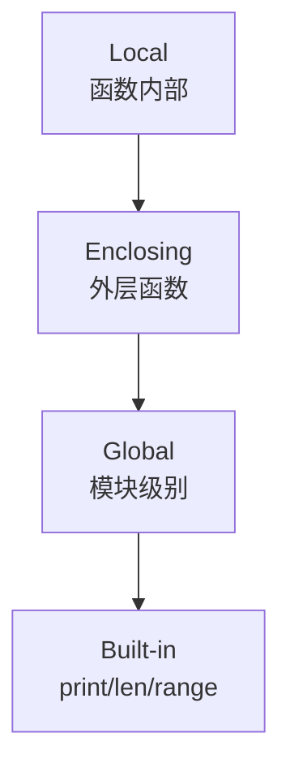

# Day 07：函数进阶与文件操作

> 🎯 **学习目标**：理解作用域与闭包，掌握递归思维，熟练 lambda 和文件操作


## 1. 函数嵌套调用

函数可以调用另一个函数，形成调用链：

```python
def is_even(n):
    """判断是否为偶数"""
    return n % 2 == 0

def filter_evens(numbers):
    """从列表中筛选偶数（调用 is_even）"""
    result = []
    for n in numbers:
        if is_even(n):      # 函数嵌套调用
            result.append(n)
    return result

print(filter_evens([1, 2, 3, 4, 5, 6]))  # [2, 4, 6]
```


## 2. 作用域

### 2.1 LEGB 规则

Python 查找变量时按 LEGB 顺序：**L**ocal → **E**nclosing → **G**lobal → **B**uilt-in



### 2.2 四种作用域演示

```python
# Built-in 作用域
# print, len, range 等内置函数

# Global 作用域
x = "全局变量"

def outer():
    # Enclosing 作用域
    x = "外层函数的变量"

    def inner():
        # Local 作用域
        x = "内层函数的变量"
        print(f"inner: {x}")    # 内层函数的变量

    inner()
    print(f"outer: {x}")        # 外层函数的变量

outer()
print(f"global: {x}")           # 全局变量
```

### 2.3 全局变量与局部变量

```python
# 函数内可以读取全局变量，但不能直接修改
total = 0

def add_one():
    # print(total)    # ❌ 下一行有 total= 声明，所以 total 被视为局部变量
    total = total + 1  # ❌ UnboundLocalError：局部变量 total 还没赋值就被引用了

# 正确做法：用 global 声明
def add_one_correct():
    global total
    total = total + 1
```

### 2.4 global 和 nonlocal

```python
# global：在函数内修改全局变量
count = 0
def increment():
    global count
    count += 1

increment()
print(count)  # 1

# nonlocal：在内层函数中修改外层（非全局）变量
def outer():
    count = 0
    def inner():
        nonlocal count
        count += 1        # 修改的是 outer 的 count，不是全局的
        return count
    return inner

counter = outer()
print(counter())  # 1
print(counter())  # 2
print(counter())  # 3
```


## 3. 闭包 ⭐

闭包 = 函数 + 它"记住"的外部变量

```python
def make_power(exponent):
    """创建一个计算 n 次幂的函数"""
    def power(base):
        return base ** exponent  # exponent 来自外层函数，被"记住"了
    return power                # 返回内层函数（闭包）

square = make_power(2)   # exponent=2 被记住
cube = make_power(3)     # exponent=3 被记住

print(square(5))  # 25  （5²）
print(square(10)) # 100 （10²）
print(cube(5))    # 125 （5³）
```

### 3.1 闭包三要素

1. **函数嵌套**——内层函数定义在外层函数内部
2. **引用外部变量**——内层函数使用了外层函数的变量
3. **返回内层函数**——外层函数返回内层函数

### 3.2 闭包的作用

```python
# 数据隐藏：外部无法直接访问 count
def make_counter():
    count = 0              # 私有变量
    def counter():
        nonlocal count
        count += 1
        return count
    return counter

c = make_counter()
print(c())  # 1
print(c())  # 2
# 无法从外部直接访问或修改 count
```


## 4. 递归

递归 = 函数调用自己

### 4.1 递归三要素

| 要素 | 说明 |
|------|------|
| **终止条件** | 必须有一个不再递归的条件，否则无限循环 |
| **问题递减** | 每次递归，问题规模必须缩小 |
| **同类子问题** | 大问题能分解为结构相同的子问题 |

### 4.2 阶乘

```python
def factorial(n):
    """计算 n! = n × (n-1) × ... × 1"""
    if n <= 1:            # 终止条件
        return 1
    return n * factorial(n - 1)  # 问题递减

print(factorial(5))  # 120
# 递归过程：
# factorial(5) = 5 × factorial(4)
#             = 5 × 4 × factorial(3)
#             = 5 × 4 × 3 × factorial(2)
#             = 5 × 4 × 3 × 2 × factorial(1)
#             = 5 × 4 × 3 × 2 × 1 = 120
```

### 4.3 斐波那契数列（递归 vs 迭代）

```python
# 递归版本（简洁但效率低）
def fib_recursive(n):
    if n <= 1:
        return n
    return fib_recursive(n-1) + fib_recursive(n-2)
# 问题：重复计算极多，fib(40) 需要计算数亿次

# 迭代版本（推荐）
def fib_iterative(n):
    a, b = 0, 1
    for _ in range(n):
        a, b = b, a + b
    return a
```

> [!warning] 递归的陷阱
> Python 默认递归深度限制为 1000。递归太深会导致 `RecursionError`。
> 大多数递归问题可以用循环更好地解决。


## 5. lambda 匿名函数

```python
# 普通函数
def add(x, y):
    return x + y

# lambda 等价写法
add_lambda = lambda x, y: x + y
# 语法：lambda 参数列表: 返回值表达式

# lambda 常用于排序、过滤、映射
students = [("张三", 85), ("李四", 92), ("王五", 78)]

# 按成绩排序
students.sort(key=lambda s: s[1])
print(students)  # [('王五', 78), ('张三', 85), ('李四', 92)]

# filter：筛选偶数
nums = [1, 2, 3, 4, 5, 6]
evens = list(filter(lambda x: x % 2 == 0, nums))
print(evens)  # [2, 4, 6]

# map：全部平方
squared = list(map(lambda x: x**2, nums))
print(squared)  # [1, 4, 9, 16, 25, 36]

# 注意：lambda 只能写单行表达式，不能包含语句
# lambda x: if x > 0: return x  ← 这种复杂逻辑还是用 def
```


## 6. 函数注释（Type Hints 入门）

```python
def calculate(weight: float, height: float) -> float:
    """
    计算 BMI

    :param weight: 体重（千克）
    :param height: 身高（米）
    :return: BMI 值
    """
    return weight / (height ** 2)

# 类型注释不会强制检查，但 IDE 会提示
# calculate("abc", 1.75)  # IDE 会警告，但运行时不会报错
```


## 7. 文件操作

### 7.1 文件打开模式

| 模式 | 说明 | 文件不存在 |
|------|------|-----------|
| `r` | 只读（默认） | 报错 |
| `w` | 写入（覆盖） | 创建新文件 |
| `a` | 追加（在末尾添加） | 创建新文件 |
| `r+` | 读写 | 报错 |
| `b` | 二进制模式 | 配合以上使用（如 `rb`, `wb`） |

### 7.2 读文件

```python
# 方式一：read() - 一次读取全部
with open("data.txt", "r", encoding="utf-8") as f:
    content = f.read()
    print(content)

# 方式二：readline() - 逐行读取
with open("data.txt", "r", encoding="utf-8") as f:
    while True:
        line = f.readline()
        if not line:        # 读到文件末尾返回空字符串
            break
        print(line.strip())  # strip() 去掉行尾换行符

# 方式三：readlines() - 读取所有行到列表
with open("data.txt", "r", encoding="utf-8") as f:
    lines = f.readlines()
    for line in lines:
        print(line.strip())

# 方式四：直接遍历文件对象（推荐！内存友好）
with open("data.txt", "r", encoding="utf-8") as f:
    for line in f:             # 文件对象本身是可迭代的
        print(line.strip())
```

### 7.3 写文件

```python
# write() - 写入字符串
with open("output.txt", "w", encoding="utf-8") as f:
    f.write("第一行\n")
    f.write("第二行\n")

# writelines() - 写入列表
lines = ["第一行\n", "第二行\n", "第三行\n"]
with open("output.txt", "w", encoding="utf-8") as f:
    f.writelines(lines)
```

### 7.4 with 语句详解

```python
# ❌ 传统方式：需要手动关闭
f = open("data.txt", "r", encoding="utf-8")
try:
    content = f.read()
finally:
    f.close()        # 必须手动关闭，否则资源泄漏

# ✅ with 方式：自动关闭
with open("data.txt", "r", encoding="utf-8") as f:
    content = f.read()
# 离开 with 块后，文件自动关闭（即使发生异常）
```


## 📝 综合练习：日记本程序

```python
"""
简易日记本
"""
import os
from datetime import datetime

DIARY_FILE = "diary.txt"

def add_entry():
    """添加一篇日记"""
    content = input("今天想写点什么？\n> ")
    timestamp = datetime.now().strftime("%Y-%m-%d %H:%M:%S")
    with open(DIARY_FILE, "a", encoding="utf-8") as f:
        f.write(f"\n{'='*40}\n")
        f.write(f"[{timestamp}]\n")
        f.write(f"{content}\n")

def view_entries():
    """查看所有日记"""
    if not os.path.exists(DIARY_FILE):
        print("还没有写过日记")
        return

    with open(DIARY_FILE, "r", encoding="utf-8") as f:
        for line in f:
            print(line, end="")

def search_entries(keyword):
    """搜索包含关键字的日记"""
    if not os.path.exists(DIARY_FILE):
        print("还没有写过日记")
        return

    with open(DIARY_FILE, "r", encoding="utf-8") as f:
        content = f.read()

    entries = content.split("=" * 40)
    found = [e for e in entries if keyword in e]
    if found:
        for entry in found:
            print(entry)
    else:
        print(f"未找到包含 '{keyword}' 的日记")

# 主菜单（lambda 做命令分发）
commands = {
    "1": lambda: add_entry(),
    "2": lambda: view_entries(),
    "3": lambda: search_entries(input("搜索关键字：")),
    "4": lambda: exit("再见！")
}

while True:
    print("\n=== 日记本 ===")
    print("1. 写日记  2. 查看全部  3. 搜索  4. 退出")
    choice = input("> ")
    action = commands.get(choice)
    if action:
        action()
    else:
        print("无效选择")
```


## 速记卡（面试闪卡）

**Q1：一句话讲清「Day 07：函数进阶与文件操作」到底是什么？**
A：函数可以调用另一个函数，形成调用链：

**Q2：1. 函数嵌套调用 —— 怎么理解？**
A：函数可以调用另一个函数，形成调用链：

**Q3：2. 作用域 —— 怎么理解？**
A：Python 查找变量时按 LEGB 顺序：**L**ocal → **E**nclosing → **G**lobal → **B**uilt-in

**Q4：3. 闭包 ⭐ —— 怎么理解？**
A：闭包 = 函数 + 它"记住"的外部变量
**函数嵌套**——内层函数定义在外层函数内部
**引用外部变量**——内层函数使用了外层函数的变量
**返回内层函数**——外层函数返回内层函数

**Q5：4. 递归 —— 怎么理解？**
A：递归 = 函数调用自己
| 要素 | 说明 |
|------|------|
| **终止条件** | 必须有一个不再递归的条件，否则无限循环 |
| **问题递减** | 每次递归，问题规模必须缩小 |
| **同类子问题** | 大问题能分解为结构相同的子问题 |
[!warning] 递归的陷阱
Python 默认递归深度限制为 1000。递归太深会导致 。
大多数递归问题可以用循环更好地解决。

**Q6：核心速记主线有哪些？**
A：抓住这几根：1. 函数嵌套调用、2. 作用域、3. 闭包 ⭐、4. 递归、5. lambda 匿名函数、6. 函数注释（Type Hints 入门）。


## 相关链接
- 上一篇：[[06_函数基础]]
- 下一篇：[[08_面向对象入门]]
- 项目实践：[[项目实战/ai-resume笔记/01_技术研读/01_架构概览|ai-resume: 架构概览]]

---
→ [[技术学习清单#函数与 OOP]]
