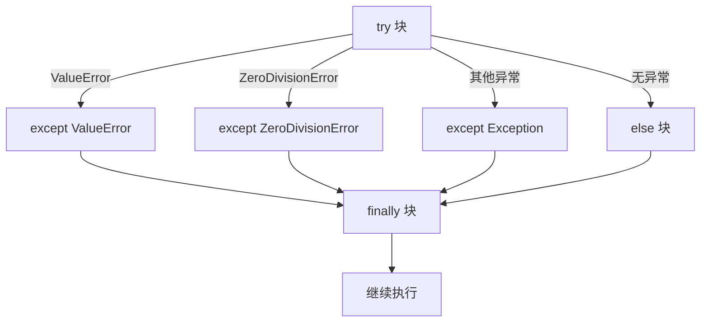

---

title: "Day 10：异常处理"

tags:

  - python

  - 技术学习

created: "2025-07-12"

---

# Day 10：异常处理

> 🎯 **学习目标**：理解异常机制，掌握完整的异常处理体系

## 1. 愤怒的小鸟综合案例（续 Day 09）

完善 Day 09 的愤怒的小鸟游戏，加入异常处理：

```python

class GameError(Exception):

    """游戏自定义异常基类"""

    pass

class BirdNotFoundError(GameError):

    """鸟不存在异常"""

    pass

class InvalidDamageError(GameError):

    """无效伤害值异常"""

    pass

# 在游戏中使用异常处理

def select_bird(birds, index):

    try:

        bird = birds[index]

    except IndexError:

        raise BirdNotFoundError(f"没有第 {index} 号小鸟")

    return bird

```

## 2. 异常处理基本语法
### 2.1 try-except

```python

# 最基础的形式

try:

    num = int(input("输入一个数字："))

    result = 100 / num

    print(f"100 ÷ {num} = {result}")

except ValueError:

    print("❌ 请输入有效的整数！")

except ZeroDivisionError:

    print("❌ 不能除以零！")

```

### 2.2 try-except-else-finally

```python

def safe_divide(a, b):

    try:

        result = a / b                    # 可能出错的代码

    except ZeroDivisionError:

        print("❌ 除数不能为零")

        return None

    except TypeError:

        print("❌ 参数类型错误")

        return None

    else:

        print("✅ 计算成功")               # 没有异常时执行

        return result

    finally:

        print("清理工作完成")              # 无论是否有异常都执行

print(safe_divide(10, 2))

# 5.0

print(safe_divide(10, 0))

# None

```



### 2.3 捕获多个异常

```python

# 方式一：多个 except

try:

    data = json.loads(user_input)

    value = data["key"]

    result = 100 / value

except json.JSONDecodeError:

    print("JSON 格式错误")

except KeyError:

    print("缺少 key 字段")

except ZeroDivisionError:

    print("value 不能为零")

# 方式二：一个 except 捕获多种

try:

    risky_operation()

except (ValueError, TypeError, KeyError) as e:

    print(f"数据错误：{e}")

# 方式三：捕获所有异常（谨慎使用！）

try:

    unknown_operation()

except Exception as e:

    print(f"发生未知错误：{type(e).__name__} - {e}")

```

> [!warning] 避免裸 except

> `except:` 会捕获包括 `KeyboardInterrupt`（Ctrl+C）和 `SystemExit` 在内的所有异常，导致程序无法正常退出。

> 始终用 `except Exception` 或更具体的异常类型。

## 3. raise 抛出异常

```python

def set_age(age):

    if not isinstance(age, int):

        raise TypeError(f"年龄必须是 int，不是 {type(age).__name__}")

    if age < 0:

        raise ValueError(f"年龄不能为负数：{age}")

    if age > 150:

        raise ValueError(f"年龄不合理：{age}")

# set_age("abc")  # ❌ TypeError: 年龄必须是 int，不是 str

```

### raise...from（异常链）

```python

def load_config(filename):

    try:

        with open(filename) as f:

            return json.load(f)

    except FileNotFoundError as e:

        raise RuntimeError(f"配置文件 {filename} 不存在") from e

    except json.JSONDecodeError as e:

        raise RuntimeError(f"配置文件 {filename} 格式错误") from e

# 异常链保留了原始异常信息，方便调试

```

## 4. assert 断言

```python

def calculate_percentage(value, total):

    """计算百分比，total 不能为 0"""

    assert total != 0, "总数不能为零！"

    return value / total * 100

# 所以不要用 assert 做正式的数据校验！

```

> [!important] raise vs assert

> - `raise` 用于**正式异常处理**，不会被禁用

> - `assert` 用于**开发阶段调试**，可能被禁用

## 5. 自定义异常

```python

class InsufficientFundsError(Exception):

    """余额不足异常"""

    def __init__(self, balance, amount):

        self.balance = balance

        self.amount = amount

        super().__init__(

            f"余额 {balance} 不足，无法取出 {amount}，"

            f"差额 {amount - balance}"

        )

class NegativeAmountError(ValueError):

    """金额为负异常"""

    pass

# 使用自定义异常

class BankAccount:

    def __init__(self, balance=0):

        self.balance = balance

    def withdraw(self, amount):

        if amount < 0:

            raise NegativeAmountError(f"取款金额不能为负：{amount}")

        if amount > self.balance:

            raise InsufficientFundsError(self.balance, amount)

        self.balance -= amount

        return self.balance

```

## 6. 异常的传递

```python

def func_c():

    """最底层：抛出异常"""

    return 1 / 0

def func_b():

    """中间层：不处理，向上传递"""

    return func_c()

def func_a():

    """最上层：捕获并处理"""

    try:

        func_b()

    except ZeroDivisionError:

        print("在 func_a 中捕获到除零错误")

    finally:

        print("无论是否异常，清理工作都要做")

func_a()

# 无论是否异常，清理工作都要做

```

## 7. with 关键字（上下文管理器）
### 7.1 文件操作的 with

```python

# ❌ 传统方式

f = open("data.txt", "r")

try:

    content = f.read()

finally:

    f.close()          # 容易忘记

# ✅ with 方式

with open("data.txt", "r") as f:

    content = f.read()

# 自动调用 f.close()，即使发生异常也会关闭

```

### 7.2 自定义上下文管理器

```python

class Timer:

    """计时器：测量代码块执行时间"""

    import time

    def __enter__(self):

        self.start = time.time()

        return self         # 返回的对象赋给 as 后面的变量

    def __exit__(self, exc_type, exc_val, exc_tb):

        self.end = time.time()

        print(f"执行时间：{self.end - self.start:.3f} 秒")

        # 返回 True 可以抑制异常（不推荐）

        # 返回 False（默认）让异常正常传播

        return False

# 使用

with Timer() as timer:

    total = sum(range(10000000))

# 输出：执行时间：0.234 秒

```

## 📝 综合练习：安全的文件处理器

```python

class FileProcessor:

    """安全的文件处理器——综合 Day 07（文件）和 Day 10（异常）"""

    def __init__(self, filename):

        self.filename = filename

    def read_lines(self):

        """安全读取所有行"""

        try:

            with open(self.filename, "r", encoding="utf-8") as f:

                return [line.strip() for line in f]

        except FileNotFoundError:

            print(f"文件 {self.filename} 不存在")

            return []

        except PermissionError:

            print(f"没有权限读取 {self.filename}")

            return []

        except UnicodeDecodeError:

            print(f"文件编码不是 UTF-8，尝试用 GBK...")

            try:

                with open(self.filename, "r", encoding="gbk") as f:

                    return [line.strip() for line in f]

            except Exception as e:

                print(f"也无法用 GBK 读取：{e}")

                return []

    def write_lines(self, lines):

        """安全写入"""

        try:

            with open(self.filename, "w", encoding="utf-8") as f:

                for line in lines:

                    f.write(line + "\n")

            print(f"成功写入 {len(lines)} 行到 {self.filename}")

            return True

        except PermissionError:

            print(f"没有权限写入 {self.filename}")

            return False

        except OSError as e:

            print(f"写入失败：{e}")

            return False

```

## 速记卡（面试闪卡）

**Q1：一句话讲清「Day 10：异常处理」到底是什么？**

A：异常处理用 try/except 捕获错误、finally 兜底清理，让程序遇错不崩溃还能优雅收场。

**Q2：1. 愤怒的小鸟综合案例（续 Day 09） —— 怎么理解？**

A：像游戏里选鸟：select_bird 用 try 取到鸟，拿不到就 raise 自定义 BirdNotFoundError。把"出错"变成可控的游戏事件，而不是整个程序崩。例子说明异常是业务的一部分，该抛就抛。

**Q3：2. 异常处理基本语法 —— 怎么理解？**

A：像应急预案：try 里放可能出错的代码，except 按异常类型分流（ValueError / ZeroDivisionError），else 没异常才跑，finally 无论怎样都执行清理。千万别裸 except:，会连 Ctrl+C 都吞掉。Exception Handling（异常处理）。

**Q4：3. raise 抛出异常 —— 怎么理解？**

A：像主动拉警报：set_age(-5) 不合规则 raise ValueError，把问题亮出来而不是静默带病运行。还能用 raise ... from 保留原始异常链，方便调试。主动抛错比埋雷强。

**Q5：4. assert 断言 —— 怎么理解？**

A：像开发期的保险丝：assert 条件, "提示" 不成立就抛 AssertionError。但注意 python -O 会禁用 assert，所以正式数据校验别用它，留着查内部逻辑错误就好。

**Q6：核心速记主线有哪些？**

- try/except/else/finally：捕获、分流、无错分支、必执行清理

- 避免裸 except，用 except Exception 或更具体类型

- raise 主动抛错，from 保留异常链

- assert 仅做开发期校验，-O 下会被关闭

**口诀**

A：异常 try except 接，else 无错 finally 收；

裸 except 是大忌，Ctrl+C 也吞走；

raise 主动拉警报，from 留链好调试；

assert 开发期保险，上线别当校验用。

## 相关链接

- 上一篇：[[09_面向对象三大特性]]

- 下一篇：[[11_模块与包]]

---

→ [[技术学习路线图#进阶特性]]

