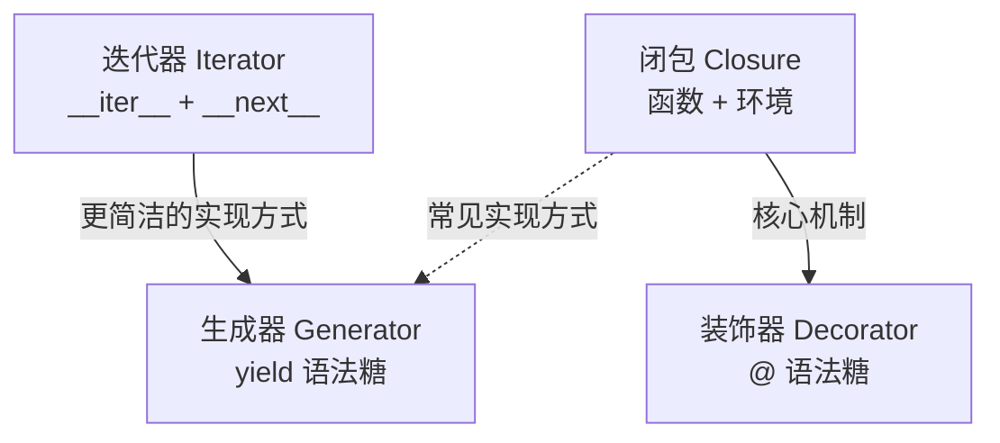

# Day 12：迭代器/生成器/装饰器

> 🎯 **学习目标**：掌握 Python 三大高级特性——迭代器、生成器、装饰器


## 1. 深浅拷贝回顾

```python
import copy

# 浅拷贝 vs 深拷贝回顾
original = [1, 2, [10, 20, 30]]

# 浅拷贝：只拷贝外层
shallow = copy.copy(original)
shallow[0] = 100             # 不影响 original[0]
shallow[2][0] = 999          # ⚠️ 影响 original[2][0]！
print(original)              # [1, 2, [999, 20, 30]]

# 深拷贝：递归拷贝全部
deep = copy.deepcopy(original)
deep[0] = 200                # 不影响 original
deep[2][0] = 888             # 也不影响 original
print(original)              # [1, 2, [10, 20, 30]] ✋ 完全不变
```


## 2. 迭代器 Iterator

### 2.1 可迭代对象 vs 迭代器

```python
# 可迭代对象（Iterable）：可以被 iter() 转换为迭代器
# 包括：list, tuple, str, dict, set, range, 文件对象...
nums = [1, 2, 3]
print(hasattr(nums, '__iter__'))  # True（可迭代对象）

# 迭代器（Iterator）：可以被 next() 逐个取值的对象
it = iter(nums)              # 获取迭代器
print(hasattr(it, '__next__'))  # True（迭代器）

print(next(it))              # 1
print(next(it))              # 2
print(next(it))              # 3
# next(it)  →  StopIteration（没有更多元素了）
```

### 2.2 for 循环的本质

```python
# for item in obj 本质上做的事情：
nums = [1, 2, 3]

# 等价于：
it = iter(nums)                # 1. 获取迭代器
while True:
    try:
        item = next(it)        # 2. 逐个获取元素
        print(item)            # 3. 执行循环体
    except StopIteration:
        break                  # 4. 没有更多元素，退出
```

### 2.3 自定义迭代器

```python
class CountDown:
    """倒计时迭代器"""
    def __init__(self, start):
        self.current = start

    def __iter__(self):
        """返回迭代器对象（就是自身）"""
        return self

    def __next__(self):
        """返回下一个值"""
        if self.current <= 0:
            raise StopIteration     # 终止信号
        value = self.current
        self.current -= 1
        return value

# 使用
for num in CountDown(5):
    print(num, end=" ")    # 5 4 3 2 1
```


## 3. 生成器 Generator ⭐

生成器是**最 Pythonic 的创建迭代器的方式**。

### 3.1 生成器函数（yield）

```python
# 用 yield 代替 return 就是生成器
def countdown(n):
    while n > 0:
        yield n        # 暂停并返回值，状态保留
        n -= 1

# 调用生成器函数 → 返回 generator 对象
gen = countdown(3)
print(type(gen))       # <class 'generator'>

# 逐个取值
print(next(gen))       # 3
print(next(gen))       # 2
print(next(gen))       # 1
# next(gen) → StopIteration

# 可以 for 循环
for num in countdown(5):
    print(num)         # 5 4 3 2 1
```

### 3.2 yield 的执行流程

```python
def demo_generator():
    print(">>> 开始")
    yield 1
    print(">>> 恢复执行")
    yield 2
    print(">>> 再次恢复")
    yield 3
    print(">>> 结束")

gen = demo_generator()
print("调用 next 第 1 次")
print(next(gen))
# 输出：
# 调用 next 第 1 次
# >>> 开始
# 1                     ← yield 在这里暂停

print("调用 next 第 2 次")
print(next(gen))
# 调用 next 第 2 次
# >>> 恢复执行
# 2

print("调用 next 第 3 次")
print(next(gen))
# 调用 next 第 3 次
# >>> 再次恢复
# 3

# print(next(gen))  # StopIteration
```

### 3.3 斐波那契数列（生成器版）

```python
def fibonacci(limit=None):
    """生成斐波那契数列"""
    a, b = 0, 1
    count = 0
    while limit is None or count < limit:
        yield a
        a, b = b, a + b
        count += 1

# 前 10 个
for num in fibonacci(10):
    print(num, end=" ")
# 0 1 1 2 3 5 8 13 21 34

# 无限生成（内存友好）
# for num in fibonacci():
#     if num > 1000:
#         break
#     print(num)
```

### 3.4 send 方法

```python
def accumulator():
    """累加器：可以接收外部传入的值"""
    total = 0
    while True:
        value = yield total      # 接收 send 传来的值，并 yield 当前总数
        if value is None:
            break
        total += value

acc = accumulator()
print(next(acc))       # 0（启动生成器）
print(acc.send(10))    # 10（传入 10）
print(acc.send(20))    # 30（累加 20）
print(acc.send(5))     # 35（累加 5）
acc.close()            # 关闭生成器
```

> [!important] yield vs return
> - `return`：函数结束，一次性返回
> - `yield`：函数暂停，可以多次产出，状态保留


## 4. 命名空间与四种作用域（深入）

```python
x = "global"                    # 全局

def outer():
    x = "enclosing"             # 嵌套作用域

    def middle():
        x = "enclosing2"        # 也属于嵌套

        def inner():
            x = "local"         # 局部
            print(f"inner: {x}")

        inner()
        print(f"middle: {x}")

    middle()
    print(f"outer: {x}")

outer()
print(f"global: {x}")

# 输出：
# inner: local
# middle: enclosing2
# outer: enclosing
# global: global
```


## 5. 装饰器 Decorator ⭐⭐

装饰器本质：**一个接受函数、返回新函数的函数**。

### 5.1 闭包实现装饰器（手动版）

```python
def my_decorator(func):
    """装饰器：包装原函数"""
    def wrapper(*args, **kwargs):
        print(f"调用 {func.__name__} 之前...")
        result = func(*args, **kwargs)
        print(f"调用 {func.__name__} 之后...")
        return result
    return wrapper

def greet(name):
    return f"Hello, {name}!"

# 手动装饰
greet = my_decorator(greet)
print(greet("Python"))
# 输出：
# 调用 greet 之前...
# 调用 greet 之后...
# Hello, Python!
```

### 5.2 语法糖 @

```python
@my_decorator          # ← 等价于 greet = my_decorator(greet)
def greet(name):
    return f"Hello, {name}!"
```

### 5.3 实用装饰器示例

```python
import time
import functools

# 计时器
def timer(func):
    @functools.wraps(func)   # 保留原函数的元信息
    def wrapper(*args, **kwargs):
        start = time.time()
        result = func(*args, **kwargs)
        elapsed = time.time() - start
        print(f"{func.__name__} 执行耗时：{elapsed:.4f} 秒")
        return result
    return wrapper

# 日志
def logger(func):
    @functools.wraps(func)
    def wrapper(*args, **kwargs):
        print(f"[LOG] 调用 {func.__name__}({args}, {kwargs})")
        result = func(*args, **kwargs)
        print(f"[LOG] {func.__name__} 返回 {result}")
        return result
    return wrapper

# 重试
def retry(max_attempts=3):
    def decorator(func):
        @functools.wraps(func)
        def wrapper(*args, **kwargs):
            for attempt in range(1, max_attempts + 1):
                try:
                    return func(*args, **kwargs)
                except Exception as e:
                    if attempt == max_attempts:
                        raise
                    print(f"第 {attempt} 次失败：{e}，重试中...")
                    time.sleep(1)
        return wrapper
    return decorator

# 叠加使用
@timer
@logger
@retry(max_attempts=3)
def fetch_data(url):
    import random
    if random.random() < 0.5:
        raise ConnectionError("网络错误")
    return f"从 {url} 获取的数据"
```

### 5.4 类装饰器

```python
class Singleton:
    """单例模式装饰器"""
    def __init__(self, cls):
        self.cls = cls
        self.instance = None

    def __call__(self, *args, **kwargs):
        if self.instance is None:
            self.instance = self.cls(*args, **kwargs)
        return self.instance

@Singleton
class Database:
    def __init__(self):
        print("连接数据库...")
        self.connected = True

# 多次"实例化"实际返回同一个对象
db1 = Database()   # 输出：连接数据库...
db2 = Database()   # 不输出，直接返回已有实例
print(db1 is db2)  # True
```


## 📝 三者关系




## 速记卡（面试闪卡）

**Q1：一句话讲清「Day 12：迭代器/生成器/装饰器」到底是什么？**
A：见正文展开。

**Q2：3. 生成器 Generator ⭐ —— 怎么理解？**
A：生成器是**最 Pythonic 的创建迭代器的方式**。
[!important] yield vs return
：函数结束，一次性返回
：函数暂停，可以多次产出，状态保留

**Q3：核心速记主线有哪些？**
A：抓住这几根：1. 深浅拷贝回顾、2. 迭代器 Iterator、3. 生成器 Generator ⭐、4. 命名空间与四种作用域（深入）、5. 装饰器 Decorator ⭐⭐、📝 三者关系。


## 相关链接
- 上一篇：[[11_模块与包]]
- 下一篇：[[13_多进程多线程]]
- 项目实践：[[项目实战/ai-resume笔记/01_技术研读/01_架构概览|ai-resume: 架构概览]]

---
→ [[技术学习清单#进阶特性]]
