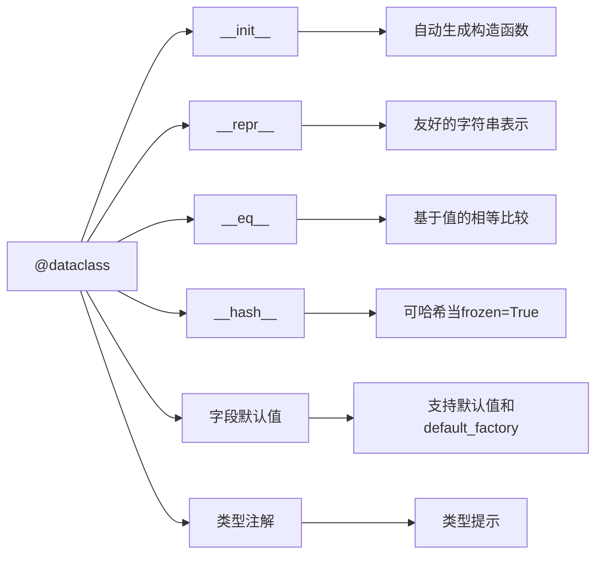

---

title: "dataclass：不可变数据类与参数安全共享"

tags:

  - python

  - 技术学习

created: "2026-07-21"

---

# dataclass：不可变数据类与参数安全共享

> **一句话**：`dataclass` 是 Python 3.7+ 的语法糖，自动生成 `__init__`、`__repr__`、`__eq__` 等方法，让定义数据容器类变得极其简单。`frozen=True` 让实例不可变，像元组一样安全。

## 1. 为什么需要 dataclass？

传统类定义数据容器时，需要手写大量样板代码：

```python

class Point:

    def __init__(self, x, y):

        self.x = x

        self.y = y

    def __repr__(self):

        return f"Point({self.x}, {self.y})"

    def __eq__(self, other):

        return self.x == other.x and self.y == other.y

```

`dataclass` 自动生成这些方法：

```python

from dataclasses import dataclass

@dataclass

class Point:

    x: int

    y: int

# 自动生成 __init__、__repr__、__eq__

p = Point(1, 2)

print(p)        # Point(x=1, y=2)

print(p == Point(1, 2))  # True

```

## 2. 核心特性
### 2.1 自动生成的方法



### 2.2 字段默认值

```python

from dataclasses import dataclass, field

@dataclass

class User:

    name: str

    age: int = 0                    # 默认值

    tags: list = field(default_factory=list)  # 可变默认值必须用field

    email: str = field(default="unknown@example.com")

user = User("Alice")

print(user)  # User(name='Alice', age=0, tags=[], email='unknown@example.com')

```

**坑点**：可变对象（list, dict, set）不能直接作为默认值，必须用 `field(default_factory=...)`。

## 3. frozen=True：不可变数据类
### 3.1 为什么需要不可变？

```python

@dataclass(frozen=True)

class Config:

    host: str

    port: int

    debug: bool = False

config = Config("localhost", 8080)

# config.port = 9090  # ❌ AttributeError: cannot assign to field 'port'

```

**好处**：

1. **线程安全**：多线程读取无需加锁

2. **可哈希**：可以作为字典键或集合元素

3. **副作用控制**：防止意外修改

### 3.2 frozen vs 非frozen

| 特性 | `frozen=False`（默认） | `frozen=True` |

|------|----------------------|---------------|

| 可修改 | ✅ 可以修改属性 | ❌ 不能修改属性 |

| 可哈希 | ❌ 默认不可哈希 | ✅ 可哈希 |

| 用途 | 可变数据容器 | 配置、值对象、字典键 |

### 3.3 实现原理

`frozen=True` 会：

1. 禁用 `__setattr__` 和 `__delattr__`

2. 自动生成 `__hash__` 方法

3. 实际上创建了一个不可变对象

## 4. 参数安全共享模式
### 4.1 问题场景

```python

class UserService:

    def __init__(self, db_config: dict):

        self.db_config = db_config  # ❌ 危险：外部修改会影响内部

    def connect(self):

        print(f"Connecting to {self.db_config['host']}")

# 外部配置

config = {"host": "localhost", "port": 5432}

service = UserService(config)

# 外部修改配置

config["host"] = "production.db.com"  # 会影响service.db_config！

```

### 4.2 解决方案：frozen dataclass

```python

from dataclasses import dataclass

@dataclass(frozen=True)

class DBConfig:

    host: str

    port: int = 5432

    database: str = "default"

class UserService:

    def __init__(self, config: DBConfig):

        self.config = config  # ✅ 安全：frozen实例不可变

    def connect(self):

        print(f"Connecting to {self.config.host}:{self.config.port}")

# 使用

config = DBConfig("localhost", 5432)

service = UserService(config)

# config.host = "production.db.com"  # ❌ AttributeError

```

## 5. 高级用法
### 5.1 继承

```python

@dataclass

class Animal:

    name: str

@dataclass

class Dog(Animal):

    breed: str

dog = Dog("Buddy", "Golden Retriever")

print(dog)  # Dog(name='Buddy', breed='Golden Retriever')

```

### 5.2 字段顺序

```python

@dataclass

class Example:

    a: int

    b: str = "default"

    c: float = 3.14

# Example(1, 3.14)  # ❌ TypeError

Example(1, "hello", 3.14)  # ✅

```

### 5.3 后置初始化

```python

from dataclasses import dataclass, post_init

@dataclass

class Circle:

    radius: float

    area: float = 0.0

    def __post_init__(self):

        """在__init__之后自动调用"""

        import math

        self.area = math.pi * self.radius ** 2

c = Circle(5)

print(c.area)  # 78.53981633974483

```

## 6. 与 LangGraph 的结合

在 LangGraph 中，`TypedDict` 和 `dataclass` 常用于定义状态：

```python

from typing import TypedDict

from dataclasses import dataclass

# TypedDict方式（推荐用于LangGraph State）

class AgentState(TypedDict):

    messages: list[str]

    current_step: str

    result: str

# dataclass方式

@dataclass

class AgentStateDC:

    messages: list[str]

    current_step: str

    result: str = ""

```

**选择建议**：

- LangGraph 状态：用 `TypedDict`（更轻量，与 LangGraph 集成更好）

- 配置、值对象：用 `frozen=True` 的 `dataclass`

- 需要可变状态：用普通 `dataclass`

## 常见坑点
### 1. 可变默认值陷阱

```python

from dataclasses import dataclass, field

@dataclass

class Bad:

    items: list = []  # ❌ 所有实例共享同一个list！

@dataclass

class Good:

    items: list = field(default_factory=list)  # ✅ 每个实例独立

bad1 = Bad()

bad2 = Bad()

bad1.items.append(1)

print(bad2.items)  # [1] ← 被污染了！

good1 = Good()

good2 = Good()

good1.items.append(1)

print(good2.items)  # [] ← 独立

```

### 2. frozen实例的“修改”

```python

@dataclass(frozen=True)

class Immutable:

    value: int

obj = Immutable(10)

# 但可以通过object.__setattr__绕过（不推荐）

object.__setattr__(obj, 'value', 20)  # ✅ 成功修改

```

### 3. 性能考虑

```python

# 但在大多数场景下可以忽略

import timeit

class Plain:

    def __init__(self, x, y):

        self.x, self.y = x, y

@dataclass

class DC:

    x: int

    y: int

plain_time = timeit.timeit('Plain(1, 2)', globals={'Plain': Plain}, number=1000000)

dc_time = timeit.timeit('DC(1, 2)', globals={'DC': DC}, number=1000000)

print(f"Plain: {plain_time:.3f}s, DC: {dc_time:.3f}s")

# 通常DC慢0.1-0.3秒/百万次

```

## 核心要点

```python

# 基础用法

@dataclass

class User:

    name: str

    age: int = 0

# 不可变

@dataclass(frozen=True)

class Config:

    host: str

    port: int

# 可变默认值

@dataclass

class Container:

    items: list = field(default_factory=list)

# 后置初始化

@dataclass

class Circle:

    radius: float

    area: float = 0.0

    def __post_init__(self):

        import math

        self.area = math.pi * self.radius ** 2

```

## 速记卡（面试闪卡）

**Q1：一句话讲清「dataclass：不可变数据类与参数安全共享」到底是什么？**

A：dataclass 是 Python 语法糖，加 @dataclass 自动生成 __init__/__repr__/__eq__；frozen=True 让实例不可变，适合配置与线程安全共享。

**Q2：为什么需要 / 自动生成的方法 —— 怎么理解？**

A：传统数据类要手写一堆样板（构造、打印、相等比较），字段一多就烦。@dataclass 按类型注解自动生成。但坑在可变默认值：list/dict 直接当默认值会让所有实例共享同一个，必须用 field(default_factory=list)。像自动挡——你只声明字段，驾照车厂发好。

**Q3：frozen=True：不可变数据类 —— 怎么理解？**

A：@dataclass(frozen=True) 禁用 __setattr__/__delattr__，创建后改属性就 AttributeError。三个好处：线程安全（只读不加锁）、可哈希（能当 dict 键/set 元素）、防意外修改。对照非 frozen 可改但默认不可哈希。

**Q4：参数安全共享模式 —— 怎么理解？**

A：反模式：把外部 dict 配置直接存进类 self.cfg = cfg，外部一改内部跟着变，极危险。frozen dataclass（如 DBConfig）传参就安全：实例不可变，外部想改也改不动，把配置当值对象（Value Object）安全共享。

**Q5：高级用法与 LangGraph 结合 —— 怎么理解？**

A：继承时字段自动合并；字段顺序固定必须按声明传参；__post_init__ 在 __init__ 后自动调（如算圆面积）。和 TypedDict 怎么选：LangGraph 状态用 TypedDict（轻量集成好），配置/值对象用 frozen dataclass，要方法就普通类。

**Q6：核心速记主线有哪些？**

- 自动生成样板：__init__/__repr__/__eq__，少写代码

- 可变默认值陷阱：用 field(default_factory=...) 隔离

- frozen=True：不可变、线程安全、可哈希

- 参数安全共享：frozen 防外部改动配置

- 选型：状态用 TypedDict，配置用 frozen dataclass

**口诀**

A：dataclass 少样板，frozen 锁死更安全；

可变默认 field 造，继承合并顺序严；

__post_init__ 后调用，参数共享值对象；

状态用 TypedDict 轻，配置 frozen 当键连。

## 相关链接

- 📋 目录：[[00-Python]]

- 📚 学习清单：[[技术学习路线图#Python 基础]]

- 🔗 [[14-TypedDict|TypedDict：类型化字典]]

- 🔗 [[09_面向对象三大特性|面向对象三大特性]]

