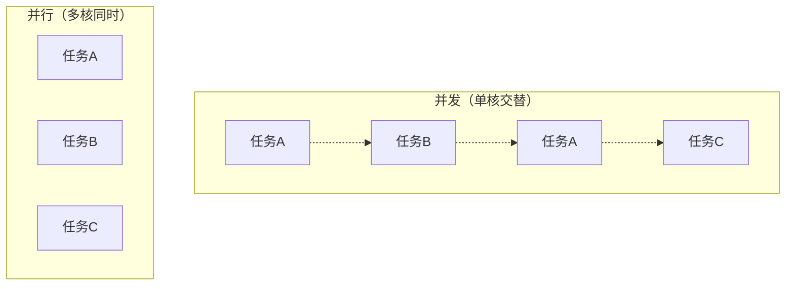
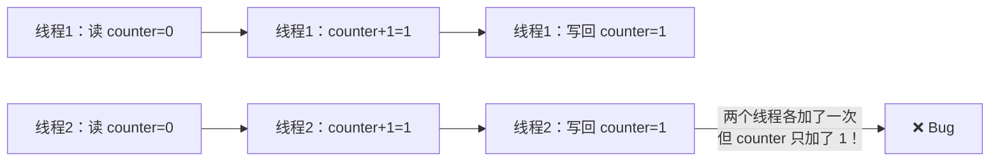
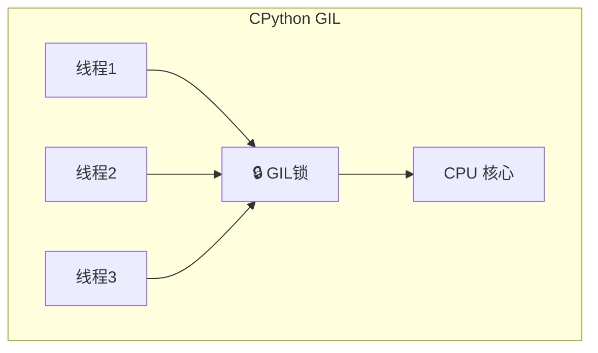

---

title: "Day 13：多进程与多线程"

tags:

  - python

  - 技术学习

created: "2025-07-12"

---

# Day 13：多进程与多线程

> 🎯 **学习目标**：理解并发/并行概念，掌握进程和线程的创建与管理

## 1. 同步/异步、并发/并行
### 1.1 概念辨析

| 概念 | 含义 | 生活类比 |

|------|------|---------|

| **同步** | 一件事做完再做下一件 | 排队买票 |

| **异步** | 不等待结果，先做其他的 | 点了外卖先去工作 |

| **并发** | 单核 CPU 快速切换任务（看起来同时） | 一个人边煮饭边回消息 |

| **并行** | 多核 CPU 真正同时执行 | 多个人同时做不同的事 |



## 2. 多进程 multiprocessing
### 2.1 创建进程

```python

import multiprocessing as mp

import time, os

def worker(name, duration):

    """模拟工作任务"""

    print(f"进程 {name}（PID={os.getpid()}）开始工作")

    time.sleep(duration)

    print(f"进程 {name} 完成")

# 方式一：直接创建

p1 = mp.Process(target=worker, args=("A", 2))

p2 = mp.Process(target=worker, args=("B", 1))

p1.start()          # 启动进程

p2.start()

p1.join()           # 等待进程结束

p2.join()

print("所有进程完成")

# 注意：必须在 if __name__ == "__main__": 下创建进程（Windows 必须）

```

### 2.2 自定义进程类

```python

class MyProcess(mp.Process):

    def __init__(self, name, duration):

        super().__init__()

        self.name = name

        self.duration = duration

    def run(self):

        """进程启动后自动调用此方法"""

        print(f"{self.name} 开始，PID={os.getpid()}")

        time.sleep(self.duration)

        print(f"{self.name} 结束")

if __name__ == "__main__":

    p = MyProcess("Worker", 2)

    p.start()

    p.join()

```

### 2.3 进程池 Pool

```python

def compute_square(n):

    """CPU 密集型任务"""

    time.sleep(0.1)  # 模拟计算

    return n ** 2

if __name__ == "__main__":

    with mp.Pool(processes=4) as pool:

        # map：类似内置 map，但并行执行

        results = pool.map(compute_square, range(10))

        print(results)  # [0, 1, 4, 9, 16, 25, 36, 49, 64, 81]

        # apply_async：异步提交单个任务

        result = pool.apply_async(compute_square, (100,))

        print(result.get())   # 10000（阻塞等待结果）

```

### 2.4 进程间通信（Queue）

```python

def producer(q):

    """生产者：向队列放数据"""

    for i in range(5):

        q.put(f"数据-{i}")

        print(f"生产了：数据-{i}")

        time.sleep(0.5)

    q.put(None)   # 结束信号

def consumer(q):

    """消费者：从队列取数据"""

    while True:

        data = q.get()

        if data is None:    # 收到结束信号

            break

        print(f"消费了：{data}")

if __name__ == "__main__":

    q = mp.Queue()

    p1 = mp.Process(target=producer, args=(q,))

    p2 = mp.Process(target=consumer, args=(q,))

    p1.start()

    p2.start()

    p1.join()

    p2.join()

```

## 3. 线程 threading
### 3.1 创建线程

```python

import threading

import time

def task(name, delay):

    print(f"线程 {name} 开始")

    time.sleep(delay)

    print(f"线程 {name} 结束")

# 创建线程

t1 = threading.Thread(target=task, args=("T1", 2))

t2 = threading.Thread(target=task, args=("T2", 1))

t1.start()

t2.start()

t1.join()

t2.join()

print("所有线程完成")

```

### 3.2 线程池 ThreadPoolExecutor（推荐）

```python

from concurrent.futures import ThreadPoolExecutor, as_completed

import requests

def fetch_url(url):

    """下载网页"""

    resp = requests.get(url, timeout=5)

    return url, resp.status_code

urls = [

    "https://www.python.org",

    "https://www.github.com",

    "https://www.baidu.com",

]

# 线程池

with ThreadPoolExecutor(max_workers=3) as executor:

    # 方式一：submit + future

    futures = {executor.submit(fetch_url, url): url for url in urls}

    for future in as_completed(futures):

        url, status = future.result()

        print(f"{url} → {status}")

    # 方式二：map

    # results = executor.map(fetch_url, urls)

```

## 4. 线程不安全问题 ⚠️
### 4.1 竞态条件

```python

# ⚠️ 有问题的代码

counter = 0

def increment():

    global counter

    for _ in range(100000):

        counter += 1  # 这不是原子操作！

        # 实际分三步：1.读值 2.加1 3.写回

if __name__ == "__main__":

    threads = [threading.Thread(target=increment) for _ in range(10)]

    for t in threads: t.start()

    for t in threads: t.join()

    print(f"期望：1000000，实际：{counter}")

    # 实际结果可能小于 1000000！

```



### 4.2 加锁解决

```python

counter = 0

lock = threading.Lock()

def increment_safe():

    global counter

    for _ in range(100000):

        with lock:           # 获取锁，同一时刻只有一个线程能进入

            counter += 1

if __name__ == "__main__":

    threads = [threading.Thread(target=increment_safe) for _ in range(10)]

    for t in threads: t.start()

    for t in threads: t.join()

    print(f"全部完成后：{counter}")   # 1000000 ✓

```

## 5. GIL 与选型指南
### 5.1 什么是 GIL

GIL（Global Interpreter Lock，全局解释器锁）是 CPython 的限制：**同一时刻只有一个线程在执行 Python 字节码**。



### 5.2 GIL 的影响

| 任务类型 | 多线程 | 多进程 | 说明 |

|----------|:------:|:------:|------|

| **IO 密集型**（网络、文件、爬虫） | ✅ 推荐 | ❌ 太重 | GIL 在 IO 时释放，多线程有效 |

| **CPU 密集型**（计算、图像处理） | ❌ 无效 | ✅ 推荐 | GIL 导致多线程无法利用多核 |

### 5.3 决策树

```python

# 决策逻辑：

if task_is_io_bound:          # IO 密集型

    use_multithreading()       # → 线程（轻量、共享内存）

elif task_is_cpu_bound:        # CPU 密集型

    use_multiprocessing()      # → 进程（绕过 GIL）

elif need_truly_concurrent:    # 真正需要并发

    use_asyncio()              # → 异步（Day 22 会讲）

```

> [!tip] 经验法则

> - **爬虫/下载/读写文件** → 多线程

> - **数学计算/图像处理/模型训练** → 多进程或异步

> - **简单并发** → 线程池 `ThreadPoolExecutor`

## 速记卡（面试闪卡）

**Q1：一句话讲清「Day 13：多进程与多线程」到底是什么？**

A：并发是单核交替看起来同时，并行是多核真同时；多进程独立内存适合CPU密集，多线程共享内存受GIL限制适合IO密集——按任务类型选。

**Q2：并发 vs 并行：看起来 vs 真同时 —— 怎么理解？**

A：并发（Concurrency）像一个人数着煮饭边回消息，是单核快速切换"看起来同时"；并行（Parallelism）是多个人真同时干不同事，靠多核。并发解"等"，并行解"算不动"。

**Q3：多进程：各开一间房 —— 怎么理解？**

A：多进程（Multiprocessing）像每人开一间独立房间，内存不共享、互不干扰，适合 CPU 密集型（计算多）。代价是进程切换和通信（IPC）贵，Windows 下必须放 __main__ 里创建。

**Q4：多线程：同屋共用客厅 —— 怎么理解？**

A：多线程（Multithreading）像多人同住一套房共用客厅（共享内存），适合 IO 密集型（等网络/磁盘）。但 Python 有 GIL（Global Interpreter Lock，全局解释器锁），同一时刻只有一个线程跑字节码。

**Q5：GIL：Python 的单车道 —— 怎么理解？**

A：GIL（Global Interpreter Lock）是 CPython 的一把全局锁：哪怕多核，同一时刻只允许一个线程执行 Python 字节码。所以多线程在 CPU 密集上无法提速，IO 密集才因等待释放锁而有效。

**Q6：核心速记主线有哪些？**

- 并发单核交替，并行多核真正同时

- 多进程独立内存，适合 CPU 密集

- 多线程共享内存，受 GIL 限，适合 IO 密集

- CPU 密集用多进程，IO 密集用多线程/协程

**口诀**

A：并发交替并行真

进程独立吃CPU

线程同屋受GIL

IO密集它最行

## 相关链接

- 上一篇：[[12_迭代器装饰器]]

- 下一篇：[[14_网络编程]]

---

→ [[技术学习路线图#进阶特性]]

