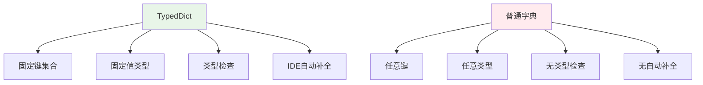

---

title: "TypedDict：类型化字典与LangGraph State约束"

tags:

  - python

  - 技术学习

created: "2026-07-21"

---

# TypedDict：类型化字典与LangGraph State约束

> **一句话**：`TypedDict` 让你在 Python 中定义具有固定键和值类型的字典，既保持了字典的灵活性，又获得了类型检查的好处。在 LangGraph 中，它是定义 Agent 状态的首选方式。

## 1. 为什么需要 TypedDict？

传统字典的问题：

```python

# 普通字典没有类型约束

user = {"name": "Alice", "age": 30}

user["name"] = 123  # ❌ 应该是字符串，但Python不会报错

user["email"] = "alice@example.com"  # ❌ 多余的键，也不会报错

```

`TypedDict` 提供类型约束：

```python

from typing import TypedDict

class UserDict(TypedDict):

    name: str

    age: int

user: UserDict = {"name": "Alice", "age": 30}

# user["email"] = "..."  # ❌ 多余的键

```

## 2. 核心特性
### 2.1 定义语法

```python

from typing import TypedDict

# 基础定义

class MovieDict(TypedDict):

    title: str

    year: int

    rating: float

# 带默认值（Python 3.9+）

class ConfigDict(TypedDict, total=False):  # total=False 表示所有字段可选

    host: str

    port: int

    debug: bool

# 混合必填和可选（Python 3.11+）

from typing import Required, NotRequired

class MixedDict(TypedDict):

    required_field: Required[str]

    optional_field: NotRequired[int]

```

### 2.2 与普通字典的区别



| 特性 | `TypedDict` | 普通 `dict` |

|------|------------|-------------|

| 键集合 | 固定 | 任意 |

| 值类型 | 固定 | 任意 |

| 类型检查 | ✅ 静态检查 | ❌ 运行时才发现 |

| IDE支持 | ✅ 自动补全 | ❌ 无 |

| 运行时开销 | 无（只是类型提示） | 无 |

## 3. 基础用法
### 3.1 创建和使用

```python

from typing import TypedDict

class PersonDict(TypedDict):

    name: str

    age: int

    email: str

# 创建实例

person: PersonDict = {

    "name": "Alice",

    "age": 30,

    "email": "alice@example.com"

}

# 访问

print(person["name"])  # Alice

# 修改

person["age"] = 31

# mypy、pyright 等工具会检查类型

```

### 3.2 嵌套 TypedDict

```python

class AddressDict(TypedDict):

    street: str

    city: str

    country: str

class CompanyDict(TypedDict):

    name: str

    address: AddressDict

    employees: list[PersonDict]

# 使用

company: CompanyDict = {

    "name": "TechCorp",

    "address": {

        "street": "123 Main St",

        "city": "Beijing",

        "country": "China"

    },

    "employees": [

        {"name": "Alice", "age": 30, "email": "alice@techcorp.com"},

        {"name": "Bob", "age": 25, "email": "bob@techcorp.com"}

    ]

}

```

## 4. 在 LangGraph 中的应用
### 4.1 定义 Agent 状态

```python

from typing import TypedDict, Annotated

from langgraph.graph.message import add_messages

class AgentState(TypedDict):

    """LangGraph Agent 的状态定义"""

    messages: Annotated[list, add_messages]  # 消息历史，自动追加

    current_step: str  # 当前步骤

    context: dict  # 上下文信息

    result: str  # 最终结果

```

### 4.2 状态转换

```python

from langgraph.graph import StateGraph, END

def process_node(state: AgentState):

    """处理节点"""

    # state 是 TypedDict，有类型提示

    messages = state["messages"]

    current_step = state["current_step"]

    # 处理逻辑

    return {

        "current_step": "next_step",

        "result": "processed"

    }

# 构建图

graph = StateGraph(AgentState)

graph.add_node("process", process_node)

# ... 添加边和条件

```

### 4.3 与 dataclass 的对比

```python

from typing import TypedDict

from dataclasses import dataclass

# TypedDict方式（LangGraph推荐）

class AgentStateTD(TypedDict):

    messages: list[str]

    step: str

# dataclass方式

@dataclass

class AgentStateDC:

    messages: list[str]

    step: str

# 3. 需要方法 → 普通类

```

## 5. 高级特性
### 5.1 可选字段

```python

from typing import TypedDict, NotRequired

class UserDict(TypedDict):

    name: str

    age: int

    email: NotRequired[str]  # 可选字段

# 使用

user1: UserDict = {"name": "Alice", "age": 30}  # ✅

user2: UserDict = {"name": "Bob", "age": 25, "email": "bob@example.com"}  # ✅

```

### 5.2 继承

```python

class BaseDict(TypedDict):

    id: int

    created_at: str

class UserDict(BaseDict):

    name: str

    email: str

# UserDict 包含 id, created_at, name, email

```

### 5.3 运行时检查

```python

from typing import TypedDict

import typing

class PointDict(TypedDict):

    x: int

    y: int

def process_point(point: PointDict):

    # 运行时类型检查

    if not typing.get_type_hints(PointDict).keys() <= point.keys():

        raise ValueError("Missing required keys")

    # 处理逻辑

    return point["x"] + point["y"]

# 使用

point = {"x": 1, "y": 2}

print(process_point(point))  # 3

```

## 6. 常见坑点
### 1. TypedDict 不是类

```python

class UserDict(TypedDict):

    name: str

# 这不是创建类实例，而是创建字典

user = UserDict(name="Alice")  # ✅ 等价于 {"name": "Alice"}

# user = UserDict("Alice")  # ❌ TypeError

```

### 2. 运行时无类型检查

```python

class PointDict(TypedDict):

    x: int

    y: int

point: PointDict = {"x": 1, "y": 2}

point["z"] = 3  # ❌ 运行时不会报错！只有静态检查工具会报错

```

### 3. 与 TypedDict 的兼容性

```python

# Python 3.8+ 可以从 typing 导入

from typing import TypedDict

```

### 4. 性能考虑

```python

# 但静态类型检查工具会增加开发时的开销

import timeit

class PlainDict:

    pass

class TypedDictClass(TypedDict):

    x: int

    y: int

plain_time = timeit.timeit('{"x": 1, "y": 2}', number=1000000)

typed_time = timeit.timeit('TypedDictClass(x=1, y=2)',

                          globals={'TypedDictClass': TypedDictClass},

                          number=1000000)

print(f"Plain dict: {plain_time:.3f}s, TypedDict: {typed_time:.3f}s")

# 性能基本相同

```

## 核心要点

```python

# 基础定义

class UserDict(TypedDict):

    name: str

    age: int

# 可选字段

class ConfigDict(TypedDict, total=False):

    host: str

    port: int

# 混合必填和可选（Python 3.11+）

class MixedDict(TypedDict):

    required: Required[str]

    optional: NotRequired[int]

# LangGraph状态

class AgentState(TypedDict):

    messages: Annotated[list, add_messages]

    step: str

# 使用

user: UserDict = {"name": "Alice", "age": 30}

```

## 速记卡（面试闪卡）

**Q1：一句话讲清「TypedDict：类型化字典与LangGraph State约束」到底是什么？**

A：TypedDict 是"有固定键和值类型的字典"：运行时就是普通 dict，写代码时却能被 mypy 揪出乱填的错。

**Q2：为什么不用普通字典 —— 怎么理解？**

A：普通字典像没格子的白纸：你写 `user["name"]=123`、多塞个 `email` 字段，Python 运行时一声不吭，上线才爆炸。TypedDict 像印好的表格模板——格子（键）和每格填什么类型都定死，mypy/pyright 在敲代码时就标红。它只是类型提示，运行时零开销，本质还是那张纸。

**Q3：怎么定义和用 —— 怎么理解？**

A：`class UserDict(TypedDict): name: str; age: int`，创建、取值和字典一模一样。`total=False` 让所有字段可选；Python 3.11+ 用 `Required`/`NotRequired` 混必填可选。还能嵌套（地址里套城市）、继承（子字典合并父字段）。生活比喻：填表模板，乱填当场被静态检查拦下。

**Q4：在 LangGraph 里怎么用 —— 怎么理解？**

A：LangGraph 用 `class AgentState(TypedDict)` 定义节点间传递的状态，配 `Annotated[list, add_messages]` 让 messages 字段"自动追加"而非覆盖。处理节点返回 `{字段: 新值}` 更新状态。选型口诀：Agent 状态用 TypedDict（轻量、与图集成好），配置/值对象用 frozen dataclass，需要方法就用普通类。

**Q5：有哪些坑别踩 —— 怎么理解？**

A：① TypedDict 不是类——`UserDict(name="Alice")` 等价于 `{"name":"Alice"}`，不能 `UserDict("Alice")`；② 运行时无类型检查，只有静态工具报（运行时 `point["z"]=3` 不报错）；③ Python 3.8 以下要从 typing_extensions 导入。它不是 dataclass，别拿去当对象实例化。

**Q6：核心速记主线有哪些？**

- 普通 dict 无约束，TypedDict 锁死键和类型

- 静态检查 + IDE 补全，运行时零开销

- total=False / Required / NotRequired / 嵌套 / 继承

- LangGraph 状态首选；坑：非类、运行时无检查

**口诀**

A：TypedDict 定键型，静态检查补全灵

LangGraph 状态首选，运行时零开销轻

total False 全可选，Required NotRequired 混

非类运行时无检查，3.8 以下补丁引

## 相关链接

- 📋 目录：[[00-Python]]

- 📚 学习清单：[[技术学习路线图#Python 基础]]

- 🔗 [[13-dataclass|dataclass：不可变数据类]]

- 🔗 [[09_面向对象三大特性|面向对象三大特性]]

- 🔗 [[AI与Agent/知识/实战/00-AI|AI学习目录]]

