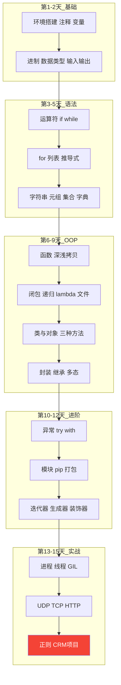

# Day 15：正则表达式与综合项目

> 🎯 **学习目标**：掌握正则表达式，综合 15 天所学完成完整项目


## 1. 正则表达式

### 1.1 元字符速查表

| 元字符 | 含义 | 示例 | 匹配结果 |
|--------|------|------|---------|
| `.` | 任意字符（除换行） | `a.b` | `"a_b"`, `"a1b"` |
| `\d` | 数字 [0-9] | `\d{3}` | `"138"` |
| `\D` | 非数字 | `\D+` | `"abc"` |
| `\w` | 字母数字下划线 | `\w+` | `"user_123"` |
| `\W` | 非字母数字下划线 | `\W+` | `"@#$"` |
| `\s` | 空白字符 | `\s` | 空格、Tab、换行 |
| `\S` | 非空白 | `\S+` | `"Hello"` |
| `*` | 0 次或多次 | `ab*` | `"a"`, `"abbb"` |
| `+` | 1 次或多次 | `ab+` | `"abb"`（不匹配 `"a"`） |
| `?` | 0 次或 1 次 | `ab?` | `"a"`, `"ab"` |
| `{n}` | 恰好 n 次 | `\d{3}` | `"123"` |
| `{n,}` | 至少 n 次 | `\d{3,}` | `"12345"` |
| `{n,m}` | n 到 m 次 | `\d{2,4}` | `"12"`, `"1234"` |
| `[]` | 字符集 | `[aeiou]` | 任一元音字母 |
| `[^]` | 排除字符集 | `[^0-9]` | 非数字 |
| `^` | 字符串开头 | `^Hello` | 以 Hello 开头 |
| `$` | 字符串结尾 | `end$` | 以 end 结尾 |
| `()` | 分组捕获 | `(\d{3})-(\d{4})` | 捕获两组数字 |
| `|` | 或 | `cat|dog` | `"cat"` 或 `"dog"` |

### 1.2 re 模块方法

```python
import re

text = "联系方式：张三 138-1234-5678，李四 13900001111"

# search：搜索第一个匹配
m = re.search(r"\d{3}-\d{4}-\d{4}", text)
if m:
    print(f"找到：{m.group()}")    # "138-1234-5678"
    print(f"位置：{m.span()}")     # (9, 22)

# findall：查找所有匹配
phones = re.findall(r"\d{3}-\d{4}-\d{4}|\d{11}", text)
print(phones)  # ['138-1234-5678', '13900001111']

# sub：替换
cleaned = re.sub(r"[^\d]", "", "电话：138-1234-5678")
print(cleaned)  # "13812345678"

# split：按模式分割
parts = re.split(r"[，,]", "苹果，香蕉,橘子")
print(parts)  # ['苹果', '香蕉', '橘子']

# match：必须从开头匹配
print(re.match(r"\d+", "123abc"))    # 匹配 "123"
print(re.match(r"\d+", "abc123"))    # None（不是从数字开头）

# compile：预编译正则（重复使用时提高效率）
phone_pattern = re.compile(r"1[3-9]\d{9}")
print(phone_pattern.findall("13812345678 15987654321"))
# ['13812345678', '15987654321']
```

### 1.3 分组捕获

```python
text = "生日：1990-05-20"

# 普通分组
m = re.search(r"(\d{4})-(\d{2})-(\d{2})", text)
print(m.group(0))   # "1990-05-20"（整个匹配）
print(m.group(1))   # "1990"（年）
print(m.group(2))   # "05"（月）
print(m.group(3))   # "20"（日）
print(m.groups())   # ('1990', '05', '20')

# 命名分组
m = re.search(r"(?P<year>\d{4})-(?P<month>\d{2})-(?P<day>\d{2})", text)
print(m.group("year"))   # "1990"
print(m.group("month"))  # "05"
print(m.groupdict())     # {'year': '1990', 'month': '05', 'day': '20'}
```

### 1.4 常用正则示例

```python
patterns = {
    "手机号":  r"^1[3-9]\d{9}$",
    "邮箱":    r"^[\w.-]+@[\w.-]+\.\w+$",
    "身份证":  r"^\d{17}[\dXx]$",
    "IP地址":  r"^\d{1,3}\.\d{1,3}\.\d{1,3}\.\d{1,3}$",
    "日期":    r"^\d{4}-\d{2}-\d{2}$",
    "中文":    r"^[一-龥]+$",
}

# 验证函数
def validate(value, pattern_name):
    pattern = patterns.get(pattern_name)
    if not pattern:
        return False
    return bool(re.match(pattern, str(value)))

print(validate("13812345678", "手机号"))  # True
print(validate("user@mail.com", "邮箱"))   # True
print(validate("hello", "中文"))           # False
```

### 1.5 贪婪 vs 非贪婪

```python
text = "<div>内容1</div><div>内容2</div>"

# 贪婪匹配（默认）：尽可能多匹配
greedy = re.findall(r"<div>.*</div>", text)
print(greedy)  # ['<div>内容1</div><div>内容2</div>'] ← 一整块

# 非贪婪匹配（加 ?）：尽可能少匹配
lazy = re.findall(r"<div>.*?</div>", text)
print(lazy)    # ['<div>内容1</div>', '<div>内容2</div>'] ← 分开的
```


## 2. 客户管理系统项目实战 🏗️

综合运用 15 天所学（函数、OOP、文件、异常、正则），完成完整 CRUD 项目：

### 2.1 客户类

```python
import re
from datetime import datetime

class Customer:
    """客户模型"""
    def __init__(self, name, phone, email, address=""):
        self.name = name
        self.phone = phone
        self.email = email
        self.address = address
        self.created_at = datetime.now().strftime("%Y-%m-%d %H:%M:%S")

    def to_dict(self):
        """转为字典（方便 JSON 序列化）"""
        return {
            "name": self.name,
            "phone": self.phone,
            "email": self.email,
            "address": self.address,
            "created_at": self.created_at
        }

    @classmethod
    def from_dict(cls, data):
        """从字典创建 Customer"""
        c = cls(data["name"], data["phone"], data["email"], data.get("address", ""))
        c.created_at = data.get("created_at", "")
        return c

    def __str__(self):
        return f"{self.name} | {self.phone} | {self.email} | {self.created_at}"
```

### 2.2 验证工具

```python
class Validator:
    """输入验证器（正则表达式）"""
    PHONE_PATTERN = re.compile(r"^1[3-9]\d{9}$")
    EMAIL_PATTERN = re.compile(r"^[\w.-]+@[\w.-]+\.\w+$")

    @classmethod
    def phone(cls, value):
        if not cls.PHONE_PATTERN.match(value):
            raise ValueError(f"手机号格式错误：{value}")
        return value

    @classmethod
    def email(cls, value):
        if not cls.EMAIL_PATTERN.match(value):
            raise ValueError(f"邮箱格式错误：{value}")
        return value

    @classmethod
    def not_empty(cls, value, field_name="字段"):
        if not value or not value.strip():
            raise ValueError(f"{field_name} 不能为空")
        return value.strip()
```

### 2.3 数据存储层

```python
import json
import os

class CustomerStore:
    """客户数据存储（字典 + JSON 持久化）"""
    def __init__(self, filename="customers.json"):
        self.filename = filename
        self.customers = {}   # phone → Customer
        self.load()

    def load(self):
        """从文件加载"""
        if os.path.exists(self.filename):
            try:
                with open(self.filename, "r", encoding="utf-8") as f:
                    data = json.load(f)
                self.customers = {
                    phone: Customer.from_dict(d)
                    for phone, d in data.items()
                }
            except (json.JSONDecodeError, KeyError):
                self.customers = {}

    def save(self):
        """保存到文件"""
        with open(self.filename, "w", encoding="utf-8") as f:
            json.dump(
                {phone: c.to_dict() for phone, c in self.customers.items()},
                f, ensure_ascii=False, indent=2
            )

    def add(self, customer):
        if customer.phone in self.customers:
            raise ValueError(f"手机号 {customer.phone} 已存在")
        self.customers[customer.phone] = customer
        self.save()

    def delete(self, phone):
        if phone not in self.customers:
            raise KeyError(f"客户 {phone} 不存在")
        del self.customers[phone]
        self.save()

    def update(self, phone, **kwargs):
        if phone not in self.customers:
            raise KeyError(f"客户 {phone} 不存在")
        c = self.customers[phone]
        for key, value in kwargs.items():
            if hasattr(c, key):
                setattr(c, key, value)
        self.save()

    def get(self, phone):
        return self.customers.get(phone)

    def search(self, keyword):
        """模糊搜索"""
        results = []
        for c in self.customers.values():
            if (keyword in c.name or keyword in c.phone
                or keyword in c.email or keyword in c.address):
                results.append(c)
        return results

    def list_all(self):
        return list(self.customers.values())

    def __len__(self):
        return len(self.customers)
```

### 2.4 主菜单与交互

```python
class CustomerApp:
    """客户管理系统主程序"""
    def __init__(self):
        self.store = CustomerStore()

    def run(self):
        while True:
            self.show_menu()
            choice = input("请选择操作：").strip()
            try:
                if choice == "1":   self.add_customer()
                elif choice == "2": self.delete_customer()
                elif choice == "3": self.update_customer()
                elif choice == "4": self.search_customer()
                elif choice == "5": self.list_customers()
                elif choice == "6":
                    print("👋 再见！")
                    break
                else:
                    print("无效选择，请重新输入")
            except Exception as e:
                print(f"❌ 操作失败：{e}")

    def show_menu(self):
        print(f"""
{'='*50}
      客户管理系统（当前 {len(self.store)} 个客户）
{'='*50}
  1. 添加客户    2. 删除客户
  3. 修改客户    4. 查询客户
  5. 显示全部    6. 退出系统
{'='*50}
""")

    def add_customer(self):
        print("\n--- 添加客户 ---")
        name = Validator.not_empty(input("姓名："), "姓名")
        phone = Validator.phone(input("手机号："))
        email = Validator.email(input("邮箱："))
        address = input("地址（可选）：").strip()
        customer = Customer(name, phone, email, address)
        self.store.add(customer)
        print(f"✅ 客户 {name} 添加成功！")

    def delete_customer(self):
        phone = input("要删除的手机号：").strip()
        c = self.store.get(phone)
        if not c:
            print(f"❌ 客户 {phone} 不存在")
            return
        confirm = input(f"确认删除 {c.name}（{phone}）？(y/N)：")
        if confirm.lower() == "y":
            self.store.delete(phone)
            print("✅ 已删除")

    def update_customer(self):
        phone = input("要修改的手机号：").strip()
        c = self.store.get(phone)
        if not c:
            print(f"❌ 客户 {phone} 不存在")
            return

        print(f"当前信息：{c}")
        name = input(f"姓名（{c.name}），回车跳过：").strip()
        email = input(f"邮箱（{c.email}），回车跳过：").strip()
        address = input(f"地址（{c.address}），回车跳过：").strip()

        updates = {}
        if name: updates["name"] = Validator.not_empty(name, "姓名")
        if email: updates["email"] = Validator.email(email)
        if address: updates["address"] = address
        if updates:
            self.store.update(phone, **updates)
            print("✅ 客户信息已更新")

    def search_customer(self):
        keyword = input("输入姓名、手机号或邮箱关键词：").strip()
        results = self.store.search(keyword)
        if results:
            print(f"找到 {len(results)} 个客户：")
            for c in results:
                print(f"  {c}")
        else:
            print("未找到匹配的客户")

    def list_customers(self):
        customers = self.store.list_all()
        if customers:
            print(f"共 {len(customers)} 个客户：")
            for c in sorted(customers, key=lambda c: c.created_at, reverse=True):
                print(f"  {c}")
        else:
            print("暂无客户")

# 运行
if __name__ == "__main__":
    app = CustomerApp()
    app.run()
```


## 📝 15 天知识体系回顾




## 速记卡（面试闪卡）

**Q1：一句话讲清「Day 15：正则表达式与综合项目」到底是什么？**
A：| 元字符 | 含义 | 示例 | 匹配结果 |
|--------|------|------|---------|
|  | 任意字符（除换行） |  | ,  |
|  | 数字 [0-9] |  |  |
|  | 非数字 |  |  |
|  | 字母数字下划线 |  |  |
|  | 非字母数字下划线 |  |  |
|  | 空白字符 |  | 空格、Tab、换行 |

**Q2：1. 正则表达式 —— 怎么理解？**
A：| 元字符 | 含义 | 示例 | 匹配结果 |
|--------|------|------|---------|
|  | 任意字符（除换行） |  | ,  |
|  | 数字 [0-9] |  |  |
|  | 非数字 |  |  |
|  | 字母数字下划线 |  |  |
|  | 非字母数字下划线 |  |  |
|  | 空白字符 |  | 空格、Tab、换行 |
|  | 非空白 |  |  |

**Q3：2. 客户管理系统项目实战 🏗️ —— 怎么理解？**
A：综合运用 15 天所学（函数、OOP、文件、异常、正则），完成完整 CRUD 项目：

**Q4：核心速记主线有哪些？**
A：抓住这几根：1. 正则表达式、2. 客户管理系统项目实战 🏗️、📝 15 天知识体系回顾。


## 相关链接
- 上一篇：[[14_网络编程]]
- 项目实践：[[项目实战/ai-resume笔记/01_技术研读/01_架构概览|ai-resume: 架构概览]]

---
→ [[技术学习清单#进阶特性]]
