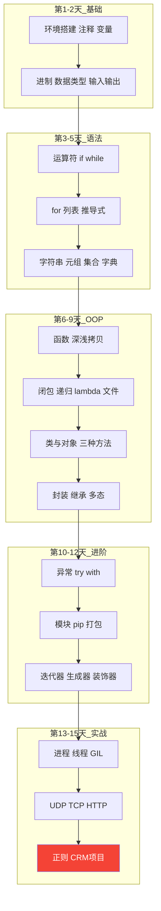

---

title: "Day 15：正则表达式与综合项目"

tags:

  - python

  - 技术学习

created: "2025-07-12"

---

# Day 15：正则表达式与综合项目

> 🎯 **学习目标**：掌握正则表达式，综合 15 天所学完成完整项目

## 1. 正则表达式
### 1.1 元字符速查表

| 元字符 | 含义 | 示例 | 匹配结果 |

|--------|------|------|---------|

| `.` | 任意字符（除换行） | `a.b` | `"a_b"`, `"a1b"` |

| `\d` | 数字 [0-9] | `\d{3}` | `"138"` |

| `\D` | 非数字 | `\D+` | `"abc"` |

| `\w` | 字母数字下划线 | `\w+` | `"user_123"` |

| `\W` | 非字母数字下划线 | `\W+` | `"@#$"` |

| `\s` | 空白字符 | `\s` | 空格、Tab、换行 |

| `\S` | 非空白 | `\S+` | `"Hello"` |

| `*` | 0 次或多次 | `ab*` | `"a"`, `"abbb"` |

| `+` | 1 次或多次 | `ab+` | `"abb"`（不匹配 `"a"`） |

| `?` | 0 次或 1 次 | `ab?` | `"a"`, `"ab"` |

| `{n}` | 恰好 n 次 | `\d{3}` | `"123"` |

| `{n,}` | 至少 n 次 | `\d{3,}` | `"12345"` |

| `{n,m}` | n 到 m 次 | `\d{2,4}` | `"12"`, `"1234"` |

| `[]` | 字符集 | `[aeiou]` | 任一元音字母 |

| `[^]` | 排除字符集 | `[^0-9]` | 非数字 |

| `^` | 字符串开头 | `^Hello` | 以 Hello 开头 |

| `$` | 字符串结尾 | `end$` | 以 end 结尾 |

| `()` | 分组捕获 | `(\d{3})-(\d{4})` | 捕获两组数字 |

| `|` | 或 | `cat|dog` | `"cat"` 或 `"dog"` |

### 1.2 re 模块方法

```python

import re

text = "联系方式：张三 138-1234-5678，李四 13900001111"

# search：搜索第一个匹配

m = re.search(r"\d{3}-\d{4}-\d{4}", text)

if m:

    print(f"找到：{m.group()}")    # "138-1234-5678"

    print(f"位置：{m.span()}")     # (9, 22)

# findall：查找所有匹配

phones = re.findall(r"\d{3}-\d{4}-\d{4}|\d{11}", text)

print(phones)  # ['138-1234-5678', '13900001111']

# sub：替换

cleaned = re.sub(r"[^\d]", "", "电话：138-1234-5678")

print(cleaned)  # "13812345678"

# split：按模式分割

parts = re.split(r"[，,]", "苹果，香蕉,橘子")

print(parts)  # ['苹果', '香蕉', '橘子']

# match：必须从开头匹配

print(re.match(r"\d+", "123abc"))    # 匹配 "123"

print(re.match(r"\d+", "abc123"))    # None（不是从数字开头）

# compile：预编译正则（重复使用时提高效率）

phone_pattern = re.compile(r"1[3-9]\d{9}")

print(phone_pattern.findall("13812345678 15987654321"))

# ['13812345678', '15987654321']

```

### 1.3 分组捕获

```python

text = "生日：1990-05-20"

# 普通分组

m = re.search(r"(\d{4})-(\d{2})-(\d{2})", text)

print(m.group(0))   # "1990-05-20"（整个匹配）

print(m.group(1))   # "1990"（年）

print(m.group(2))   # "05"（月）

print(m.group(3))   # "20"（日）

print(m.groups())   # ('1990', '05', '20')

# 命名分组

m = re.search(r"(?P<year>\d{4})-(?P<month>\d{2})-(?P<day>\d{2})", text)

print(m.group("year"))   # "1990"

print(m.group("month"))  # "05"

print(m.groupdict())     # {'year': '1990', 'month': '05', 'day': '20'}

```

### 1.4 常用正则示例

```python

patterns = {

    "手机号":  r"^1[3-9]\d{9}$",

    "邮箱":    r"^[\w.-]+@[\w.-]+\.\w+$",

    "身份证":  r"^\d{17}[\dXx]$",

    "IP地址":  r"^\d{1,3}\.\d{1,3}\.\d{1,3}\.\d{1,3}$",

    "日期":    r"^\d{4}-\d{2}-\d{2}$",

    "中文":    r"^[一-龥]+$",

}

# 验证函数

def validate(value, pattern_name):

    pattern = patterns.get(pattern_name)

    if not pattern:

        return False

    return bool(re.match(pattern, str(value)))

print(validate("13812345678", "手机号"))  # True

print(validate("user@mail.com", "邮箱"))   # True

print(validate("hello", "中文"))           # False

```

### 1.5 贪婪 vs 非贪婪

```python

text = "<div>内容1</div><div>内容2</div>"

# 贪婪匹配（默认）：尽可能多匹配

greedy = re.findall(r"<div>.*</div>", text)

print(greedy)  # ['<div>内容1</div><div>内容2</div>'] ← 一整块

# 非贪婪匹配（加 ?）：尽可能少匹配

lazy = re.findall(r"<div>.*?</div>", text)

print(lazy)    # ['<div>内容1</div>', '<div>内容2</div>'] ← 分开的

```

## 2. 运行

```python
if __name__ == "__main__":

    app = CustomerApp()

    app.run()

```

## 📝 15 天知识体系回顾



## 速记卡（面试闪卡）

**Q1：一句话讲清「Day 15：正则表达式与综合项目」到底是什么？**

A：正则用元字符描述文本模式，re 模块做匹配提取；当天还整合前 14 天所学做了个 CRM 项目。

**Q2：元字符与 re 方法（metacharacters / re module） —— 怎么理解？**

A：类比：元字符是"通配积木"：. 任意字符、\d 数字、\w 字母数字、* 0+次、+ 1+次、? 0/1次、[] 字符集、^/$ 首尾、() 分组。re 模块像警察：search 抓第一个、findall 一窝端、sub 替换、split 分割、match 必须从开头、compile 预编译提速。（Regular Expression）

**Q3：分组捕获与贪婪（groups / greedy） —— 怎么理解？**

A：类比：(\d{4})-(\d{2})-(\d{2}) 用 group(1)(2)(3) 取年月日，命名分组 (?P<year>...) 用 groupdict() 取。贪婪 .* 尽量多吞、非贪婪 .*? 尽量少吞——提取多个 HTML 标签时加 ? 是关键，否则一整块被吞掉。（Greedy vs lazy）

**Q4：客户管理系统项目（CRM CRUD） —— 怎么理解？**

A：类比：综合 15 天所学成一个完整 CRUD 项目：Customer 模型（to_dict/from_dict）、Validator（正则校验手机/邮箱）、CustomerStore（dict+JSON 文件持久化增删改查）、CustomerApp（菜单交互 try/except 兜底）。像把散零件拧成一台能跑的机器。（Real project）

**Q5：核心认知与坑（maintainability） —— 怎么理解？**

A：类比：正则是文本处理的瑞士军刀，但别写太复杂的正则（难维护易错，超复杂提取用解析库）。贪婪 vs 非贪婪是最常踩的坑（HTML/XML 提取务必加 ?）。项目里异常兜底 + 正则校验，是保证健壮性的标准动作。（Be pragmatic）

**Q6：核心速记主线有哪些？**

- 元字符速查：. \d \w \s * + ? {} [] ^ $ () |

- re 方法：search/findall/sub/split/match/compile

- 分组捕获 group() 与命名分组 groupdict()

- 贪婪 .* 多吞、非贪婪 .*? 少吞，提取多标签必加 ?

- CRM 项目：Customer / Validator / Store / App 串成完整 CRUD

**口诀**

A：正则积木通配符，re 警察抓匹配；

分组抓取年月日，贪婪多吞懒惰缺；

CRM 整合十五天，模型存储菜单接；

复杂正则莫硬写，解析库更体贴。

## 相关链接

- 上一篇：[[14_网络编程]]

---

→ [[技术学习路线图#进阶特性]]

