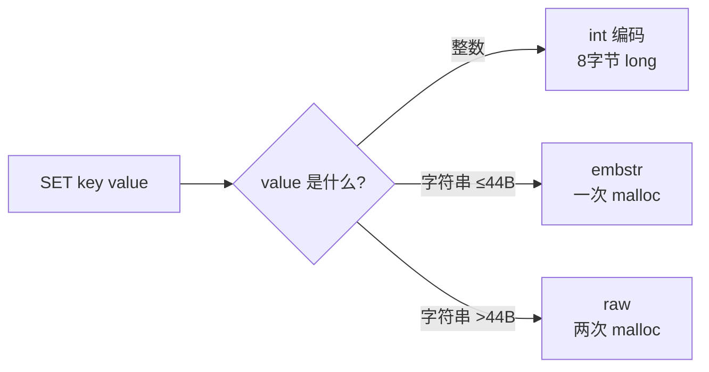
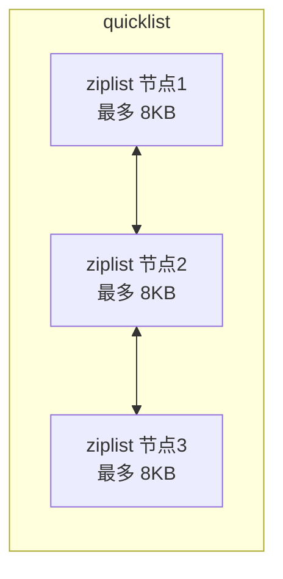
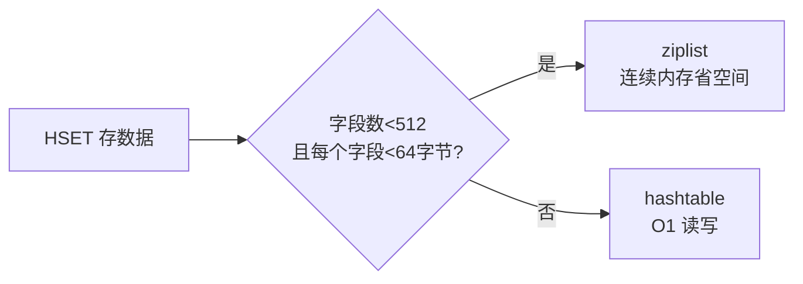
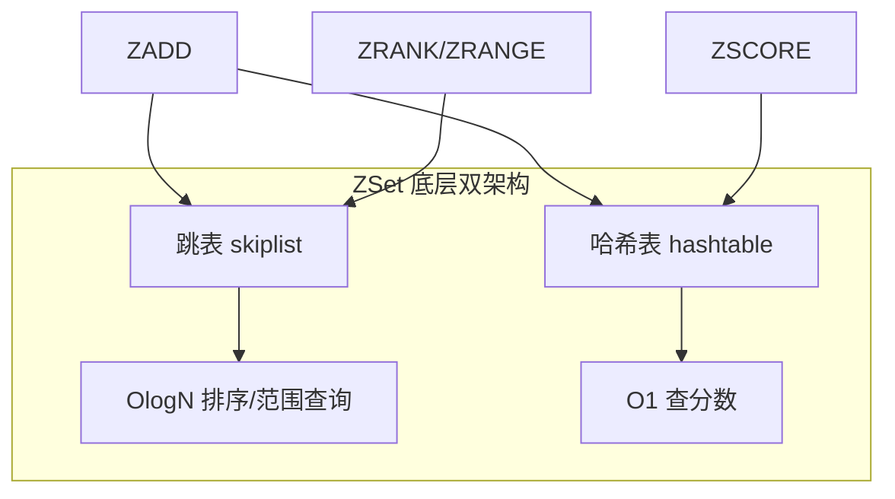
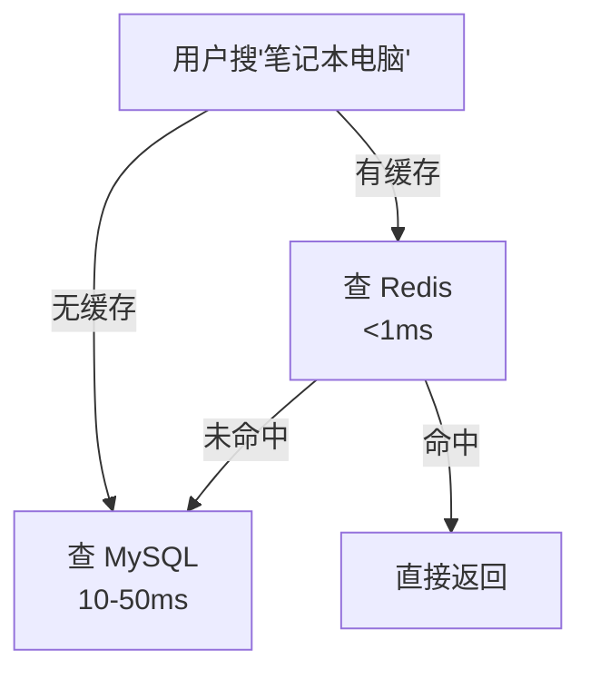
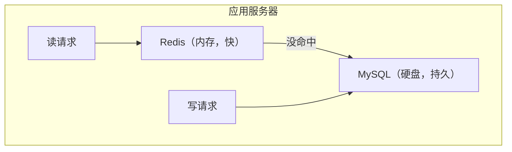
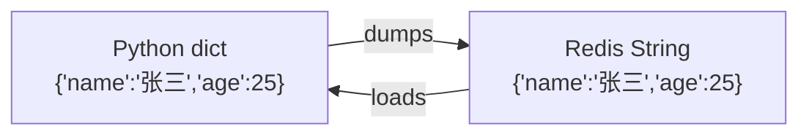

---

title: "Redis五种数据结构"

created: "2026-07-20"

tags:

  - 八股文

  - redis

---

# Redis五种数据结构

## 一句话总结

> **Redis 不是普通键值库——它的 value 有 5 种类型：String（字符串）、List（列表）、Hash（哈希）、Set（集合）、ZSet（有序集合）。选对类型，一行命令顶十行代码。**

---

## 一、String — 最基础，啥都能存
## 二、List — 消息队列/最新消息
## 三、Hash — 存对象/用户资料
## 四、Set — 标签/去重/共同好友
## 五、ZSet — 排行榜/延时队列/限流
### 是什么

最简单的键值对——key 对应一个字符串 value。

### 能存什么

| 存什么 | 例子 | 最大限制 |

| -------- | ------ | --------- |

| 普通字符串 | `"hello"` | 512MB |

| 数字 | `"10086"` | Redis 自己处理加减 |

| JSON 序列化 | `'{"name":"alice"}'` | 512MB |

| 二进制数据 | 图片 base64 | 512MB |

### 常用命令

```bash

SET name "alice"        # 设置

GET name                # 获取 → "alice"

INCR count              # 原子+1（秒杀库存扣减）

INCRBY count 10         # 原子+10

DECR count              # 原子-1

SETEX token 3600 "xyz"  # 设置 + 过期时间（秒）

SETNX lock "1"          # 不存在才设置（分布式锁核心）

MSET k1 v1 k2 v2        # 批量设置

MGET k1 k2              # 批量获取

STRLEN name             # 字符串长度

APPEND name " world"    # 追加

GETRANGE name 0 3       # 子串截取

```

### 底层实现

- **int**：纯数字（8 字节 long）

- **embstr**：短文本（≤44 字节，一次内存分配）

- **raw**：长文本（>44 字节，两次内存分配）



### 应用场景

| 场景 | 做法 |

| ------ | ------ |

| **缓存** | `SETEX article:123 data 3600` |

| **计数器** | `INCR article:views:123` |

| **分布式锁** | `SET lock uuid NX EX 30` |

| **限流** | `INCR ip:rate:192.168.1.1` + 检查值 |

| **全局 ID** | `INCR id:generator` |

---

### 是什么

有序可重复的字符串列表，底层是双向链表或压缩列表。

### 常用命令

```bash

LPUSH posts "article1"    # 左插入（头插）

RPUSH posts "article2"    # 右插入（尾插）

LPOP posts                # 左弹出

RPOP posts                # 右弹出

LRANGE posts 0 -1         # 范围查询（全部元素）

LLEN posts                # 列表长度

LINDEX posts 0            # 按索引查

LTRIM posts 0 99          # 截断（保留前100个）

BLPOP posts 5             # 阻塞左弹出（超时5秒，消息队列核心）

```

### 底层实现

- **quicklist**（3.2+）：压缩列表 + 双向链表的混合体，Redis 3.2 之后唯一实现

- 每个节点是一个 ziplist（压缩列表），节点之间双向指针连接

- **省内存**：ziplist 存小数据时比普通链表省 ~90% 内存



### 应用场景

| 场景 | 做法 |

| ------ | ------ |

| **最新消息/朋友圈** | `LPUSH feed:user1 post1` + `LTRIM feed:user1 0 99` |

| **消息队列** | 生产者 `RPUSH queue task`，消费者 `BLPOP queue 0` |

| **栈** | `LPUSH` + `LPOP`（后进先出）|

| **分页** | `LRANGE items 0 9`（第1页10条）|

### 注意事项

```text

⚠️ List 不是真正的消息队列：

- 没有 ACK 机制（消费者挂了任务就丢了）

- 没有广播机制

- 专业 MQ 场景不要用 List，上 Redis Stream 或 RabbitMQ

```

---

### 是什么

键值对集合，适合存储对象（一个用户的所有字段）。

### 常用命令

```bash

HSET user:1001 name "alice" age 20      # 设置多个字段

HGET user:1001 name                      # 获取单个字段 → "alice"

HGETALL user:1001                        # 获取所有字段

HMGET user:1001 name age                 # 获取多个字段

HDEL user:1001 age                       # 删除字段

HEXISTS user:1001 name                   # 判断字段是否存在 → 1

HINCRBY user:1001 age 1                  # 字段原子+1

HKEYS user:1001                          # 获取所有字段名

HVALS user:1001                          # 获取所有字段值

HLEN user:1001                           # 字段数量

```

### 底层实现

- **ziplist**（小数据）：字段数 < 512 且每个字段长度 < 64 字节

- **hashtable**（大数据）：超过阈值时升级



### 场景对比：String vs Hash 存对象

```bash

# String 方式 —— 序列化整个对象

SET user:1001 '{"name":"alice","age":20,"city":"sz"}'

# Hash 方式 —— 独立字段

HSET user:1001 name "alice" age 20 city "sz"

# ✅ 只查名字：HGET user:1001 name

```

| 场景 | String | Hash |

| ------ | -------- | ------ |

| 缓存一个完整的 JSON | ✅ 简单 | ❌ 多余 |

| 频繁读写某个字段 | ❌ 序列化开销大 | ✅ 直接操作 |

| 字段经常增删 | ❌ 改结构影响全量 | ✅ 灵活 |

| 内存 | ✅ 省一点 | ❌ 头部开销略大 |

### 应用场景

| 场景 | 做法 |

| ------ | ------ |

| **用户资料** | `HSET user:1001 name age city avatar` |

| **购物车** | `HSET cart:1001 item_id quantity` |

| **文章详情** | `HSET article:123 title content author time` |

---

### 是什么

无序、不重复的字符串集合。

### 常用命令

```bash

SADD tags:post1 "python" "redis" "ai"   # 添加元素（自动去重）

SREM tags:post1 "redis"                  # 删除元素

SMEMBERS tags:post1                       # 获取所有元素

SISMEMBER tags:post1 "python"            # 判断是否存在 → 1

SCARD tags:post1                          # 元素个数

SINTER tags:post1 tags:post2             # 交集（共同标签）

SUNION tags:post1 tags:post2             # 并集

SDIFF tags:post1 tags:post2              # 差集

SRANDMEMBER tags:post1 2                 # 随机取2个（不删除）

SPOP tags:post1                           # 随机弹出一个

```

### 底层实现

- **intset**（整数集）：所有元素都是整数且数量 < 512

- **hashtable**：存字符串或元素数量大时

### 为什么 Set 做交集这么快？

```text

Set 交集 = 遍历最小的集合，在最大的集合里查存在性

SINTER tag:python(1万) tag:redis(8万) tag:ai(5万)

→ 挑最小的 tag:python(1万)，在另外两个 hashtable 里 O(1) 查询

→ 总共 1万次 O(1) 操作 = 毫秒级

```

### 应用场景

| 场景 | 做法 |

| ------ | ------ |

| **标签系统** | `SADD article:1:tags python redis` |

| **共同好友** | `SINTER user:1:friends user:2:friends` |

| **关注/粉丝** | `SADD user:1:follow user:2` |

| **抽奖去重** | `SRANDMEMBER lottery:users 3` / `SPOP` |

| **UV 统计** | `SADD page:uv:20240101 user_id` |

---

### 是什么

Set + 排序——每个元素带一个 score（分数），按分数排序，元素唯一。

### 常用命令

```bash

ZADD leaderboard 100 "alice" 200 "bob"   # 添加元素+分数

ZRANK leaderboard "alice"                 # 升序排名 → 0

ZREVRANK leaderboard "alice"              # 降序排名 → 1

ZSCORE leaderboard "alice"                # 获取分数 → 100

ZINCRBY leaderboard 50 "alice"            # 加分（原子操作）

ZRANGE leaderboard 0 2                    # 升序取前3名

ZREVRANGE leaderboard 0 2 WITHSCORES      # 降序取前3名+分数

ZRANGEBYSCORE leaderboard 0 500           # 按分数范围取

ZREM leaderboard "bob"                    # 删除元素

ZCARD leaderboard                         # 元素个数

ZCOUNT leaderboard 100 200                # 分数范围内元素数

```

### 底层实现

- **ziplist**（小数据）：元素数 < 128 且每个元素长度 < 64 字节

- **skiplist + hashtable**（大数据）：跳表维护顺序 + 哈希表 O(1) 查分



### 为什么 ZSet 用跳表不用红黑树？

| 维度 | 跳表 | 红黑树 |

| ------ | ------ | -------- |

| 实现复杂度 | 约 50 行 | 约 300 行 |

| 范围查询 | 天然支持（链表） | 需中序遍历，复杂 |

| 并发友好 | 分段加锁简单 | 加锁复杂 |

| 平均查找 | O(logN) | O(logN) |

| 内存 | 略多（冗余指针） | 少一点 |

> **必答：不是红黑树不好，是跳表在范围查询和实现简单度上更适合 Redis 场景。**

### 应用场景

| 场景 | 做法 |

| ------ | ------ |

| **排行榜** | `ZINCRBY leaderboard:game1 user1 10`（每次加分）|

| **延时队列** | `ZADD delay_queue task1 now+3600`（score=执行时间）|

| **滑动窗口限流** | `ZREMRANGEBYSCORE + ZCARD` |

| **商品销量排序** | `ZINCRBY sales:today product1 1` |

| **GEO 附近的人** | `ZADD geo user1 score`（简单版）|

### 延时队列实现

```python

# 生产者：加入延时任务

ZADD delay:queue "send_email:user1" 1704067200  # score=未来时间戳

# 消费者：每秒轮询

while True:

    tasks = ZRANGEBYSCORE delay:queue 0 now() LIMIT 0 10

    for task in tasks:

        process(task)

        ZREM delay:queue task

    sleep(1)

```

> **专业版：Redis 5.0+ 有专门的 Stream 做消息队列，比 ZSet 延时队列更可靠。**

---

## 六、五种数据结构速查表

| 类型 | 有序 | 可重复 | 最大元素 | 底层 | 核心应用 |

| :--- | :---: | :-----: | :-------: | :--- | :--------- |

| **String** | - | - | 512MB | int / embstr / raw | 缓存/计数器/分布式锁 |

| **List** | ✅ | ✅ | 2^32-1 | quicklist | 消息队列/最新消息 |

| **Hash** | ❌ | ❌ | 2^32-1 字段 | ziplist / hashtable | 对象存储/用户资料 |

| **Set** | ❌ | ❌ | 2^32-1 | intset / hashtable | 标签/去重/共同好友 |

| **ZSet** | ✅ 按 score | ❌ | 2^32-1 | ziplist / skiplist+hash | 排行榜/延时队列 |

---

## 七、选型决策树

```text

你要存什么？

│

├── 单个值（JSON/字符串/数字）

│   └── String ✅

│

├── 一系列有序数据

│   ├── 最新N条消息 → List（LPUSH + LTRIM）

│   └── 需要去重 → ZSet

│

├── 对象的多个字段

│   ├── 全量读写 → Hash

│   └── 很少改某个字段 → String 序列化

│

├── 无序不重复集合

│   ├── 只看在不在 → Set

│   └── 需要交集/并集运算 → Set

│

└── 需要排序

    ├── 按分数排序 → ZSet

    └── 按插入时间排序 → List

```

---

## 记忆口诀

> **String 缓存计数器，List 队列最新事。**

> **Hash 存对象字段，Set 去重做交集。**

> **ZSet 排行榜之王，跳表哈希双架构。**

> **选对类型省代码，一行命令顶十行。**

---

## 目录

- [Redis 是什么](#redis-是什么)

- [安装运行](#安装运行)

- [前置知识：命令行基础](#前置知识命令行基础)

- [一、String — 字符串](#一-string--字符串)

- [二、Hash — 哈希](#二-hash--哈希)

- [三、List — 列表](#三-list--列表)

- [四、Set — 集合](#四-set--集合)

- [五、ZSet — 有序集合](#五-zset--有序集合)

- [速查表](#速查表)

- [缓存穿透 / 击穿 / 雪崩](#缓存穿透--击穿--雪崩)

- [常见踩坑](#常见踩坑)

- [综合实战](#综合实战)

---

## Redis 是什么
### 一个场景理解缓存

你在电商网站搜"笔记本电脑"，页面要显示商品列表。如果每次搜索都去查 MySQL：



MySQL 是仓库（空间大、拿东西慢），Redis 是工作台上的工具箱（空间小、伸手就拿）。常用的螺丝刀放工具箱，偶尔用的大电钻才去仓库取。

### Redis 为什么快？

| 原因 | 解释 |

|:---|:---|

| **纯内存操作** | 数据在 RAM 里，不碰硬盘（MySQL 要走磁盘 I/O） |

| **单线程模型** | 没有锁竞争、没有上下文切换开销 |

| **IO 多路复用** | 一个线程同时监听多个连接，哪个有数据到了就处理哪个 |

| **简单数据结构** | 没有复杂的关系模型，就是 key-value |

> [!note] 单线程为什么还这么快？

> Redis 的瓶颈从来不在 CPU，而在网络带宽和内存大小。就像一个收银员速度够快，瓶颈是顾客排多长队、收银台多大——不是收银员脑子转不过来。

**QPS 量级概念**：MySQL 单机 QPS ≈ 几千到一万，Redis 单机 QPS ≈ 10 万+。不是快一两倍，是快两个数量级。

### Redis 和 MySQL 的关系：不是替代，是互补



> [!note]

> MySQL 是日记本（要长期保存的），Redis 是便利贴（用完可以丢、但随时能看）。

---

## 安装运行

> Redis 官方不直接支持 Windows。以下三种方式任选一种。

### 方式 1：Docker（推荐，一行搞定）

```bash

# 拉取并运行 Redis（端口 6379 是 Redis 默认端口）

docker run -d --name myredis -p 6379:6379 redis

# 进入 Redis 命令行

docker exec -it myredis redis-cli

```

### 方式 2：WSL（Windows Subsystem for Linux）

```bash

# 在 WSL Ubuntu 里

sudo apt update

sudo apt install redis-server

# 启动

sudo service redis-server start

# 连接

redis-cli

```

### 方式 3：Memurai（Windows 原生，兼容 Redis 协议）

下载地址：https://www.memurai.com/ → 安装后自动启动，直接 `redis-cli` 连接。

### 验证安装成功

```bash

$ redis-cli

127.0.0.1:6379> ping

PONG

127.0.0.1:6379> SET hello world

OK

127.0.0.1:6379> GET hello

"world"

```

---

## 前置知识：命令行基础
### Redis CLI 基本规则

| 规则 | 说明 | 示例 |

|:---|:---|:---|

| 命令不区分大小写 | `GET` = `get`（习惯大写） | `GET name` |

| key 区分大小写 | `user` ≠ `User` | |

| 字符串值带引号时含空格 | `SET title "hello world"` | 双引号保护空格 |

| 默认操作 0 号数据库 | Redis 有 0~15 共 16 个库 | `SELECT 1` 切换 |

| `Ctrl + C` 退出 | 或直接关终端 | |

### 通用命令（所有数据类型都适用）

| 命令 | 作用 | 示例 |

|:---|:---|:---|

| `KEYS pattern` | 按模式查找 key | `KEYS user:*` |

| `DEL key` | 删除 key | `DEL user:1` |

| `EXISTS key` | 判断 key 是否存在 | `EXISTS user:1` |

| `EXPIRE key seconds` | 设置过期时间（秒） | `EXPIRE code 300` |

| `TTL key` | 查看剩余过期时间 | `TTL code`（-1=永不过期，-2=已过期） |

| `TYPE key` | 查看 key 的数据类型 | `TYPE user:1` |

| `RENAME old new` | 重命名 key | `RENAME tmp name` |

| `FLUSHDB` | ⚠️ 清空当前库 | 生产环境禁用！ |

---

## 一、String — 字符串
### 1.1 为什么需要 String？

Redis 最基础的类型。存一个 key 对应一个值：

```bash

SET name "张三"

GET name          # "张三"

```

String 不仅能存字符串，还能存数字并自增——这是普通缓存做不到的。

String 就像便利贴——贴一个标签（key），上面写一行字（value）。

### 1.2 核心命令

| 命令 | 作用 | 示例 |

|:---|:---|:---|

| `SET key value` | 设置值（有则覆盖） | `SET name "张三"` |

| `GET key` | 取值 | `GET name` |

| `MSET k1 v1 k2 v2` | 批量设值 | `MSET user:1:name "张三" user:1:age 25` |

| `MGET k1 k2` | 批量取值 | `MGET user:1:name user:1:age` |

| `SETEX key seconds value` | 设值 + 设过期时间 | `SETEX code 300 "123456"` |

| `SETNX key value` | 仅 key 不存在时才设（**SET** if **N**ot e**X**ists） | `SETNX lock:task "1"` |

| `INCR key` | 值 +1（值必须是数字） | `INCR views` |

| `DECR key` | 值 -1 | `DECR stock` |

| `INCRBY key N` | 值 +N | `INCRBY views 10` |

| `APPEND key value` | 追加字符串 | `APPEND log "new line"` |

| `STRLEN key` | 字符串长度 | `STRLEN name` |

| `GETSET key value` | 取旧值的同时设新值 | `GETSET name "李四"` |

```bash

# 基本存取

127.0.0.1:6379> SET username "zhangsan"

OK

127.0.0.1:6379> GET username

"zhangsan"

# 计数器（INCR 天生线程安全——没有"读-改-写"的并发问题）

127.0.0.1:6379> SET page:views 0

OK

127.0.0.1:6379> INCR page:views      # → 1

(integer) 1

127.0.0.1:6379> INCR page:views      # → 2

(integer) 2

127.0.0.1:6379> INCRBY page:views 10 # → 12

(integer) 12

# 验证码场景：存 5 分钟自动过期

127.0.0.1:6379> SETEX sms:13800138000 300 "456789"

OK

127.0.0.1:6379> TTL sms:13800138000  # 还剩多少秒

(integer) 295

# 分布式锁原理：SETNX 只有一个客户端能 set 成功

127.0.0.1:6379> SETNX order:1001 "locked"

(integer) 1    # ← 拿到锁了

# 另一个客户端同时执行：

127.0.0.1:6379> SETNX order:1001 "locked"

(integer) 0    # ← 没拿到，别人锁着呢

```

### 1.3 常见场景

| 场景 | 用到的命令 | 说明 |

|:---|:---|:---|

| 缓存 JSON 数据 | `SET`/`GET` | 把对象序列化成 JSON 字符串存 |

| 计数器（阅读量/点赞） | `INCR` | 原子操作，并发安全 |

| 验证码/Token | `SETEX` | 带过期时间，自动清理 |

| 分布式锁 | `SETNX` | "只有第一个执行的能 set 成功" |

| 限流计数器 | `INCR` + `EXPIRE` | 统计 1 分钟内请求次数 |

---

## 二、Hash — 哈希
### 2.1 为什么需要 Hash？

String 存对象要序列化成 JSON，想改一个字段就得整体取出→修改→写回。Hash 直接存字段，可以**按字段读写**。

```bash

# ❌ String 存用户：改邮箱要整取整写

SET user:1 '{"name":"张三","age":25,"email":"zs@qq.com"}'

# ✅ Hash 存用户：改邮箱只动一个字段

HSET user:1 name "张三" age 25 email "zs@qq.com"

HSET user:1 email "new@qq.com"   # 只改 email

```

String 存对象就像把整张表格拍成照片存——改一格得重拍。Hash 就像 Excel 表格——直接定位到单元格修改。

### 2.2 核心命令

| 命令 | 作用 | 示例 |

|:---|:---|:---|

| `HSET key field value` | 设单个字段 | `HSET user:1 name "张三"` |

| `HSET key f1 v1 f2 v2` | 设多个字段（Redis 4.0+） | `HSET user:1 name "张三" age 25` |

| `HGET key field` | 取单个字段 | `HGET user:1 name` |

| `HMGET key f1 f2` | 取多个字段 | `HMGET user:1 name age` |

| `HGETALL key` | 取所有字段和值 | `HGETALL user:1` |

| `HDEL key field` | 删除字段 | `HDEL user:1 email` |

| `HEXISTS key field` | 判断字段是否存在 | `HEXISTS user:1 name` |

| `HKEYS key` | 取所有字段名 | `HKEYS user:1` |

| `HVALS key` | 取所有字段值 | `HVALS user:1` |

| `HLEN key` | 字段数量 | `HLEN user:1` |

| `HINCRBY key field N` | 字段值 +N | `HINCRBY user:1 age 1` |

```bash

# 存用户信息

127.0.0.1:6379> HSET user:1001 name "张三" age 25 email "zs@qq.com"

(integer) 3

# 取单个字段

127.0.0.1:6379> HGET user:1001 name

"张三"

# 取多个字段

127.0.0.1:6379> HMGET user:1001 name age

1) "张三"

2) "25"

# 取全部（field 和 value 交替返回）

127.0.0.1:6379> HGETALL user:1001

1) "name"

2) "张三"

3) "age"

4) "25"

5) "email"

6) "zs@qq.com"

# 判断字段是否存在

127.0.0.1:6379> HEXISTS user:1001 phone

(integer) 0

# 年龄 +1

127.0.0.1:6379> HINCRBY user:1001 age 1

(integer) 26

# 购物车场景：商品 ID → 数量

127.0.0.1:6379> HSET cart:1001 sku_101 2 sku_202 1

(integer) 2

127.0.0.1:6379> HINCRBY cart:1001 sku_101 1

(integer) 3

```

### 2.3 常见场景

| 场景 | 用到的命令 | 说明 |

|:---|:---|:---|

| 用户信息缓存 | `HSET`/`HGET`/`HMGET` | 按字段读写，不用整取整写 |

| 购物车 | `HSET`/`HINCRBY`/`HDEL` | 商品 ID 做 field，数量做 value |

| 文章点赞数统计 | `HINCRBY` | 原子自增，并发安全 |

| 对象属性快速查询 | `HEXISTS` | 判断用户是否有某属性 |

---

## 三、List — 列表
### 3.1 为什么需要 List？

List 是**有序可重复**的字符串列表。关键特性：**可以从两端 push/pop**——天然适合做队列和栈。

List 像一根竹筒——只能从两端塞东西或取东西。从左边塞从右边取 → 队列（先进先出）；从左边塞从左边取 → 栈（后进先出）。

### 3.2 核心命令

| 命令 | 作用 | 示例 |

|:---|:---|:---|

| `LPUSH key value` | 从左边插入 | `LPUSH tasks "send_email"` |

| `RPUSH key value` | 从右边插入 | `RPUSH tasks "send_sms"` |

| `LPOP key` | 从左边弹出（取出并删除） | `LPOP tasks` |

| `RPOP key` | 从右边弹出 | `RPOP tasks` |

| `LRANGE key start stop` | 按范围取（不删除） | `LRANGE tasks 0 -1`（取全部） |

| `LLEN key` | 列表长度 | `LLEN tasks` |

| `LINDEX key index` | 按下标取 | `LINDEX tasks 0`（第一个） |

| `LREM key count value` | 删除指定值的元素 | `LREM tasks 1 "send_email"` |

| `LTRIM key start stop` | 只保留范围内的 | `LTRIM news 0 9` |

```bash

# 从左边塞入（最新的在最左边）

127.0.0.1:6379> LPUSH news "消息1"

(integer) 1

127.0.0.1:6379> LPUSH news "消息2"

(integer) 2

127.0.0.1:6379> LPUSH news "消息3"

(integer) 3

# 取全部

127.0.0.1:6379> LRANGE news 0 -1

1) "消息3"

2) "消息2"

3) "消息1"

# ===== 队列模式：LPUSH + RPOP（先进先出） =====

127.0.0.1:6379> LPUSH queue "task1" "task2" "task3"

(integer) 3

127.0.0.1:6379> RPOP queue      # 右边弹出 = 最早进去的

"task1"

127.0.0.1:6379> RPOP queue

"task2"

# ===== 栈模式：LPUSH + LPOP（后进先出） =====

127.0.0.1:6379> LPUSH stack "a" "b" "c"

(integer) 3

127.0.0.1:6379> LPOP stack       # 左边弹出 = 最后进去的

"c"

127.0.0.1:6379> LPOP stack

"b"

# ===== 阻塞弹出：队列空了会等着，有新消息立即返回 =====

127.0.0.1:6379> BLPOP queue 5    # 5秒内没数据就返回 nil

```

### 3.3 常见场景

| 场景 | 用到的命令 | 说明 |

|:---|:---|:---|

| 消息队列 | `LPUSH` + `RPOP`/`BLPOP` | 生产者左边塞，消费者右边取 |

| 最新动态/时间线 | `LPUSH` + `LTRIM` | 左边塞新的，`LTRIM` 只保留最近 N 条 |

| 任务栈 | `LPUSH` + `LPOP` | 后进先出，深度优先处理 |

| 分页列表 | `LRANGE` | `LRANGE key 0 9` 取前 10 条 |

> [!warning] List 不是正经消息队列

> 没有确认机制，消费者崩了消息就丢了。生产环境消息队列用 RabbitMQ/Kafka。List 适合轻量场景或学习。

---

## 四、Set — 集合
### 4.1 为什么需要 Set？

Set 是**无序不重复**的字符串集合。核心价值在**集合运算**——交集、并集、差集，一句命令搞定。

Set 像微信群——群里每个人只能出现一次（不重复），看谁和谁在同一个群就是交集。

### 4.2 核心命令

| 命令 | 作用 | 示例 |

|:---|:---|:---|

| `SADD key member` | 添加元素 | `SADD tags:article:1 "python"` |

| `SREM key member` | 删除元素 | `SREM tags:article:1 "python"` |

| `SMEMBERS key` | 取所有元素 | `SMEMBERS tags:article:1` |

| `SISMEMBER key member` | 判断是否存在 | `SISMEMBER tags:article:1 "python"` |

| `SCARD key` | 元素个数（**S**et **C**ARD**inality**） | `SCARD tags:article:1` |

| `SINTER key1 key2` | 交集 — 两个集合都有的 | `SINTER user:1:friends user:2:friends` |

| `SUNION key1 key2` | 并集 — 合并去重 | `SUNION tags:1 tags:2` |

| `SDIFF key1 key2` | 差集 — key1 有 key2 没有的 | `SDIFF user:1:friends user:2:friends` |

| `SRANDMEMBER key N` | 随机取 N 个（不删除） | `SRANDMEMBER users 3` |

| `SPOP key` | 随机弹出一个（取出并删除） | `SPOP lottery` |

```bash

# 给文章打标签

127.0.0.1:6379> SADD article:1:tags "python" "redis" "database"

(integer) 3

127.0.0.1:6379> SADD article:2:tags "python" "django" "web"

(integer) 3

# 查看文章 1 的所有标签

127.0.0.1:6379> SMEMBERS article:1:tags

1) "python"

2) "redis"

3) "database"

# 两篇文章的共同标签（交集）

127.0.0.1:6379> SINTER article:1:tags article:2:tags

1) "python"

# ===== 共同好友（交集） =====

127.0.0.1:6379> SADD user:1:friends "user:2" "user:3" "user:5"

(integer) 3

127.0.0.1:6379> SADD user:4:friends "user:2" "user:5" "user:8"

(integer) 3

127.0.0.1:6379> SINTER user:1:friends user:4:friends

1) "user:2"

2) "user:5"

# user:4 的好友里，user:1 还没有的是谁？

127.0.0.1:6379> SDIFF user:4:friends user:1:friends

1) "user:8"          # user:1 不认识 user:8 → 推荐

# ===== 抽奖（随机弹出） =====

127.0.0.1:6379> SADD lottery "user:1" "user:2" "user:3" "user:4" "user:5"

(integer) 5

127.0.0.1:6379> SPOP lottery       # 随机抽一个

"user:3"

127.0.0.1:6379> SPOP lottery

"user:1"

```

### 4.3 常见场景

| 场景 | 用到的命令 | 说明 |

|:---|:---|:---|

| 文章标签 | `SADD`/`SMEMBERS` | 一个文章多个标签 |

| 共同好友/共同关注 | `SINTER` | 交集运算，一句命令 |

| 推荐关注（你可能认识） | `SDIFF` | 差集：他有我没有的朋友 |

| 用户标签体系 | `SUNION` | 并集：覆盖多种特征的用户群 |

| 抽奖/随机推荐 | `SRANDMEMBER`/`SPOP` | 随机取元素 |

| 点赞用户集合 | `SADD`/`SREM`/`SCARD` | 记录谁点了赞，快速去重 |

---

## 五、ZSet — 有序集合
### 5.1 为什么需要 ZSet？

Set 是无序的——你能存"用户 A 是 vip"，但不能存"用户 A 消费了 5200 元，排名第 3"。ZSet 给每个元素绑定一个 **score（分数）**，按分数自动排序。

Set 是微信群（只知道有谁），ZSet 是成绩排名表——每个人后面跟着一个分数，按分数从高到低排。

### 5.2 核心命令

| 命令 | 作用 | 示例 |

|:---|:---|:---|

| `ZADD key score member` | 添加元素（有则更新分数） | `ZADD rank 9800 "张三"` |

| `ZREM key member` | 删除元素 | `ZREM rank "张三"` |

| `ZSCORE key member` | 查某个元素的分数 | `ZSCORE rank "张三"` |

| `ZRANK key member` | 查排名（从小到大，0 开始） | `ZRANK rank "张三"` |

| `ZREVRANK key member` | 查排名（从大到小） | `ZREVRANK rank "张三"` |

| `ZRANGE key start stop` | 按排名范围取（升序） | `ZRANGE rank 0 2`（前三名） |

| `ZREVRANGE key start stop` | 按排名范围取（降序） | `ZREVRANGE rank 0 2` |

| `ZRANGE ... WITHSCORES` | 取值时带上分数 | `ZREVRANGE rank 0 2 WITHSCORES` |

| `ZRANGEBYSCORE key min max` | 按分数范围取 | `ZRANGEBYSCORE rank 5000 10000` |

| `ZCARD key` | 元素个数 | `ZCARD rank` |

| `ZCOUNT key min max` | 分数在范围内的个数 | `ZCOUNT rank 5000 10000` |

| `ZINCRBY key N member` | 分数 +N | `ZINCRBY rank 100 "张三"` |

| `ZREMRANGEBYRANK key start stop` | 按排名删除 | `ZREMRANGEBYRANK rank 0 9`（删 Top10） |

```bash

# 添加玩家 + 积分

127.0.0.1:6379> ZADD game:rank 9800 "张三" 7200 "李四" 5100 "王五" 8900 "赵六"

(integer) 4

# 查看 Top3（从大到小）

127.0.0.1:6379> ZREVRANGE game:rank 0 2 WITHSCORES

1) "张三"

2) "9800"

3) "赵六"

4) "8900"

5) "李四"

6) "7200"

# 查看张三的排名（从大到小）

127.0.0.1:6379> ZREVRANK game:rank "张三"

(integer) 0

# 查看王五的排名和分数

127.0.0.1:6379> ZREVRANK game:rank "王五"

(integer) 3

127.0.0.1:6379> ZSCORE game:rank "王五"

"5100"

# 张三 +100 分

127.0.0.1:6379> ZINCRBY game:rank 100 "张三"

"9900"

# 分数在 5000~10000 的有多少人

127.0.0.1:6379> ZCOUNT game:rank 5000 10000

(integer) 4

# score 存执行时间的时间戳，消费者取 score 最小的

127.0.0.1:6379> ZADD delay:queue 1719000000 "send_email:1001"

(integer) 1

127.0.0.1:6379> ZADD delay:queue 1719000500 "send_sms:1002"

(integer) 1

# 取"现在之前该执行"的任务

127.0.0.1:6379> ZRANGEBYSCORE delay:queue 0 1719000300

1) "send_email:1001"

```

### 5.3 常见场景

| 场景 | 用到的命令 | 说明 |

|:---|:---|:---|

| 游戏排行榜 | `ZADD`/`ZREVRANGE`/`ZINCRBY` | 积分更新 + 排名查询 |

| 热搜榜单 | `ZINCRBY`/`ZREVRANGE` | 每搜索一次 score +1 |

| 延迟队列 | `ZADD`/`ZRANGEBYSCORE` | score = 执行时间戳 |

| 带权重的推荐 | `ZADD`/`ZREVRANGE` | score = 推荐权重 |

| 时间线排序 | `ZADD`/`ZREVRANGE` | score = 发布时间戳 |

---

## 速查表
### 各数据结构一句话 + 核心命令

| 类型 | 一句话 | 增 | 查 | 删 | 特色 |

|:---|:---|:---|:---|:---|:---|

| **String** | 一个 key 一个值 | `SET` | `GET`/`MGET` | `DEL` | `INCR` 原子自增 |

| **Hash** | key 下面有多个 field-value | `HSET` | `HGET`/`HMGET`/`HGETALL` | `HDEL` | `HINCRBY` 字段自增 |

| **List** | 有序可重复的双端列表 | `LPUSH`/`RPUSH` | `LRANGE`/`LINDEX` | `LPOP`/`RPOP` | `BLPOP` 阻塞弹出 |

| **Set** | 无序不重复的集合 | `SADD` | `SMEMBERS`/`SISMEMBER` | `SREM`/`SPOP` | `SINTER`/`SUNION`/`SDIFF` |

| **ZSet** | 带分数的有序集合 | `ZADD` | `ZRANGE`/`ZSCORE`/`ZRANK` | `ZREM` | `ZINCRBY` 改分值 |

### 场景选型速查

| 你要做什么 | 用哪个类型 | 为什么 |

|:---|:---|:---|

| 缓存一个 API 返回的 JSON | String | 直接序列化存，最简单 |

| 缓存用户信息（按字段读写） | Hash | 不用整体序列化/反序列化 |

| 计数器 / 限流 | String + `INCR` | 原子操作，天生并发安全 |

| 消息队列（轻量） | List | 双端操作，`BLPOP` 阻塞等 |

| 最新动态 Top N | List + `LTRIM` | 左边塞新的，裁剪保留 N 条 |

| 去重 / 标签 / 点赞用户 | Set | 自动去重，支持交并差 |

| 共同好友 / 共同关注 | Set + `SINTER` | 一句命令出结果 |

| 排行榜 / 热搜 | ZSet | score 自动排序 |

| 延迟队列 | ZSet | score = 执行时间，按范围取 |

| 抽奖 / 随机推荐 | Set + `SRANDMEMBER` | 随机取元素 |

---

## 缓存穿透 / 击穿 / 雪崩
### 缓存穿透（Cache Penetration）

**是什么**：查询一个**根本不存在**的数据，缓存里没有，数据库里也没有。每次请求都穿透缓存打到数据库。

```text

用户查 id=99999 的商品（不存在）

  → Redis: 没有

  → MySQL: 也没有

  → 返回空

恶意攻击者用脚本循环查 id=-1, -2, -3...（全不存在）

  → 每次都打穿 Redis 直击 MySQL

  → 数据库被打垮

```

有人不停按你家门铃问"王大爷在吗"——但小区根本没这个人。你每次都要开门看一眼再回答不在。

**解决方案：**

| 方案 | 做法 | 优缺点 |

|:---|:---|:---|

| **缓存空值** | 查不到的数据也缓存，value 设 null 或特殊标记，过期时间设短（1-5 分钟） | 简单；浪费一点内存 |

| **布隆过滤器** | 在 Redis 前面加一个布隆过滤器，先判断 key 是否"可能存在" | 高效；实现复杂，有误判率 |

```bash

# 缓存空值示例：查不到的商品也存，但短时间过期

SET product:99999 "" EX 60

# 下次查同一个不存在 ID → Redis 返回空 → 不查 MySQL

```

> [!note] 布隆过滤器

> 一个很小的数据结构，能告诉你"这个 key 肯定不存在"或"可能存在"。就像图书馆门口的检索电脑——查不到的书名肯定没有，查到了再进库（Redis/MySQL）。Redis 4.0+ 有内置的布隆过滤器模块 `RedisBloom`。

### 缓存击穿（Cache Breakdown）

**是什么**：一个**热点 key**（比如双十一某爆款商品）在过期的一瞬间，大量请求同时打到数据库——缓存被"击穿"了一个洞。

```text

某热门商品的缓存 key 在 12:00:00 过期

  → 12:00:00.001，1000 个请求同时到达

  → Redis 返回 nil（过期了）

  → 1000 个请求全部涌向 MySQL 查同一条数据

  → 数据库瞬时压力巨大

```

演唱会门口只有一个检票口——开门瞬间所有人挤进去，检票员（数据库）被冲垮。

**和穿透的区别**：穿透是查"不存在的数据"；击穿是查"存在但缓存刚好过期了的热点数据"。

**解决方案：**

| 方案 | 做法 | 优缺点 |

|:---|:---|:---|

| **互斥锁** | 第一个没命中的请求去查数据库，同时加锁；其他请求等锁释放后从缓存拿 | 保证只有一个请求查 DB；增加复杂度 |

| **永不过期** | 热点数据不设过期时间，用异步任务更新 | 简单；可能返回旧数据（看业务容忍度） |

#### 互斥锁实现

```python

def get_product(product_id: int):

    # 1. 先查 Redis

    data = redis.get(f"product:{product_id}")

    if data:

        return data

    # 2. 没命中 → 尝试获取锁

    lock_key = f"lock:product:{product_id}"

    if redis.setnx(lock_key, "1"):

        redis.expire(lock_key, 10)

        try:

            data = mysql.query(product_id)

            redis.setex(f"product:{product_id}", 3600, data)

        finally:

            redis.delete(lock_key)

        return data

    # 3. 没拿到锁 → 等一会再查 Redis

    time.sleep(0.1)

    return get_product(product_id)

```

#### 永不过期方案

核心思路：热点 key 不设 `EXPIRE`——缓存永远不会因为 TTL 到期而消失。数据更新靠**后台异步任务**定期从 MySQL 刷新到 Redis。应用层永远只读 Redis，不直接查 MySQL。

```text

请求 → 读 Redis → 永远命中（key 没有 TTL） → 返回

                         ↑

              后台定时任务：每 N 秒查 MySQL → 更新 Redis

```

##### 方式 1：定时任务全量刷新

热点数据量不大（几百到几千条），对实时性要求不高（秒级延迟可接受）。

```python

import asyncio

import json

HOT_PRODUCT_IDS = [1001, 1002, 1003, 1050, 1088]

async def refresh_hot_products():

    while True:

        for pid in HOT_PRODUCT_IDS:

            product = await db.query("SELECT * FROM products WHERE id = %s", pid)

            if product:

                await redis.set(f"product:{pid}", json.dumps(product))

        await asyncio.sleep(30)

async def get_product(product_id: int):

    data = await redis.get(f"product:{product_id}")

    if data:

        return json.loads(data)

    return await get_product_from_db(product_id)

```

实现最简单，但热点列表要手动维护，新增热点需要改代码或配置。

##### 方式 2：逻辑过期时间（推荐）

物理上永不过期（不设 EXPIRE），逻辑上把过期时间写在 value 里。读取时判断——如果"逻辑过期"了，先返回旧数据，再异步触发更新。

```json

Redis 里存的数据结构（value 里包一层）：

{

    "data": { "id": 1, "name": "张三", ... },

    "expire_at": 1719100000

}

```

```python

import json

import time

import threading

def get_product_logical_expire(product_id: int):

    cache_key = f"product:{product_id}"

    lock_key = f"lock:product:{product_id}"

    raw = redis.get(cache_key)

    if raw is None:

        return get_product_from_db(product_id)

    payload = json.loads(raw)

    data = payload["data"]

    expire_at = payload["expire_at"]

    if time.time() < expire_at:

        return data

    # 逻辑过期 → 先返回旧数据，再异步更新

    if redis.setnx(lock_key, "1"):

        redis.expire(lock_key, 10)

        threading.Thread(

            target=_refresh_cache, args=(product_id, cache_key, lock_key)

        ).start()

    return data

def _refresh_cache(product_id: int, cache_key: str, lock_key: str):

    try:

        product = db.query(f"SELECT * FROM products WHERE id = {product_id}")

        if product:

            payload = {

                "data": product,

                "expire_at": time.time() + 3600,

            }

            redis.set(cache_key, json.dumps(payload))

    finally:

        redis.delete(lock_key)

```

**关键细节**：

- "逻辑过期先返回旧数据再异步更新"——用户请求不会被阻塞

- 互斥锁保证只有一个线程去查 MySQL

- **预热很重要**：系统启动时必须把热点数据加载进 Redis，否则第一个请求会穿透

##### 方式 3：Redis 键空间通知 + 定时巡检

更自动化地发现"哪些 key 该刷新了"。

```python

import time

import json

async def get_product_with_tracking(product_id: int):

    cache_key = f"product:{product_id}"

    raw = await redis.get(cache_key)

    if raw:

        await redis.zincrby("hotkey:access:count", 1, cache_key)

        return json.loads(raw)

    return await get_product_from_db(product_id)

async def refresh_stale_hotkeys():

    while True:

        hot_keys = await redis.zrevrange("hotkey:access:count", 0, 99, withscores=True)

        for cache_key, _ in hot_keys:

            last_refresh = await redis.hget("hotkey:meta", cache_key)

            last_refresh = float(last_refresh) if last_refresh else 0

            if time.time() - last_refresh > 300:

                product_id = int(cache_key.split(":")[1])

                product = await db.query("SELECT * FROM products WHERE id = %s", product_id)

                if product:

                    await redis.set(cache_key, json.dumps(product))

                    await redis.hset("hotkey:meta", cache_key, time.time())

        await asyncio.sleep(60)

```

##### 三种方案对比

| 方案 | 实现难度 | 实时性 | 维护成本 | 适用场景 |

|:---|:---|:---|:---|:---|

| **定时全量刷新** | ⭐ 最简单 | 秒级 | 需手动维护热点列表 | 热点数据明确且稳定 |

| **逻辑过期时间** | ⭐⭐ 中等 | 读请求触发，近乎实时 | 低，自动识别过期 | 大多数业务场景 |

| **定时巡检** | ⭐⭐⭐ 较复杂 | 分钟级 | 需额外存储元数据 | 热点 key 动态变化 |

大部分场景**方式 2（逻辑过期时间）**就够了：缓存物理上永不过期 → 彻底消灭击穿；逻辑过期后返回旧数据 + 异步更新 → 用户请求永远快速响应。缺点是可能返回几秒的旧数据——99% 的业务场景都能接受。如果数据一致性要求极高（如库存扣减、余额查询），那不应该用缓存，直接查 MySQL。缓存本质上就是"用一致性换性能"。

### 缓存雪崩（Cache Avalanche）

**是什么**：**大量 key 在同一时间过期**，或者 Redis 挂了，所有请求直接砸向 MySQL。

```text

场景 1：批量设了 1000 个 key，全部 1 小时后过期

  → 1 小时后瞬间全部消失

  → 所有请求打向数据库

场景 2：Redis 进程崩溃 / 重启

  → 缓存全没

  → 数据库承受全部流量

```

雪崩不是一块雪掉下来（击穿），而是整片山坡的雪同时塌下来——所有缓存一起失效。

**解决方案：**

| 方案 | 做法 | 优缺点 |

|:---|:---|:---|

| **随机过期时间** | 同一批 key 的过期时间加随机偏移（如 3600 + random(0, 600)） | 最简单有效，避免同时过期 |

| **多级缓存** | 本地缓存（应用内存）+ Redis + MySQL | Redis 挂了还有本地缓存兜底 |

| **限流降级** | 数据库前加限流，请求太多时直接返回降级页面 | 牺牲一部分用户体验保数据库 |

| **Redis 高可用** | 主从 + 哨兵 / 集群 | Redis 本身不挂是根本 |

```bash

# 随机过期时间示例

SETEX product:1 3700  # 3600 + random(0, 600)

SETEX product:2 3850

SETEX product:3 3550

# 过期时间散开了，不会同时失效

```

### 三兄弟对比

| | 缓存穿透 | 缓存击穿 | 缓存雪崩 |

|:---|:---|:---|:---|

| **通俗记忆** | 查不存在的 | 热点过期了 | 大片一起过期 |

| **数据在 DB** | ❌ 不存在 | ✅ 存在 | ✅ 存在 |

| **范围** | 单个/多个不存在 key | 单个热点 key | 大量 key |

| **核心解法** | 布隆过滤器 / 缓存空值 | 互斥锁 / 永不过期 | 随机过期时间 / 多级缓存 |

---

## 常见踩坑
### 1. `KEYS *` 在生产环境用

```bash

# ❌ 生产禁用！KEYS 会阻塞 Redis，遍历所有 key

KEYS *

# ✅ 用 SCAN 分批迭代，不阻塞

SCAN 0 MATCH user:* COUNT 100

# 返回游标 + 一批 key，下次用新游标继续

```

`KEYS` 是 O(n) 且阻塞——有几百万个 key 时就卡几秒，期间所有请求等着。

### 2. key 命名混乱

```bash

# ❌ 毫无命名规范

SET name "张三"

SET 1 "value"

# ✅ 用冒号分层（业界惯例）

SET user:1001:name "张三"

SET product:2001:stock "50"

SET cache:api:userlist "{...}"

```

### 3. 不设过期时间

```bash

# ❌ 永不过期 → 内存越占越多 → OOM

SET cache:data "{...}"

# ✅ 始终设过期时间（除非确实需要永久）

SETEX cache:data 3600 "{...}"

```

### 4. 一个 key 存太大（Big Key）

```bash

# ❌ 一个 key 存几 MB 数据

SET user:all "[{...一万个用户...}]"

# ✅ 拆成多个小 key

HSET user:1 name "张三" age 25

HSET user:2 name "李四" age 30

```

大 key 会让 Redis 单线程卡在序列化/网络传输上，拖慢所有请求。

### 5. 热 key 没做保护

一个 key 被几十万 QPS 访问 → 单节点 CPU 飙升。解法：**本地缓存**（应用内存里也存一份），或者**key 拆分**（`hotkey:1`、`hotkey:2`、`hotkey:3` 随机取一个）。

### 6. `DEL` 大 key 时阻塞

```bash

# ❌ DEL 大集合 → 阻塞

DEL big:set

# ✅ 用 UNLINK（异步删除，Redis 4.0+）

UNLINK big:set

```

### 7. List 当消息队列丢消息

`LPOP` 弹出后客户端崩了 → 消息没了。生产级消息队列需要 ack 确认机制，Redis List 没有。用 Redis Stream（5.0+）或 RabbitMQ/Kafka。

---

## 前置知识补充

> json 模块和 asyncio 异步编程——理解缓存击穿代码中用到的 Python 知识。

### json 模块：Python 对象 ⇄ 字符串

**为什么需要它？** Redis 的 String 类型只能存字符串。但你的业务数据是 Python 字典/列表——需要"翻译"成字符串才能存进去，取出来再"翻译"回来。



**核心 4 个函数：**

| 函数 | 方向 | 说明 | 示例 |

|:---|:---|:---|:---|

| `json.dumps(obj)` | Python → 字符串 | 序列化 | `json.dumps({"a":1})` → `'{"a":1}'` |

| `json.loads(s)` | 字符串 → Python | 反序列化 | `json.loads('{"a":1}')` → `{"a":1}` |

| `json.dump(obj, f)` | Python → 文件 | 写入文件 | `json.dump(data, open("a.json","w"))` |

| `json.load(f)` | 文件 → Python | 从文件读取 | `json.load(open("a.json"))` |

记忆技巧：带 `s` 的是处理字符串，不带 `s` 的是处理文件。

```python

import json

user = {"name": "张三", "age": 25, "tags": ["Python", "Redis"]}

# 序列化存 Redis

json_str = json.dumps(user)

redis.set("user:1", json.dumps({"name": "张三", "age": 25}))

# 反序列化

data = json.loads(redis.get("user:1"))

```

**常见踩坑：**

```python

# ❌ 不是所有 Python 对象都能序列化

json.dumps(datetime.now())    # TypeError

# ✅ 需要先转成字符串

json.dumps({"time": datetime.now().isoformat()})

# ❌ loads 接收的字符串必须用双引号

json.loads("{'name': '张三'}")  # 报错！

# ✅ 双引号

json.loads('{"name": "张三"}')

```

### asyncio：Python 的异步编程

**为什么需要它？** 在等待 IO 的时候，CPU 可以去做别的事。


**核心语法：**

```python

import asyncio

async def fetch_data(url: str):

    print(f"开始请求 {url}")

    await asyncio.sleep(2)

    print(f"完成请求 {url}")

    return f"{url} 的数据"

async def main():

    # 顺序执行

    r1 = await fetch_data("url1")

    # 并发执行：3 个 URL 同时请求

    results = await asyncio.gather(

        fetch_data("url1"),

        fetch_data("url2"),

        fetch_data("url3"),

    )

    print(results)

asyncio.run(main())

```

**三个最常用的并发工具：**

| 工具 | 用途 | 示例 |

|:---|:---|:---|

| `asyncio.gather(*tasks)` | 并发执行多个任务，等全部完成 | `await asyncio.gather(task1(), task2())` |

| `asyncio.create_task(coro)` | 创建后台任务，不等它完成 | `task = asyncio.create_task(update_cache())` |

| `asyncio.sleep(seconds)` | 异步等待（不阻塞其他任务） | `await asyncio.sleep(5)` |

**实战：异步刷新缓存**

```python

async def refresh_one_product(pid: int):

    product = await db.query("SELECT * FROM products WHERE id = %s", pid)

    if product:

        await redis.set(f"product:{pid}", json.dumps(product))

async def refresh_all_hot_products():

    while True:

        hot_ids = [1001, 1002, 1003, 1050, 1088]

        await asyncio.gather(*[refresh_one_product(pid) for pid in hot_ids])

        await asyncio.sleep(30)

asyncio.run(refresh_all_hot_products())

```

**关键概念：**

| 概念 | 一句话解释 |

|:---|:---|

| `async def` | 定义一个"可以暂停"的函数 |

| `await` | 暂停当前函数，让出 CPU，等这个操作完成再回来 |

| **协程 (coroutine)** | 就是 `async def` 函数的返回值，一个"可暂停的任务" |

| **事件循环 (event loop)** | 调度器——管理所有协程，决定谁先跑 |

| `asyncio.gather` | 你们几个一起跑，我在这等你们全部跑完 |

**asyncio vs threading vs multiprocessing：**

| | asyncio（协程） | threading（线程） | multiprocessing（进程） |

|:---|:---|:---|:---|

| 切换方式 | 代码主动 `await` 让出 | 操作系统强制切换 | 操作系统强制切换 |

| 并发量 | 上万没问题 | 几百就卡了 | 几十个 |

| 适合场景 | IO 密集型（网络、数据库） | IO 密集型 | CPU 密集型 |

| GIL 影响 | 不受影响 | 受 GIL 限制 | 不受影响 |

| 是否有锁问题 | 单线程，无竞态 | 需要锁 | 需要跨进程通信 |

> [!warning]

> Python 因为有 GIL，多线程不能用来加速 CPU 密集任务。CPU 密集必须用 `multiprocessing`（多进程）。asyncio 适用于"同时发 100 个 Redis 查询"或"定时任务并发刷新缓存"场景。

**常见踩坑：**

```python

# ❌ 在 async 函数里用同步 sleep → 整个事件循环卡死

async def bad():

    time.sleep(5)    # 阻塞整个线程！

# ✅ 用异步版本

async def good():

    await asyncio.sleep(5)

# ❌ 忘记 await → 根本没执行

async def bug():

    refresh_cache()    # 返回 coroutine 对象，但没执行！

# ✅ 必须 await

async def fixed():

    await refresh_cache()

# ❌ 用了同步 Redis 库在 async 函数里

import redis

r = redis.Redis()

async def bad():

    r.get("key")    # 阻塞！

# ✅ 用异步 Redis 客户端

from redis.asyncio import Redis

r = Redis()

async def good():

    await r.get("key")

```

---

## 综合实战
### 五种数据结构命令实操

在 `redis-cli` 中完成以下所有操作。

#### 练习 1：String — 文章阅读量计数器

```bash

# 1. 初始化三篇文章的阅读量

MSET article:1:views 0 article:2:views 0 article:3:views 0

# 2. 文章 1 被阅读 5 次，文章 2 被阅读 3 次

INCRBY article:1:views 5

INCRBY article:2:views 3

# 3. 文章 2 又被阅读 1 次

INCR article:2:views

# 4. 查看三篇文章的阅读量

MGET article:1:views article:2:views article:3:views

# 5. 设置一个验证码，300 秒后过期

SETEX verify:13800138000 300 "123456"

# 6. 检查验证码还存在

TTL verify:13800138000

# 期望: (integer) 295 左右

```

#### 练习 2：Hash — 用户信息缓存

```bash

# 1. 存入用户 1001 的信息

HSET user:1001 name "张三" age 25 email "zhangsan@qq.com" city "北京"

# 2. 存入用户 1002 的信息

HSET user:1002 name "李四" age 30 email "lisi@qq.com" city "上海"

# 3. 只查询用户 1001 的 name 和 email

HMGET user:1001 name email

# 4. 修改用户 1001 的 city 为"深圳"

HSET user:1001 city "深圳"

# 5. 用户 1001 过生日，年龄 +1

HINCRBY user:1001 age 1

# 6. 查看用户 1001 所有信息

HGETALL user:1001

# 7. 判断用户 1002 有没有 phone 字段

HEXISTS user:1002 phone

# 期望: (integer) 0

```

#### 练习 3：List — 最新动态 + 消息队列

```bash

# 1. 用户 1001 发了 5 条动态

LPUSH timeline:1001 "今天天气真好" "Redis 真好用" "中午吃啥" "学会了 List" "晚安"

# 2. 只保留最近 3 条

LTRIM timeline:1001 0 2

# 3. 查看 timeline

LRANGE timeline:1001 0 -1

# 4. 生产者塞 3 个任务

LPUSH task:queue "send_email:1001" "send_sms:1002" "compress_img:1003"

# 5. 消费者取出并处理

RPOP task:queue     # → "send_email:1001"

RPOP task:queue     # → "send_sms:1002"

# 6. 还剩几个任务？

LLEN task:queue     # → (integer) 1

# 7. 阻塞等待新任务（5 秒超时）

BLPOP task:queue 5

# 期望: 1) "task:queue"  2) "compress_img:1003"

```

#### 练习 4：Set — 标签 + 共同好友

```bash

# 1. 给文章打标签

SADD article:1:tags "Python" "Redis" "后端"

SADD article:2:tags "Python" "Django" "后端"

SADD article:3:tags "JavaScript" "React" "前端"

# 2. 查文章 1 的所有标签

SMEMBERS article:1:tags

# 3. 文章 1 和文章 2 的共同标签

SINTER article:1:tags article:2:tags

# 4. 文章 1 和文章 3 有共同标签吗？

SINTER article:1:tags article:3:tags

# 5. 我的好友

SADD friends:me "Alice" "Bob" "Charlie" "David"

# 6. Bob 的好友

SADD friends:Bob "Alice" "David" "Eve" "Frank"

# 7. 共同好友

SINTER friends:me friends:Bob

# 8. 推荐好友——Bob 有但我没有的

SDIFF friends:Bob friends:me

# 9. 所有我们认识的人（并集）

SUNION friends:me friends:Bob

# 期望: Alice、Bob、Charlie、David、Eve、Frank

```

#### 练习 5：ZSet — 游戏排行榜 + 延迟队列

```bash

# 1. 录入玩家积分

ZADD game:score 9800 "player:A" 7200 "player:B" 5100 "player:C" 8900 "player:D" 6500 "player:E"

# 2. 查看 Top3

ZREVRANGE game:score 0 2 WITHSCORES

# 3. 查看 player:C 的排名和分数

ZREVRANK game:score "player:C"

ZSCORE game:score "player:C"

# 4. player:C 完成一局游戏 +300 分

ZINCRBY game:score 300 "player:C"

# 5. 分数范围统计

ZCOUNT game:score 5000 10000

# 6. 淘汰倒数 2 名

ZREMRANGEBYRANK game:score 0 1

# 7. 查看剩下的

ZREVRANGE game:score 0 -1 WITHSCORES

# 8. 添加延迟任务

ZADD delay:task 1719100000 "send_reward:user:1001"

ZADD delay:task 1719100100 "send_reward:user:1002"

ZADD delay:task 1719105000 "send_reward:user:1003"

# 9. 取该执行的任务

ZRANGEBYSCORE delay:task 0 1719100300

# 期望: user:1001、user:1002

```

### 缓存场景：用户信息查询

> 前置：`pip install redis`，确保 Redis 已启动（`redis-cli ping` 返回 PONG）。数据库用 Python 内置的 **sqlite3**。

```python

"""

可运行的缓存查询示例：

  请求 → 查 Redis（缓存）→ 命中 → 返回

                          ↓ 没命中

                        查 SQLite（数据库）→ 写回 Redis → 返回

"""

import sqlite3

import json

import time

import redis

# ===== 1. 初始化 Redis 连接 =====

r = redis.Redis(host='localhost', port=6379, decode_responses=True)

# ===== 2. 初始化 SQLite 并插入测试数据 =====

db = sqlite3.connect(":memory:")

db.execute("CREATE TABLE users (id INT, name TEXT, age INT, email TEXT)")

db.execute("INSERT INTO users VALUES (1, '张三', 25, 'zs@qq.com')")

db.execute("INSERT INTO users VALUES (2, '李四', 30, 'ls@qq.com')")

db.commit()

# ===== 3. 带缓存的查询函数 =====

def get_user(user_id: int) -> dict | None:

    cache_key = f"user:{user_id}"

    # 第 1 步：查 Redis

    cached = r.get(cache_key)

    if cached:

        print(f"  ✅ 缓存命中")

        return json.loads(cached)

    # 第 2 步：没命中，查数据库

    print(f"  ❌ 缓存未命中 → 查数据库")

    row = db.execute(

        "SELECT id, name, age, email FROM users WHERE id = ?", (user_id,)

    ).fetchone()

    if not row:

        return None

    user = {"id": row[0], "name": row[1], "age": row[2], "email": row[3]}

    # 第 3 步：写回 Redis

    r.setex(cache_key, 3600, json.dumps(user))

    print(f"  📝 已写入缓存 (TTL=3600s)")

    return user

# ===== 4. 测试 =====

print("第 1 次查询 user:1：")

t1 = time.time()

user = get_user(1)

print(f"  结果: {user}  |  耗时: {(time.time() - t1)*1000:.1f}ms\n")

print("第 2 次查询 user:1：")

t2 = time.time()

user = get_user(1)

print(f"  结果: {user}  |  耗时: {(time.time() - t2)*1000:.1f}ms\n")

print("查一个不存在的用户 (id=999)：")

user = get_user(999)

print(f"  结果: {user}")

```

**运行输出：**

```text

第 1 次查询 user:1：

  ❌ 缓存未命中 → 查数据库

  📝 已写入缓存 (TTL=3600s)

  结果: {'id': 1, 'name': '张三', 'age': 25, 'email': 'zs@qq.com'}  |  耗时: 3.2ms

第 2 次查询 user:1：

  ✅ 缓存命中

  结果: {'id': 1, 'name': '张三', 'age': 25, 'email': 'zs@qq.com'}  |  耗时: 0.8ms

查一个不存在的用户 (id=999)：

  ❌ 缓存未命中 → 查数据库

  结果: None

```

| 你看到的 | 说明 |

|:---|:---|

| 第 1 次慢（3.2ms） | 走了数据库 + 写缓存 |

| 第 2 次快（0.8ms） | 直接命中缓存，没碰数据库 |

| 不存在的用户返回 None | 没有缓存空值（简化处理），实际项目参考缓存穿透节 |

---

→ [[技术学习路线图#六、Redis 缓存]]

##

> ▶ 对应实操：[[01-Redis数据结构与缓存|01-Redis数据结构与缓存]]

## 速记卡（面试闪卡）

**Q1：一句话讲清「Redis 五种数据结构」到底是什么？**

A：Redis 的 value 有 5 种带脑子的类型：String/List/Hash/Set/ZSet，选对类型一行命令顶十行代码。

**Q2：一~三、String / List / Hash —— 怎么理解？ —— 怎么理解？**

A：String 最基础，自带 INCR 原子自增（计数器、秒杀）和 SETNX 分布式锁。Hash 像 Excel 表格——一个 key 挂多个字段，改邮箱只动一个字段，不用整取整写 JSON。List 是双端链表，左塞右取是队列、左塞左取是栈，BLPOP 阻塞弹出做轻量消息队列。

**Q3：四、五、Set / ZSet —— 怎么理解？ —— 怎么理解？**

A：Set 是无序不重复集合，核心价值在集合运算——SINTER 交集（共同好友）、SUNION 并集、SDIFF 差集（你可能认识的人）。ZSet 给每个元素绑 score 按分数排序，底层 skiplist+hashtable，排行榜/热搜/延迟队列（score=时间戳）靠它。

**Q4：为什么 ZSet 用跳表不用红黑树 —— 怎么理解？ —— 怎么理解？**

A：跳表范围查询天然方便（链表顺序扫），实现只要约 50 行，红黑树要 300 行且范围查询复杂。不是红黑树不好，是跳表在范围查询和实现简单度上更贴 Redis 场景。底层双架构：跳表管排序、哈希表 O(1) 查分。

**Q5：缓存穿透 / 击穿 / 雪崩 —— 怎么理解？ —— 怎么理解？**

A：穿透=查根本不存在的数据，每次打穿到 DB，用布隆过滤器或缓存空值；击穿=热点 key 过期瞬间大量请求涌向 DB，用互斥锁或永不过期；雪崩=大量 key 同时过期或 Redis 挂了，用随机过期时间+多级缓存。口诀：穿透无有、击穿热点、雪崩齐失效。

**Q6：核心速记主线有哪些？**

- 五类 value：String 计数、List 队列、Hash 对象、Set 去重交集、ZSet 排行

- String 自带 INCR/SETNX；Hash 按字段读写；List 双端可做队列

- Set 做交集/并集/差集；ZSet 跳表+哈希做排行榜

- 缓存三兄弟：穿透(布隆/空值)、击穿(锁/不过期)、雪崩(随机过期)

**口诀**

A：五种结构真不少，

String 计数 List 妙；

Hash 存对象按字段，

Set 去重 ZSet 排行好。

相关链接

- 📋 目录：[[00-Redis]]

- 📚 学习清单：[[八股文学习路线图]]

- 🔗 [[02-ZSet跳表原理|ZSet跳表原理]] — ZSet 底层跳表深入

- 🔗 [[12-布隆过滤器原理与应用|布隆过滤器原理与应用]] — 大数据量去重

- 🔗 [[06-缓存淘汰策略LRU与LFU|缓存淘汰策略LRU/LFU]] — 内存不够用怎么办

- 🔗 [[语言与框架/MySQL/八股/01-MySQL索引B+树与聚簇非聚簇|MySQL B+树索引]] — B+树 vs 跳表：两种有序数据结构

- 🔗 [[计算机基础/设计模式/02-工厂模式与策略模式对比|策略模式]] — 数据结构选型是"空间换时间"策略的应用

## 相关链接

- [[笔记/语言与框架/Redis/八股/15-Cluster哈希槽与数据分片|Cluster 集群：哈希槽 16384 + 数据分片]]

- [[笔记/语言与框架/Redis/八股/08-缓存击穿|缓存击穿热点数据过期]]

- [[笔记/语言与框架/Redis/八股/18-Redis7.0新特性|Redis 7.0+ 新特性：Functions / ACL v2]]

- [[笔记/语言与框架/Redis/八股/04-缓存与数据库双写一致性|缓存与数据库双写一致性]]

- [[笔记/语言与框架/Redis/八股/02-ZSet跳表原理|ZSet 底层：跳表原理，为什么不用红黑树]]

