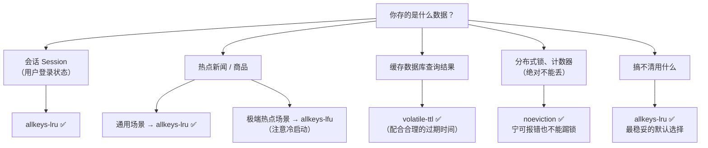

---

title: "缓存淘汰策略 8 种：LRU vs LFU"

created: "2026-07-20"

tags:

  - 八股文

  - redis

---

# 缓存淘汰策略 8 种：LRU vs LFU

## 一句话总结

> **缓存空间有限，放不下所有数据，必须踢走一些。怎么踢？看策略——有的一视同仁按过期时间踢，有的按"多久没用了"踢（LRU），有的按"用得少"踢（LFU）。关键是选对策略，别把马上要用的数据踢了。**

---

## 🌰 理解为什么需要淘汰策略

你家冰箱（缓存）只有这么大，不能把所有菜都放进去。

> 冰箱满了，来了块新牛排，必须扔掉一样东西才能放进去。

>

> **扔什么？**

>

> - 只看保质期（TTL）→ 快过期的扔了

> - 扔最长时间没吃的（LRU）→ 过年买的冻饺子一直没吃，扔了

> - 扔吃得最少的（LFU）→ 那瓶只喝了一次的汽水，扔了

>

> **没有完美的策略。你扔了冻饺子，结果明天想吃了——后悔。但冰箱就这么大，总得扔。**

---

## 8 种淘汰策略一览

Redis 提供了 8 种策略，分成三类：

| 类别 | 策略 | 行为 | 踢谁 |
| ------ | ------ | ------ | ------ |
| **不淘汰** | `noeviction` | 满了直接报错，不写新数据 | - |
| **过期删除** | `volatile-ttl` | 挑过期时间最短的先踢 | 设置了 TTL 的 key |
| | `volatile-random` | 在设置了 TTL 的 key 里随机踢 | 设置了 TTL 的 key |
| | `volatile-lru` | 在设置了 TTL 的 key 里挑最近最少用的踢 | 设置了 TTL 的 key |
| | `volatile-lfu` | 在设置了 TTL 的 key 里挑最不常用的踢 | 设置了 TTL 的 key |
| **全空间淘汰** | `allkeys-random` | 所有 key 里随机踢 | 所有 key |
| | `allkeys-lru` | 所有 key 里挑最近最少用的踢 | 所有 key |
| | `allkeys-lfu` | 所有 key 里挑最不常用的踢 | 所有 key |

---

## 必问：LRU vs LFU

这两个是最核心的策略，必须区分清楚。

### LRU（Least Recently Used）—— 最近最少使用

**核心思想：踢走最长时间没被访问的那个。**

> 冰箱里有一堆菜：

> - 鸡蛋：每天早上吃 → 最近用过

> - 冻饺子：过年买的，再也没碰过 → 最久没用

>

> 冰箱满了 → 扔冻饺子。

**LRU 关注的是"时间"——谁最久没被碰过，谁走。**

### LFU（Least Frequently Used）—— 最不经常使用

**核心思想：踢走被访问次数最少的那一个。**

> 冰箱里：

> - 鸡蛋：每天吃 → 用了 30 次

> - 老干妈：偶尔吃一次 → 用了 2 次

> - 冻饺子：过年买的，再也没碰过 → 用了 0 次（不对，一开始放进去也算一次）

>

> 冰箱满了 → 按 LFU 扔老干妈（只用过 2 次）。

> 注意：冻饺子也只用了 1 次（放进去那一次），所以冻饺子和老干妈都可能被踢。

**LFU 关注的是"频率"——谁用得最少，谁走。**

### LRU vs LFU 的关键区别
### 🌰 场景对比

```text

一个新闻网站，每天都有热点新闻刷屏。

假设：

  - 昨天头条"A 事件"：昨天被访问了 100 万次

  - 今天头条"B 事件"：今天正在被疯狂访问

如果缓存满了，需要淘汰：

LRU 的做法 ↓

  "A 事件"昨天被访问的，今天没人看了——最久没用，踢了。

  ✅ 正确。"A 事件"已经过气了，留着占地方。

LFU 的做法 ↓

  "A 事件"被访问了 100 万次——次数最多的。

  "B 事件"刚出来，才被访问 100 次——次数最少的。

  好吧，踢"B 事件"。

  ❌ 错误！"B 事件"正是现在的热点啊！你把它踢了，等下全部请求都要去数据库查。

这就是 LFU 的冷启动问题——高频率的旧热点会把新热点挤掉。

```

| 维度 | LRU | LFU |
| ------ | ----- | ----- |
| 判断依据 | **最后一次访问到现在多久了** | **总共被访问了多少次** |
| 适合场景 | 通用场景，大多数业务都适用 | 访问模式稳定的场景 |
| 优点 | 实现简单，对新热点友好 | 能识别"真正的热门数据" |
| 缺点 | 一次批量访问可能把缓存占满 | 旧热点霸榜，新热点进不来 |
| 被踢风险 | 很久没访问的数据 | 访问次数少的数据 |

**LRU 适合大多数场景。** LFU 适合"访问模式很稳定"的场景，比如 CDN 的热门文件，真的就是某些文件被反复访问。

---

## 其他策略说明
### noeviction（不淘汰）

```text

满了 → 直接拒绝新写入

  WRITE: OOM command not allowed when used memory > 'maxmemory'

适合场景：缓存不能丢的场景（比如用作分布式锁的 Redis）

特点：宁可写不进去，也不能把还没过期的数据踢了

```

### volatile-ttl（优先淘汰快过期的）

```text

只对有设置过期时间的 key 生效

踢人逻辑："谁的过期时间最短，谁先走。"

问题：如果一堆 key 的过期时间都一样，volatile-ttl 也不知道踢谁

       其实还是近似随机踢

```

### volatile-random / allkeys-random（随机踢）

```text

就是随机选一个踢了，不看热度不看时间。

特点：

  - 最公平（谁也别说自己该留）

  - 但效率最低（可能踢掉马上要用的数据）

适合场景：数据之间没有"冷热"之分，谁留谁走都一样

```

---

## 实际项目怎么选？



---

## 一句话讲清

```text

延伸提问："Redis 的缓存淘汰策略有哪些？LRU 和 LFU 的区别？"

你：

"Redis 有 8 种淘汰策略，分三类：

第一类不淘汰——noeviction，满了直接报错。

第二类只针对设置了过期时间的 key——

  volatile-lru、volatile-lfu、volatile-ttl、volatile-random。

第三类针对所有 key——

  allkeys-lru、allkeys-lfu、allkeys-random。

LRU 和 LFU 的核心区别：

  LRU 看"多久没用了"——踢最久没被访问的。

  LFU 看"用了多少次"——踢访问次数最少的。

LRU 的问题是：一次批量扫描可能把缓存填满，把真正的热点挤掉了。

LFU 的问题是：旧热点霸榜，新热点进不来（冷启动问题）。

实际项目默认 allkeys-lru 基本够用。

LFU 更适合访问模式稳定的场景，比如 CDN。"

```

---

## 记忆口诀

> **8 种策略三大类：noeviction 不踢报错，volatile 只踢有 TTL 的，allkeys 全都可以踢。**

> **LRU 踢最久不用的，LFU 踢用得最少的。**

> **LRU 通用保底，LFU 防扫荡。**

> **选不对就 allkeys-lru，90% 场景够用。**

## 速记卡（面试闪卡）

**Q1：一句话讲清「缓存淘汰策略 8 种：LRU vs LFU」到底是什么？**

A：缓存空间有限必须踢数据：8 种策略分三类，核心是 LRU 踢最久没用、LFU 踢用得最少。

**Q2：一、为什么需要淘汰策略 —— 怎么理解？**

A：冰箱（缓存）就那么大，新牛排来了必须扔一样才能放进。扔什么？只看保质期（TTL）扔快过期的；按 LRU 扔最久没吃的（过年冻饺子）；按 LFU 扔吃得最少的（只喝一次的汽水）。没有完美策略——但冰箱就这么大，总得扔。英文：eviction（淘汰）、cache（缓存）。

**Q3：二、8 种策略三大类 —— 怎么理解？**

A：第一类 noeviction：满了直接报错拒绝写，适合分布式锁这种"不能丢"的场景。第二类 volatile-*：只在设了 TTL 的 key 里挑——ttl 踢过期最短、lru 踢最久没用、lfu 踢最少用、random 随机。第三类 allkeys-*：对所有 key 生效。一句话：volatile 只动有期限的，allkeys 谁都能动。英文：noeviction、volatile-ttl、allkeys-lru。

**Q4：三、必问：LRU vs LFU —— 怎么理解？**

A：LRU 看"多久没用了"——踢最久没被访问的（每天吃的鸡蛋最近用过，冻饺子最久扔）。LFU 看"用了多少次"——踢访问最少的（只喝一次的汽水）。LRU 对新热点友好，但批量扫描会占满缓存挤掉真热点；LFU 能识别真热门，却有冷启动——旧热点霸榜挤掉新热点。英文：LRU、LFU、cold start（冷启动）。

**Q5：四、实际项目怎么选 —— 怎么理解？**

A：记住"选不对就 allkeys-lru"这个保底。Session、缓存查询结果→allkeys-lru；极端热点（爆款商品）→allkeys-lfu（留意冷启动）；都设了合理 TTL 的查询结果→volatile-ttl；分布式锁/计数器（绝对不能丢）→noeviction，宁可报错。英文：allkeys-lru（默认）。

**Q6：核心速记主线有哪些？**

- 缓存满了必须踢，本质是"踢谁"的规矩换空间

- 8 种策略三类：noeviction / volatile-* / allkeys-*

- LRU 踢最久没用，LFU 踢用得最少

- LRU 通用但有扫荡缺陷，LFU 有冷启动

- 默认 allkeys-lru 基本够用

**口诀**

A：八种策略三大类，noeviction 不踢报错；

volatile 只踢有 TTL，allkeys 谁都能踢掉。

LRU 踢最久没用，LFU 踢用得最少；

选不对就 allkeys-lru，九成场景够你跑。

## 相关链接

- 📋 目录：[[00-Redis]]

- 📚 学习清单：[[八股文学习路线图]]

- 🔗 [[07-过期键删除策略|过期键删除策略]] — 过期删除与内存淘汰的协作关系

- 🔗 [[05-缓存三兄弟终极对比|缓存三兄弟终极对比]] — 淘汰策略与缓存问题的关系

- 🔗 [[01-五种数据结构|五种数据结构]] — 不同数据结构的内存占用差异

- 🔗 [[计算机基础/操作系统/08-页面置换算法|页面置换算法]] — LRU/LFU在OS和Redis中的两种实现

- 🔗 [[语言与框架/Python/八股/基础/03-深浅拷贝|深浅拷贝]] — LRU实现中涉及的浅拷贝问题

