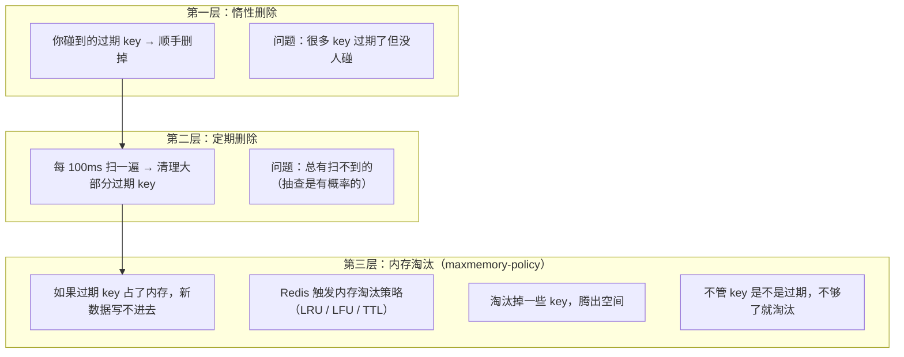

---

title: "过期键删除策略：惰性删除 + 定期删除"

created: "2026-07-20"

tags:

  - 八股文

  - redis

---

# 过期键删除策略：惰性删除 + 定期删除

## 一句话总结

> **Redis 删过期 key 不靠定时器一秒一秒扫，而是"懒 + 勤"双保险：你访问一个 key 的时候顺带检查它过期没（惰性删除）+ 每隔 100ms 抽查一部分 key 主动清掉（定期删除）。两招互相兜底，既省 CPU 又不让过期 key 赖着不走。**

> **但也兜不住极端情况 → 靠内存淘汰策略（LRU/LFU）托底。**

---

## 🌰 理解场景

你租了一个仓库（Redis），里面堆满了箱子（key），每个箱子上贴着保质期（TTL）。

```text

三种"扔过期箱子"的思路：

思路 A：雇一个人一秒一秒盯着每个箱子

  → 10 万个箱子，每秒查一遍

  → CPU 全烧了 ❌ （定时删除）

思路 B：每次从仓库拿箱子时看一眼保质期

  → 过期了顺手扔掉

  → 但如果一直没人拿，过期箱子永远不扔 ❌ （惰性删除）

思路 C：隔一段时间去仓库逛一圈，随机抽查一些箱子

  → 看到过期的就扔掉

  → 不浪费 CPU，也不会放过太多 ❌但查不干净

Redis = 思路 B + 思路 C 结合

```

---

## 一、惰性删除（Lazy Deletion）
## 二、定期删除（Periodic Deletion）
### 是什么

**每次访问 key 的时候，检查它是否过期。过期就删掉，返回 nil。**

```text

客户端请求：GET "session:123"

Redis 内部流程：

  1. 查 dict（key 字典）→ 找到 "session:123"

  2. 查 expires（过期字典）→ 找到过期时间：1710000000

  3. 当前时间 > 过期时间？→ 是 ✅ 过期了

  4. 删除这个 key

  5. 返回 nil 给客户端

```

**代码层面：**

```c

// Redis 源码简化逻辑

int expireIfNeeded(redisDb *db, robj *key) {

    // 1. 检查 key 有没有设过期时间

    if (!dictFind(db->expires, key)) return 0;

    // 2. 检查是否过期

    if (now > expires_time) {

        // 3. 删除 key 并通知从库和 AOF

        deleteKey(db, key);

        return 1;  // 已删除

    }

    return 0;  // 没过期

}

```

**优劣势：**

| 维度 | 评价 |

| ------ | ------ |

| CPU 开销 | ✅ 几乎没有——不访问就不检查 |

| 内存开销 | ✅ 无额外内存 |

| 漏网之鱼 | ❌ 过期但永远不访问的 key 永远不会删 |

**像什么：冰箱里的剩菜，你每次打开冰箱看到发霉了才扔。不打开就一直放着。**

---

### 是什么

**Redis 每隔 100ms（默认）主动扫描一部分 key，把过期的清理掉。**

```text

Redis 的 serverCron（定时任务）每 100ms 跑一次：

函数：activeExpireCycle()

执行流程：

  1. 从 16 个数据库（db 0~15）里随机选一个

  2. 从当前数据库的 expires 字典里随机抽 20 个 key

  3. 删除这 20 个里过期的 key

  4. 如果过期比例 > 25%（删了 5+ 个）：

     └─ 再抽 20 个，继续删

     └─ 重复直到过期比例 <= 25% 或超时

  5. 检查 CPU 耗时：

     └─ 如果本次循环超过 25ms → 暂停，等下一轮

     └─ 不能让定期删除拖慢正常请求

  6. 遍历到下一个数据库

```

**核心参数（通过宏控制，Redis 7.4+ 可配置）：**

```text

ACTIVE_EXPIRE_CYCLE_LOOKUPS_PER_LOOP = 20  — 每次抽查 20 个

ACTIVE_EXPIRE_CYCLE_SLOW_TIME_PERC = 25    — CPU 时间不超过 25%

ACTIVE_EXPIRE_CYCLE_ACCEPTABLE_STALE = 10  — 容忍过期 key 占 10%

```

**优劣势：**

| 维度 | 评价 |

| ------ | ------ |

| CPU 开销 | 🟡 中——每隔 100ms 扫一次，有限时，不会卡死 |

| 内存释放 | ✅ 保证过期 key 不会一直赖着 |

| 覆盖范围 | 🟡 随机的，总有一些 key 每次都没被抽到 |

**像什么：保洁阿姨每隔一段时间来办公室逛一圈，看到空瓶子就收走。但不会一个一个抽屉翻。**

---

## 三、为什么不做"定时删除"？（知识点）
### ：为什么不用定时器方案？

```text

定时删除：每个 key 过期时立即删除。

比如 SET session:123 "abc" EX 3600

       └─ Redis 起一个定时器，3600 秒后触发删除

表面上很完美：一到时间就删，内存马上释放。

为什么 Redis 不用？

问题 1：每个 key 一个定时器 → 内存爆炸

   10 万个 key 需要维护 10 万个定时器

   光管理定时器的开销就比 key 本身还大 ❌

问题 2：高并发下 CPU 撑不住

   如果 1 万 key 在同一秒过期

   同一秒触发 1 万个删除操作

   CPU 全花在删 key 上，正常请求被卡住 ❌

问题 3：和 Redis 单线程模型冲突

   Redis 是单线程处理命令

   定时删除会打断正在执行的命令

   或者导致命令排队大量延迟 ❌

```

**惰性删除 + 定期删除 = 不用定时器，不占额外内存，CPU 开销可控。**

---

## 四、RDB / AOF / 主从复制对过期 key 的处理
### RDB 持久化

```text

生成 RDB：

  └─ 过期 key 不会写入 RDB 文件

  └─ 生成时就过滤掉过期的

加载 RDB：

  └─ 主库加载 RDB → 过期 key 会根据过期时间重新计算

  └─ 从库加载 RDB → 所有 key 不过期（等主库发删除命令）

```

### AOF 持久化

```text

写入 AOF：

  └─ key 过期但没有被惰性/定期删除时 → AOF 不处理

  └─ key 被删除时 → AOF 追加一条 DEL 命令

AOF 重写：

  └─ 重写时跳过过期 key

```

### 主从复制

```text

主库删除一个过期 key 时：

  1. 主库执行 DEL

  2. 向所有从库发送 DEL 命令

从库自己不会主动删除：

  你读从库，即使 key 过期了，从库也能返回数据！

  └─ 这是为了主从数据一致

  └─ 从库只能等主库发 DEL

```

**有一个例外（Redis 7.4+）：某些场景下从库可以主动删除过期的 key（优化），但主库仍然是权威。**

---

## 五、三种策略对比总结

| 策略 | 机制 | CPU 开销 | 内存释放 | 实现复杂度 |

| ------ | ------ | --------- | --------- | ----------- |

| **定时删除** | 每个 key 设定时器 | 🔴 极高 | ✅ 即时 | 🔴 复杂 |

| **惰性删除** | 访问时检查 | ✅ 极低 | ❌ 可能有漏 | ✅ 简单 |

| **定期删除** | 每 100ms 抽查 | 🟡 中 | ✅ 基本干净 | 🟡 中 |

**Redis = 惰性删除（兜底）+ 定期删除（主动出击）+ 内存淘汰策略（最后防线）。**

---

## 六、内存淘汰策略的关系



---

## 一句话讲清

```text

延伸提问："Redis 过期 key 是怎么删除的？"

你：

"Redis 用两种策略配合：惰性删除 + 定期删除。

惰性删除——每次操作 key 时检查是否过期，过期就删。

优点是几乎不占 CPU，缺点是有些过期 key 没人碰就永远不删。

定期删除——Redis 每隔 100ms 跑一次 activeExpireCycle，

随机抽 20 个 key 检查，如果过期比例超过 25% 就继续抽。

每次最多跑 25ms，不会卡住正常请求。

Redis 不用定时删除，因为单线程模型下，

大量定时器既占内存又卡性能。

最后还有一层兜底：内存淘汰策略。

过期 key 太多占着内存时，Redis 按 LRU/LFU 踢掉一些 key。

三层配合，CPU 不浪费，内存不爆炸。"

```

---

## 记忆口诀

> **惰性删除——访问时才检查，过期就删，不访问就不管。**

> **定期删除——每 100ms 抽 20 个，过期超过 25% 就继续抽。**

> **不用定时器——单线程撑不住一万个定时器。**

> **三层防线：惰性 + 定期 + 淘汰策略。**

## 速记卡（面试闪卡）

**Q1：一句话讲清「过期键删除策略：惰性删除 + 定期删除」到底是什么？**

A：Redis 不靠定时器，用惰性+定期双策略清理过期 key。

**Q2：惰性删除（Lazy Deletion） —— 怎么理解？ —— 怎么理解？**

A：像冰箱里的剩菜——你每次打开冰箱看到发霉了才扔，不打开就一直放着。缺点是过期但没人碰的 key 永远不删。英语：lazy deletion。

**Q3：定期删除（Periodic Deletion） —— 怎么理解？ —— 怎么理解？**

A：像保洁阿姨每隔 100ms 来逛一圈，随机抽查 20 个箱子，看到过期的就收走，但不会翻每个抽屉。CPU 可控、内存基本干净。英语：periodic deletion。

**Q4：为什么不用定时删除 —— 怎么理解？ —— 怎么理解？**

A：像给 10 万个箱子各雇一个监工，每秒盯一遍——CPU 全烧了还和单线程打架。所以 Redis 干脆不养定时器。英语：timer-based deletion。

**Q5：内存淘汰策略兜底 —— 怎么理解？ —— 怎么理解？**

A：像保安的最后一道闸：惰性+定期仍有扫不到的漏网之鱼，Redis 用 LRU/LFU 在内存告急时再踢掉一些 key。英语：maxmemory eviction。

**Q6：核心速记主线有哪些？**

- 双保险：惰性（访问才查）+ 定期（每 100ms 抽查 20 个）

- 不用定时器：单线程下大量定时器既占内存又卡性能

- 定期循环：过期比例 >25% 继续抽，单次上限 25ms

- 兜底：内存淘汰 LRU/LFU 处理扫不到的过期 key

**口诀**

A：惰性删除访问删，

定期百毫抽查看；

定时删除太烧钱，

淘汰兜底保平安。

## 相关链接

- 📋 目录：[[00-Redis]]

- 📚 学习清单：[[八股文学习路线图]]

- 🔗 [[06-缓存淘汰策略LRU与LFU|缓存淘汰策略LRU/LFU]] — 过期键删除与内存淘汰策略的分工

- 🔗 [[10-RDB与AOF与混合持久化|RDB与AOF与混合持久化]] — 过期键在持久化文件中的处理

- 🔗 [[计算机基础/操作系统/19-零拷贝sendfile_mmap_splice|零拷贝]] — 定期删除的 serverCron 与后台任务

