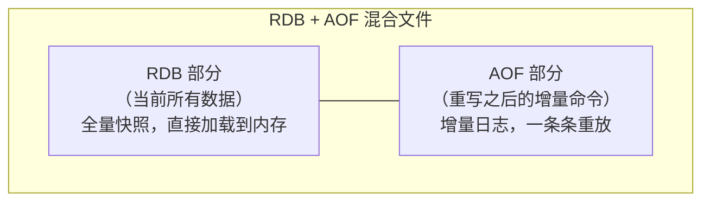
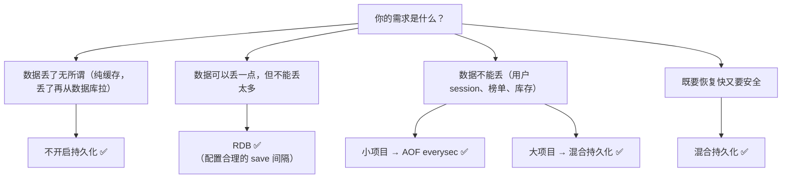

# RDB vs AOF vs 混合持久化

## 一句话总结

> **RDB 是"拍快照"——Redis 全部数据存成一个文件，恢复快但可能丢数据；AOF 是"写日记"——每一条写操作都记下来，丢得少但文件大恢复慢。混合持久化 = 平时用 AOF 记日志，重启时用 RDB 做全量恢复 + AOF 补增量，兼顾速度和安全性。**

---

## 🌰 理解为什么需要持久化

Redis 的数据在内存里。内存的特点是：**一断电，全没了。**

> 你的奶茶店有一块"小白板"（内存），上面记着今天的订单和库存。
> 小白板查得快（微秒级），但晚上一关门擦掉——第二天啥都不剩。
> 
> **没有持久化 = 每天开门都是一张白板。所有数据丢了无所谓？**
> 但如果缓存的是用户 session、商品库存、排行榜呢？丢了用户就得重新登录、重新抢购。

**持久化就是把内存里的数据定期或实时地写到磁盘上，保证 Redis 重启后数据还在。**

---

## 一、RDB（Redis Database）—— 快照

### 是什么

**RDB = 定期给 Redis 内存里的全部数据拍一张"照片"，存成一个 .rdb 文件。**

> 就像你每天早上开店之前，给小白板拍一张照片。
> 如果白天小白板被擦了一点，没关系——明天早上还有昨天的照片。
> 但如果今天下午 3 点 Redis 崩了，恢复出来的是早上 8 点的数据——**中间那 7 个小时的数据丢了。**

### 怎么触发

```redis
-- 自动触发（配置 save 指令）
save 900 1        -- 900 秒（15 分钟）内至少有 1 个 key 变了 → 拍一次
save 300 10       -- 300 秒（5 分钟）内至少有 10 个 key 变了 → 拍一次
save 60 10000     -- 60 秒内至少有 10000 个 key 变了 → 拍一次

-- 手动触发
SAVE              -- 同步拍（拍完之前啥也不干，别用）
BGSAVE            -- 后台拍（fork 子进程去拍，不阻塞主进程）
```

### RDB 的执行过程（BGSAVE）

```text
1. Redis 主进程 fork 出一个子进程
   └─ fork 用的是写时复制（COW），子进程共享父进程的内存

2. 子进程开始把数据写入临时 .rdb 文件

3. 写完后用临时文件覆盖旧的 .rdb 文件

4. 子进程退出

整个过程主进程不阻塞，可以正常处理请求。
```

### RDB 的优缺点

| ✅ 优点 | ❌ 缺点 |
| --------- | --------- |
| 文件小，适合备份和传输 | 可能丢数据（两次快照之间的数据全丢）|
| 恢复快（直接加载 .rdb 到内存）| fork 子进程时如果数据量大，瞬间占用双倍内存 |
| 主进程不阻塞 | 频繁 fork 会影响性能 |

---

## 二、AOF（Append Only File）—— 日记

### 是什么

**AOF = Redis 每执行一条"写"命令，都记到 .aof 文件里。重启时把文件里的命令重新执行一遍，数据就恢复了。**

> 不像 RDB 那样拍照片，AOF 是写日记：
> 每个客人来点了什么，你都在日记本上记一条：
>   - 09:00 杨枝甘露 +1
>   - 09:05 珍珠奶茶 +2
>   - 09:10 杨枝甘露 -1（卖出一杯）
> 
> 如果小白板被擦了 → 翻开日记，从早上 09:00 开始把每条命令再执行一遍 → 数据恢复。

### 三种写回策略

| 策略 | 配置名 | 行为 | 安全性 |
| ------ | -------- | ------ | -------- |
| **每次写** | `appendfsync always` | 每执行一条写命令，立刻同步到磁盘 | 🟢 最安全（最多丢一条）|
| **每秒写** | `appendfsync everysec` | 每秒批量同步一次 | 🟡 折中（最多丢 1 秒数据）|
| **不主动写** | `appendfsync no` | 由操作系统决定什么时候写磁盘 | 🔴 最不安全（丢一堆）|

**生产最常用：everysec。** 每秒同步一次，最多丢 1 秒数据，性能影响也小。

### AOF 重写（Rewrite）

AOF 的问题：日记越写越多，文件越来越大。

```text
原始日记：
  SET name 'A'
  SET name 'B'
  SET name 'C'
  SET name 'D'

实际上只看最后一条 SET name 'D' 就够了。
前面三条都是废话。
```

**AOF 重写 = 去掉废话，只保留最终结果。**

```text
重写后：
  SET name 'D'    ← 只需要这一条
```

**重写过程：**

```text
1. Redis fork 子进程
2. 子进程把当前内存里的数据转成 AOF 格式（只写最终值）
3. 主进程同时把新命令写入"重写缓冲区"
4. 子进程完成后，把重写缓冲区里的命令追加到新 AOF 文件
5. 新文件覆盖旧文件
```

### AOF 的优缺点

| ✅ 优点 | ❌ 缺点 |
| --------- | -------- |
| 数据更安全（everysec 最多丢 1 秒） | AOF 文件比 RDB 大得多 |
| 可读（AOF 文件是明文命令）| 恢复慢（要一条条重放命令）|
| 不容易损坏（即使最后一条没写全也能恢复）| 同样数据量比 RDB 占更多磁盘 |

---

## 三、混合持久化（Redis 4.0+）

### 是什么

**混合持久化 = RDB 做全量快照 + AOF 做增量日志。**

> 不再只拍照片或只写日记。
> 
> Redis 在做持久化时：
>   1. 先把当前内存里的数据存成一个 RDB 格式的快照
>   2. 重写之后的增量命令用 AOF 格式追加在文件后面
> 
> 重启恢复时：
>   1. 直接加载 RDB 部分（快，不用一条条重放）
>   2. 再重放 AOF 部分（补全最后一次持久化之后的数据）

### 文件格式



### 怎么开启

```redis
aof-use-rdb-preamble yes    -- 开启混合持久化
appendonly yes              -- 必须启用 AOF
```

**注意：混合持久化是基于 AOF 的增强。必须先开 AOF，再开混合模式。**

### 混合持久化的优缺点

| ✅ 优点 | ❌ 缺点 |
| --------- | -------- |
| 重启恢复比纯 AOF 快得多（RDB 全量加载）| AOF 文件仍然比纯 RDB 大 |
| 数据安全性接近 AOF（增量部分不丢）| 格式不是纯文本（RDB 部分是二进制）|
| 综合了 RDB 的恢复速度和 AOF 的安全性 | 兼容性问题（旧版本 Redis 读不了混合文件）|

---

## 三条对比

| 维度 | RDB | AOF | 混合 |
| ------ | ----- | ----- | ------ |
| **文件大小** | 🟢 最小 | 🔴 最大 | 🟡 中等 |
| **恢复速度** | 🟢 最快 | 🔴 最慢 | 🟢 快（RDB 加载 + AOF 补量）|
| **数据安全性** | 🔴 可能丢多（两次快照间）| 🟢 最多丢 1 秒（everysec）| 🟢 最多丢 1 秒 |
| **磁盘写入** | 🟢 低频（按 save 策略）| 🔴 高频（每秒/每次）| 🟡 中频 |
| **对性能影响** | 🟡 fork 瞬间阻塞 | 🟡 写磁盘有 IO 压力 | 🟡 同 AOF |
| **可读性** | 🔴 二进制，不可读 | 🟢 明文命令，可读 | 🟡 半二进制半明文 |
| **适用 Redis 版本** | 任何版本 | 任何版本 | 4.0+ |

---

## 实际项目怎么选？



**2026 年的推荐：用混合持久化。** 既有 RDB 的恢复速度，又有 AOF 的安全性。

---

## 记忆口诀

> **RDB 拍照片——文件小恢复快，但可能丢数据。**
> **AOF 写日记——每条都记不丢数据，但文件大恢复慢。**
> **混合持久化——RDB 全量 + AOF 增量，重启又快又不丢。**
> **4.0 之后选混合，everysec 同步最均衡。**


## 速记卡（面试闪卡）

**Q1：一句话讲清「RDB vs AOF vs 混合持久化」到底是什么？**
A：**RDB 是"拍快照"——Redis 全部数据存成一个文件，恢复快但可能丢数据；AOF 是"写日记"——每一条写操作都记下来，丢得少但文件大恢复慢。混合持久化 = 平时用 AOF 记日志，重启时用 RDB 做全量恢复 + AOF 补增量，兼顾速度和安全性。**
---

**Q2：一句话总结 —— 怎么理解？**
A：**RDB 是"拍快照"——Redis 全部数据存成一个文件，恢复快但可能丢数据；AOF 是"写日记"——每一条写操作都记下来，丢得少但文件大恢复慢。混合持久化 = 平时用 AOF 记日志，重启时用 RDB 做全量恢复 + AOF 补增量，兼顾速度和安全性。**
---

**Q3：🌰 理解为什么需要持久化 —— 怎么理解？**
A：Redis 的数据在内存里。内存的特点是：**一断电，全没了。**
你的奶茶店有一块"小白板"（内存），上面记着今天的订单和库存。
小白板查得快（微秒级），但晚上一关门擦掉——第二天啥都不剩。
**没有持久化 = 每天开门都是一张白板。所有数据丢了无所谓？**
但如果缓存的是用户 session、商品库存、排行榜呢？丢了用户就得重新登录、重新抢购。
**持久化就是把内存里的数据定期或实时地写到磁盘上，保证 Redis 重启后数据还在。

**Q4：一、RDB（Redis Database）—— 快照 —— 怎么理解？**
A：**RDB = 定期给 Redis 内存里的全部数据拍一张"照片"，存成一个 .rdb 文件。**
就像你每天早上开店之前，给小白板拍一张照片。
如果白天小白板被擦了一点，没关系——明天早上还有昨天的照片。
但如果今天下午 3 点 Redis 崩了，恢复出来的是早上 8 点的数据——**中间那 7 个小时的数据丢了。

**Q5：二、AOF（Append Only File）—— 日记 —— 怎么理解？**
A：**AOF = Redis 每执行一条"写"命令，都记到 .aof 文件里。重启时把文件里的命令重新执行一遍，数据就恢复了。**
不像 RDB 那样拍照片，AOF 是写日记：
每个客人来点了什么，你都在日记本上记一条：
09:00 杨枝甘露 +1
09:05 珍珠奶茶 +2
09:10 杨枝甘露 -1（卖出一杯）
如果小白板被擦了 → 翻开日记，从早上 09:00 开始把每条命令再执行一遍 → 数据恢复。

**Q6：核心速记主线有哪些？**
A：抓住这几根：一句话总结、🌰 理解为什么需要持久化、一、RDB（Redis Database）—— 快照、二、AOF（Append Only File）—— 日记、三、混合持久化（Redis 4.0+）、三条对比。


## 相关链接

- 📋 目录：[[00-Redis]]
- 📚 学习清单：[[八股文学习清单]]
- 🔗 [[07-过期键删除策略|过期键删除策略]] — 过期键在 RDB/AOF 中的处理
- 🔗 [[13-主从复制全量与增量同步|主从复制]] — 主从同步依赖 RDB 快照
- 🔗 [[语言与框架/MySQL/八股/23-redo_log与undo_log与binlog|MySQL日志系统]] — MySQL和Redis的持久化机制对比
- 🔗 [[计算机基础/操作系统/19-零拷贝sendfile_mmap_splice|零拷贝]] — 持久化中的IO优化技术
- 🔗 [[计算机基础/分布式-系统设计/06-消息队列MQ|消息队列]] — 持久化与消息可靠投递的关联
