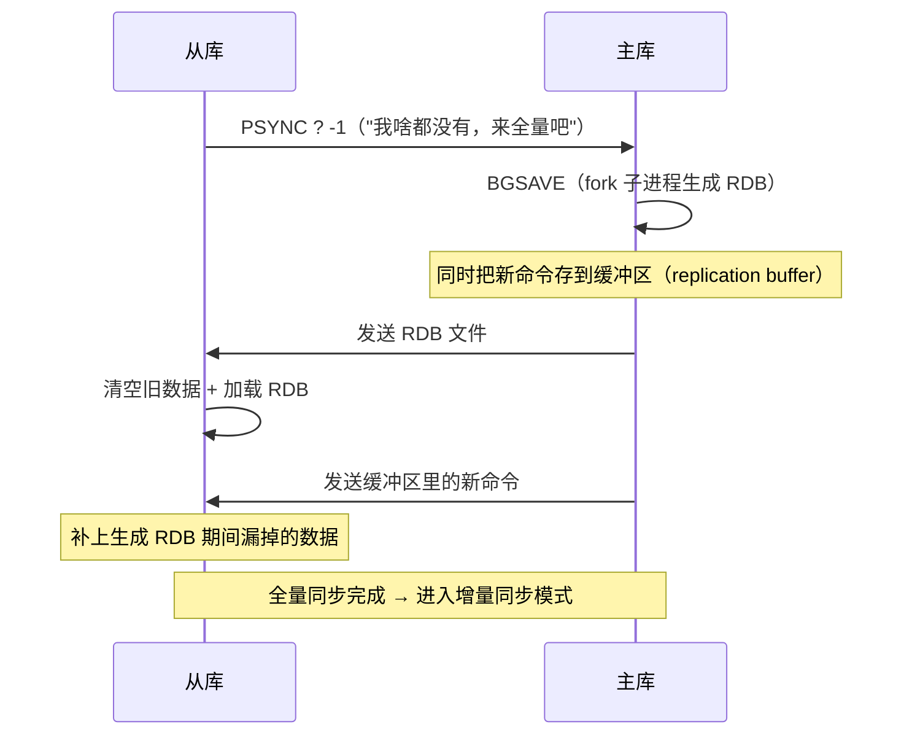
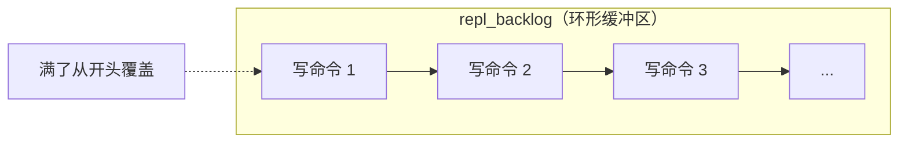
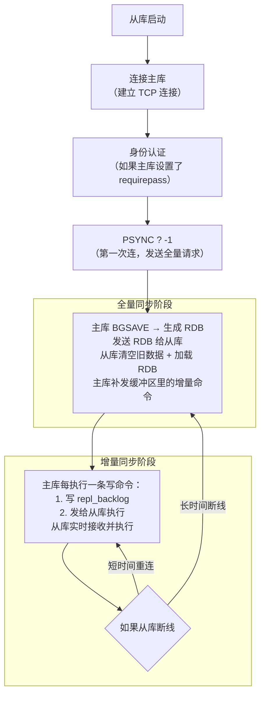

---

title: "主从复制：全量同步 + 增量同步"

created: "2026-07-20"

tags:

  - 八股文

  - redis

---

# 主从复制：全量同步 + 增量同步

## 一句话总结

> **第一次连从库 → 全量同步（主库把全部数据发给从库）。之后日常同步 → 增量同步（主库把写命令实时发给从库）。全量只在"第一次"或"断线太久追不上"时发生，平时靠增量。**

---

## 🌰 理解主从复制

你是一家奶茶店的总店长（主库），开了一家分店（从库）。

```text

总店长（主库）

  └─ 顾客来买奶茶，你收钱出杯

  └─ 每做一杯你都同步告诉分店

分店（从库）

  └─ 刚开业时：总店把全部菜单和配方拿给分店（全量同步）

  └─ 日常营业：卖出一杯就在群里通知一声（增量同步）

```

**两种同步：**

- **全量同步** = 从库第一次上线或掉线太久，主库把全部数据发过去

- **增量同步** = 主库每次写操作，实时发给从库

---

## 一、全量同步（Full Sync）
## 二、增量同步（Partial Sync / Incremental Replication）
### 什么时候触发

```text

1. 从库第一次连上主库（刚搭建好复制）

2. 从库断线太久，主库的"命令缓冲区"（repl_backlog）已经覆盖了

   从库最后同步的位置 → 从库跟不上 → 必须重新全量

```

### 全量同步的流程



### 全量同步的问题

**RDB 文件传输是瓶颈。**

```text

假设主库有 10GB 数据：

  └─ BGSAVE 生成 RDB → 几秒到几十秒（期间 fork 耗内存）

  └─ 传输 RDB 给从库 → 取决于带宽（1Gbps 约 80 秒）

  └─ 从库加载 RDB → 几十秒

  └─ 整个过程主库不能停写

总耗时：可能 2-5 分钟。

如果 10 个从库同时全量同步 → 主库要 fork 10 次？不，只 fork 一次。

Redis 优化：多个从库同时请求全量同步时，

主库只 fork 一次生成 RDB，发给所有从库。

```

---

### 什么时候触发

```text

全量同步完成后 → 进入增量同步模式。

只要从库没断线太久（还在 repl_backlog 范围内），就一直增量。

```

### 增量同步的流程

```text

主库处理一条写命令：

  SET name 'Alice'

          │

          ↓

Step 1: 主库把命令写入 repl_backlog（环形缓冲区，固定大小）

        └─ 同时更新 master_repl_offset（偏移量，当前写到了第几个字节）

          │

          ↓

Step 2: 主库把命令发给所有连接的从库

        └─ "SET name 'Alice'"

          │

          ↓

Step 3: 从库收到命令，执行

        └─ 更新自己的数据

        └─ 更新 slave_repl_offset（自己同步到了哪个位置）

          │

          ↓

Step 4: 从库告诉主库："我已经同步到这个位置了"

        └─ 主库记录从库的 offset，下次断线重连时用

```

### 断线重连后的增量同步

```text

从库断线了 30 秒，又连上了。

从库发送 PSYNC <主库ID> <从库最后的位置 offset>

主库检查：

  ├─ offset 还在 repl_backlog 里？ → 增量同步 ✅

  │   只发从库落下的那部分命令

  │

  └─ offset 已经被 repl_backlog 覆盖了？ → 重新全量同步 ❌

      从库掉线太久，追不上了

```

### repl_backlog 是什么



大小由 `repl-backlog-size` 决定（默认 1MB）

如果从库断线时间 < 缓冲区存满的时间 → 增量同步

如果从库断线时间 > 缓冲区存满的时间 → 全量同步

---

## 增量 vs 全量对比

| 维度 | 全量同步 | 增量同步 |

| ------ | --------- | --------- |

| **触发时机** | 从库第一次连接 / 断线太久 | 日常运行 / 短时间断线重连 |

| **传输内容** | 整个 RDB 文件（全部数据）| 几条写命令 |

| **数据量** | GB 级 | KB 级 |

| **耗时** | 分钟级 | 毫秒级 |

| **对主库影响** | fork 子进程 + 磁盘 IO + 网络带宽 | 极小（只多一次网络发送）|

| **对从库影响** | 清空所有数据 + 重新加载 | 立即执行几条命令 |

| **网络要求** | 带宽要大，否则传输慢 | 基本没要求 |

---

## 一个完整的主从复制生命周期



---

## 常问：主从复制的注意事项
### 1. 主库写了，从库看不到？

```text

主库：SET name 'Alice'

从库：GET name → (nil)

检查：

  └─ 从库有延迟（从库还在同步上一条命令）

  └─ 正常现象，等一会儿就好

  └─ 如果一直不同步 → 检查复制状态（INFO replication）

```

### 2. 从库崩溃了再恢复？

```text

如果断线不久 → 自动增量同步 ✅

如果断线太久 → 自动全量同步 Redis 2.8+ 支持

老版本 Redis（2.8 之前）：

  断线重连也是全量同步 → 非常低效

```

### 3. repl_backlog 配多大？

```text

repl-backlog-size = 主库每秒写入量 × 能接受的最大断线时间

比如主库每秒写 1MB，希望从库断线 1 小时内能增量同步：

  backlog = 1MB × 3600 = 3.6GB（记得配大一点）

```

**默认 1MB 太小了。大一点，避免频繁全量同步。**

### 4. 主从复制和哨兵的区别？

```text

主从复制：数据同步（主库写→从库读）

哨兵：监控 + 自动故障转移（主库挂了→选一个从库变主库）

主从复制是哨兵的基础，哨兵是主从复制的增强。

```

---

## 记忆口诀

> **第一次连或断太久 → 全量（发整个 RDB）。日常同步 → 增量（发写命令）。**

> **全量很重（fork+RDB+传输），增量很轻（几行命令）。**

> **repl_backlog 是关键——够大才能增量，太小逼你全量。**

> **从库崩了不用慌——短连增量，长连全量，Redis 能自己处理。**

## 速记卡（面试闪卡）

**Q1：一句话讲清「主从复制：全量同步 + 增量同步」到底是什么？**

A：第一次连从库 → 全量同步（主库把全部数据 RDB 发给从库）。之后日常 → 增量同步（主库把写命令实时发给从库）。全量只在"第一次"或"断线太久追不上"时发生，平时靠增量。

**Q2：理解主从复制 —— 怎么理解？**

A：你是奶茶总店长（主库 Master），开了一家分店（从库 Slave）。总店每做一杯都在群里通知一声，分店照着做，这就是复制。分店刚开业时，总店把全部菜单配方拿过去（全量同步）；日常营业每卖出一杯就通知一声（增量同步）。主库负责写，从库负责读，一写多读扛住高并发读流量。

**Q3：一、全量同步（Full Sync） —— 怎么理解？**

A：触发时机：从库第一次连上主库，或从库断线太久、主库的 repl_backlog（复制积压缓冲区，一个固定大小的环形 buffer）已经覆盖了从库最后同步的位置。流程：从库发 `PSYNC ? -1`（"我啥都没有，来全量吧"）→ 主库 BGSAVE（Background SAVE，fork 子进程生成 RDB 快照文件）的同时把新命令存进 replication buffer → 发 RDB 给从库 → 从库清空旧数据加载 RDB → 主库补发缓冲区里 RDB 生成期间漏掉的新命令。瓶颈在 RDB 传输：10GB 数据按 1Gbps 带宽约 80 秒，总耗时可能 2 到 5 分钟。多个从库同时请求时主库只 fork 一次，RDB 发给所有从库。

**Q4：二、增量同步（Partial Sync） —— 怎么理解？**

A：全量完成后进入增量模式：主库每执行一条写命令，先写进 repl_backlog 并更新 master_repl_offset（主库写到了第几个字节），再发给所有从库，从库执行后更新自己的 slave_repl_offset。从库断线 30 秒又连上，发 `PSYNC <主库ID> <自己的offset>`：只要 offset 还在 repl_backlog 里 → 增量，只补落下的命令；offset 已被覆盖 → 重新全量。repl_backlog 大小由 repl-backlog-size 决定（默认 1MB），公式：backlog = 主库每秒写入量 × 能接受的最大断线时间，默认 1MB 太小，容易逼出全量。

**Q5：常问：主从复制注意事项 —— 怎么理解？**

A：①主库写了从库看不到？正常，从库有同步延迟，等一会儿就好，一直不同步查 INFO replication。②从库崩了？断线不久自动增量，断线太久自动全量（Redis 2.8+ 支持，老版本断线重连也是全量，很低效）。③repl_backlog 配多大？按上面公式算，配大点避免频繁全量。④主从复制和哨兵（Sentinel）区别？主从复制负责数据同步（主写从读），哨兵负责监控 + 自动故障转移（主挂了选从变主），主从是哨兵的基础，哨兵是主从的增强。

**Q6：核心速记主线有哪些？**

A：一、全量同步（RDB + BGSAVE + replication buffer，分钟级）、二、增量同步（repl_backlog 环形缓冲 + offset，毫秒级）、三、断线重连靠 offset 是否在 backlog 里决定增量还是全量、四、repl_backlog-size 配置、五、主从复制 vs 哨兵。

**口诀**

A：首次连接或断太久，全量 RDB 发一遍；

日常同步靠增量，写命令实时传；

repl_backlog 是关卡，够大才增量、太小逼全量；

主从同步哨兵管转移，二者配合才稳当。

## 相关链接

- 📋 目录：[[00-Redis]]

- 📚 学习清单：[[八股文学习路线图]]

- 🔗 [[语言与框架/MySQL/八股/24-主从复制原理|MySQL主从复制]] — MySQL和Redis主从复制的异同

- 🔗 [[计算机基础/分布式-系统设计/06-消息队列MQ|消息队列]] — 增量同步类似消息队列的消费机制

- 🔗 [[语言与框架/Python/八股/基础/04-引用计数与垃圾回收|引用计数与垃圾回收]] — 复制过程中的内存管理

