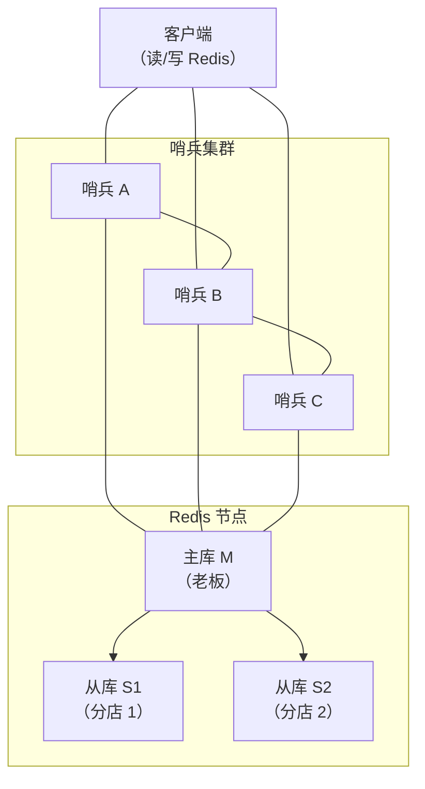
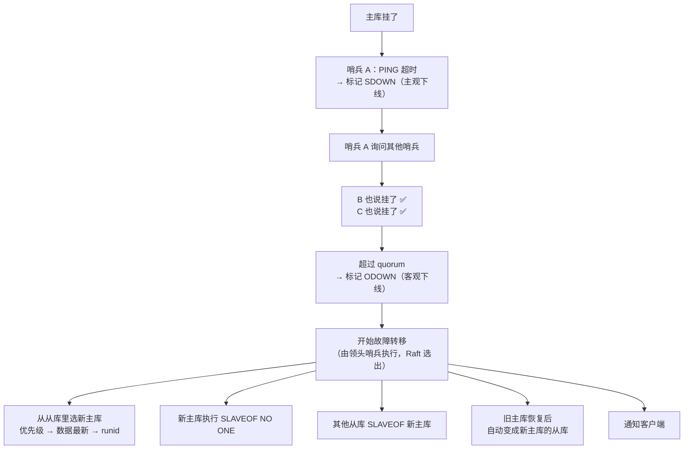

# 哨兵 Sentinel：主观/客观下线 + 故障转移

## 一句话总结

> **哨兵是 Redis 的"保安队长"——盯着主库有没有挂。觉得挂了叫"主观下线"，多问几个哨兵确认了叫"客观下线"。确认主库挂了就启动选举：选一个从库当新主库，剩下的从库切换去连新主库。**

---

## 🌰 理解哨兵的角色

你开了一家奶茶店（主库），有三家分店（从库），请了一个保安队长（哨兵）。

```text
保安队长每天的工作：
  1. 每隔一秒喊一声："老板还在吗？"（PING）
  2. 老板回答："在"（PONG）→ 正常
  3. 老板没回答 → 再喊两声
  4. 喊了三声都不回 → "老板可能出事了"
  5. 叫隔壁保安也来喊喊 → 如果大家都说老板不回 → "老板真出事了"
  6. 启动紧急预案：选一个分店长当代理老板
  7. 通知所有分店："以后听新老板的"
```

**哨兵不是一个人在干活——它也是集群。至少 3 个哨兵，互相确认，防止误判。**

---

## 一、哨兵集群架构



**哨兵之间互相通信，哨兵和 Redis 节点也互相通信。**

---

## 二、主观下线（Subjective Down / SDOWN）

### 是什么

**一个哨兵觉得主库挂了。**

```text
哨兵 A 每隔 1 秒给主库发 PING：

  正常情况：
    哨兵 A → PING → 主库
    哨兵 A ← PONG ← 主库  ✅

  异常情况：
    哨兵 A → PING → 主库
    ...等 1 秒...
    哨兵 A → PING → 主库
    ...等 1 秒...
    哨兵 A → PING → 主库

  如果 down-after-milliseconds 时间内（比如 5 秒）没收到回复：
    哨兵 A 在自己的日志里写："我怀疑主库挂了" → SDOWN

  注意：这只是哨兵 A 自己的判断。
  可能只是网络闪断，主库自己好好的。
```

**像什么：你喊了老板三声没回，你觉得"老板可能不在"。但只是你一个人觉得，别人可能刚看到老板。**

**配置：**

```text
sentinel down-after-milliseconds mymaster 5000
  └─ 5 秒没收到回复 → 标记为主观下线
```

---

## 三、客观下线（Objective Down / ODOWN）

### 是什么

**多数哨兵都觉得主库挂了。**

```text
哨兵 A 标记 SDOWN 后，开始拉票：

  哨兵 A 问哨兵 B："你觉得主库还活着吗？"
  哨兵 B："我也 ping 不通了" ✅
  哨兵 A 问哨兵 C："你觉得呢？"
  哨兵 C："我也 ping 不通了" ✅

  → 3 个哨兵里，3 个都觉得挂了
  → 超过半数（quorum，一般配 2）
  → 哨兵 A 把主库标记为 ODOWN
  → 开始故障转移
```

**关键参数：quorum**

```text
sentinel monitor mymaster 127.0.0.1 6379 2
                                            ↑
                                        quorum=2
意味着：至少 2 个哨兵认为主库挂了 → 才确认客观下线
```

**像什么：你问了隔壁两个保安，大家都说老板没回。不是网络问题，老板真出事了。**

为什么不能一个哨兵说了算？

```text
如果只有 1 个哨兵：
  哨兵 A 自己网络出了问题，连不上主库
  但实际上主库好好的
  哨兵 A 一个人决定"主库挂了" → 切换 → 主库其实还在 → 两个主库 → 脑裂
```

**多数确认 = 防止误判。这是一个典型的"分布式共识"思想。**

---

## 四、故障转移（Failover）

确认主库挂了后，哨兵要干三件事：

```text
Step 1: 选一个新主库（从从库里面挑一个）
Step 2: 让其他从库去连新主库
Step 3: 通知客户端新的主库是谁
```

### Step 1：选举新主库

```text
哨兵从所有从库里挑一个，规则如下：

第一轮筛选：排除不合格的
  └─ 断线的从库 → 排除
  └─ 最近 5 秒没回复哨兵的 → 排除
  └─ 跟主库断开太久（数据太旧）的 → 排除

第二轮打分（按优先级）：
  ① 优先级最高的（slave-priority 值最小）
     如果设置了某些从库优先级更高（比如硬件更好的机器）
  
  ② 复制偏移量最大的（数据最新的）
     跟主库同步得最全的从库
  
  ③ runid 最小的（字典序）
     实在分不出来时，选 ID 最小的
```

**最终选出"数据最新 + 优先级最高"的从库。**

### Step 2：从库切换

```text
哨兵执行切换：

  1. 向选中的从库发送 SLAVEOF NO ONE
     └─ "从现在起，你自己当主库"
     └─ 从库变成主库

  2. 向其他从库发送 SLAVEOF <新主库IP> <端口>
     └─ "以前跟着老板，现在跟着新老板"
     └─ 其他从库重新复制新主库
```

### Step 3：通知客户端

```text
哨兵会把新主库的信息写在自己的配置里。
客户端通过哨兵获取新的主库地址：

  SENTINEL get-master-addr-by-name mymaster
  → 返回新主库的 IP 和端口

  （客户端一般用 Redis Sentinel 的订阅机制，
   哨兵切换时会发布消息，客户端收到后自动更新连接）
```

---

## 故障转移全流程



---

## 哨兵部署建议

### 最少 3 个哨兵

```text
一个哨兵 → 单点故障，哨兵自己挂了就没人监控了
两个哨兵 → 如果 quorum=2，一个哨兵挂了只剩 1 个，永远达不到 quorum
三个哨兵 → quorum=2，一个哨兵挂了还有 2 个，可以正常切换
```

**最佳实践：3 个哨兵 + 1 主 2 从。**

### 哨兵和 Redis 分开部署

```text
❌ 哨兵和 Redis 放在同一台机器
   → 机器挂了，Redis 和哨兵一起挂

✅ 哨兵放在 3 台不同的机器上
   → 最大限度容错
```

---

## 一句话讲清

```text
延伸提问："Redis 哨兵是怎么工作的？"

你：
"哨兵有三个核心功能：监控、通知、自动故障转移。

判断分两层：
  主观下线（SDOWN）——一个哨兵自己 ping 不通了。
  客观下线（ODOWN）——quorum 个哨兵都认为挂了。

故障转移分三步：
  1. 从从库里选一个新主库
     先看优先级、再看数据最新程度
  2. 让其他从库切换去连新主库
  3. 旧主库恢复后自动变成从库

哨兵至少 3 个，quorum 一般配 2。
这样即使一个哨兵挂了，另外两个还能正常切换。"
```

---

## 记忆口诀

> **主观下线（SDOWN）是一个哨兵觉得挂了，客观下线（ODOWN）是多数哨兵都同意挂了。**
> **故障转移三步走：选新主、切从库、通知客户端。**
> **quorum 防误判——至少半数确认才动手。**
> **哨兵至少 3 个，quorum=2，稳定又安全。**


## 速记卡（面试闪卡）

**Q1：一句话讲清「哨兵 Sentinel：主观/客观下线 + 故障转移」到底是什么？**
A：**哨兵是 Redis 的"保安队长"——盯着主库有没有挂。觉得挂了叫"主观下线"，多问几个哨兵确认了叫"客观下线"。确认主库挂了就启动选举：选一个从库当新主库，剩下的从库切换去连新主库。**
---

**Q2：一句话总结 —— 怎么理解？**
A：**哨兵是 Redis 的"保安队长"——盯着主库有没有挂。觉得挂了叫"主观下线"，多问几个哨兵确认了叫"客观下线"。确认主库挂了就启动选举：选一个从库当新主库，剩下的从库切换去连新主库。**
---

**Q3：🌰 理解哨兵的角色 —— 怎么理解？**
A：你开了一家奶茶店（主库），有三家分店（从库），请了一个保安队长（哨兵）。
**哨兵不是一个人在干活——它也是集群。至少 3 个哨兵，互相确认，防止误判。**
---

**Q4：一、哨兵集群架构 —— 怎么理解？**
A：**哨兵之间互相通信，哨兵和 Redis 节点也互相通信。**
---

**Q5：二、主观下线（Subjective Down / SDOWN） —— 怎么理解？**
A：**一个哨兵觉得主库挂了。**
**像什么：你喊了老板三声没回，你觉得"老板可能不在"。但只是你一个人觉得，别人可能刚看到老板。**
**配置：**
---

**Q6：核心速记主线有哪些？**
A：抓住这几根：一句话总结、🌰 理解哨兵的角色、一、哨兵集群架构、二、主观下线（Subjective Down / SDOWN）、三、客观下线（Objective Down / ODOWN）、四、故障转移（Failover）。


## 相关链接

- 📋 目录：[[00-Redis]]
- 📚 学习清单：[[八股文学习清单]]
