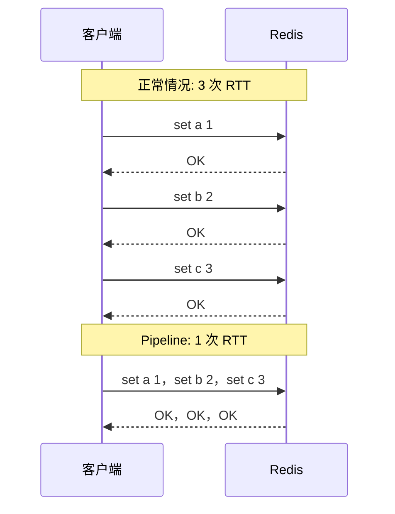

---

title: "Pipeline 批量操作"

created: "2026-07-20"

tags:

  - 八股文

  - redis

---

# Pipeline 批量操作

## 一句话总结

> **Pipeline = 把 N 条 Redis 命令攒在一趟发过去，原来 N 次网络往返变成 1 次。跟拼车一个道理——十个人各打一辆车 vs 十个人打一辆大巴，路程一样，但车费（网络开销）省了 90%。**

---

## 🌰 先搞懂问题在哪
### 想象你点外卖

```text

没有 Pipeline：

  你："老板，一份炒饭"

  老板："好"  ← 把饭端出来

  你："再加一份汤"

  老板："好"  ← 又端汤出来

  你："再加个蛋"

  老板："好"  ← 又端蛋出来

  每加一个菜→等老板回应→再加→再等

  时间全花在"来回走"上，不是做饭上 ❌

Pipeline：

  你："老板，炒饭+汤+蛋，一起上"

  老板一起做完，一次端出来 ✅

```

**网络也是一样：每次发命令→等 Redis 回复→再发→再等。Pipeline 就是让 Redis 一次收一整串，你等一次就行。**

### 快递员送货的比喻

```text

你是快递员（客户端），仓库是 Redis。

没有 Pipeline：

  送一件货 → 回仓库拿下一件 → 再送 → 再回

  10 件货 = 10 趟

有 Pipeline：

  一次装上 10 件货 → 挨个送完 → 回仓库

  10 件货 = 1 趟

Pipeline 不减少"送货"本身的时间，

省的是"来回跑"的时间。

```

---

## Pipeline 省了什么，没省什么

```text

省了啥？

  └─ 客户端 ⇄ Redis 之间来回跑的时间（网络往返）

  └─ 每次命令的打包解包开销

没省啥？

  └─ Redis 执行命令本身的时间（该 1ms 还是 1ms）

  └─ 命令的复杂度（查询大 key 还是慢）

一句话：Pipeline 解决的是"距离"问题，不是"速度"问题。

```

---

## 核心思想：攒够了再发



**Pipeline 的原理就这么简单：不等到回复就发下一条，最后一起收所有回复。**

---

## Pipeline 不是事务（最高频考点）

这是最喜欢挖坑的地方：

```text

Pipeline 只是把命令攒在一起发。

到了 Redis 那边，还是逐条执行的。

比如你发了：SET a 1, SET b 2, GET c, DEL d

Redis 收到的顺序：

① SET a 1 ✓

② SET b 2 ✓

③ GET c → 返回 c 的值

④ DEL d ✓

如果第③条 c 不存在，Redis 只是返回 nil。

第④条照样执行，不会回滚。

```

**Pipeline = 一车拉过去，挨个执行，互不影响。**

**事务 = 要么全做，要么全不做。**

| 对比 | Pipeline | 事务（MULTI/EXEC） |

| ------ | ---------- | ------------------- |

| **原子性** | ❌ 中间失败，后面的继续 | ✅ 全部成功或全部放弃 |

| **网络优化** | ✅ 减少往返 | ❌ 不减少往返 |

| **回滚** | ❌ | ✅ DISCARD |

| **场景** | 批量操作、省网络 | 需要原子性的场景 |

---

## 实际用多少条一批合适

```text

少了没意义：

  攒 2~3 条 → 省不了啥网络开销，不如直接发

多了也会出事：

  一次性 Pipeline 100 万条 SET

  → 你的程序先要攒 100 万条命令在内存里

  → 网络一下子发一个大包

  → Redis 要处理完这 100 万条才能干别的

  → 你这 100 万条没处理完，其他请求全堵住了 ❌

经验值：500~1000 条一批比较稳妥。

```

---

## Pipeline vs MSET/MGET

```text

Redis 自带了一些"批量命令"：

  MSET a 1 b 2 c 3    ← 一次设多个 key

  MGET a b c           ← 一次取多个 key

  DEL a b c            ← 一次删多个 key

这些命令比 Pipeline 还省——Pipeline 好歹发了 N 条命令，

MSET/MGET 是一条命令搞定。

能用 MSET/MGET 的场景，先用它。

那什么时候用 Pipeline？

  Pipeline 赢在"灵活"：

    MSET 只能设，MGET 只能取。

    Pipeline 可以：先删、再读、再写、再删，各种混着来。

像一个购物清单：MSET 是"买 3 瓶水"（单一操作多次）。

Pipeline 是"买水、退衣服、问价格、买面包"（杂七杂八一起搞）。

```

---

## 一句话讲清

```text

延伸提问："Redis Pipeline 是什么？"

你：

"Pipeline 就是批量发命令，减少网络往返。

正常一条命令一次网络往返，Pipeline 把 N 条攒一起，

一次发过去，一次收所有回复。

比如你内网延迟 1ms，发 1000 条命令：

  不用 Pipeline → 1ms × 1000 = 1 秒花在路上

  用 Pipeline → 分两批，每批 500 条 → 2ms

注意 Pipeline 不是事务。

它只是省了网络时间，原子性不保证。

中间某条失败，后面的照样执行。

要原子性得用 Lua 脚本或事务。"

```

---

## 记忆口诀

> **Pipeline = 攒一批发一趟，省的是来回跑的时间，不是干活的时间。**

> **Pipeline 不是事务——命令到了 Redis 还是逐条执行，中间失败不回滚。**

> **500~1000 条一批，少了省不了多少，多了撑爆内存堵住 Redis。**

> **MSET/MGET 比 Pipeline 还省——同样批量，命令数量也更少。但 Pipeline 更灵活，什么操作都能混着来。**

## 速记卡（面试闪卡）

**Q1：一句话讲清「Pipeline 批量操作」到底是什么？**

A：Pipeline 是把 N 条 Redis 命令攒一车发过去：N 次网络往返变 1 次，省的是跑腿时间不是干活时间。

**Q2：它到底省了什么、没省什么 —— 怎么理解？**

A：像快递员送货：没 Pipeline 是一件件跑仓库（10 件=10 趟），有 Pipeline 是一次装车挨个送（10 件=1 趟），省的是来回跑的路费（网络 RTT）。但 Redis 执行每条命令本身的耗时一点没少——它解决的是"距离"问题，不是"速度"问题。命令复杂或大 key 该慢还是慢。

**Q3：Pipeline 不是事务 —— 怎么理解？**

A：Pipeline 像一车货拉过去挨个卸，谁坏谁坏、互不影响；事务（Transaction，MULTI/EXEC）像"要么全做要么全不做"的打包契约。中间某条失败（比如 GET 一个不存在的 key 返回 nil），后面的照样执行、不回滚。要原子性得用 Lua 脚本或真正的事务。

**Q4：一批攒多少条合适 —— 怎么理解？**

A：太少没意义（攒 2-3 条不如直接发），太多会爆——程序得先在内存里攒 100 万条命令，网络一下甩个大包，Redis 处理完这 100 万条前别的请求全堵死。经验值 500~1000 条一批最稳，兼顾省网络又不撑爆内存。

**Q5：和 MSET/MGET 怎么选 —— 怎么理解？**

A：MSET/MGET 是"一条命令买三瓶水"（单一操作批量），比 Pipeline（发三条命令）还省。能用 MSET/MGET 先用它。但 Pipeline 赢在"灵活"：MSET 只能设、MGET 只能取，Pipeline 能"删了再读再写再删"各种混着来——像购物清单里买水、退衣服、问价一起办。

**Q6：核心速记主线有哪些？**

- Pipeline 攒一批发一趟，省网络往返不省执行

- 不是事务，中间失败不回滚

- 500~1000 条一批，少了没用多了堵

- MSET/MGET 更省，但 Pipeline 更灵活

**口诀**

A：Pipeline 攒一车，省的是跑腿不干活

不是事务不回滚，中间失败照样过

五百一千一批稳，太多撑爆内存破

MSET MGET 更省，灵活还数 Pipeline 多

## 相关链接

- 📋 目录：[[00-Redis]]

- 📚 学习清单：[[八股文学习路线图]]

