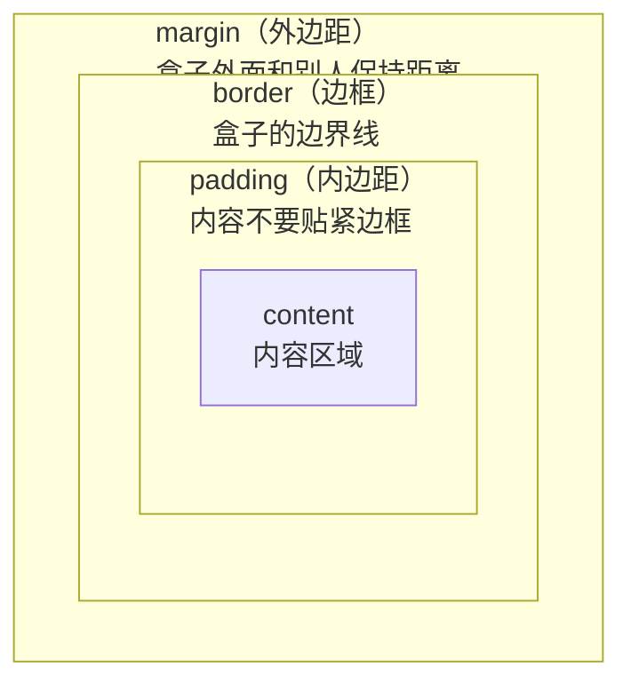

---

title: "HTML与CSS基础"

created: "2025-07-12"

tags:

  - 八股文

  - javascript

  - react-ts-js

---

# HTML与CSS基础

> **定位**：扫清 React 写界面时的 HTML/CSS 障碍——你能看懂 JSX 里的标签和样式在干什么，不被 `<div>`、`flex`、`padding` 卡住。

>

> **前提**：你已经会 TS，知道 `const`、箭头函数、对象——这篇不重复 JS 语法。

>

> **建议时间**：2 小时通读 + 打开任意 React 项目对照着看

---

## 零、先回答一个根本问题：React 里写的 `<div>` 到底是不是 HTML？

**不是。你写的是 JSX，不是 HTML。** JSX 长得像 HTML，但它会被编译成 JS 函数调用。

```tsx

// 你写的 JSX：

<div className="box">

  <h1>{title}</h1>

</div>

// 编译后（大致）：

React.createElement("div", { className: "box" },

  React.createElement("h1", null, title)

);

```

所以这篇笔记不是教你手写静态网页——是教你**读懂 JSX 里那些标签和样式**，让你不被卡住。

**JSX 和 HTML 的三个关键差异**（先记住，后面遇到不再解释）：

| 写法 | HTML | JSX (React) |

|:---|:---|:---|

| 类名 | `class="box"` | `className="box"` |

| 内联样式 | `style="color: red"` | `style={{ color: "red" }}` |

| 自闭合标签 | `` | `` |

> **为什么 className 不是 class？** 因为 `class` 是 JS 的关键字（`class User {}`），React 为了避免冲突用了 `className`。没别的深意，就是个命名躲避。

---

## 一、HTML：页面骨架的 10 个标签
### 1.1 标签是什么？

一个标签长这样：

```html

<p>这是段落文字</p>

```

```text

<p>                ← 开始标签（告诉浏览器"段落开始了"）

   这是段落文字     ← 内容（文字或嵌套其他标签）

</p>               ← 结束标签（浏览器"段落结束了"）

```

> **和 TS 对照**：标签 ≈ 函数调用。`<p>文字</p>` ≈ `p("文字")` —— 把文字包进段落组件里。

### 1.2 必背的 10 个标签
#### ① `<div>` —— 万能容器（最常用）

```html

<div>

  <h1>标题</h1>

  <p>内容</p>

</div>

```

> `div` = division，就是一个**看不见的盒子**，用来把东西归拢到一起。它是**块级元素**——自己独占一行，宽度撑满父容器。React 里 `<div>` 是无处不在的外壳。

#### ② `<span>` —— 行内容器

```html

<p>价格：<span style="color: red">99 元</span></p>

```

> `span` 也是看不见的盒子，但它是**行内元素**——不会独占一行，只占内容宽度。用来圈住一段文字加样式。

**div vs span 速记**：

| | div | span |

|:---|:---|:---|

| 换行 | 独占一行（块级） | 不换行（行内） |

| 宽度 | 撑满父容器 | 只包内容 |

| 用途 | 布局分区 | 文字样式 |

```html

<!-- div：每个盒子占一行 -->

<div>第一行</div>

<div>第二行</div>

<!-- span：文字接着排 -->

<span>你好</span><span>世界</span>  <!-- 输出：你好世界，在同一行 -->

```

#### ③ `<h1>` ~ `<h6>` —— 标题

```html

<h1>一级标题（最大）</h1>

<h2>二级标题</h2>

<h3>三级标题</h3>

```

> h1~h6 是块级元素，自带字号、加粗、上下间距。React 里用它标记页面层级。

#### ④ `<p>` —— 段落

```html

<p>这是一段文字。段落之间会有间距。</p>

<p>这是另一段。</p>

```

> `p` = paragraph，块级元素。自带上下边距。

#### ⑤ `<a>` —— 链接

```html

<a href="https://example.com">点我跳转</a>

<a href="/users/1">用户详情</a>

```

> `a` = anchor（锚）。`href` 属性 = URL 地址。React 里常用 `<Link to="/users">` 替代 `<a href>`，长得一样、作用一样。

#### ⑥ `` —— 图片

```html


<!--    ↑ 图片路径        ↑ 加载失败时显示的文字 -->

```

> `img` 是**自闭合标签**：没有 `</img>`，用 `/>` 结尾。`src` = 图片地址，`alt` = 替代文字（无障碍 + SEO）。

#### ⑦ `<input>` —— 输入框

```html

<input type="text" placeholder="请输入姓名" />

<input type="number" placeholder="请输入年龄" />

<input type="checkbox" /> 同意协议

<input type="radio" name="gender" /> 男

```

> `input` 也是自闭合标签。React 里 `<input>` 必须绑定 `value` 和 `onChange`，这是 React 的受控组件模式（后面会学到）。

#### ⑧ `<button>` —— 按钮

```html

<button>点我</button>

<button type="submit">提交</button>

```

> React 里 `<button onClick={handleClick}>` 你已经在写了。

#### ⑨ `<ul>` / `<ol>` / `<li>` —— 列表

```html

<!-- 无序列表（unordered list）—— 前面带圆点 -->

<ul>

  <li>苹果</li>

  <li>香蕉</li>

  <li>橘子</li>

</ul>

<!-- 有序列表（ordered list）—— 前面带数字 -->

<ol>

  <li>第一步</li>

  <li>第二步</li>

</ol>

```

> `li` = list item。React 里 `items.map(item => <li key={item.id}>{item.name}</li>)` 你天天写。

#### ⑩ `<form>` —— 表单（知道就行）

```html

<form>

  <input type="text" name="username" placeholder="用户名" />

  <input type="password" name="password" placeholder="密码" />

  <button type="submit">登录</button>

</form>

```

> `<form>` 是原生提交数据的容器。**React 里基本不用 form 的原生提交机制**——用 `onSubmit` 拦截，手写 fetch/axios。看到 `<form onSubmit={handleSubmit}>` 知道在干什么就行。

### 1.3 属性 = 标签的参数

```html

<a href="https://example.com" target="_blank">链接</a>

<!--  ↑ 属性名    ↑ 属性值        ↑ 属性名 ↑ 属性值 -->


<!--  ↑ src: 图片来源    ↑ alt: 替代文字 -->

<input type="text" placeholder="请输入" disabled />

<!--            ↑ placeholder: 占位提示    ↑ disabled: 禁用（不需要值） -->

```

> **和 TS 对照**：属性 ≈ 函数传参。`` ≈ `Img({ src: "/a.png", alt: "头像" })`。**JSX 的属性名用驼峰**：`className` 不是 `class`，`onClick` 不是 `onclick`。

### 1.4 标签嵌套 = 父子关系

```html

<div class="card">          <!-- 父：卡片容器 -->

  <h2>张三</h2>             <!-- 子：标题 -->

  <p>年龄：25</p>           <!-- 子：段落 -->

  <div class="tags">        <!-- 子：标签容器（又是它里面两个 span 的父） -->

    <span>React</span>      <!-- 孙：标签 -->

    <span>TypeScript</span> <!-- 孙：标签 -->

  </div>

</div>

```

**读嵌套的口诀**：从左往右看缩进，每一层 `>` 往里走一步。React 组件树就是这种嵌套——`<App>` 套 `<Page>` 套 `<Card>` 套 `<Button>`。

### 1.5 HTML 文件的基本骨架（见过就行）

```html

<!DOCTYPE html>                    <!-- 声明：这是 HTML5 文档 -->

<html lang="zh-CN">                <!-- 根元素，lang 告诉浏览器这是中文 -->

  <head>                            <!-- head：元数据，不显示在页面上 -->

    <meta charset="UTF-8" />       <!-- 字符编码，不写中文会乱码 -->

    <meta name="viewport"           <!-- 移动端视口，不写手机上字会很小 -->

          content="width=device-width, initial-scale=1.0" />

    <title>页面标题</title>        <!-- 浏览器标签页上的标题 -->

  </head>

  <body>                            <!-- body：页面上能看到的东西全放这里 -->

    <div id="root"></div>           <!-- React 会挂载到这个 div 里 -->

    <script src="main.js"></script> <!-- 加载 JS 文件 -->

  </body>

</html>

```

> React 项目里（Vite / CRA）这个文件是自动生成的，你基本不碰。但你写 `<App>` 最终会渲染到 `<div id="root">` 里——看到它知道是挂载点就行。

---

## 二、CSS：样式怎么长成这样的
### 2.1 CSS 长什么样

```css

选择器 {

  属性: 值;

  属性: 值;

}

```

```css

/* 举个真例子 */

h1 {

  color: red;          /* 字体颜色：红色 */

  font-size: 24px;     /* 字体大小：24 像素 */

}

.box {

  width: 200px;        /* 宽度 200 像素 */

  padding: 16px;       /* 内边距 16 像素 */

  background: #f0f0f0; /* 背景色：浅灰（#f0f0f0 是十六进制颜色） */

}

```

> **和 TS 对照**：CSS 规则 ≈ 给元素声明默认属性。`h1 { color: red; }` 相当于 "所有 `<h1>` 的 color 属性默认值设为 red"。

### 2.2 三种写 CSS 的位置

```html

<!-- ① 内联样式：直接写在标签上（React 里常见） -->

<p style="color: red; font-size: 16px">红字</p>

<!-- ② 内部样式表：写在 <style> 标签里 -->

<style>

  p { color: red; }

</style>

<!-- ③ 外部样式表：单独 .css 文件（最传统） -->

<link rel="stylesheet" href="style.css" />

```

> React 里这三种对应：`style={{ }}` 内联、CSS-in-JS（styled-components）、CSS Modules / Tailwind。先知道原生怎么写，后面学 React 样式方案才不会懵。

### 2.3 选择器——选中你要加样式的元素

```css

/* ① 标签选择器：选中所有该标签 */

div { color: blue; }            /* 所有 div 都变蓝 */

/* ② class 选择器（最常用）：选中所有 class="xxx" 的元素 */

.card { border: 1px solid #ccc; }   /* 所有 class="card" 的都加边框 */

.active { color: red; }             /* 所有 class="active" 的都变红 */

/* ③ id 选择器：选中 id="xxx" 的唯一个元素（React 里少用） */

#root { height: 100%; }         /* 选中 id="root" 的元素 */

/* ④ 父子选择器：只选中父里面的子 */

.card h2 { font-size: 20px; }   /* 只选中 .card 里面的 h2，外面的 h2 不管 */

/* ⑤ 多 class 组合：同时有多个 class 时 */

.header.active { color: red; }  /* 同时有 header 和 active 类名的元素 */

```

**和 React 对照**：

```tsx

// CSS 里：

.card { padding: 16px; }

// React 里（JSX）：

<div className="card">内容</div>

//   ↑ 不是 class="card"，是 className

```

### 2.4 CSS 的层叠规则（一句话）

**后面写的覆盖前面写的；越具体的覆盖越笼统的。**

```css

/* 笼统：所有 p */

p { color: blue; }

/* 具体：.card 里的 p */

.card p { color: red; }   /* 赢了，因为更具体 */

```

> 不用深究优先级计算（id 权重 100、class 权重 10 之类的）——React 项目里 Tailwind 或 CSS Modules 会自动处理冲突。记住"越具体越优先"就行。

---

## 三、盒模型——CSS 最重要的概念，没有之一
### 3.1 一切皆为盒子

**每个元素在页面上都是一个矩形盒子。** CSS 做的就是三件事：

1. 盒子多大（width / height）

2. 盒子放哪（margin / flex / position）

3. 盒子里面长什么样（padding / border / background / color）

### 3.2 盒模型的四个部分



**生活比喻**：快递盒。

- **content** = 你要寄的东西（文字、图片）

- **padding** = 泡棉（东西不能贴着纸箱壁，要留缓冲）

- **border** = 纸箱壁（盒子的边界）

- **margin** = 箱子外面的留空（两个箱子之间不能紧贴着）

```css

.box {

  width: 200px;        /* 内容宽度：200 像素 */

  height: 100px;       /* 内容高度：100 像素 */

  padding: 16px;       /* 内边距：四边各 16 像素 */

  border: 1px solid #ccc;  /* 边框：1 像素实线灰色 */

  margin: 20px;        /* 外边距：四边各 20 像素 */

  /* 盒子真实占用的宽度 = content 200 + padding 16×2 + border 1×2 + margin 20×2

                        = 200 + 32 + 2 + 40 = 274 像素 */

}

```

### 3.3 padding 和 margin 的简写

```css

.box {

  /* 四个值：上 右 下 左（顺时针，从上开始） */

  margin: 10px 20px 10px 20px;

  /*      ↑上  ↑右  ↑下  ↑左 */

  /* 两个值：上下 左右 */

  margin: 10px 20px;

  /*      ↑上下 ↑左右 */

  /* 一个值：四边一样 */

  margin: 10px;

  /*      ↑四边都是 10 */

  /* 单独指定一边 */

  margin-top: 10px;

  margin-right: 20px;

  margin-bottom: 10px;

  margin-left: 20px;

}

```

> `padding` 语法和 `margin` 完全一样，把 `margin` 换成 `padding` 就行。

### 3.4 `box-sizing: border-box` —— 救命的设置

```css

/* ❌ 默认行为（content-box）：width 不包含 padding 和 border */

.box {

  width: 200px;

  padding: 16px;

  /* 实际占据宽度 = 200 + 16 + 16 = 232px！超出预期 */

}

/* ✅ 推荐（border-box）：width 包含 padding 和 border */

.box {

  box-sizing: border-box;

  width: 200px;       /* 整个盒子总共 200 宽，padding 从里面扣 */

  padding: 16px;      /* 内容区自动变成 200 - 16 - 16 = 168px */

}

```

> React 项目里（Tailwind / 任何现代 CSS 方案）默认已经帮你设了 `border-box`。但可能问，知道这个差异就行。

---

## 四、Flexbox —— React 布局 90% 靠这个
### 4.1 为什么需要 Flexbox？

HTML 默认是"从上往下堆"。你要做**左右并排**、**垂直居中**、**自动间距**，标准流做不到。Flexbox 就是来解决"怎么放这几个盒子"的。

```text

没有 Flex：

[盒子A]                          ← 占一整行

[盒子B]                          ← 占一整行

[盒子C]                          ← 占一整行

有了 Flex（display: flex）：

[盒子A] [盒子B] [盒子C]          ← 并排了！

```

### 4.2 两个角色：容器 vs 项目

```html

<div class="container">     ← 设置了 display: flex 的盒子 = 容器（指挥者）

  <div>项目A</div>          ← 容器里面的直接子元素 = 项目（听令者）

  <div>项目B</div>

  <div>项目C</div>

</div>

```

**容器上写的属性控制"项目怎么排列"；项目上写的属性控制"某个项目自己的位置"。**

### 4.3 容器的 4 个核心属性

```css

.container {

  display: flex;            /* 开启 Flex 布局（必须写，不写就还是从上往下堆） */

  flex-direction: row;      /* 主轴方向：row = 从左往右（默认），column = 从上往下 */

  justify-content: center;  /* 主轴对齐：项目在主轴上怎么分布 */

  align-items: center;      /* 交叉轴对齐：项目在交叉轴上怎么分布 */

}

```

#### 什么是主轴和交叉轴？

```text

flex-direction: row（默认）:

  主轴 = →（水平从左往右）

  交叉轴 = ↓（垂直从上往下）

flex-direction: column:

  主轴 = ↓（垂直从上往下）

  交叉轴 = →（水平从左往右）

```

> 别死记术语。你就记：**justify 管主轴方向的对齐，align 管交叉轴方向的对齐**。

#### `justify-content` 的取值

```css

/* 主轴 = 水平方向（flex-direction: row 时） */

.container {

  justify-content: flex-start;  /* 项目挤在左边（默认） */

  justify-content: center;      /* 项目居中 */

  justify-content: flex-end;    /* 项目挤在右边 */

  justify-content: space-between; /* 两端对齐，中间平均分（最常用） */

  justify-content: space-around;  /* 每个项目左右有相同间距 */

}

```

```text

flex-start:    [A][B][C] .............

center:        .....[A][B][C].....

flex-end:      .............[A][B][C]

space-between: [A]........[B]........[C]

space-around:  ...[A]...[B]...[C]...

```

#### `align-items` 的取值

```css

/* 交叉轴 = 垂直方向（flex-direction: row 时） */

.container {

  align-items: stretch;    /* 项目拉伸到容器高度（默认） */

  align-items: flex-start; /* 项目顶部对齐 */

  align-items: center;     /* 项目垂直居中（最常用！） */

  align-items: flex-end;   /* 项目底部对齐 */

}

```

#### 一个常见组合（背下来）

```css

/* 水平 + 垂直居中（React 里最常见的需求） */

.container {

  display: flex;

  justify-content: center;  /* 水平居中 */

  align-items: center;      /* 垂直居中 */

  /* 结果：子元素在容器正中央 */

}

```

### 4.4 `gap` —— 项目之间的间距

```css

.container {

  display: flex;

  gap: 16px;            /* 项目之间间距 16 像素（最常用的属性！） */

}

```

> `gap` 只管项目之间的间距，不管项目和外界的间距。React 里 `gap: 16px` 比给每个子元素设 `margin-right: 16px` 干净得多。

### 4.5 `flex-wrap` —— 超宽时换行

```css

.container {

  display: flex;

  flex-wrap: wrap;      /* 一行放不下就换行 */

  gap: 16px;

}

```

> 不写 `flex-wrap` 默认 `nowrap`，所有项目挤在一行里，会压扁变形。React 里做卡片列表、商品网格必写 `flex-wrap: wrap`。

### 4.6 项目的属性：`flex: 1` —— 自动撑满剩余空间

```css

.item {

  flex: 1;    /* 这个项目自动拿走所有剩余空间 */

}

```

```text

.container (display: flex, 总宽度 600px)

  [A] [B 设了 flex: 1] [C]

  → A 和 C 宽度 = 内容宽度（比如各 100px）

  → B 宽度 = 剩余空间 = 600 - 100 - 100 = 400px

```

```css

/* 常驻底部的技巧 */

.layout {

  display: flex;

  flex-direction: column;

  min-height: 100vh;          /* 至少一屏高 */

}

.content {

  flex: 1;                    /* 内容区吃光剩余空间，footer 被挤到底部 */

}

```

### 4.7 Flexbox 速查卡

| 写在哪 | 属性 | 作用 | 常用值 |

|:---|:---|:---|:---|

| 容器 | `display: flex` | 开启 Flex | `flex` |

| 容器 | `flex-direction` | 主轴方向 | `row`（默认）/ `column` |

| 容器 | `justify-content` | 主轴对齐 | `center` / `space-between` |

| 容器 | `align-items` | 交叉轴对齐 | `center` / `flex-start` |

| 容器 | `gap` | 项目间距 | `16px` / `24px` |

| 容器 | `flex-wrap` | 是否换行 | `wrap` / `nowrap` |

| 项目 | `flex: 1` | 吃光剩余空间 | `1` / `2`（双份） |

---

## 五、常用样式属性速查
### 5.1 文字相关

```css

.text {

  color: #333;              /* 文字颜色（#333 = 深灰） */

  font-size: 16px;          /* 字号 */

  font-weight: bold;        /* 加粗（normal/bold/600/700） */

  text-align: center;       /* 文字居中（left/center/right） */

  line-height: 1.5;         /* 行高（1.5 倍字号 = 正常行距） */

  text-decoration: none;    /* 去掉下划线（a 标签的默认下划线） */

  white-space: nowrap;      /* 文字不换行 */

  overflow: hidden;         /* 超出隐藏 */

  text-overflow: ellipsis;  /* 超出显示省略号 ... */

  /* 上面三行组合 = 单行溢出省略号，React 里天天见 */

}

```

### 5.2 背景与颜色

```css

.box {

  background: #f5f5f5;              /* 灰色背景（十六进制） */

  background: rgb(245, 245, 245);   /* 同上，rgb 写法 */

  background: rgba(0, 0, 0, 0.5);   /* 半透明黑色，a = 透明度 */

  background: #f5f5f5 url(bg.png);  /* 背景色 + 背景图 */

  color: red;                       /* 颜色也可以用英文名 */

  color: #ff0000;                   /* 红色（十六进制） */

  color: rgb(255, 0, 0);            /* 红色（RGB） */

}

```

### 5.3 边框和圆角

```css

.card {

  border: 1px solid #e0e0e0;        /* 边框：粗细 样式 颜色 */

  /* 样式：solid(实线) / dashed(虚线) / none(无边框) */

  border-radius: 8px;               /* 圆角：8 像素 */

  border-radius: 50%;               /* 正圆（宽高相等时） */

  border-radius: 8px 8px 0 0;       /* 只上面两个角圆（上左 上右 下右 下左） */

}

```

### 5.4 尺寸控制

```css

.box {

  width: 200px;           /* 定宽 */

  max-width: 600px;       /* 最大宽度（响应式的关键） */

  min-width: 100px;       /* 最小宽度 */

  height: 100px;          /* 定高（尽量少用，让内容撑开） */

  min-height: 100vh;      /* 最少一屏高 */

  /* vh = viewport height = 屏幕可视高度的 1% */

  /* vw = viewport width = 屏幕可视宽度的 1% */

  /* 100vh = 占满一屏高 */

}

```

### 5.5 溢出控制

```css

.scroll-box {

  overflow-y: auto;       /* 纵向超出时出现滚动条（最常用） */

  overflow: hidden;       /* 超出部分隐藏 */

  overflow: scroll;       /* 永远显示滚动条 */

}

```

### 5.6 鼠标指针

```css

.clickable {

  cursor: pointer;        /* 鼠标移上去变手型（可点击的暗示） */

}

```

---

## 六、定位：`position`（知道就行，React 里用得少）

```css

.position-demo {

  /* ① static（默认）：正常流，不特殊定位 */

  position: static;

  /* ② relative：相对自己原来的位置偏移（原来的坑还占着） */

  position: relative;

  top: 10px;              /* 往下移 10 像素 */

  left: 20px;             /* 往右移 20 像素 */

  /* ③ absolute：相对于最近的非 static 祖先定位（原来的坑没了） */

  position: absolute;

  top: 0;

  right: 0;               /* 贴在父容器右上角 */

  /* ④ fixed：相对于屏幕定位，滚动也不动（悬浮按钮） */

  position: fixed;

  bottom: 20px;           /* 屏幕下方 20 像素处 */

  right: 20px;            /* 屏幕右边 20 像素处 */

}

```

**生活比喻**：

- `relative` = 你换了个坐姿，但座位还在

- `absolute` = 你离开座位去讲台，座位被收走了

- `fixed` = 你贴在窗户上，不管教室怎么转你都不动

> React 组件里大部分布局靠 Flex 解决，position 只在特殊场景用（弹窗、悬浮按钮、角标）。不用深究。

---

## 七、JSX 样式写法对照（你的实际场景）

```tsx

// ===== ① className（= HTML 的 class） =====

// CSS 里：

.card { padding: 16px; }

// React 里：

<div className="card">内容</div>

// ===== ② 动态 className：用模板字符串 =====

<div className={`card ${isActive ? "card--active" : ""}`}>

// 多个 class 用空格隔开：className="card card--active"

// ===== ③ 内联样式：用双花括号 =====

<div style={{ padding: "16px", color: "red", fontSize: "14px" }}>

//              ↑ CSS 属性名用驼峰：font-size → fontSize

//   ↑ 外层 {} = JSX 表达式  内层 {} = JS 对象字面量

// ===== ④ 条件样式 =====

<div style={{

  color: isActive ? "red" : "#333",

  display: show ? "block" : "none",

}}>

```

---

## 八、和 TS/React 环境的关系
### 8.1 你的项目里 CSS 写在哪？

你在写 React + TS 时，CSS 有几种常见的存放方式（先知道，后面学）：

| 方式 | 写法 | 特点 |

|:---|:---|:---|

| **全局 CSS 文件** | 一个 `index.css` 全项目用 | 简单但容易冲突 |

| **CSS Modules** | `Card.module.css` 只影响导入它的组件 | 自动隔离，不会冲突 |

| **Tailwind CSS** | `className="px-4 py-2 bg-blue-500"` | 用工具类拼样式，不写 CSS 文件 |

| **CSS-in-JS** | `const Box = styled.div\`...\`` | 样式直接写在 TS 文件里 |

> 你现在不需要选——这篇笔记教的是**CSS 属性的底层含义**。不管用哪种方案，你都要知道 `padding: 16px` 是什么意思。

### 8.2 TS 的类型在 CSS 里的角色

```tsx

// TS 帮你检查：style 对象的属性名对不对

const styles: React.CSSProperties = {

  padding: "16px",

  // paddding: "16px",  ← TS 会报错：拼写错误！

  // 因为 React.CSSProperties 类型里只有 padding，没有 paddding

};

```

> `React.CSSProperties` 是 React 内置的 style 对象类型，让你写内联样式时有 TS 的自动补全和校验。

---

## 九、HTML/CSS 速查卡（一页纸）

| 你要写什么 | HTML | CSS | React (JSX) |

|:---|:---|:---|:---|

| 容器 | `<div>` | `div { ... }` | `<div className="...">` |

| 行内容器 | `<span>` | `span { ... }` | `<span>` |

| 标题 | `<h1>`~`<h6>` | `h1 { font-size: 2em; }` | `<h1>` |

| 段落 | `<p>` | `p { ... }` | `<p>` |

| 链接 | `<a href="...">` | `a { color: blue; }` | `<a href="...">` |

| 图片 | `` | `img { max-width: 100%; }` | `` |

| 输入框 | `<input />` | `input { border: 1px solid; }` | `<input value={v} onChange={fn} />` |

| 按钮 | `<button>` | `button { ... }` | `<button onClick={fn}>` |

| 无序列表 | `<ul><li>` | `ul { list-style: none; }` | `{items.map(i => <li key={i.id}>)}` |

| 样式 | `style="color: red"` | `.class { color: red; }` | `className="class"` / `style={{ color: "red" }}` |

| 水平居中 | — | `text-align: center` 或 `margin: 0 auto` | Flex: `justify-content: center` |

| 垂直居中 | — | `align-items: center` | Flex: `align-items: center` |

| 间距 | — | `margin` / `padding` | `gap` / `margin` / `padding` |

---

## 十、自测清单

- [ ] 看到 `<div className="box">` 知道是 JSX 不是 HTML？

- [ ] 看到 `style={{ color: "red" }}` 知道双花括号不是语法错误？

- [ ] 能画出盒模型的四个部分（content → padding → border → margin）？

- [ ] 看到 `display: flex` + `justify-content: center` + `align-items: center` 知道是居中？

- [ ] 看到 `gap: 16px` 知道是子元素之间间距？

- [ ] 看到 `flex: 1` 知道是自动吃满剩余空间？

- [ ] 能一眼认出 `<div>` 是块级元素（独占一行），`<span>` 是行内元素（不换行）？

- [ ] 看到 `<input value={x} onChange={fn} />` 知道是受控组件？

- [ ] 看到 `padding: 10px 20px` 知道是上下 10、左右 20？

- [ ] 打开任意 React 教程的 CSS，能大致看懂每一行在干什么？

---

> **核心理念**：你不用手写几千行 CSS。在 React 里你会大量用组件库（Ant Design / shadcn/ui）和工具类（Tailwind）。但不管用什么高级方案，**底层都是这些属性**。这篇笔记是字典，不是教材——写界面时遇到不懂的属性，回来看对应的那节。

---

## 速记卡（面试闪卡）

**Q1：一句话讲清「HTML与CSS基础」到底是什么？**

A：这篇教你读懂 React 里 JSX 的标签与样式，核心含 HTML 骨架标签、CSS 盒模型与 Flexbox 布局。

**Q2：零、先回答一个根本问题：React 里写的 <div> 到底是不是 HTML？ —— 怎么理解？**

A：不是。你写的是 JSX（JavaScript XML，一种语法糖），会被编译成 `React.createElement("div", {...}, ...)` 这样的 JS 函数调用，不是浏览器直接解析的 HTML。三个差异：①类名用 className 不是 class（class 是 JS 关键字，React 避开冲突）；②内联样式 `style={{ color: "red" }}` 双花括号（外层是 JSX 表达式、内层是 JS 对象）；③自闭合标签要 ``。标签≈函数调用，属性≈函数传参，JSX 属性名用驼峰。

**Q3：一、HTML：页面骨架的 10 个标签 —— 怎么理解？**

A：10 个必背标签：div（万能块级容器，独占一行）、span（行内容器，只占内容宽）、h1~h6（标题）、p（段落）、a（anchor 链接，href 是地址）、img（自闭合，src 路径+alt 替代文字）、input（自闭合，React 受控组件绑 value+onChange）、button、ul/ol/li（列表）、form（React 基本用 onSubmit 拦截不用原生提交）。块级 vs 行内：div 独占一行、span 不换行。

**Q4：三、盒模型——CSS 最重要的概念，没有之一 —— 怎么理解？**

A：盒模型（Box Model）是 CSS 最重要概念：每个元素都是矩形盒子，由外到内 content（内容）→ padding（内边距，像泡棉）→ border（边框，纸箱壁）→ margin（外边距，箱子间留空）。救命设置 `box-sizing: border-box`：width 包含 padding 和 border，算尺寸不再头疼（现代方案默认已开）。真实宽度 = content+padding×2+border×2+margin×2。

**Q5：四、Flexbox —— React 布局 90% 靠这个 —— 怎么理解？**

A：HTML 默认从上往下堆，要做左右并排、垂直居中、自动间距靠 Flexbox（弹性盒布局，英文 Flexible Box）。两角色：容器（设 display:flex 的盒子，指挥者）和项目（直接子元素）。容器四属性：flex-direction（主轴方向 row/column）、justify-content（主轴对齐 center/space-between）、align-items（交叉轴对齐 center）、gap（项目间距，比 margin 干净）。记：justify 管主轴、align 管交叉轴；`flex:1` 吃光剩余空间。水平+垂直居中 = flex+justify center+align center。

**Q6：核心速记主线有哪些？**

- JSX 不是真 HTML，编译成 createElement；className/双花括号/自闭合三差异

- HTML 10 标签与块级/行内（div 独占、span 不换行）

- 盒模型 content/padding/border/margin；box-sizing: border-box

- Flexbox 容器四属性 + flex:1 + gap；justify 主轴 align 交叉轴

**口诀**

A：JSX 不是真 HTML，编译成 createElement；

className 双花括号，自闭合标签带斜杠；

盒模型像快递盒，content 内 padding border margin 外；

Flex 布局记两端：justify 主轴 align 交叉；

flex:1 吃剩余，gap 管间距别用 margin。

## 相关链接

- 📋 目录：[[00-JavaScript]]

- 📚 学习清单：[[八股文学习路线图]]

