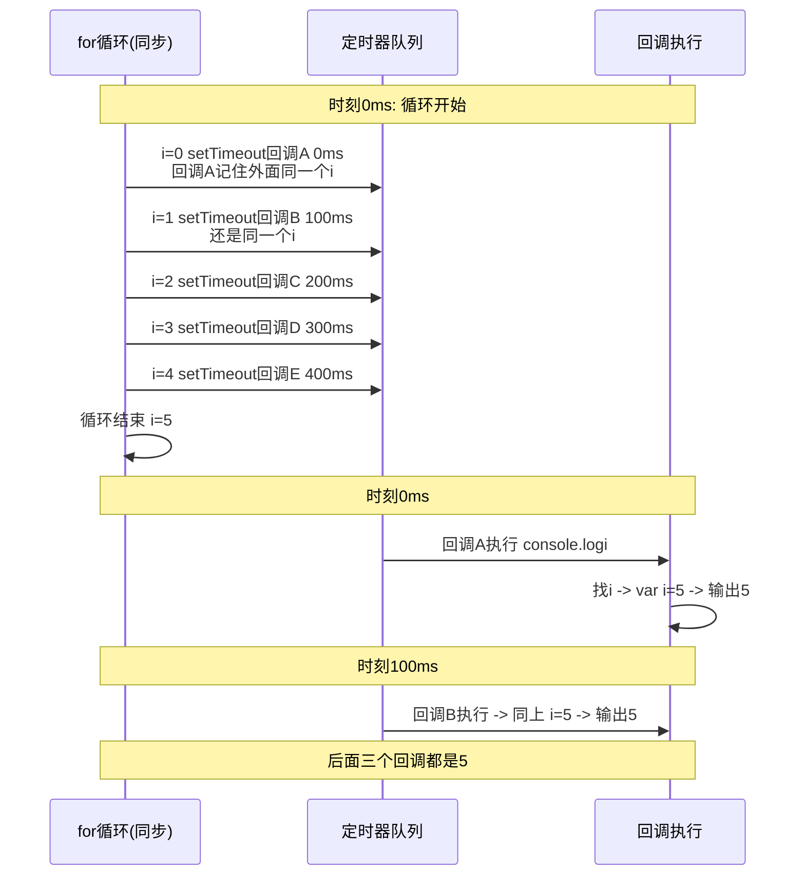
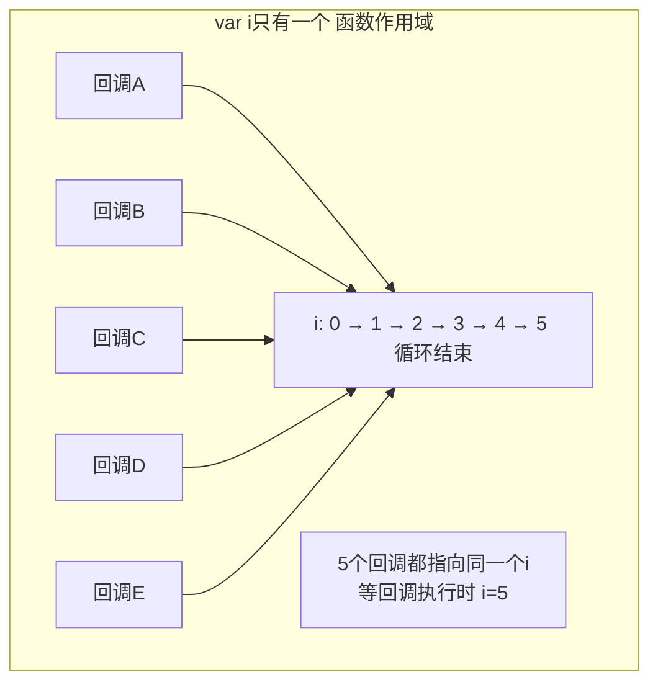
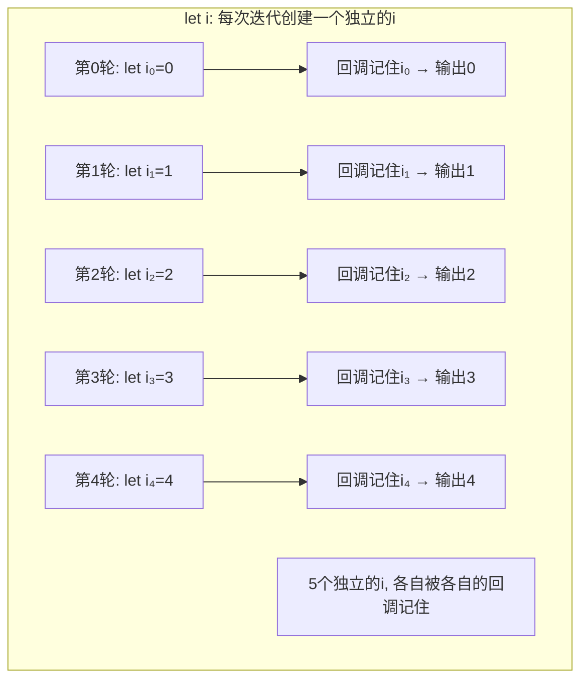
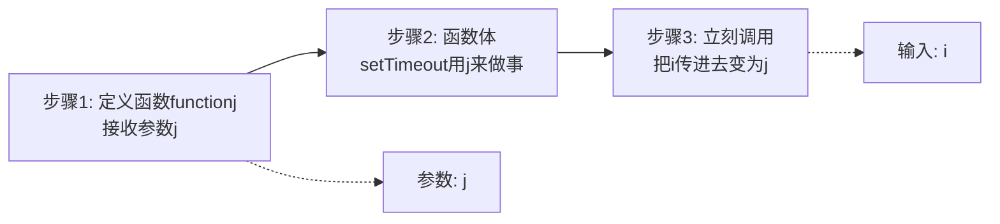
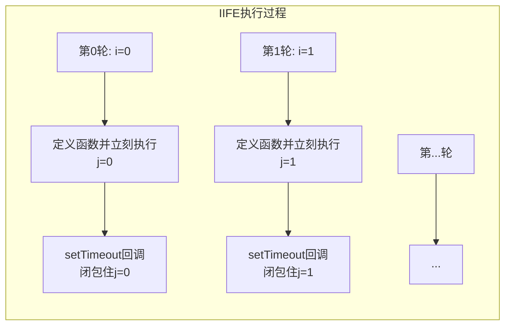
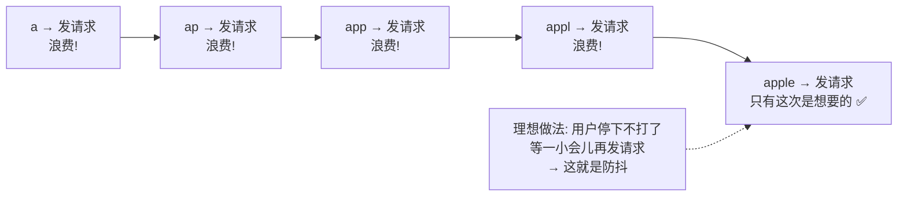
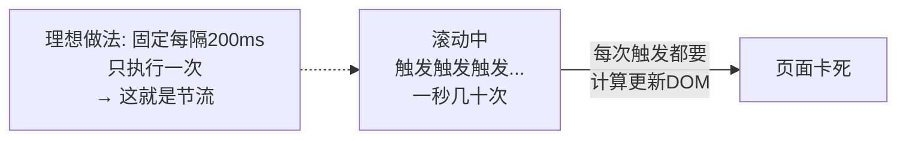

---

title: "闭包Closure核心考点"

created: "2025-07-12"

tags:

  - 八股文

  - javascript

  - react-ts-js

---

# 闭包Closure核心考点

## 二、闭包（Closure）— 核心考点
### 2.1 闭包是什么？

> **闭包 = 函数 + 函数定义时所在的外部作用域。** 当一个函数"记住"了它出生时的外部变量，即使外部函数已经执行完了，这些变量仍然可以被内部函数访问。

**通俗比喻**：你毕业离校了（外部函数执行完了），但你手里有张校友卡（闭包），凭这张卡你仍然能进校图书馆（访问外部变量）。

```javascript

function createCounter() {

    let count = 0;                     // 外部函数的局部变量

    return function() {                // 返回的内部函数（匿名函数，合法且常用）

        count++;                       // 访问了外部函数的 count

        return count;

    };

}

const counter = createCounter();       // counter 是返回的函数，createCounter 执行完了

                                         // 按理 count 应该销毁

console.log(counter);    // [Function] — counter 本身是函数（不加括号 = 引用）

console.log(counter());  // 1          — counter() 是调用结果（加括号 = 执行）

console.log(counter());  // 2          // 每次调用都在操作同一个 count

console.log(counter());  // 3

```

> **关键理解**：`count` 是 `createCounter` 的局部变量，正常应该随着函数执行完毕被垃圾回收。但 `return` 出来的内部函数引用了 `count`，JS 引擎就保留了 `count` 所在的整个作用域——这就是闭包。

### 2.2 闭包的形成条件

| 条件 | 说明 |
| :--- | :--- |
| ① 函数嵌套 | 一个函数内部定义了另一个函数 |
| ② 内部函数引用外部变量 | 内部函数使用了外部函数的变量 |
| ③ 内部函数被"送出去" | 通过 return、赋值给全局变量、作为回调传递等方式让内部函数在外部可访问 |

> 三个条件缺一不可。只嵌套不引用 = 没有闭包；嵌套 + 引用但没有"送出去" = 外部函数执行完照样回收，不形成闭包。

### 2.3 前置：函数在 JS 里是"一等公民"（值）

在讲闭包怎么用之前，先搞清一条 JS 核心规则：

> **函数在 JS 里就是一种值。** 和数字、字符串一样，函数可以被赋值给变量、被当成参数传、被 return 出去。

```javascript

// 数字是值，可以赋值、传递

let a = 1;

let b = a;        // b = 1

// 函数也是值，同样可以赋值、传递

function foo() { console.log('hi'); }

let c = foo;      // c 现在也是那个函数

c();              // 'hi' — c 和 foo 是同一个函数

// 函数可以直接当参数传（回调）

setTimeout(function() { console.log('later'); }, 1000);

// 函数可以当返回值（闭包的核心）

function outer() {

    return function() { console.log('inner'); };  // 把函数这个"值"返回出去

}

```

> 一旦接受"函数就是值"，闭包就不再神秘——你不过是从外部函数里 **return 了一个值**（这个值恰好是个函数），而这个值"记得"自己出生时周围有哪些变量。

### 2.3.1 两个必须知道的内置函数

**① `setTimeout` — 定时器：过一段时间执行某个函数**

```javascript

setTimeout(做什么函数, 等多少毫秒);

// 例子：2 秒后打印

setTimeout(function() {

    console.log('2秒后我才出现');

}, 2000);                         // 2000 毫秒 = 2 秒

console.log('我先出现');           // 这行先执行，setTimeout 不会卡住等

// 输出顺序：

// "我先出现"

// （等2秒）

// "2秒后我才出现"

```

> 理解要点：① 不会卡住代码往下跑；② 时间不是精确的（可能有几毫秒误差）；③ 设 0ms 也是异步的，要等同步代码跑完才执行。

**② `console.log` — 打印输出：把值显示到控制台**

```javascript

console.log('hello');             // 打印字符串

console.log(123);                 // 打印数字

console.log(i);                   // 打印变量 i 的当前值

```

> 在笔记所有代码里，`console.log(某个东西)` 就是"把这个东西的值打出来给你看"。

### 2.3.2 顺带搞懂：回调函数（callback）是什么？

> **回调 = 把一个函数传给另一个函数，让它在合适的时机"回头调"你。**

```javascript

// 你 → 把函数交给 setTimeout

// setTimeout → 等时间到了 → 回头调你给的函数

setTimeout(function() {

    console.log('1秒到了');        // 回调函数：做什么

}, 1000);                          // 1000毫秒 = 1秒：等多久

```

**生活比喻**：你去餐厅吃饭，前台说"等有位子了给你打电话"——你把电话号码（回调函数）留给前台（setTimeout），前台有空位了就打给你（回调执行）。你不用一直站在门口等。

**换个更直白的写法，你就认识了：**

```javascript

// 这种写法你见过——把函数赋给变量，变量当参数传

function onTimeUp() {          // ① 先定义一个普通函数

    console.log('1秒到了');

}

setTimeout(onTimeUp, 1000);    // ② 把它传给 setTimeout，到时它会被调用

                                //    onTimeUp 就是"回调函数"

                                //    注意：是传 onTimeUp，不是 onTimeUp()

                                //    加 () 是立刻执行；不加是"把这个函数给你，你到时候再调"

// 上面的代码和下面完全等价，只是省略了给函数起名的步骤：

setTimeout(function() {         // 匿名函数直接写进去，作用一样

    console.log('1秒到了');

}, 1000);

```

> **回调的本质**：把函数当参数传。调用权不在你手里，在接收方手里——它决定什么时候执行。

>

> 常见的回调场景：`setTimeout`、`addEventListener`、`Promise.then`、数组的 `forEach/map/filter`。

---

### 2.4 闭包的四大应用场景
#### ① 数据私有化

> 闭包最常见的用途：创建"私有变量"，外部无法直接访问，只能通过暴露出来的函数操作。

```javascript

function createCounter() {

    let count = 0;                         // 私有变量，外部碰不到

    // 只 return 一个函数（闭包），这是最简形式

    return function() {

        count++;

        return count;

    };

}

const c = createCounter();                 // c = 返回的那个函数

c();  // 1 — 只能通过 c() 操作 count，没法直接改 count

c();  // 2

// count 在哪？你看不到也改不了，这就是"私有"

```

```javascript

// 进阶：返回多个函数（对象形式），每个函数都共享同一个私有变量

function createPerson(name) {

    let age = 0;                           // 私有变量

    return {

        getName: function() { return name; },  // 注意：这是 "属性名: 函数" 的写法

        getAge:  function() { return age; },

        growUp:  function() { age++; },

    };

}

const p = createPerson('小明');

p.getName();  // '小明' — 括号是空的，name 透过闭包直接拿

p.getAge();   // 0

p.growUp();   // 让 age + 1

p.getAge();   // 1

p.age;        // undefined — age 是私有的，属性不存在

p.name;       // undefined — name 同样是私有的

```

> React 的 `useState`、`useCallback` 本质就是利用了闭包来记住状态。

#### ② 函数工厂（柯里化）

```javascript

// 创建一个"加固定值"的函数

function createAdder(x) {

    return function(y) {

        return x + y;        // 内部函数记住了 x

    };

}

const add5 = createAdder(5);  // x = 5 被闭包记住了

const add10 = createAdder(10); // x = 10 被另一个闭包记住

console.log(add5(3));   // 8

console.log(add10(3));  // 13

```

#### ③ 循环中的闭包（经典题，必考）

先看题目：

```javascript

// ❌ 你以为输出 0 1 2 3 4？

for (var i = 0; i < 5; i++) {

    setTimeout(function() {

        console.log(i);

    }, i * 100);

}

// 实际输出：5 5 5 5 5

```

**一步步拆解到底发生了什么：**

第一步：搞清楚两段代码谁先谁后

```text

for 循环本身         → 同步代码，立刻执行完（几微秒）

setTimeout 的回调     → 异步代码，被丢到"待执行队列"，等同步代码全部跑完才执行

```

第二步：模拟 JS 引擎的大脑



第三步：一张图讲清根本原因



> **根本原因两句话**：

> 1. `var i` 是函数级作用域，整个循环共用一个 `i`，不是每轮一个独立的

> 2. `setTimeout` 回调是异步的，执行时循环早就跑完了，`i` 已经是 5

---

**三种修复方式（要能写出前两种）：**

**解法一：`let` 换 `var`（最简）**

```javascript

for (let i = 0; i < 5; i++) {

    setTimeout(function() {

        console.log(i);    // 0 1 2 3 4 ✅

    }, i * 100);

}

```

> **为什么 `let` 能解决？两个机制叠加：**

>

> ① `let` 有**块级作用域**——`{}` 会限住变量

>

> ② `for (let i = ...)` 有一个特殊行为：**每次迭代创建一个全新的 `i` 绑定**。相当于每轮循环都有一个独立的 `i`，值分别是 0, 1, 2, 3, 4

>

> 这样一来，每个 `setTimeout` 回调闭包住的都是**自己那一轮的独立 `i`**，互不影响。



**解法二：IIFE（立即执行函数）——不用 `let` 的老办法**

先别怕这段代码的样子，拆开看就三步：



**逐段拆解语法：**

```javascript

// 第一步：写一个普通函数

function fn(j) {

    setTimeout(function() {

        console.log(j);

    }, j * 100);

}

// 第二步：把函数名去掉，变成匿名函数，用 () 包起来让它变成一个"表达式"

//         （如果不包，JS 引擎看到 function 开头会以为是"函数声明"，不让你直接调）

(function(j) {

    setTimeout(function() {

        console.log(j);

    }, j * 100);

})

// 第三步：在最后加 (i)，就是立刻调用它，i 作为参数传进去变成 j

(function(j) {

    setTimeout(function() {

        console.log(j);

    }, j * 100);

})(i);   // ← 这个 (i) 就是调用，就像 fn(i) 一样

```

**为什么要这样写？** 因为你需要**立刻**创建一个独立作用域，把当前 `i` 的值"固定"进去。普通函数定义不会自己执行，得有人调它——那就在定义的同时立刻调用。

```javascript

// 对比：普通写法 vs IIFE

function save(val) { ... }   // 定义函数

save(i);                     // 手动调用

(function(j) { ... })(i);    // 定义 + 调用，一步到位，中间没有间隙

```

**完整代码再看一遍：**

```javascript

for (var i = 0; i < 5; i++) {

    (function(j) {                    // 定义函数（参数 j）

        setTimeout(function() {

            console.log(j);           // 回调闭包住 j，不是 i

        }, j * 100);

    })(i);                            // 立刻调用，把当前 i 的值传给 j

}

// 输出 0 1 2 3 4 ✅

```

> 拆解执行过程：



> 每轮循环都**立刻**创建了一个新函数并执行，`i` 的值被当作参数 `j` 传了进去。由于 `j` 是这个函数的局部变量，每一轮都有独立的一份 `j`，互不干扰。

**解法三：`setTimeout` 第三个参数（知道即可）**

```javascript

for (var i = 0; i < 5; i++) {

    setTimeout(function(j) {          // j 从第三个参数接收值

        console.log(j);               // 0 1 2 3 4 ✅

    }, i * 100, i);                   // ← 第三个参数 i，会作为回调函数的参数传入

}

```

> `setTimeout(fn, delay, arg1, arg2, ...)` ——从第三个参数开始，都会传给 `fn` 作为参数。回调的 `j` 是**参数**，不是闭包的变量，每次传的是当时 `i` 的值（基本类型传值，不会被后续修改影响）。

---

**三种解法对比：**

| 解法 | 原理 | 推荐度 |
| :--- | :--- | :---: |
| `let` | 块级作用域 + 每次迭代独立绑定 | ⭐⭐⭐ 首选，一句话讲清 |
| IIFE | 立即执行函数创建独立作用域，参数传值"固定" | ⭐⭐⭐ 展示你对闭包+作用域的理解 |
| setTimeout 第三参 | 利用 API 传参机制，不走闭包 | ⭐ 知道就行，体现广度 |

#### ④ 防抖与节流（实战高频）
##### 场景引入：为什么需要这两个东西？

**场景 A：搜索框输入** — 用户在搜索框打字，每按一个键就发一次请求？



**场景 B：页面滚动** — 用户滚一下鼠标，`scroll` 事件一秒钟触发几十次？



| | 防抖（debounce） | 节流（throttle） |
| :--- | :--- | :--- |
| 比喻 | 电梯：有人进来就重新计时，没人进了才关门走 | 地铁闸机：固定间隔放一个人，不管你多急 |
| 策略 | 连续触发 → 不断重置计时器，最后一次才执行 | 连续触发 → 固定频率执行，中间的全忽略 |
| 典型场景 | 搜索框输入、窗口 resize 结束 | 滚动加载、鼠标移动 |

---

##### 防抖（debounce）— 逐行拆解

**先看最简版（去掉所有花哨语法）：**

```javascript

// 需求：输入框每次按键都调用 handleInput，但只在停打 500ms 后才真正执行

function debounce(fn, delay) {

    let timer = null;                        // ① 定时器编号，初始为空

                                             //    这个变量会被返回的函数闭包持有

    return function() {                      // ② 返回一个新函数，替代原来的 fn

        clearTimeout(timer);                 // ③ 清除上一次还没执行的定时器

                                             //    如果持续触发，定时器永远排不上队

        timer = setTimeout(function() {      // ④ 设一个新的定时器

            fn();                            //    ⑤ delay 毫秒后，真正执行 fn

        }, delay);

    };

}

// === 使用 ===

function handleInput() {

    console.log('发请求搜索');

}

const debouncedHandle = debounce(handleInput, 500);

// debouncedHandle 就是包装后的函数——每次按键都调它

// 用户在输入框打 "abc"：

debouncedHandle();  // t=0ms:  设定时器500ms后执行 → 定时器A

debouncedHandle();  // t=100ms: 清除定时器A → 设定时器B（500ms后）

debouncedHandle();  // t=150ms: 清除定时器B → 设定时器C（500ms后）

// 用户停下来了...

// t=650ms: 定时器C到时间 → 真正执行 handleInput() → 发请求 ✅

```

**关键理解——闭包在哪里？**

```javascript

// debounce 执行完后，timer 按理应该销毁

// 但返回的函数引用了 timer，所以 timer 一直活着

function debounce(fn, delay) {

    let timer = null;       // ← 这个 timer...

    return function() {     // ← ...被这个返回的函数记住了（闭包）

        clearTimeout(timer);

        timer = setTimeout(function() { fn(); }, delay);

    };

}

// 每次调 debouncedHandle，操作的都是同一个 timer

```

**加上参数的完整版（了解即可）：**

```javascript

function debounce(fn, delay) {

    let timer = null;

    return function(...args) {               // ...args 收下所有参数

        clearTimeout(timer);

        timer = setTimeout(function() {

            fn(...args);                     // 原样传给真正的 fn

        }, delay);

    };

}

// 这样防抖后的函数也能接收参数了：

const debouncedSearch = debounce(function(keyword) {

    console.log('搜索：' + keyword);

}, 500);

debouncedSearch('苹果');

```

---

##### 节流（throttle）— 逐行拆解

```javascript

function throttle(fn, interval) {

    let lastTime = 0;                        // ① 上一次执行的时间戳，初始为0

                                             //    同样被返回的函数闭包持有

    return function() {                      // ② 返回一个新函数

        let now = Date.now();                // ③ 获取当前时间（毫秒数）

        if (now - lastTime >= interval) {    // ④ 距上次执行 >= 间隔时间，才允许执行

            lastTime = now;                  //    ⑤ 更新"上次执行时间"为当前时间

            fn();                            //    ⑥ 真正执行

        }

        // 如果时间不够，什么都不做——这次触发被忽略

    };

}

// === 使用 ===

function handleScroll() {

    console.log('加载更多内容');

}

const throttledScroll = throttle(handleScroll, 1000);

// 用户疯狂滚动页面：

// 第1次触发：now=1000, lastTime=0,    1000-0>=1000 ✅ → 执行，lastTime=1000

// 第2次触发：now=1100, lastTime=1000,  1100-1000<1000 ❌ → 忽略

// 第3次触发：now=1300, lastTime=1000,  1300-1000<1000 ❌ → 忽略

// 第4次触发：now=2100, lastTime=1000,  2100-1000>=1000 ✅ → 执行，lastTime=2100

// ...

// 不管中间触发多少次，最少隔 1000ms 才执行一次

```

> **防抖 vs 节流一句话选型**：

> - 等用户**停下来** → 防抖（如搜索框输完再搜）

> - 让用户**有规律地感知** → 节流（如滚动时持续加载，不能断）

### 2.5 闭包的副作用：内存泄漏

> 闭包持有的外部变量**不会**随着外部函数执行完毕被垃圾回收，因为内部函数还"活着"，这些变量就一直被引用着。

```javascript

// ❌ 不当使用导致内存泄漏

function leak() {

    const hugeData = new Array(1000000).fill('🐛');  // 大数组

    return function() {

        console.log(hugeData[0]);  // 闭包引用整个 hugeData

    };

}

const fn = leak();  // hugeData 永远不会被回收，除非 fn = null

```

**怎么避免？**

- 及时释放：不用时 `fn = null`，断开引用

- 只闭包需要的变量，不要一把"抓"整个作用域

- 现代 JS 引擎（V8）会优化：未被内部函数实际用到的外部变量会被回收

**"未被用到的变量会被回收"什么意思？看代码：**

```javascript

function outer() {

    let used = '我被用了';           // ① 内部函数引用了 → 保留

    let unused = '我没被用';        // ② 内部函数没引用 → V8 会回收掉

    return function() {

        console.log(used);         // 只用了 used，没碰 unused

    };

}

const fn = outer();

// 理论上：闭包会保留 outer 的整个作用域，used 和 unused 都应该活着

// 实际上：V8 很聪明——它发现返回的函数根本不需要 unused

//        于是把 unused 垃圾回收掉，只保留 used

//        这样就不会因为闭包而白白占着没用的内存

```

> 一句话：闭包不会无脑保留外部函数的所有变量，只保留**内部函数真正用到的**那些。

---

## 速记卡（面试闪卡）

**Q1：一句话讲清「闭包 Closure」到底是什么？**

A：闭包 = 函数 + 函数定义时所在的外部作用域。白话：一个内部函数"记住"了它被创建时周围那些变量，即使外层函数已经返回，它照样能访问。面试常考：形成条件、四大应用场景、副作用（内存泄漏）。

**Q2：二、闭包是什么 —— 怎么理解？**

A：函数在 JS 里是"一等公民"（first-class citizen，可以像数字一样被赋值、传参、返回）。闭包就是：你返回一个内部函数时，这个内部函数顺手把外层函数的变量环境"打包"带走了。生活比喻：你去办事，窗口大姐给你开了张"权限条"，你拿着条去别的窗口照样能查到你的资料——条上记着你的身份（外层变量），不用大姐还站在那。

**Q3：闭包的形成条件与四大应用场景 —— 怎么理解？**

A：形成三条件：①有函数嵌套；②内部函数引用了外部变量；③外部函数把内部函数返回（或传出去）。四大应用场景：①数据私有化（用闭包做"私有变量"，外面改不了）；②函数工厂（根据参数生成不同行为的函数）；③回调函数保留上下文（setTimeout / 事件监听里用外部变量）；④模块模式（早期 JS 用闭包模拟模块封装）。一句话：闭包让函数"携带状态"。

**Q4：闭包的副作用：内存泄漏 —— 怎么理解？**

A：因为闭包带着外层变量"不撒手"，这些变量不会被垃圾回收（GC，Garbage Collection），用多了、尤其大对象加长生命周期的闭包，内存就下不来。解法：不需要时手动把引用置 null，或别让闭包持有不必要的大对象。面试经典坑：循环里用 var + 闭包（var 没有块级作用域，要用 let 或 IIFE 立即执行函数解决）。

**Q5：前置：函数在 JS 里是一等公民 + 回调 callback —— 怎么理解？**

A：一等公民 = 函数可以赋值给变量、当参数传、当返回值。回调（callback）就是把一个函数作为参数传给另一个函数，等某个事件（IO 完成、定时器到点）时再调用它。闭包和回调常一起出现：回调里常常要访问外层变量，于是自然形成了闭包。比如 `setTimeout(() => console.log(count), 1000)` 里的箭头函数就是闭包，记住了 count。

**Q6：核心速记主线有哪些？**

A：一、闭包定义（函数 + 外部作用域）、二、形成三条件、三、四大应用场景（私有化 / 工厂 / 回调 / 模块）、四、副作用内存泄漏与 var 循环题、五、前置（一等公民 + 回调）。

**口诀**

A：闭包就是函数带环境，外层变量记心中；

一等公民能传递，回调里面它常用；

私有数据它来守，工厂函数它来种；

用了记得置 null，否则内存会发懵。

## 相关链接

- 📋 目录：[[00-JavaScript]]

- 📚 学习清单：[[八股文学习路线图]]

- 🔗 [[语言与框架/TypeScript-React/八股/React/08-闭包陷阱深度剖析|React闭包陷阱]] — React Hooks中的闭包陷阱详解

- 🔗 [[语言与框架/Python/八股/并发/10-生成器与yield原理|Python生成器yield]] — 闭包与生成器都涉及函数状态保持

- 🔗 [[计算机基础/操作系统/21-用户态与内核态|用户态与内核态]] — 闭包在用户态管理内存

