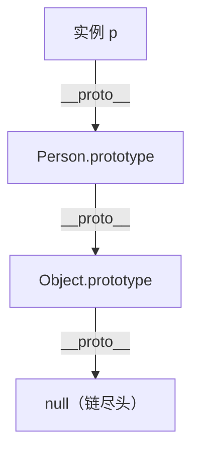

# 原型链与继承（Prototype Chain & Inheritance）

## 零、一句话定位

JavaScript 的对象**不是**靠"类拷贝"继承的，而是靠**原型（prototype）**：每个对象内部都有一条隐藏的 `[[Prototype]]` 链（浏览器里叫 `__proto__`）。当你读取一个属性，自己身上没有，就**顺着这条链往上找**——找到就返回，找到头（`Object.prototype`）还没有就 `undefined`。

> 英文全称：**prototype = 原型**；**prototype chain = 原型链**；**inheritance = 继承**；**constructor = 构造函数**。

## 一、生活化类比

原型链像**家族传家宝 / 族谱**：
- 你（对象）家里没有某件工具（属性/方法）？去问你爸（`__proto__` 指向的父亲对象）。
- 爸也没有？再问爷爷（继续往上）。
- 一路问到老祖宗 `Object.prototype`，他也没有 → 断代了，返回 `undefined`。

ES6 的 `class` / `extends` **只是语法糖**，底层跑的还是这一套原型链，并不是像 Java 那样"复制一份类结构"。

## 二、机制拆解

```js
function Person(name) { this.name = name; }
Person.prototype.say = function () { return "我是" + this.name; };

const p = new Person("小明");
p.say();          // ✅ 自己没有 say，沿 __proto__ 找到 Person.prototype.say
p.toString();     // ✅ 再往上找到 Object.prototype.toString
p.age;            // undefined：整条链都没有 age
```

- `p.__proto__ === Person.prototype`（`new` 时把构造函数的 prototype 挂到实例的 `__proto__`）。
- `Person.prototype.__proto__ === Object.prototype`（链顶端）。
- 实例的 `__proto__` 就是"父对象"，一层层串起来就是**原型链**。

## 三、继承的常见写法

```js
// 1) 原型链继承（共享引用类型属性，已基本不用）
// 2) 构造函数继承：在子类里 call 父类，拿到实例属性
// 3) 组合继承 / 寄生组合继承：最经典，ES5 时代标配
// 4) ES6 class extends：语法糖，底层仍是原型链
class Animal { constructor(n){ this.n = n; } speak(){ return "..."; } }
class Dog extends Animal { speak(){ return this.n + " 汪"; } }
```

## 四、怎么答

1. JS 是**基于原型**的语言，继承靠原型链而非类拷贝。
2. 属性查找顺序：自身 → `__proto__` → 一直找到 `Object.prototype` → `undefined`。
3. `class` 是语法糖，底层还是原型；`instanceof` 判断的就是"构造函数的 prototype 是否出现在对象原型链上"。
4. 原型链过长会影响查找性能；警惕"循环引用"导致链成环。

## 五、要点图解



## 速记卡（面试闪卡）

**Q1：一句话讲清「原型链与继承（Prototype Chain & Inheritance）」到底是什么？**
A：JavaScript 的对象**不是**靠"类拷贝"继承的，而是靠**原型（prototype）**：每个对象内部都有一条隐藏的  链（浏览器里叫 ）。当你读取一个属性，自己身上没有，就**顺着这条链往上找**——找到就返回，找到头（）还没有就 。

**Q2：零、一句话定位 —— 怎么理解？**
A：JavaScript 的对象**不是**靠"类拷贝"继承的，而是靠**原型（prototype）**：每个对象内部都有一条隐藏的  链（浏览器里叫 ）。当你读取一个属性，自己身上没有，就**顺着这条链往上找**——找到就返回，找到头（）还没有就 。
英文全称：**prototype = 原型**；**prototype chain = 原型链**；**inheritance = 继承**；**constructor = 构造函数**。

**Q3：一、生活化类比 —— 怎么理解？**
A：原型链像**家族传家宝 / 族谱**：
你（对象）家里没有某件工具（属性/方法）？去问你爸（ 指向的父亲对象）。
爸也没有？再问爷爷（继续往上）。
一路问到老祖宗 ，他也没有 → 断代了，返回 。
ES6 的  /  **只是语法糖**，底层跑的还是这一套原型链，并不是像 Java 那样"复制一份类结构"。

**Q4：二、机制拆解 —— 怎么理解？**
A：（ 时把构造函数的 prototype 挂到实例的 ）。
（链顶端）。
实例的  就是"父对象"，一层层串起来就是**原型链**。

**Q5：核心速记主线有哪些？**
A：抓住这几根：零、一句话定位、一、生活化类比、二、机制拆解、三、继承的常见写法、四、怎么答、五、要点图解。


## 相关链接

- 📋 目录：[[00-JavaScript]]
- 📚 学习清单：[[八股文学习清单#十一、React-TS-JS]]
- 🔗 [[12-作用域链ScopeChain|作用域链]] — 另一条"找变量"的链，别和原型链搞混
- 🔗 [[11-闭包Closure|闭包]] — 词法作用域下的函数记忆
