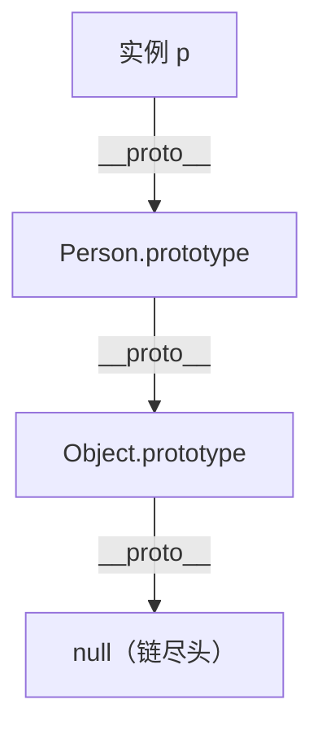

---

title: "原型链与继承"

created: "2026-07-21"

tags:

  - 八股文

  - javascript

---


# 原型链与继承

## 零、一句话定位


JavaScript 的对象**不是**靠"类拷贝"继承的，而是靠**原型（prototype）**：每个对象内部都有一条隐藏的 `[[Prototype]]` 链（浏览器里叫 `__proto__`）。当你读取一个属性，自己身上没有，就**顺着这条链往上找**——找到就返回，找到头（`Object.prototype`）还没有就 `undefined`。


> 英文全称：**prototype = 原型**；**prototype chain = 原型链**；**inheritance = 继承**；**constructor = 构造函数**。


## 一、生活化类比


原型链像**家族传家宝 / 族谱**：

- 你（对象）家里没有某件工具（属性/方法）？去问你爸（`__proto__` 指向的父亲对象）。

- 爸也没有？再问爷爷（继续往上）。

- 一路问到老祖宗 `Object.prototype`，他也没有 → 断代了，返回 `undefined`。


ES6 的 `class` / `extends` **只是语法糖**，底层跑的还是这一套原型链，并不是像 Java 那样"复制一份类结构"。


## 二、机制拆解


```js

function Person(name) { this.name = name; }

Person.prototype.say = function () { return "我是" + this.name; };


const p = new Person("小明");

p.say();          // ✅ 自己没有 say，沿 __proto__ 找到 Person.prototype.say

p.toString();     // ✅ 再往上找到 Object.prototype.toString

p.age;            // undefined：整条链都没有 age

```


- `p.__proto__ === Person.prototype`（`new` 时把构造函数的 prototype 挂到实例的 `__proto__`）。

- `Person.prototype.__proto__ === Object.prototype`（链顶端）。

- 实例的 `__proto__` 就是"父对象"，一层层串起来就是**原型链**。


## 三、继承的常见写法


```js

// 1) 原型链继承（共享引用类型属性，已基本不用）

// 2) 构造函数继承：在子类里 call 父类，拿到实例属性

// 3) 组合继承 / 寄生组合继承：最经典，ES5 时代标配

// 4) ES6 class extends：语法糖，底层仍是原型链

class Animal { constructor(n){ this.n = n; } speak(){ return "..."; } }

class Dog extends Animal { speak(){ return this.n + " 汪"; } }

```


## 四、怎么答


1. JS 是**基于原型**的语言，继承靠原型链而非类拷贝。

2. 属性查找顺序：自身 → `__proto__` → 一直找到 `Object.prototype` → `undefined`。

3. `class` 是语法糖，底层还是原型；`instanceof` 判断的就是"构造函数的 prototype 是否出现在对象原型链上"。

4. 原型链过长会影响查找性能；警惕"循环引用"导致链成环。


## 五、要点图解





## 速记卡（面试闪卡）


**Q1：一句话讲清「原型链与继承」到底是什么？**

A：JS 里每个对象都有个隐藏的 `[[Prototype]]`（原型），访问属性时自己没有就顺着原型往上找，这条"找爸爸"的链就是原型链。继承就是让子对象的原型指向父对象，从而复用父的属性和方法。


**Q2：零、一句话定位 + 一、生活化类比 —— 怎么理解？**

A：生活比喻：你（实例）没有某个技能，先问你爸（父对象），爸没有再问你爷爷（祖父原型），一路问到最顶上的 Object.prototype，再没有就返回 undefined——这就是原型链查找。原型（prototype）是函数上的属性，指向一个对象；实例的 `__proto__` 指向构造函数的 prototype。两者关系：函数的 prototype 是"模具"，实例的 `__proto__` 是"指向模具的指针"。


**Q3：二、机制拆解 —— 怎么理解？**

A：关键三个点：① `prototype` 是构造函数身上的属性，放共享方法；② 实例的 `__proto__` 指向构造函数的 prototype；③ 方法调用时，先查自身，没有就沿 `__proto__` 一路向上，直到 null。用 `instanceof` 判断"是不是某构造函数的实例"，本质就是沿原型链找有没有这个 prototype。`Object.getPrototypeOf(obj)` 是标准取原型的方式（别直接用 `__proto__`）。


**Q4：三、继承的常见写法 —— 怎么理解？**

A：ES5 靠"构造函数 + 原型链"手动拼（Child.prototype = new Parent()），麻烦还容易踩坑。ES6 的 `class` 是语法糖，底层还是原型链，`extends` 一键搞定继承，`super` 调用父类。面试要会说清楚：class 不是 Java 那种"类"，JS 本质还是原型委托（prototype delegation），new 一个实例时做的是"把实例的 `__proto__` 连到类的 prototype"。


**Q5：四、怎么答 + 五、要点图解 —— 怎么理解？**

A：被问到"new 一个对象发生了什么"，标准答：①创建一个空对象；②把它的 `__proto__` 指向构造函数的 prototype；③构造函数里的 this 绑到这个新对象并执行；④返回这个对象（若构造函数没显式返回对象）。被问"原型链顶端是什么"，答 Object.prototype 的 `__proto__` 是 null。记住：所有对象最终都源于 Object.prototype，它是原型链的"老祖宗"。


**Q6：核心速记主线有哪些？**

A：一、原型链查找规则（自身 → 原型 → ... → null）、二、prototype 与 `__proto__` 的区别、三、ES5 手动继承 vs ES6 class/extends/super、四、new 的四步过程、五、instanceof 与顶端 Object.prototype。


**口诀**

A：每个对象有原型，自己没有往上寻；

prototype 是模具，__proto__ 是指针；

class extends 是语法糖，底层还是委托亲；

new 四步走完事，顶端 Object 是老根。


## 相关链接


- 📋 目录：[[00-JavaScript]]

- 📚 学习清单：[[八股文学习路线图#十一、React-TS-JS]]

- 🔗 [[12-作用域链ScopeChain|作用域链]] — 另一条"找变量"的链，别和原型链搞混

- 🔗 [[11-闭包Closure|闭包]] — 词法作用域下的函数记忆

