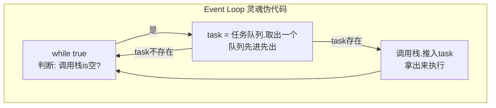
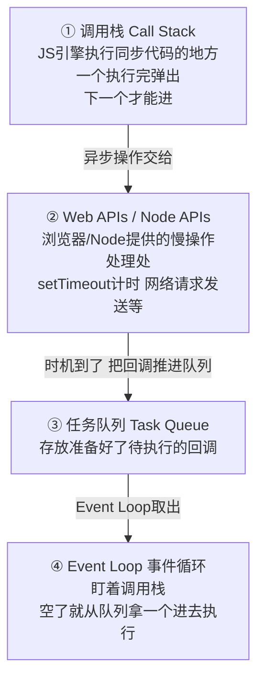
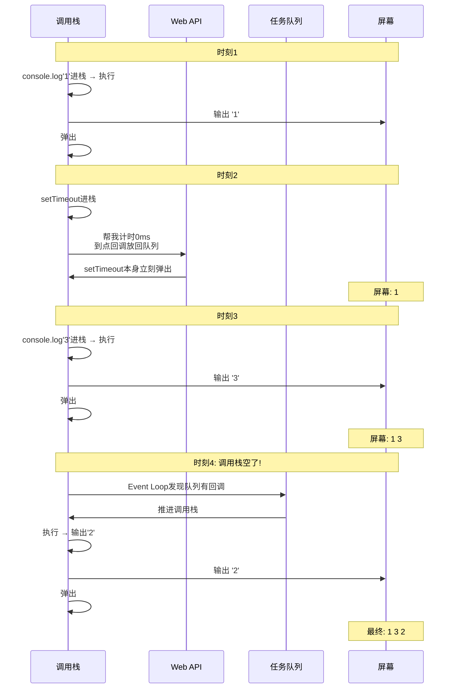

# 宏任务与微任务
## 三、事件循环（Event Loop）


### 3.1 事件循环是什么？


> **Event Loop 是一个死循环**：它反复检查\"调用栈是不是空了\"，空了就从任务队列里取一个任务塞回调用栈执行。就这么周而复始，直到天荒地老。





> 注意：这是简化版真正的循环还要分宏/微任务，先这样理解，下面第六节讲完整流程。


### 3.2 四个组成部分





### 3.3 用一道题模拟 Event Loop 的脑子


```javascript

console.log('1');                       // ① 同步，立即输出

setTimeout(function() {

    console.log('2');                   // ④ 异步，进队列，最后输出

}, 0);

console.log('3');                       // ② 同步，立即输出

```


**模拟引擎大脑，逐时刻拆：**





> **关键认知**：`setTimeout(fn, 0)` 的 0 不是\"立刻执行\"，而是\"至少等 0 毫秒\"，真正的执行时机是\"调用栈空了之后\"。这是所有异步题的解题钥匙。


---


## 速记卡（面试闪卡）

**Q1：一句话讲清「宏任务与微任务」到底是什么？**
A：**Event Loop 是一个死循环**：它反复检查\"调用栈是不是空了\"，空了就从任务队列里取一个任务塞回调用栈执行。就这么周而复始，直到天荒地老。
注意：这是简化版真正的循环还要分宏/微任务，先这样理解，下面第六节讲完整流程。
**模拟引擎大脑，逐时刻拆：**
**关键认知**： 的 0 不是\"立刻执行\"，而是\"至少等 0 毫秒\"，真正的执行时机是\"调用栈空了之后\"。

**Q2：三、事件循环（Event Loop） —— 怎么理解？**
A：**Event Loop 是一个死循环**：它反复检查\"调用栈是不是空了\"，空了就从任务队列里取一个任务塞回调用栈执行。就这么周而复始，直到天荒地老。
注意：这是简化版真正的循环还要分宏/微任务，先这样理解，下面第六节讲完整流程。
**模拟引擎大脑，逐时刻拆：**
**关键认知**： 的 0 不是\"立刻执行\"，而是\"至少等 0 毫秒\"，真正的执行时机是\"调用栈空了之后\"。这是所有异步题的解题钥匙。
---

**Q3：核心速记主线有哪些？**
A：抓住这几根：三、事件循环（Event Loop）。


## 相关链接


- 📋 目录：[[00-JavaScript]]

- 📚 学习清单：[[八股文学习清单]]


