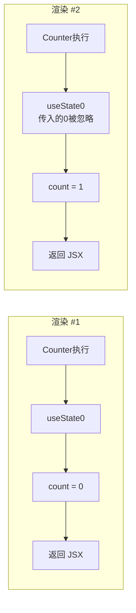
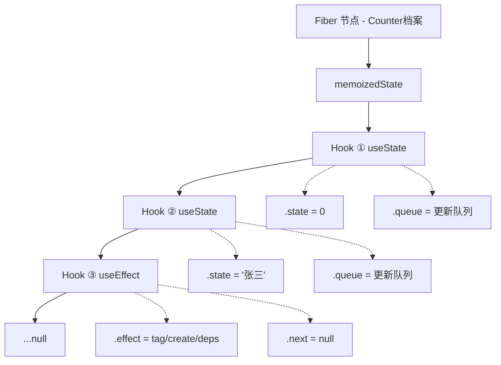
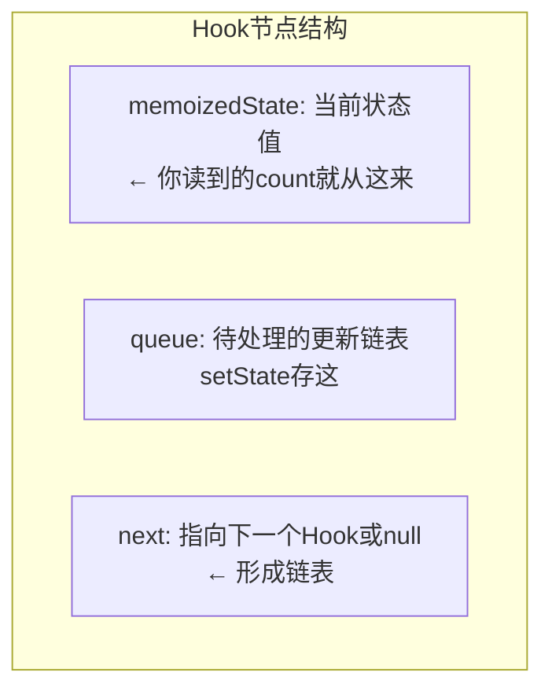
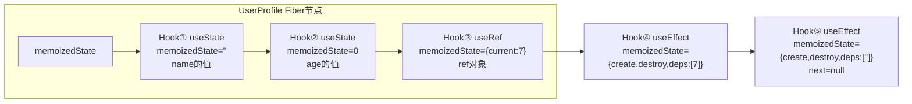
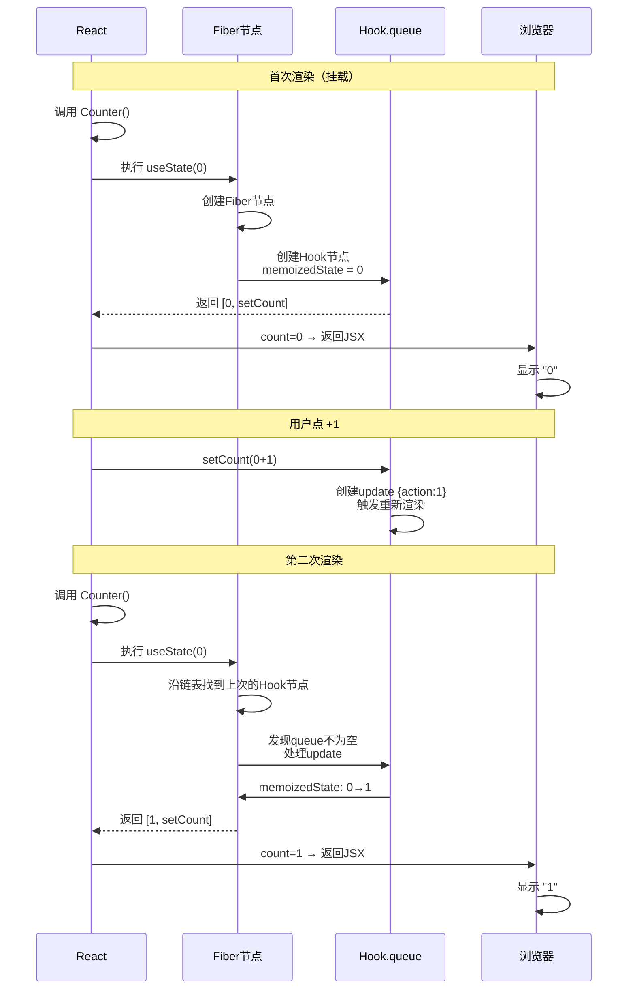
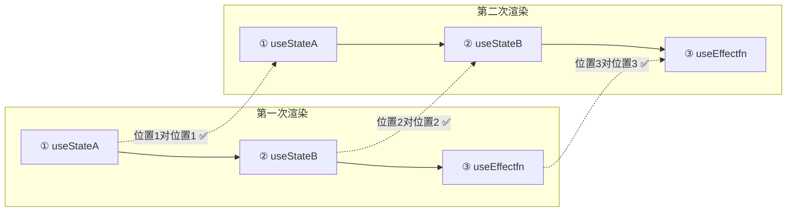
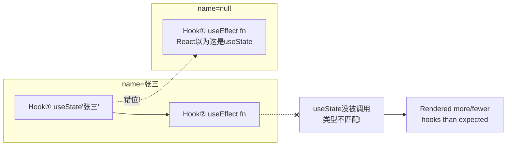
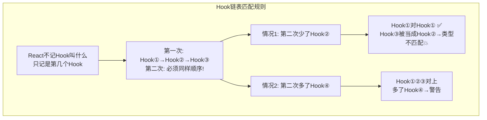
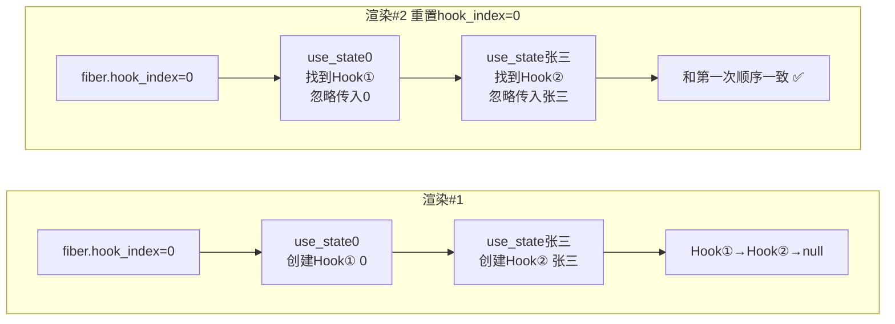

---

title: "useState底层机制"

created: "2025-07-12"

tags:

  - 八股文

  - react

  - react-ts-js

---

# useState底层机制

## 一、useState 底层机制


> 核心："函数组件每次渲染都重新执行，state 凭什么能保留？"


#### 🔍 先定义：Hook 到底是个啥？


你写的 `useState(0)` 是一个**函数调用**。这个调用做了两件事：


| 步骤 | 发生了什么 | 类比 |
| :--- | :--- | :--- |
| ① | React 在组件 Fiber 链表的当前位置找一个"坑位"（第一次渲染就挖一个新坑，后续渲染复用旧坑） | 你去图书馆找自己的储物柜——第一次来分配一个空柜子，之后每次来还是那个柜子 |
| ② | 返回 `[当前值, 更新函数]`——值从坑位里读，更新函数往坑位里写 | 打开柜子拿东西 / 放东西 |


所以 **"一个 Hook"= 一次 `useXxx()` 函数调用 + Fiber 链表上那个调用对应的存储节点**。你调了 5 次 Hook → Fiber 上就有 5 个节点串成一串。


> **Hook 不只有 useState**：`useState`、`useEffect`、`useRef`、`useMemo`、`useCallback`……所有以 `use` 开头的函数都叫 Hook。它们做的事不同——`useState` 管状态值，`useEffect` 管副作用，`useRef` 管可变引用——但底层机制一样：都靠"调用顺序"在 Fiber 链表上找自己的坑位。


关键：你写的是 `useState`，React 记的是链表上第几个节点。**Hook 不靠名字认身份，靠位置**。这就是为什么不能放在 if 里——跳过一次调用，后面的坑位全对不上。


### 1.1 先看现象——函数明明重跑了，值却留下了


```tsx


function Counter() {


  const [count, setCount] = useState(0);  // ① 每次渲染都执行这一行


  return (


    <div>


      <p>{count}</p>                      // ② 第 2 次渲染显示 1，不是 0


      <button onClick={() => setCount(count + 1)}>+1</button>


    </div>


  );


}


```





> **关键认知**：`useState(0)` 里的 `0` **只在第一次渲染时被用作初始值**。后续渲染 `useState(0)` 传入的 `0` 被 React 忽略——React 从内部存储返回当前值。


### 1.2 状态存在哪——Fiber 节点上的 Hook 链表


> 每个组件实例在 React 内部对应一个 **Fiber 节点**（可以理解为 React 为这个组件维护的"档案"）。Fiber 节点上挂着一个** Hook 链表**——你在这个组件里调了多少个 Hook，链表上就有多少个节点。








#### 实例：一个组件 5 个 Hook → 链表 5 个节点


```tsx


// 一个真实组件——调了 5 个 Hook


function UserProfile({ userId }: { userId: string }) {


  const [name, setName] = useState("");              // ① 调第 1 个 Hook


  const [age, setAge] = useState(0);                 // ② 调第 2 个 Hook


  const prevUserId = useRef(userId);                 // ③ 调第 3 个 Hook


  useEffect(() => { fetchUser(userId); }, [userId]); // ④ 调第 4 个 Hook


  useEffect(() => { document.title = name; }, [name]);// ⑤ 调第 5 个 Hook


  return <div>{name}, {age}</div>;


}


```


这个组件渲染一次之后，它的 Fiber 节点上挂着这样一个链表：





> 这 5 个 Hook 的顺序**每次渲染必须一模一样**——React 第二次渲染时从 Hook① 开始逐个匹配：第一次的 Hook① 就得是这次渲染的 Hook①（都是 `useState("")`）。如果某次渲染 `userId` 为空就跳过了 `useRef`，那 Hook③ 缺失，后面的 `useEffect` 全部错位 → 崩溃。


**生活比喻**：


- Fiber 节点 = 你的学籍档案袋（一个组件一个袋子）


- Hook 链表 = 档案袋里一张张钉在一起的记录卡（每个 Hook 一张卡）


- `memoizedState` = 记录卡上写的当前值（下次来读这张卡就看到了）


- `queue` = 记录卡背面的"待办便签"（`setCount` 贴上去的，下次渲染时处理）


- `next` = 把卡片串起来的订书钉（保证顺序）


### 1.3 一次完整的 setState → 重新渲染过程


以 `Counter` 组件的两次渲染为例：





> **核心**：`useState` 返回的 state 不是"存在函数里的变量"——是存在 **Fiber 节点上 Hook 链表的 `memoizedState`** 里。函数重新执行只是"路过" Fiber，从那里取回上次存的值。


### 1.4 为什么 Hooks 不能在条件/循环里调用？


> 这是 React Hooks 重点掌握题。


React 靠**调用顺序**来匹配两次渲染之间的 Hook：





如果在条件里调 Hook，匹配就乱了：


```tsx


// ❌ 第一次渲染：name 有值，Hook 链表是 [useState(name), useEffect]


//    第二次渲染：name 为空，Hook 链表是 [useEffect]（跳过 useState）


//    → React 把第二次的 useEffect 当成第一次的 useState → 读错数据 → 💥


function BadComponent({ name }) {


  if (name) {


    useState(name);  // ❌ 条件调用——第一次有，第二次跳过了


  }


  useEffect(() => { /* ... */ });


}


```








> **一句话**：Hook 靠"第几个"认身份，不是靠"叫什么"。条件/循环会改变调用次数和顺序 → React 匹配错位 → 崩溃。


**生活比喻**：10 个人排队进电梯（渲染 ）保安数着"1号是会计、2号是程序员、3 号是设计师"。下次同样 10 个人排队（渲染 ）保安不看人脸——只看序号——认为"1 号还是会计、2 号还是程序员"。如果中间少个人（条件跳过了），后面所有人的身份全对不上。


### 1.5 手写极简版 useState（15 行理解原理，不背）


> 🎯 **目的不是背代码，是让你"看到"链表 + 索引匹配到底怎么工作。** 实践中你能用自己的话讲清楚下面这 3 句话就够了，不需要写 Python。代码只是帮你验证"原来就这点事"。


```python


# 不需要懂 JS，用你熟悉的 Python 看这套逻辑就够了


class Hook:


    """模拟一个 Hook 节点"""


    def __init__(self, state):


        self.memoized_state = state   # ① 当前状态值——你读到的 count 从这来


        self.next = None              # ② 指向下一个 Hook（形成链表）


class FiberNode:


    """模拟 React 的 Fiber 节点（组件的'档案'）"""


    def __init__(self):


        self.memoized_state = None    # ③ 指向第一个 Hook


        self.hook_index = 0           # ④ 当前渲染时处理到第几个 Hook 了


fiber = FiberNode()                   # ⑤ 每个组件有一个 Fiber 档案


def use_state(initial):


    """每个渲染周期内，第 N 次调用 use_state 就操作 Hook 链表的第 N 个节点"""


    # ⑥ 找上一次渲染时这个位置的 Hook


    current_hook = fiber.memoized_state  # 从头开始找


    i = 0


    while current_hook and i < fiber.hook_index:


        current_hook = current_hook.next  # 沿链表走到对应位置


        i += 1


    if current_hook is None:          # ⑦ 第一次渲染——创建新 Hook


        new_hook = Hook(initial)      #    用 initial 作为初始值


        # 把新 Hook 挂到链表末尾


        if fiber.memoized_state is None:


            fiber.memoized_state = new_hook  # 第一个 Hook


        else:


            # 找到链表末尾，挂上去


            last = fiber.memoized_state


            while last.next:


                last = last.next


            last.next = new_hook


        current_hook = new_hook


    state = current_hook.memoized_state  # ⑧ 返回存在 Hook 上的值（不是初始值！）


    fiber.hook_index += 1                # ⑨ 索引 +1，下次调用 use_state 处理下一个 Hook


    return state


```


> **执行流程（用这个伪代码模拟两次渲染）**：





>


> **如果 Hook② 在渲染 #2 被条件跳过了**：`use_state("张三")` 没被调用 → `hook_index` 停在 1 → 第三个 `use_state` 被当成第 2 个来匹配 → Hook 类型/位置错位 → 崩溃。


> 这 15 行 Python 就是 React useState 的核心思路。真实源码复杂得多（涉及 update 队列、批量更新、优先级调度），但"链表记录 + 索引匹配"这个骨架不变。


---


## 速记卡（面试闪卡）


**Q1：一句话讲清「useState底层机制」到底是什么？**

A：useState 把组件状态存在 React 的内部 Fiber 节点上，而非函数局部变量里。


**Q2：1.1 先看现象——函数明明重跑了，值却留下了 —— 怎么理解？**

A：像去银行办业务：柜员（函数）每次都重新坐到位，但你的余额（状态）存在银行系统（Fiber）里，不在柜员脑子里。状态留在 Fiber 节点（Fiber Node）上。


**Q3：1.2 状态存在哪——Fiber 节点上的 Hook 链表 —— 怎么理解？**

A：像学籍档案袋：一个组件一个袋，里面钉着一张张记录卡（Hook 节点），每张卡记下当前值和待办便签，靠订书钉（next 指针）串成顺序。这条链表叫 Hook List。


**Q4：1.3 一次完整的 setState → 重新渲染过程 —— 怎么理解？**

A：像贴便签催办：setState 把更新贴到 Hook 的 queue 上并触发重渲染，React 重新跑函数、按队列算出最新值、再比对更新真实 DOM。把更新入队叫 Enqueue Update。


**Q5：1.4 为什么 Hooks 不能在条件/循环里调用？ —— 怎么理解？**

A：像 10 人排队进电梯，保安只数序号不认脸；若中间少一人（条件跳过），后面所有人身份全对不上，Hook 顺序错位就崩。定位靠调用顺序（Call Order），不看名字。


**Q6：核心速记主线有哪些？**

- 状态存在 Fiber 的 Hook 链表，不在函数局部变量

- 靠"第几个"调用顺序定位 Hook，不看名字

- setState 入队 → 调度重渲染 → 取最新值渲染

- Hooks 必须在顶层，调用顺序每次一致


**口诀**

A：useState 状态不在函数里，Fiber 链表记清楚；

调用顺序定位置，条件循环不能住；

setState 入队等重渲，批处理合并不反复；

想懂原理写一遍，闭包数组是雏形。


## 相关链接


- 📋 目录：[[00-React]]


- 📚 学习清单：[[八股文学习路线图]]


