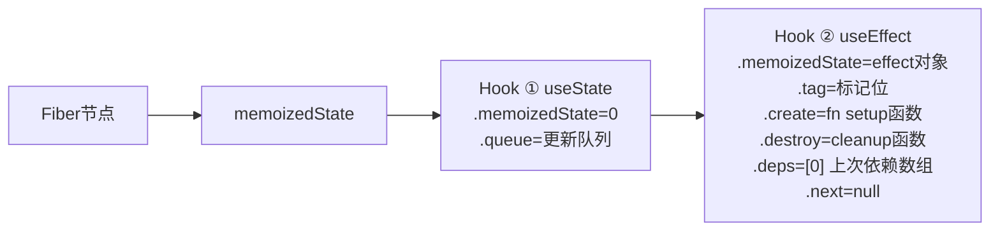
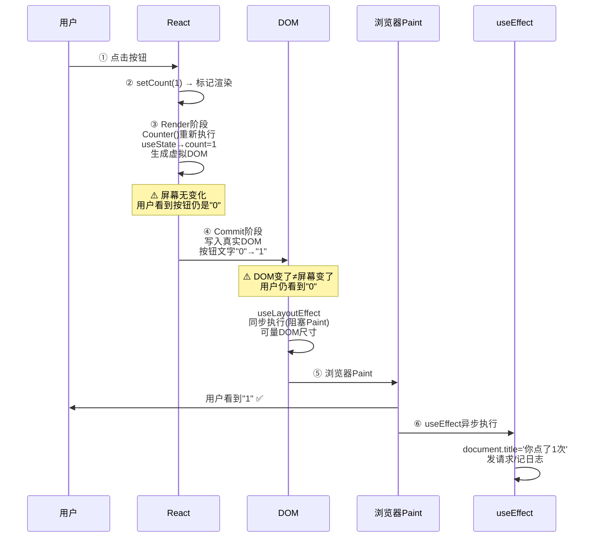
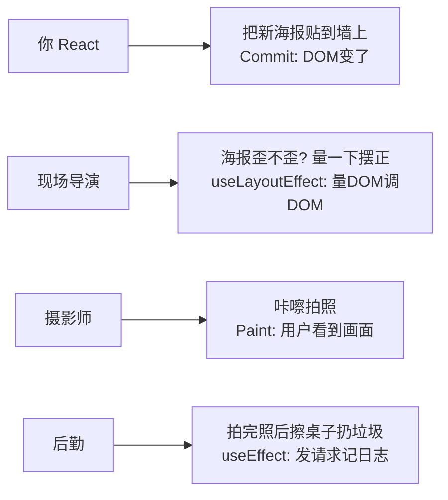
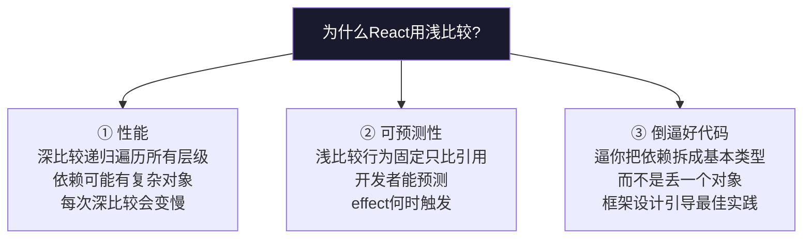

---

title: "useEffect底层机制"

created: "2025-07-12"

tags:

  - 八股文

  - react

  - react-ts-js

---

# useEffect底层机制

## 三、useEffect 底层机制

> TS 笔记讲透了 useEffect 的"怎么用"（setup/cleanup/三个阶段）。本节只讲延伸追问的三个底层问题。

### 3.1 Effect 存在哪——也在 Hook 链表上

useEffect 和 useState 共用同一条 Hook 链表。区别是 Hook 节点里存的字段不同：



**effect 对象字段解释**：

| 字段 | 存储内容 | 类比 |

| :--- | :--- | :--- |

| `tag` | 标记位（区分 useEffect / useLayoutEffect） | 快递标签：普通件 vs 当日达 |

| `create` | 你传的 setup 函数 `() => { ... }` | 待执行的指令 |

| `destroy` | setup 返回的 cleanup 函数 | 上一次的"擦屁股"函数 |

| `deps` | 上次渲染的依赖数组 | 参照物——这次拿新的来比 |

### 3.2 useEffect 的执行时机——提交后异步执行

> 先忘掉 React，理解一个常识：**浏览器更新画面是分步骤的**。你改了 DOM（比如改了一个 `<p>` 的文字），浏览器不是立刻画到屏幕上——它要等到合适的时机才"画"（Paint）。就像你在 Word 里打字，字先写入文档（DOM 变了），然后 Word 才刷新显示（Paint）。

用你写过的 `Counter` 组件，跟踪一次 `setCount(1)` 的完整时间线：

```tsx

function Counter() {

  const [count, setCount] = useState(0);

  useEffect(() => {

    document.title = `你点了 ${count} 次`;       // ⑥ 最后做这个，不挡用户

  }, [count]);

  return <button onClick={() => setCount(count + 1)}>   // ① 用户点按钮

    {count}                                            // ⑤ 用户看到新数字

  </button>;

}

```

**慢动作分解（每一步写清楚"用户看到了什么"）：**



**一分钟理解版（一个比喻）：**



| | useLayoutEffect | useEffect |

| :--- | :--- | :--- |

| 在 Paint 前还是后？ | Paint **前**，同步执行 | Paint **后**，异步执行 |

| 会阻塞用户看到新画面吗？ | 会（如果里面写耗时操作，页面卡） | 不会（用户先看到新画面） |

| 能读 DOM 尺寸吗？ | ✅ 能，DOM 已更新、还没画 | 读到的是旧画面还是新画面不一定 |

| 什么时候用它？ | 弹窗定位、滚动位置恢复、防止闪烁 | 网络请求、日志上报、写 localStorage |

| 你 99% 代码里用的是？ | ❌ 很少用 | ✅ 就用这个 |

> **一句话**：`useEffect` 让你在"用户已经看到新画面之后"再做额外的事——不挡着用户。`useLayoutEffect` 是"DOM 变了但用户还没看到"那一刻——让你有机会抢在 Paint 之前调整布局，代价是如果写太慢用户会觉得卡。

**一句话讲清（30 秒版）**：

> "useEffect 在浏览器绘制之后异步执行，不阻塞渲染，90% 的场景用它。useLayoutEffect 在 DOM 提交之后、浏览器绘制之前同步执行——只在需要测量 DOM 布局、或者改了 DOM 不想让用户看到闪烁时才用。"

### 3.3 依赖数组比较——为什么是浅比较 + 为什么不能改
#### 先搞懂：什么是浅比较、什么是深比较？（用 Python 讲，2 分钟）

你从 Python 来——这个概念你其实已经会了：

```python

# === 浅比较 = Python 的 is（只比身份证） ===

a = [1, 2, 3]

b = [1, 2, 3]

c = a

print(a is b)   # False ← 浅比较：两个不同的列表对象，内存地址不同 → "不一样"

print(a is c)   # True  ← 浅比较：同一个对象 → "一样"

# === 深比较 = Python 的 ==（递归比内容，逐层往里看） ===

print(a == b)   # True  ← 深比较：a 和 b 长得一模一样，每一个元素都相等

# === 对象的情况（类比组件的 props 或依赖数组里的对象） ===

class User:

    def __init__(self, name):

        self.name = name

u1 = User("张三")

u2 = User("张三")

print(u1 is u2)  # False ← 浅比较：两个不同的对象

print(u1 == u2)  # False ← Python 默认 == 对自定义对象也是比引用（除非实现 __eq__）

#                           但如果是 dict/list，== 就是深比较了

```

**一张表总结**：

| | 浅比较（React 用的） | 深比较（React 不用的） |

| :--- | :--- | :--- |

| Python 等价 | `a is b` | 递归版 `a == b` |

| 比什么 | 内存地址（引用） | 递归比较每一层内容 |

| `{}` vs `{}` | ❌ 不等（两个不同对象） | ✅ 相等（内容一样） |

| `[1, 2]` vs `[1, 2]` | ❌ 不等 | ✅ 相等 |

| `"abc"` vs `"abc"` | ✅ 相等（基本类型 JS 也比值） | ✅ 相等 |

| 速度 | 极快（就比一个地址） | 慢（要递归遍历所有层级） |

| 为什么 JS 不默认用深比较 | — | 对象可能很深，遍历要时间；而且"内容相同但不同对象"这个边界情况让开发者自己处理更好 |

**核心洞见**：浅比较下，`{}` 和 `{}` 永远是"不等"的——因为它们是两个不同的对象。这就是为什么不能把对象直接写进依赖数组的原因。

**问：为什么 React 用 `Object.is`（浅比较）而不是深比较？**



**一句话**：深比较听起来好，实际会让 React 又慢又不确定。React 选浅比较 = 选"快且可预测"。

---

## 速记卡（面试闪卡）

**Q1：一句话讲清「useEffect底层机制」到底是什么？**

A：useEffect 在浏览器绘制完成后异步执行副作用，不阻塞渲染，靠依赖数组决定是否重跑。

**Q2：三、useEffect 底层机制 —— 怎么理解？**

A：像后勤收尾：useEffect 和 useState 共用同一条 Hook 链表，节点里存 effect 对象（tag/create/销毁函数/deps）。effect 对象像快递单：tag 区分普通件还是当日达，deps 是本次参照物。Hook（钩子，复用逻辑的机制）。

**Q3：二、执行时机：提交后异步、不阻塞渲染 —— 怎么理解？**

A：像贴海报后拍照：React 提交 DOM（海报贴墙）→ 浏览器 Paint（拍照用户看到）→ 之后才异步跑 useEffect（后勤擦桌子）。所以它在"用户看到新画面之后"做事，不挡用户。useLayoutEffect 则在 Paint 前同步跑。

**Q4：三、依赖数组浅比较与不可变 —— 怎么理解？**

A：像查身份证：依赖数组用浅比较（Object.is，比引用不比内容）。deps 里放对象/数组，每次渲染都是新引用→永远不等→无限重跑。所以依赖要原子值，或保证引用不变（useMemo）。Shallow Compare（浅比较）。

**Q5：四、与 useLayoutEffect 的区别 —— 怎么理解？**

A：像分工：useLayoutEffect 在 DOM 提交后、绘制前同步执行，能量 DOM 尺寸防闪烁，但写慢了卡页面；useEffect 绘制后异步，90% 场景用它（请求、日志、localStorage）。选错位置会让用户感觉到卡顿。

**Q6：核心速记主线有哪些？**

- useEffect 存在 Hook 链表，节点存 effect 对象

- 执行时机：Commit 之后、Paint 之后异步跑

- 依赖数组浅比较，引用变化才重跑

- useLayoutEffect 绘制前同步，useEffect 绘制后异步

**口诀**

A：useEffect 后勤兵，绘制之后才执行；

Hook 链表存对象，deps 是那参照镜；

浅比较比身份证，引用变了就重跑；

布局同步用 Layout，九成场景普通好。

## 相关链接

- 📋 目录：[[00-React]]

- 📚 学习清单：[[八股文学习路线图]]

