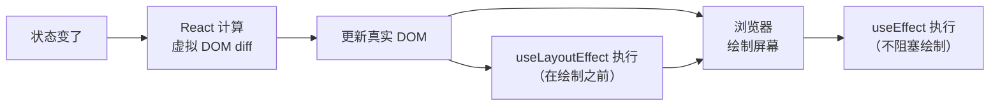
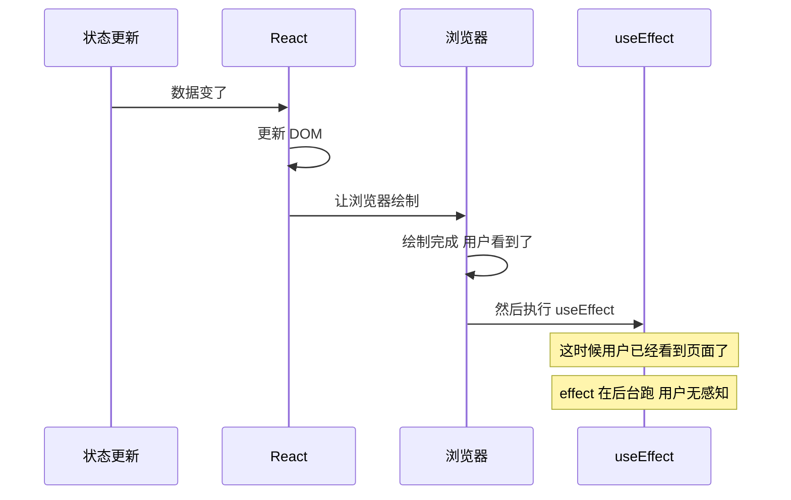
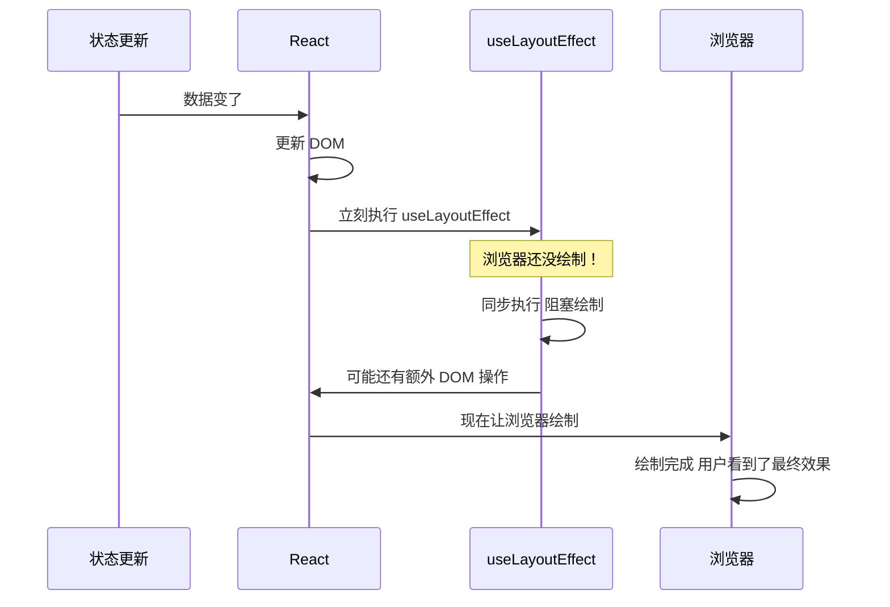
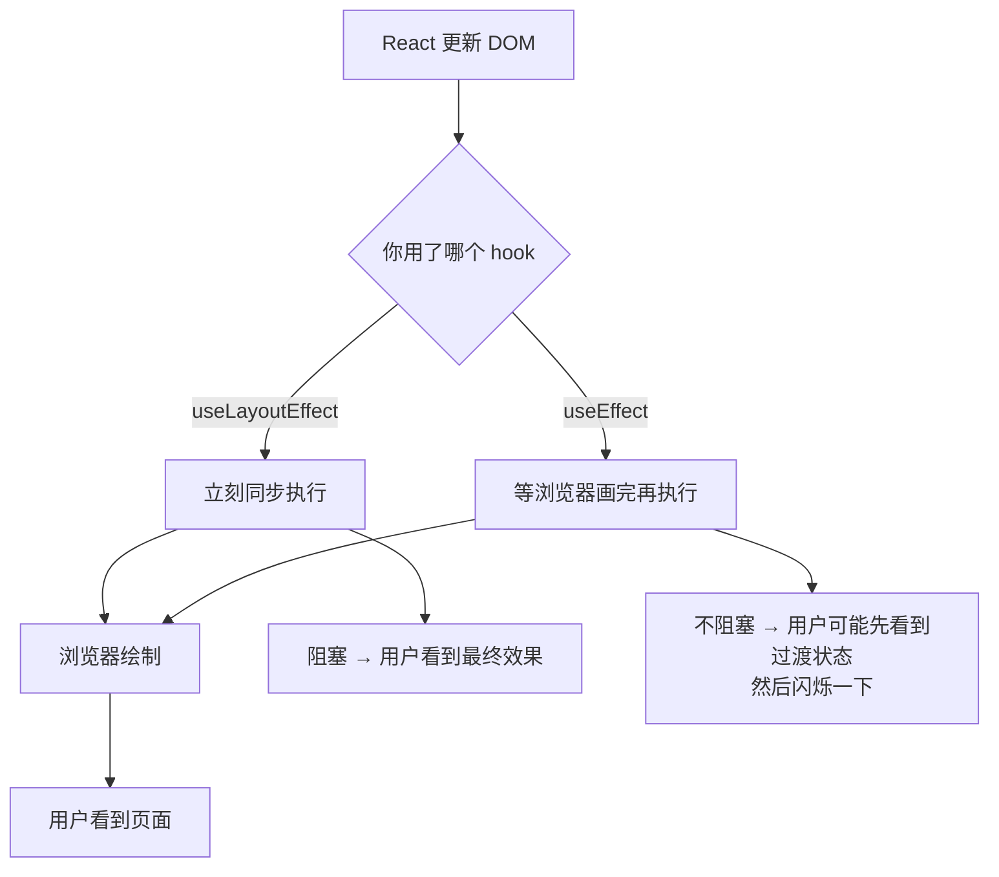
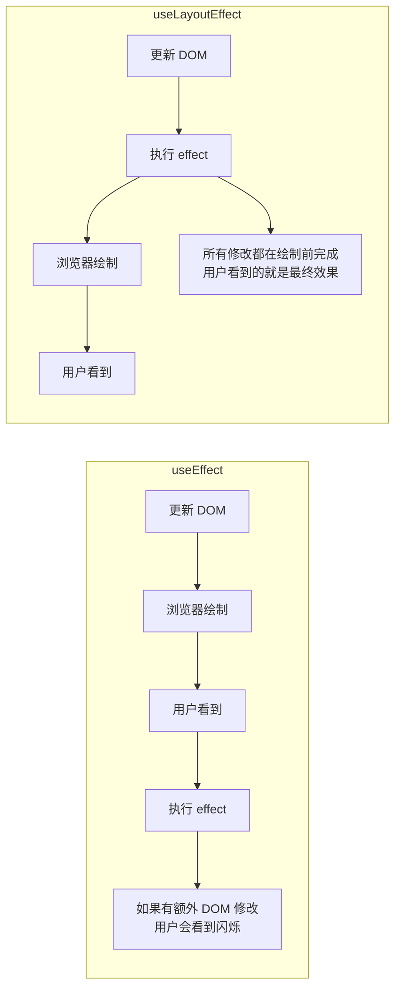
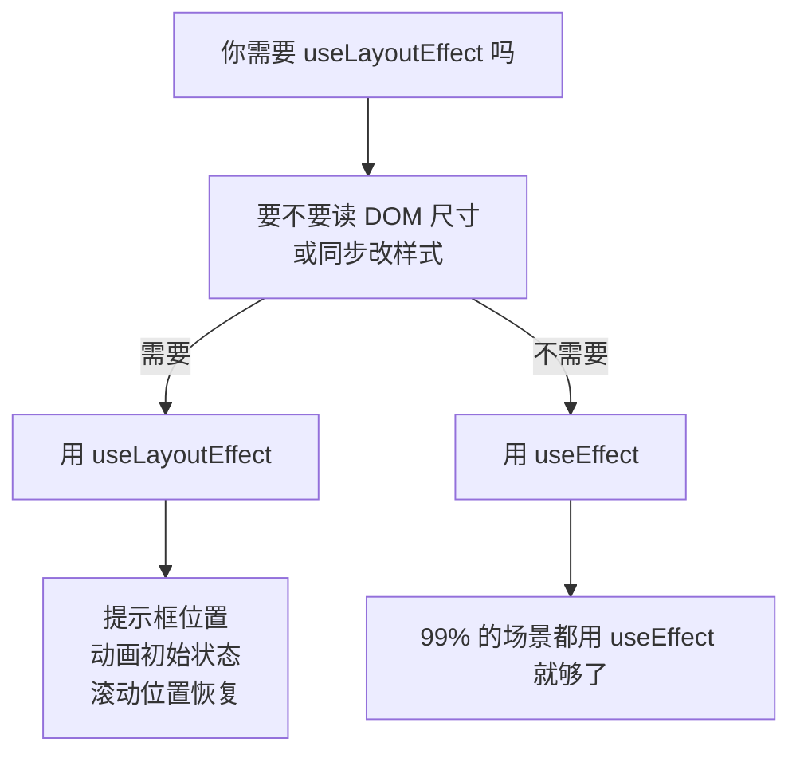
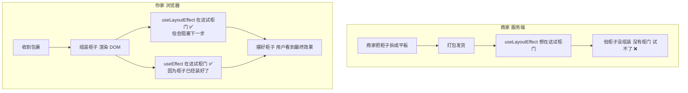
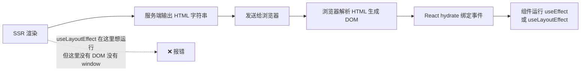
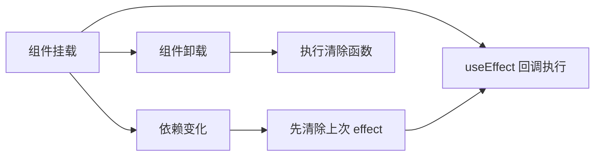

---

title: "useEffect vs useLayoutEffect"

created: "2025-07-12"

tags:

  - 八股文

  - react

  - react-ts-js

---

# useEffect vs useLayoutEffect

## 一句话先记

> **useEffect = 页面画完了再干活（不阻塞渲染）。useLayoutEffect = 页面画完之前先把活干完（阻塞渲染）。两者的区别就一个：执行时机不同。**

---

## 先搞懂——React 渲染流程

要理解这两个 hook 的区别，先搞懂 React 渲染一帧的过程：



**关键时间线：**

```text

React 更新 DOM → useLayoutEffect 执行 → 浏览器绘制屏幕 → useEffect 执行

                            ↑                              ↑

                      阻塞浏览器绘制                   不阻塞浏览器绘制

```

**类比：装修房子**

```text

你要装修一套房子：

1. 水电改造（React 更新 DOM）

2. 泥瓦工进场（浏览器绘制）

useLayoutEffect = 你站在旁边盯着，水电没改完不准泥瓦工进场（阻塞）

useEffect       = 你让泥瓦工先进场改，改完了再让水电工来（不阻塞）

```

---

## useEffect——"画完再说"

默认行为。等浏览器把页面画完了，**悄悄在后台执行**。



```typescript

function 用户列表() {

    const [数据, 设置数据] = useState([]);

    // ✅ 适合放这里：数据获取

    useEffect(() => {

        fetch('/api/users').then(res => res.json()).then(设置数据);

    }, []);  // 只跑一次

    // 等页面渲染完了，再去后台拿数据

    // 用户先看到空列表 → 数据加载完 → 列表刷新

    return <用户列表数据={数据} />;

}

```

**什么时候用：**

- 数据获取（fetch API）

- 订阅事件（addEventListener）

- 打日志、埋点

- 任何不需要用户"看到变化过程"的操作

---

## useLayoutEffect——"画之前改完"

在浏览器绘制屏幕之前执行，**会阻塞浏览器绘制**。



```typescript

function 工具提示({ 目标元素 }) {

    const 提示框 = useRef(null);

    // ✅ 适合放这里：需要测量 DOM 再调整

    useLayoutEffect(() => {

        const rect = 目标元素.getBoundingClientRect();

        // 根据位置计算提示框应该出现在上面还是下面

        提示框.current.style.top = rect.bottom + 8 + 'px';

        // 在浏览器绘制之前就调整好了位置

        // 用户看到的就是正确位置的提示框

    }, [目标元素]);

    return <div ref={提示框}>提示内容</div>;

}

```

**什么时候用：**

- 读取 DOM 尺寸/位置（getBoundingClientRect）

- 同步修改 DOM 样式

- 需要让用户"一眼看到最终效果"的场景

- 避免页面闪烁

---

## 核心区别一张图





| | useEffect | useLayoutEffect |

| --- | --- | --- |

| 执行时机 | 浏览器绘制之后 | 浏览器绘制之前 |

| 阻塞绘制 | ❌ 不阻塞 | ✅ 阻塞 |

| 用户体验 | 可能看到闪烁 | 一次性看到最终效果 |

| 性能影响 | 无（不阻塞帧） | 有（阻塞帧，可能导致卡顿） |

| 推荐场景 | API 请求、日志、事件绑定 | DOM 测量、样式调整 |

---

## 常见问题
### Q1：useLayoutEffect 什么时候真的需要？



具体场景：

```typescript

// 场景 1：恢复滚动位置

useLayoutEffect(() => {

    window.scrollTo(0, 保存的滚动位置);

}, [保存的滚动位置]);

// 场景 2：测量元素尺寸并调整样式

useLayoutEffect(() => {

    const width = 元素.current.offsetWidth;

    元素.current.style.left = width / 2 + 'px';

}, [依赖]);

```

### Q2：useLayoutEffect 会阻塞渲染，那不是性能更差吗？

会阻塞，但**只有需要时才用**。大多数场景 useEffect 就够了。

类比：

- useEffect = 外卖送错了，你吃完饭再找客服退（不饿肚子）

- useLayoutEffect = 外卖送错了，你在饭前打电话让店家重做（多等一会儿，但吃到的就是对的）

### Q3：服务端渲染（SSR）能用 useLayoutEffect 吗？

**不能用。** 原因就一句话：**服务端没有 DOM。**

**类比：网购柜子**

```text

你网购了一个柜子（组件），商家（服务端）把柜子拆成平板包装发给你（SSR 输出 HTML 字符串）。

包裹到了你家，你开始组装（浏览器 hydrate + 渲染）。

```



**为什么不行：**



**服务端（Node.js）没有 `window`、没有 `document`、没有 `getBoundingClientRect`。**

useLayoutEffect 里你要操作 DOM（量尺寸、调样式），但在服务端执行时，这些 API 全都不存在，直接报错。

**React 的处理方式：**

- 服务端渲染时，React 会忽略 useLayoutEffect

- 但会在控制台打印警告

- 某些操作（比如读了不存在的 `window.scrollY`）会直接报错

**解决方案：**

```typescript

// 方案 1：如果是 SSR 项目，默认用 useEffect

// useLayoutEffect 只在明确需要 DOM 操作时用

// 方案 2：动态选择

import { useEffect, useLayoutEffect } from 'react';

const 安全LayoutEffect = typeof window !== 'undefined'

    ? useLayoutEffect

    : useEffect;  // 服务端用 useEffect 代替

// 方案 3：只在客户端执行

useEffect(() => {

    // 确保在浏览器环境

    if (typeof window === 'undefined') return;

    // 这里才执行 DOM 操作

}, []);

```

**一句话记住：SSR 阶段没有浏览器 DOM，useLayoutEffect 强制需要 DOM，所以在 SSR 用不了。用 useEffect 代替，等浏览器渲染完了再干活。**

### Q4：useEffect 里的回调什么时候执行？



```typescript

useEffect(() => {

    console.log('挂载时执行');

    return () => {

        console.log('组件卸载或依赖变化时清除');

    };

}, [依赖]);

```

---

## 最佳实践

| 场景 | 用哪个 |

| --- | --- |

| 调 API 拿数据 | useEffect |

| 绑定 DOM 事件 | useEffect |

| 打日志 / 埋点 | useEffect |

| 读 DOM 尺寸 | **useLayoutEffect** |

| 同步改样式 | **useLayoutEffect** |

| 动画初始状态 | **useLayoutEffect** |

| 恢复滚动位置 | **useLayoutEffect** |

| 其他情况 | 默认 useEffect |

---

## 一句话总结

> **useEffect 画完再干活（不阻塞），useLayoutEffect 画之前干完活（阻塞）。99% 场景用 useEffect，只有在需要读 DOM 尺寸或改样式避免闪烁时才用 useLayoutEffect。**

## 速记卡（面试闪卡）

**Q1：一句话讲清「useEffect vs useLayoutEffect」到底是什么？**

A：useEffect 等浏览器画完再执行，useLayoutEffect 在绘制前同步执行并阻塞渲染。

**Q2：一句话先记 —— 怎么理解？**

A：像装修房子：水电改完（更新 DOM）后，useLayoutEffect 是"盯着工人改完才准泥瓦工进场"（阻塞绘制），useEffect 是"让泥瓦工先干，改完再叫水电工"（不阻塞）。两者唯一区别就是执行时机。

**Q3：先搞懂——React 渲染流程 —— 怎么理解？**

A：像一帧的生命线：React 更新 DOM →（useLayoutEffect 在此执行）→ 浏览器绘制 →（useEffect 在此执行）。关键就一句：useLayoutEffect 在绘制前、useEffect 在绘制后，差的就是"用户会不会先看到半成品"。

**Q4：useEffect——"画完再说" —— 怎么理解？**

A：像后台悄悄干活：等用户已经看到页面，再去 fetch 数据、绑事件、打日志。适合任何"用户不需要看到变化过程"的操作——数据获取、订阅、埋点都放这。

**Q5：useLayoutEffect——"画之前改完" —— 怎么理解？**

A：像画前量尺：在浏览器绘制前读 DOM 尺寸/位置（getBoundingClientRect）、同步改样式，用户一眼看到的就是最终效果，避免闪烁。适合提示框定位、滚动恢复、动画初态。

**Q6：核心速记主线有哪些？**

- 时机：useEffect 绘制后执行不阻塞；useLayoutEffect 绘制前执行阻塞

- 体验：useEffect 可能闪烁；useLayoutEffect 一次性看到终态

- 用途：数据/事件/日志用 useEffect；DOM 测量/样式用 useLayoutEffect

- SSR：服务端无 DOM，useLayoutEffect 用不了，改用 useEffect

**口诀**

A：useEffect 画完干，Layout 画前忙；

一个不阻塞，一个挡屏光；

量尺改样式，Layout 最在行；

SSR 无 DOM，Layout 让 useEffect。

## 相关链接

- 📋 目录：[[00-React]]

- 📚 学习清单：[[八股文学习路线图]]

