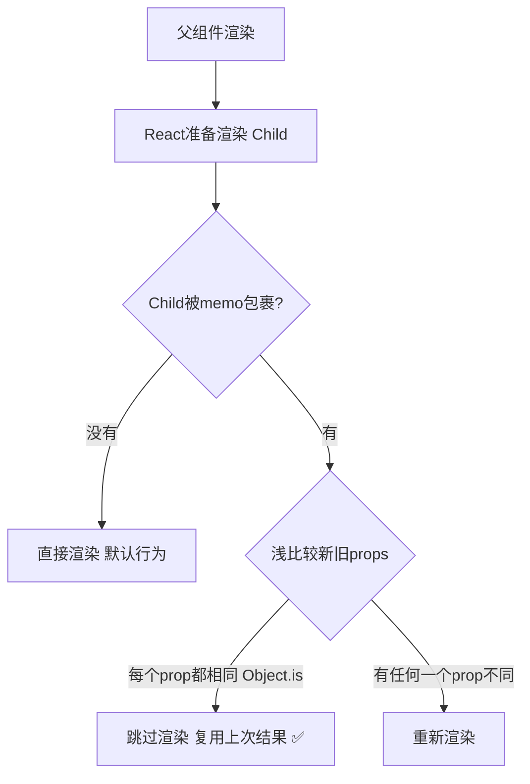

---

title: "React.memo浅比较盾牌"

created: "2025-07-12"

tags:

  - 八股文

  - react

  - react-ts-js

---

# React.memo浅比较盾牌

## 一、React.memo —— 给函数组件加一层"浅比较盾牌"
### 1.1 先看问题——为什么需要 React.memo？

React 的默认行为：**父组件重新渲染 → 所有子组件全部重新渲染**，即使子组件的 props 一个字都没变。

```tsx

// ❌ 没有 memo：父组件 state 变了，Child 即使 props 完全不变也会重新执行

function Parent() {

  const [count, setCount] = useState(0);

  const [name, setName] = useState("张三");  // 和 Child 毫无关系

  return (

    <div>

      <button onClick={() => setCount(count + 1)}>count: {count}</button>

      <Child name={name} />  {/* name 没变，但 Child 还是重新渲染了 */}

    </div>

  );

}

function Child({ name }: { name: string }) {

  console.log("Child 渲染了");  // 点一次按钮就打印一次——浪费

  return <div>{name}</div>;

}

```

**React 为什么这么设计？** 因为 React 不知道你的组件是不是"纯"的——它宁可多渲染一次，也不能漏掉更新。`React.memo` 就是你对 React 的承诺："我这个组件是纯的——props 不变，输出就不变，放心跳过。"

### 1.2 核心原理——浅比较 props

```tsx

// React.memo 包裹后：props 没变 → 跳过渲染

const Child = React.memo(function Child({ name }: { name: string }) {

  console.log("Child 渲染了");  // name 不变就不会打印

  return <div>{name}</div>;

});

```

**React.memo 做了什么**：



**第二个参数 `areEqual`**：默认用浅比较。你也可以传自定义比较函数：

```tsx

const Child = React.memo(

  function Child({ user }: { user: { name: string; age: number } }) {

    return <div>{user.name}, {user.age}</div>;

  },

  (prevProps, nextProps) => {

    // 返回 true = "相等，跳过渲染"；返回 false = "不等，重新渲染"

    // ⚠️ 注意：这个返回值语义和 shouldComponentUpdate 相反！

    return prevProps.user.name === nextProps.user.name

        && prevProps.user.age === nextProps.user.age;

  }

);

```

> **记忆技巧**：`areEqual` 返回 `true` → "确实相等（are equal）" → 跳过渲染。别写反了。

### 1.3 React.memo 失效的四种场景

> **常见**："memo 包裹的组件为什么还是会重新渲染？"

| # | 失效场景 | 根因 | 解法 |

| :---: | :--- | :--- | :--- |

| 1 | 父组件传了**新对象/数组** | 每次渲染创建新引用，浅比较认为 props 变了 | `useMemo` 缓存对象/数组 |

| 2 | 父组件传了**新函数** | 每次渲染创建新函数，引用不同 | `useCallback` 缓存函数 |

| 3 | 子组件**消费了 Context** | memo 只比较 props，不管 context | 拆分组件——把 context 消费上移到 wrapper |

| 4 | 子组件内部有 **useState / useReducer** | 自身的 state 更新触发自身重渲染，memo 拦不住 | 正常的——自身状态当然要渲染 |

**场景 1 详解——对象引用陷阱**：

```tsx

// ❌ 父组件每次渲染都创建新的 style 对象 → memo 失效

function Parent() {

  const [count, setCount] = useState(0);

  return (

    <div>

      <button onClick={() => setCount(count + 1)}>+1</button>

      <Child style={{ color: "red" }} />  {/* ⚠️ 每次渲染都是新对象！*/}

    </div>

  );

}

const Child = React.memo(function Child({ style }: { style: object }) {

  console.log("还是会打印——因为 {} !== {}");  // 浅比较：两个不同对象 → 不等

  return <div style={style}>hello</div>;

});

```

```tsx

// ✅ 用 useMemo 固定对象引用

function Parent() {

  const [count, setCount] = useState(0);

  const style = useMemo(() => ({ color: "red" }), []);  // 引用永远不变

  return (

    <div>

      <button onClick={() => setCount(count + 1)}>+1</button>

      <Child style={style} />  {/* style 引用不变 → memo 生效 ✅ */}

    </div>

  );

}

```

> **一句话**：React.memo 是盾牌，但只挡"值没变的 props"。对象/数组/函数每次渲染都是新引用——盾牌认不出它们是"旧朋友"，照样放行。解法就是用 useMemo / useCallback 把这些引用固定住。

---

## 速记卡（面试闪卡）

**Q1：一句话讲清「React.memo浅比较盾牌」到底是什么？**

A：React.memo 给函数组件包一层浅比较盾牌：父重渲染时，若 props 用 Object.is 逐项相等就跳过子组件重渲染，避免无效计算。

**Q2：为什么需要 React.memo —— 怎么理解？**

A：React 默认父一渲染所有子全渲染，哪怕子 props 一字没变。因为它不知道组件纯不纯，宁可多渲一次也不漏更新。memo 是你向 React 承诺"我这个组件纯的——props 不变输出就不变"，放心跳过。

**Q3：核心原理：浅比较 props —— 怎么理解？**

A：memo 包裹后，新旧 props 用 Object.is 逐个比：全相同就复用上次结果跳过渲染；任一项不同就重渲。还可传第二参数 areEqual 自定义比较——返回 true 表示"相等跳过"，语义和 shouldComponentUpdate 相反，别写反。

**Q4：失效的四种场景 —— 怎么理解？**

A：盾牌只挡"值没变的 props"。①传新对象/数组：每次渲染新引用，浅比认为变了→useMemo 固定；②传新函数→useCallback；③子消费 Context：memo 不管 context，要上移拆分；④子自身有 state：自己更新 memo 拦不住，本就该渲。

**Q5：一句话总结 —— 怎么理解？**

A：memo 是盾牌但只认值没变的 props。对象/数组/函数每次渲染都是新引用，盾牌认不出是"旧朋友"照样放行。解法就是用 useMemo/useCallback 把这些引用钉死，让浅比较能认出"没变"。

**Q6：核心速记主线有哪些？**

- 默认行为：父渲染所有子全渲染，memo 跳过纯组件

- 原理：props 浅比较（Object.is），全相等才跳过

- areEqual：自定义比较，true=跳过，语义反直觉

- 失效：新对象/新函数/Context/自身 state 四种

- 解法：useMemo/useCallback 固定引用

**口诀**

A：React.memo 浅比较，父渲子跳省开销；

Object.is 逐项比，全等跳过不同渲；

对象函数新引用，盾牌认不出旧貌；

useMemo 钉引用，四种失效全绕。

## 相关链接

- 📋 目录：[[00-React]]

- 📚 学习清单：[[八股文学习路线图]]

