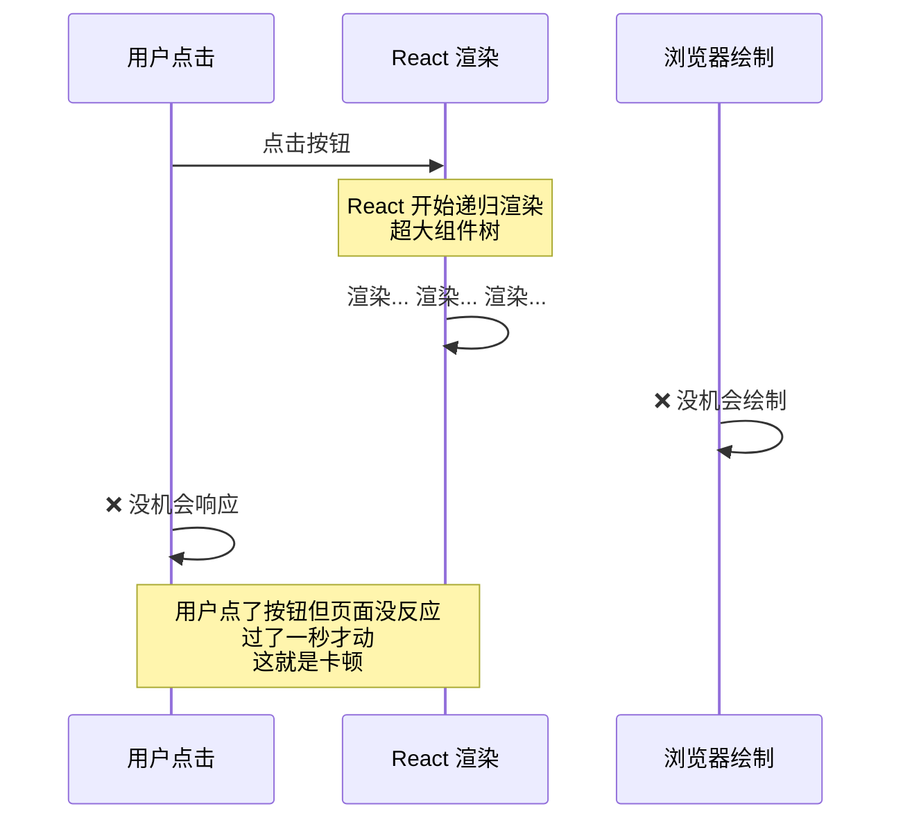
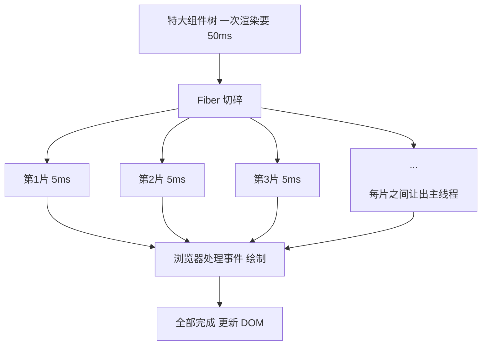
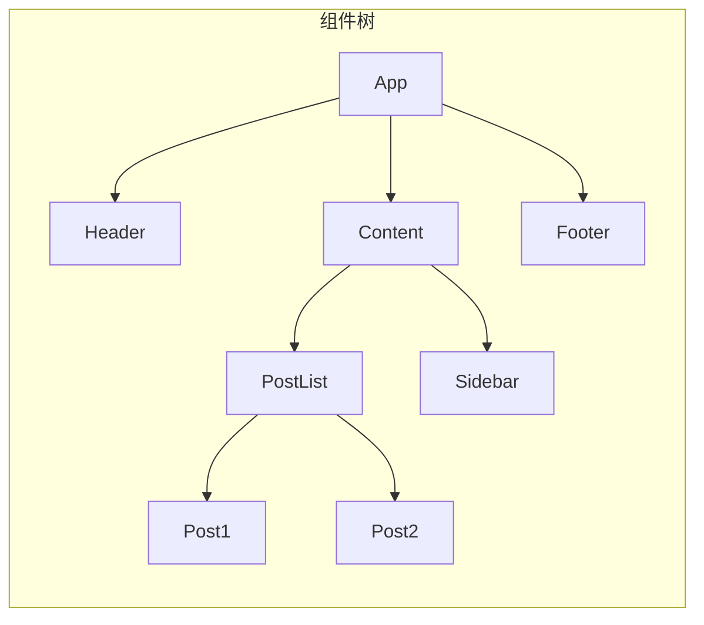
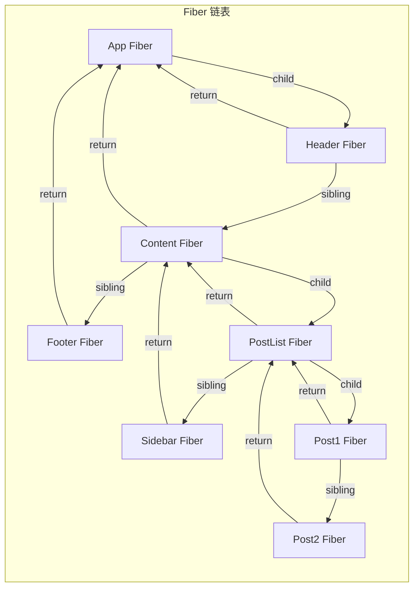
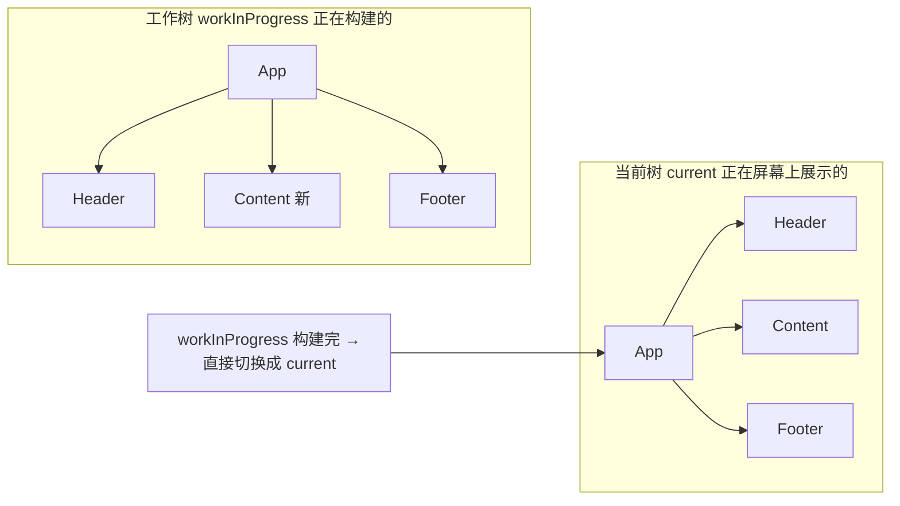
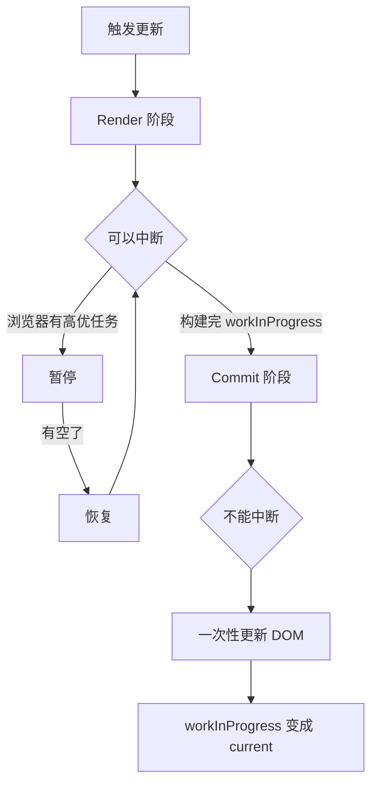
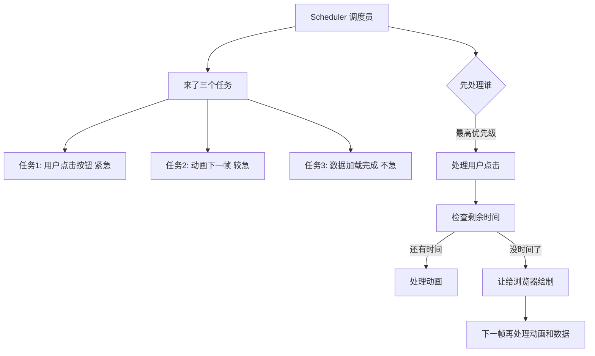
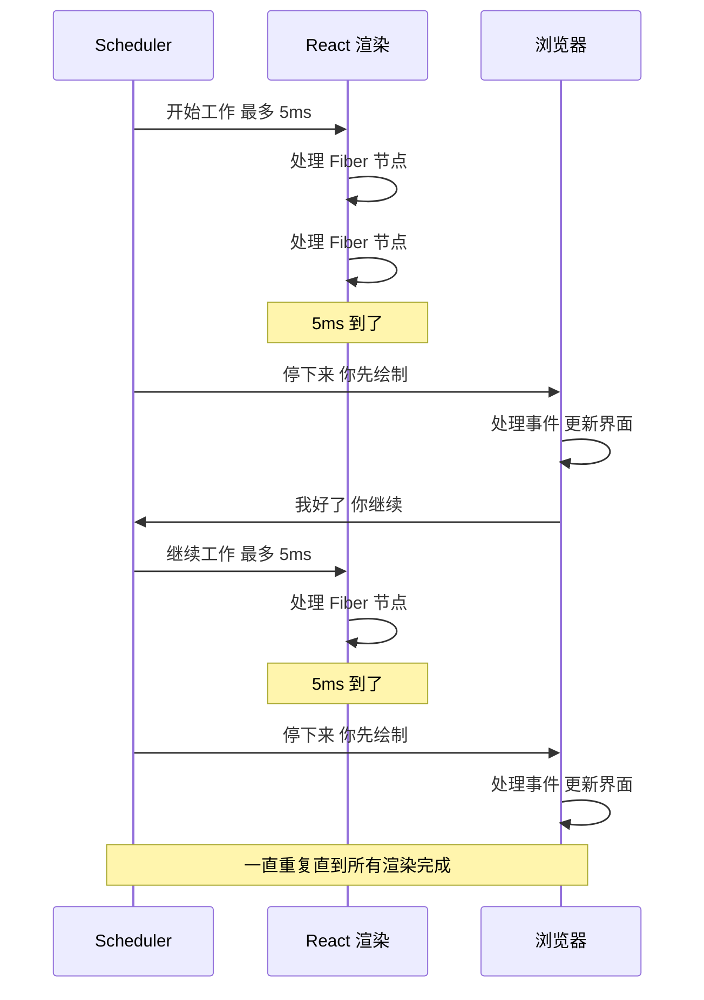
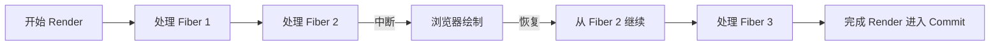
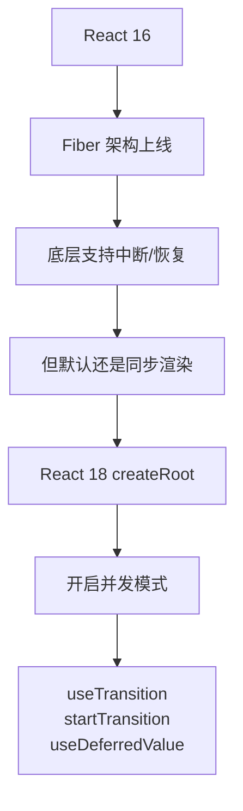

---

title: "React Fiber 架构 + Scheduler 调度"

created: "2025-07-12"

tags:

  - 八股文

  - react

  - react-ts-js

---

# React Fiber 架构 + Scheduler 调度

## 一句话先记

> **Fiber = React 把渲染拆成"一粒一粒"的工作单元，每粒干完都可以停下来让浏览器去做别的事。Scheduler = 决定"哪一粒先干、哪一粒可以插队"的调度员。**

---

## 先搞懂——旧版 React 有什么问题？

React 16 之前用的是**栈协调器（Stack Reconciler）**。


**问题：一旦开始遍历，就算到死。**



**类比：坐长途火车**

```text

你坐一趟火车从北京到广州（渲染超大组件树）。

火车一旦发车，中途不停。

你想上厕所（用户点击）？忍着！

你想喝水（浏览器绘制）？等着！

必须到站（渲染完成）才能动。

那是绿皮车时代了。

```

---

## Fiber 的思想——把大任务切碎



**类比：公交车 vs 火车**

```text

旧版（Stack Reconciler）  = 火车：发车就不停，到站才开门

新版（Fiber Reconciler）   = 公交车：每站停，有人上车（高优任务）还可以插队

```

**Fiber 就是"每站"——每个组件对应一个 Fiber 节点，节点之间通过链表连接，可以随时暂停、继续、中断。**

---

## Fiber 的核心——链表

Fiber 是个普通的 JS 对象，代表**一个工作单元**。



每个组件对应一个 Fiber 节点。节点之间用**链表**连接，不是递归。



**三个指针：**

- `child` → 第一个子节点

- `sibling` → 下一个兄弟节点

- `return` → 父节点

**有了链表，Fiber 可以：**

1. 从任意节点暂停 → 记住当前位置

2. 去做别的事 → 回来从断点继续

3. 放弃当前工作 → 从头开始

**类比：读书 vs 翻字典**

```text

Stack（递归） = 读书：你必须从第 1 页读到第 100 页，中间不能停

Fiber（链表） = 翻字典：你查"Fiber"这个词 → 看到链接"参考 React 协调" →

               先去查"React 协调" → 回来继续看"Fiber" → 随时可以合上书去接电话

```

---

## 双缓冲——两棵树

Fiber 同时维护**两棵树**：



| 树 | 作用 |
| --- | --- |
| current | 当前屏幕上展示的，用户正在看的 |
| workInProgress | 正在内存里构建的新版本，用户看不见 |

**当 workInProgress 构建完成后，一次指针切换就变成 current。用户瞬间看到新界面。**

**类比：舞台换幕**

```text

舞台上正在演第一幕（current tree）。

后台同时在搭建第二幕的布景（workInProgress tree）。

第一幕演完，幕布一拉，第二幕直接展示在观众面前。

中间没有空档期。

```

---

## 两阶段：Render + Commit



| 阶段 | 干什么 | 能不能中断 |
| --- | --- | --- |
| Render | 构建 workInProgress 树，算出差分 | ✅ 可以中断、恢复、放弃 |
| Commit | 把差分一次性更新到真实 DOM | ❌ 必须一口气干完 |

**Render 阶段 = 你在纸上画设计图，画错了可以擦掉重画，画一半可以去喝口水。**

**Commit 阶段 = 你照着设计图开始装修了，墙都敲了不能停，必须一口气装完。**

---

## Scheduler——调度员

Scheduler 是 Fiber 架构的"大脑"，决定：

1. **谁先干**（优先级调度）

2. **干多久**（时间切片）

3. **什么时候停**（让出主线程）



### 时间切片

Scheduler 把渲染任务切成 **5ms 一小片**。



**类比：番茄工作法**

```text

你学习（渲染）的时候用番茄钟：

学 5 分钟 → 休息 1 分钟（浏览器绘制）

学 5 分钟 → 休息 1 分钟

...

这就是时间切片。5ms ≈ 番茄钟的 5 分钟。

```

### 优先级（Lane）

React 把更新分成不同优先级车道（Lane）：

| 优先级 | 场景 | 例子 |
| --- | --- | --- |
| 最高 | 用户输入 | 打字、点击、触摸 |
| 高 | 动画 | requestAnimationFrame |
| 中 | 普通更新 | 数据加载完成后的渲染 |
| 低 | 预加载 | 提前渲染未显示的内容 |
| 最低 | 空闲时做 | 日志上报、分析 |

**类比：医院急诊分诊**

```text

急诊室（Scheduler）来了几个病人：

1. 心梗（用户点击）→ 立刻抢救 ✅ 最高优先级

2. 骨折（动画）→ 马上处理 ✅ 次高

3. 感冒（数据加载）→ 排队等 ⏳ 低优先级

4. 体检报告（日志上报）→ 有空再看 🕐 最低优先级

```

---

## 常见问题
### Q1：Fiber 到底解决了什么核心问题？

**解决了一个问题：渲染不阻塞主线程。**

旧版是递归，开始就不能停。

新版是切碎 + 调度，每片之间让出主线程处理事件和绘制。

### Q2：Fiber 节点里有什么？

```typescript

{

    type: 'div' | 组件函数,      // 节点类型

    key: 'xxx',                   // 唯一标识

    stateNode: 真实DOM,           // 对应的真实 DOM

    child: Fiber | null,          // 第一个子节点

    sibling: Fiber | null,        // 下一个兄弟节点

    return: Fiber | null,         // 父节点

    pendingProps: {},             // 新 props

    memoizedProps: {},            // 上次的 props

    memoizedState: {},            // 当前 state

    effectTag: 'UPDATE' | 'PLACEMENT' | 'DELETION',  // 要做什么

    nextEffect: Fiber | null,     // 下一个要提交的节点

    lanes: number,                // 优先级

    alternate: Fiber | null,      // 指向另一棵树的对应节点

}

```

### Q3：Render 阶段可以中断，那中断了怎么办？

Scheduler 会记录**当前处理到哪个 Fiber 节点**。



如果中断后来了更高优的任务，之前的工作直接放弃，从头开始新的 Render。

### Q4：为什么 Commit 阶段不能中断？

因为 **DOM 操作必须连续**。

你改了元素的 class，下一行就要把元素高度改了——如果这两行之间停了一下，用户可能看到半个过渡状态。

Commit 阶段是一次性的 DOM 操作批处理，**要么全改，要么不改**，不存在"改了一半"。

### Q5：React 18 的并发模式跟 Fiber 什么关系？

**并发模式 = Fiber 能力的暴露。**

Fiber 架构在 React 16 就实现了，但默认不开启并发特性。React 18 的 `createRoot` 才正式打开。



### Q6：requestIdleCallback 和 Scheduler 的关系？

浏览器有 `requestIdleCallback` 可以"等空闲时执行"。但 React 没用它，而是**自己实现了 Scheduler**。

原因：

- requestIdleCallback 触发频率不够（50ms 一次）

- React 需要精确控制 5ms 时间片

- requestIdleCallback 兼容性不好

---

## 一句话总结

> **Fiber = 把渲染切成可中断的小片，链表连接可恢复。Scheduler = 分优先级 + 5ms 时间片，保证高优任务插队。双缓冲 = 内存里建好新树，一次切换。学习重点：为什么需要 Fiber（递归不可中断→卡顿）、怎么做到的（链表+双缓冲+时间片）。**

## 速记卡（面试闪卡）

**Q1：一句话讲清「React Fiber 架构 + Scheduler 调度」到底是什么？**

A：旧Stack Reconciler递归到底占满主线程致卡顿；Fiber把渲染拆成可中断的工作单元，Scheduler按优先级调度，让出主线程保证响应——这是React 16性能基石。

**Q2：旧栈协调器：火车不停站 —— 怎么理解？**

A：Stack Reconciler 像一趟不停站的长途火车：开始递归遍历组件树就一口气算到底才更新 DOM，期间主线程（Main Thread）被占满，用户点击、动画全没机会执行——就是卡顿根源。

**Q3：Fiber：把活拆成一粒粒 —— 怎么理解？**

A：Fiber（纤维）是 React 16 引入的调度单元：把整棵树的渲染拆成"一粒粒"工作单元（Work Unit），每粒干完可以暂停、让浏览器去绘制或响应交互，之后再接着干——可中断、可恢复。

**Q4：Scheduler：哪一粒先干 —— 怎么理解？**

A：Scheduler（调度器）决定工作单元的优先级和执行时机：用户输入、动画等高分任务插队先跑，低分任务（如离屏渲染）往后排。它用 MessageChannel 把任务切成帧，避免长期占主线程。

**Q5：双缓存与提交：切好后一次性贴 —— 怎么理解？**

A：Fiber 用双缓存树（Current/WorkInProgress）在内存里先建好新树，全就绪后一次性"提交（Commit）"到 DOM——用户看不到中间态，避免渲染到一半的闪烁，保证 UI 一致性。

**Q6：核心速记主线有哪些？**

- Stack Reconciler 递归到底占主线程致卡顿

- Fiber 拆工作单元，可中断让出主线程

- Scheduler 按优先级调度，高优先任务插队

- 双缓存树就绪后一次性提交，避免闪烁

**口诀**

A：旧版递归卡到站

Fiber 切粒可中断

调度按优先级排

双树就绪一次换

## 相关链接

- 📋 目录：[[00-React]]

- 📚 学习清单：[[八股文学习路线图]]

- 🔗 [[计算机基础/操作系统/01-进程vs线程vs协程对比|进程vs线程vs协程]] — Fiber是React用户态的"协程"

- 🔗 [[语言与框架/TypeScript-React/八股/JavaScript/16-事件循环EventLoop|JS事件循环EventLoop]] — Fiber调度器与事件循环的配合

- 🔗 [[计算机基础/操作系统/04-进程调度算法|进程调度算法]] — Fiber调度借鉴了OS调度算法的思想

