---

title: "状态管理：Context / Redux / Zustand 对比"

created: "2025-07-12"

tags:

  - 八股文

  - react

  - react-ts-js

---

# 状态管理：Context / Redux / Zustand 对比

## 一句话先记

> **Context = React 自带的大喇叭，简单但一喊全村都听到。Redux = 公司 OA 系统，规范严谨但流程巨长。Zustand = 微信群聊，拉几个人、发几条消息，完事。**

---

## 先搞懂——为什么需要状态管理？

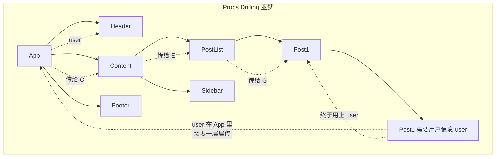

**问题：组件 A 里的数据，要传到深层组件 H，中间每个组件都得帮传（即使它们自己不用）。**

**状态管理要解决三件事：**

1. **跨层级共享** —— 别让我层层传 props

2. **响应式更新** —— 数据变了，用到它的组件自动更新

3. **可预测维护** —— 不乱改、好调试

---

## 先搞懂——Provider 是什么？

Provider 的概念贯穿 Context 和 Redux。Zustand 牛逼的一个点就是**不需要 Provider**。

### Provider = 信号发射器

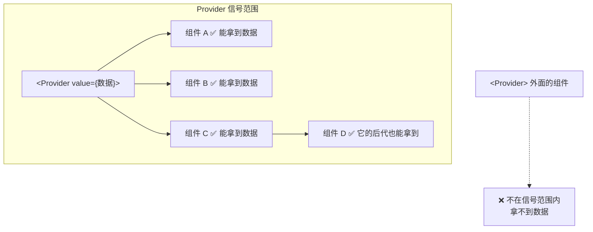

**类比：WiFi 路由器**

```text

Provider = 你家客厅的路由器（WiFi）。

在路由器信号范围内（Provider 包裹的组件树）：

  - 客厅、卧室、书房都能连上 WiFi（都能拿到数据）

不在信号范围内：

  - 出了小区，连不上了（拿不到数据）

Context 和 Redux 都需要先装路由器（加 Provider），设备才能联网。

Zustand = 直接用手机流量，不需要 WiFi 路由器。

```

**一句话：Provider = 把数据"注入"组件树的入口。它的后代组件才能访问这些数据。Zustand 不需要是因为它把数据存在 JS 模块里，组件 import 就能用，不依赖组件树位置。**

---

## Context——React 自带的大喇叭
## Redux——公司 OA 系统
## Zustand——微信群聊
### 原理

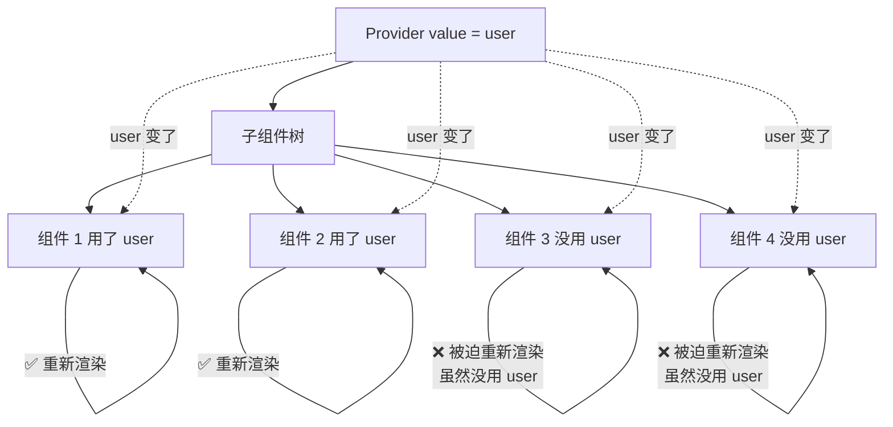

**核心：Provider 的 value 变了，所有 consumer 都重新渲染。不管它用没用那个值。**

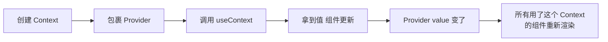

**类比：村口大喇叭**

```text

村里装了广播大喇叭（Provider）。

村长喊："今晚有暴雨！"（value 更新）。

全村 1000 户都听到了。

但——有 300 户其实在屋外，自己能看见下雨（不需要广播）。

但它们也被吵到了（被迫重渲染）。

```

### 问题

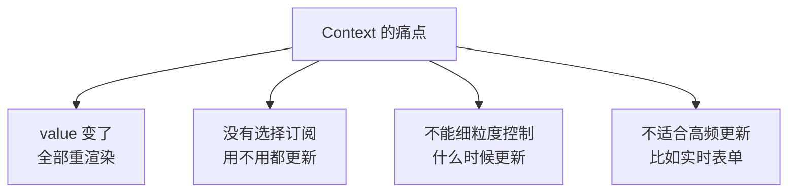

### 什么时候用 Context？

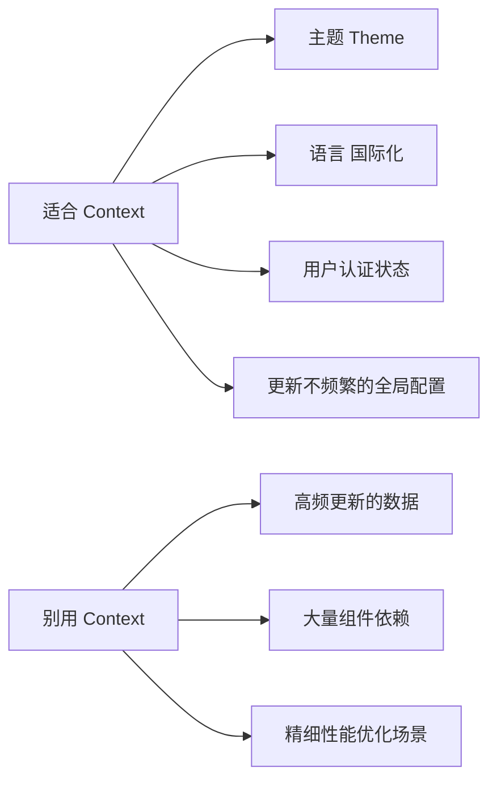

**一句话：Context 是"够用就好"的方案。频率不高、范围不大、简单场景，用 Context 就行。别硬上 Redux。**

---

### 原理

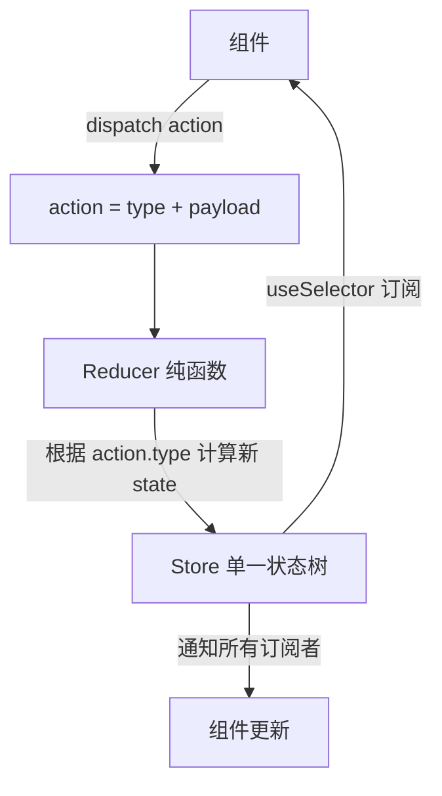

**四个核心概念：**

| 概念 | 说人话 |
| --- | --- |
| Store | 唯一的"中央数据库" |
| Action | 你提交的"申请单"：`{ type: 'ADD_TODO', payload: '写笔记' }` |
| Reducer | 审批流程：看到 ADD_TODO → 往列表加一项 |
| Dispatch | 你把申请单交到前台的动作 |

### 类比：公司 OA 系统

```text

你想申请一台新电脑（更新状态）。

1. 你填申请表（Action）：{"申请类型": "采购电脑", "型号": "MacBook"}

2. 你提交给前台（Dispatch）

3. OA 流程开始跑（Reducer 处理）：

   - 经理审批：预算够 → 通过

   - 财务审批：有钱 → 通过

   - IT 采购：下单

4. 电脑到了，通知你来领（Store 更新 → 组件重新渲染）

每一步都是可预测的、可追踪的、可回放的。

谁在哪一步改了什么，一查日志就知道。

```

### 数据流

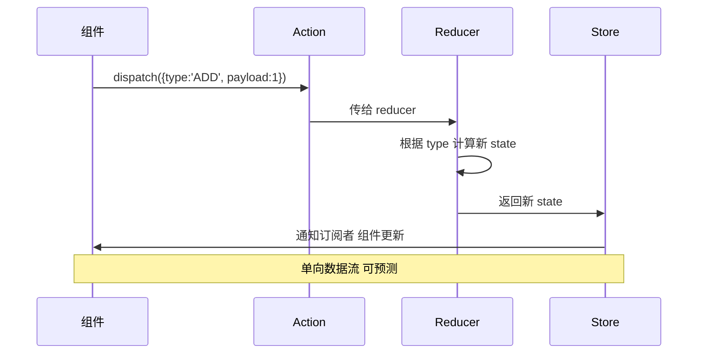

### 问题

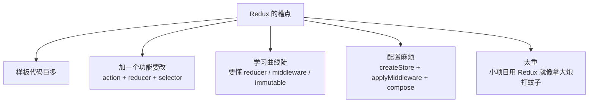

### 什么时候用 Redux？

✅ **适合：**

- 大型项目，几十上百个组件共享状态

- 复杂状态逻辑（多步操作、状态依赖）

- 需要中间件处理副作用（redux-saga / redux-thunk）

- 需要时间旅行调试（DevTools）

- 团队多人协作，需要"规矩"来约束

❌ **别用：**

- 小项目、简单场景

- 只有 1-2 个组件需要共享一点点数据

- 团队不想写模板代码

---

### 原理

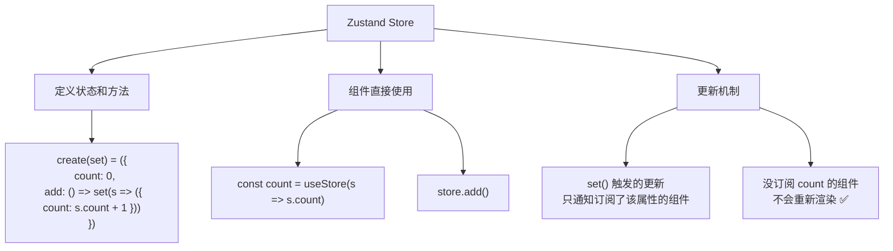

**核心优势：不需要 Provider，不需要包裹整个应用树。**

```typescript

// 全部代码就这么多

import { create } from 'zustand';

const useStore = create((set) => ({

    count: 0,

    add: () => set((state) => ({ count: state.count + 1 })),

    reset: () => set({ count: 0 }),

}));

// 组件里用

function Counter() {

    const count = useStore((s) => s.count);

    const add = useStore((s) => s.add);

    return <button onClick={add}>{count}</button>;

}

```

**对比 Redux 同功能：**

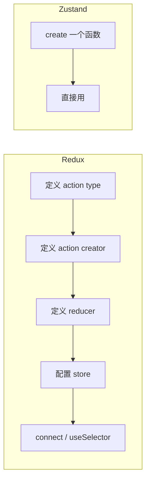

### 类比：微信群聊

```text

你需要几个人（组件）同步一个消息（状态）。

Context = 拉了个全员大群，1000 人都在里面，发一条消息所有人手机都响。

Redux = 走 OA 系统，写申请 → 审批 → 归档，每一步都有记录。

Zustand = 拉了 3 个人的小群。"明天几点开会？" "三点。" "收到。"

谁需要谁进群。不打扰无关的人。

不需要提前建群（Provider）。不需要写审批单（action + reducer）。

```

### 三个方案对比

| 维度 | Context | Redux | Zustand |
| --- | --- | --- | --- |
| Provider | 需要 | 需要 | **不需要** |
| 样板代码 | 少 | 很多 | **极少** |
| 选择订阅 | ❌ 全量通知 | ✅ selector 控制 | ✅ selector 控制 |
| 不可变更新 | 手动保证 | reducer 自带 | **自动合并** |
| 中间件 | 无 | saga / thunk / logger | immer / devtools / persist |
| 学习成本 | 零 | 高 | **低** |
| 适合场景 | 简单低频共享 | 大型复杂项目 | 中小型 + 不想写模板 |
| 包大小 | 0（内置） | ~12KB | ~2KB |

### Zustand 的"选择订阅"有多重要？

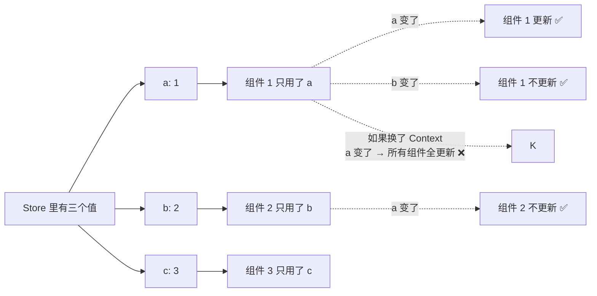

**这就是 Zustand 的名字来源：德语"zustand" = "状态"。你只拿你要的部分，不多渲染。**

---

## 常见问题
### Q1：Context 的"全部重渲染"问题有办法解决吗？

有，但都是"曲线救国"：

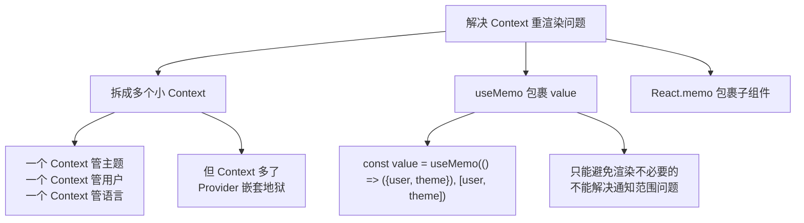

**但说到底，Context 的设计就是"广播"——你很难让它只通知一部分人。所以高频更新场景还是得上 Zustand 或 Redux。**

### Q2：Redux 和 Zustand 的更新机制有什么不同？

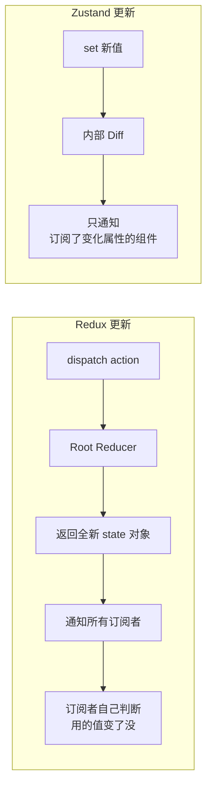

Redux 是"**推送 + 订阅者自查**"——不管订阅者用不用，先通知再说。

Zustand 是"**谁订阅谁收到**"——没用到的组件根本收不到通知。

### Q3：Zustand 不需要 Provider，那数据存在哪？

存在 JS 模块级变量里（闭包）。组件直接 import 就能用。

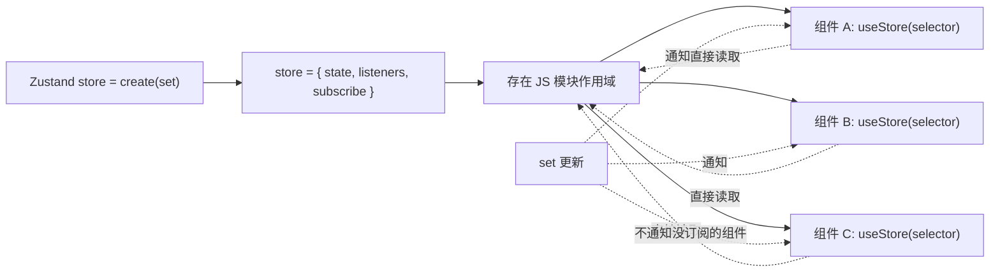

**不需要 Provider 是因为 Zustand 根本不依赖 React 的组件树。它是独立的状态容器，通过 hooks 跟组件桥接。**

### Q4：到底选哪个？

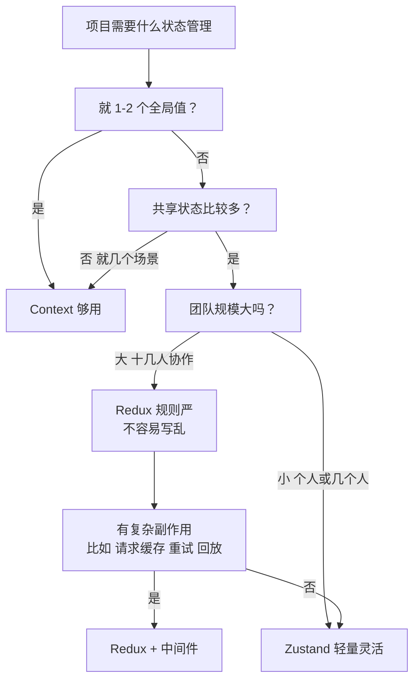

**个人建议（用）：**

```text

个人/小团队/中小型项目 → Zustand（最佳性价比）

大型项目/团队协作/需要规矩 → Redux Toolkit（现代 Redux，样板少了）

简单低频共享 → Context（不用装包，够用就行）

```

---

## 一句话总结

> **Context = 大喇叭，简单广播但覆盖所有人。Redux = OA 系统，规范可追踪但流程长。Zustand = 微信群，谁需要拉谁，精确通知不打扰。学习重点：会不会全量通知（Context 的痛点）、选择订阅（Zustand 的优势）、是否需要规矩约束（Redux 的适用场景）。**

## 速记卡（面试闪卡）

**Q1：一句话讲清「状态管理：Context / Redux / Zustand 对比」到底是什么？**

A：Context 是全村大喇叭、Redux 是公司 OA、Zustand 是微信群——三种前端状态管理，广播范围与规矩轻重各不相同。

**Q2：为什么需要状态管理 —— 怎么理解？**

A：组件 A 的数据要传给深层组件 H，中间每层都得帮忙传（props drilling，像击鼓传花传到手酸）。状态管理解决三件事：跨层级共享（别层层传）、响应式更新（数据变自动刷）、可预测维护（不乱改好调试）。本质就是"把共享数据搬出组件树，谁要谁拿"。

**Q3：Provider 是什么，像什么 —— 怎么理解？**

A：Provider 像 WiFi 路由器：在它信号覆盖的组件树里都能连上数据，出了范围就连不上。Context 和 Redux 都要先装路由器（包 Provider），Zustand 牛在不用——它把数据存在 JS 模块里，组件 import 直接拿，不依赖组件树位置（像直接用手机流量，不用路由器）。

**Q4：Context 的痛点 —— 怎么理解？**

A：Context 像村口大喇叭：村长喊一声暴雨，全村 1000 户全听见——包括那 300 户在屋外本来能看见下雨的，也被吵得重渲染。value 一变，所有 consumer 不论用没用都更新，没法细粒度订阅。所以高频更新（如实时表单）场景别用 Context，得上 Zustand/Redux。

**Q5：三者怎么选 —— 怎么理解？**

A：简单低频共享（主题、语言、登录态）→ Context 够用别硬上 Redux；大型项目十几人协作、要规矩可追踪、有复杂副作用 → Redux（或 Redux Toolkit）；个人/小团队/中小型、不想写模板 → Zustand 性价比最高。门槛：Provider(Context/Redux 要) vs 不需要(Zustand)、样板代码(多/极少)、选择订阅(全量/精准)。

**Q6：核心速记主线有哪些？**

- Context：大喇叭，简单广播但全覆盖、高频更新会卡

- Redux：OA 系统，规范可追踪但样板多流程长

- Zustand：微信群，谁订阅谁收到、无需 Provider

- 选型：低频用 Context、大项目用 Redux、中小用 Zustand

**口诀**

A：Context 大喇叭，一喊全村都听到

Redux 走 OA，规范可追流程长

Zustand 微信群，谁订阅谁收到

低频 Context 大项目 Redux，中小 Zustand 香

## 相关链接

- 📋 目录：[[00-React]]

- 📚 学习清单：[[八股文学习路线图]]

