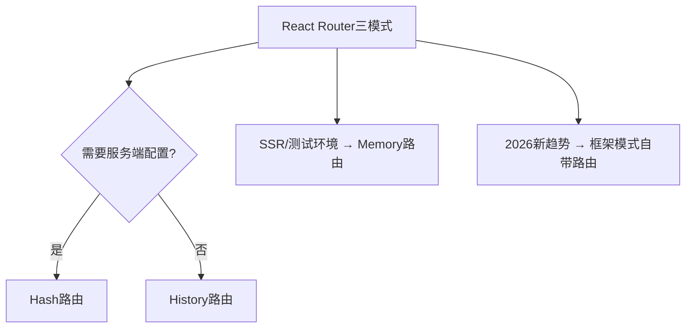
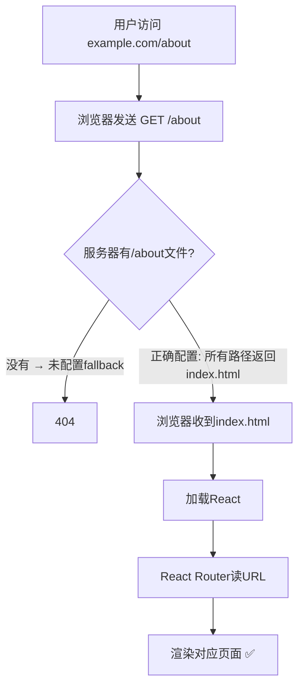
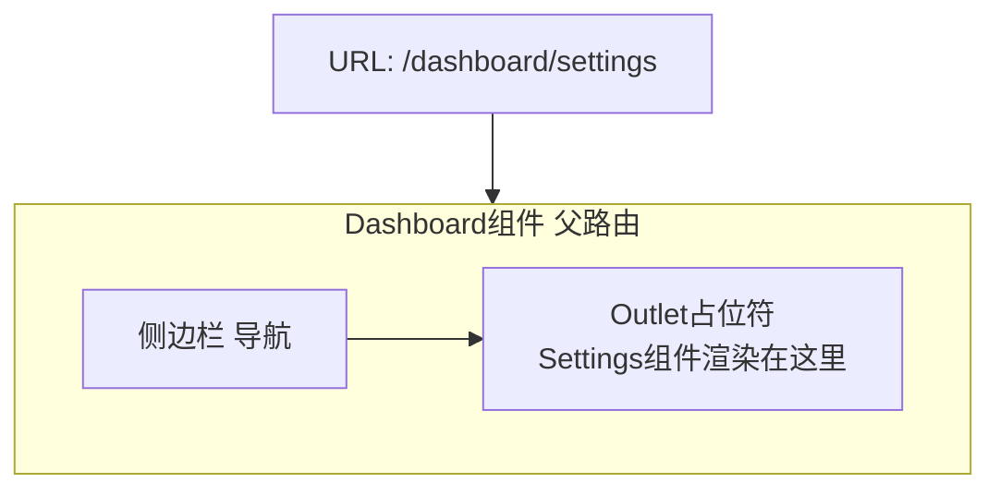
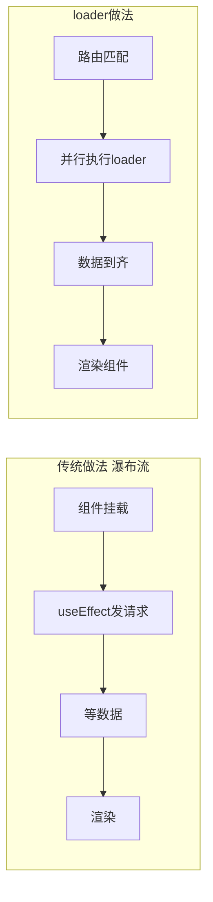
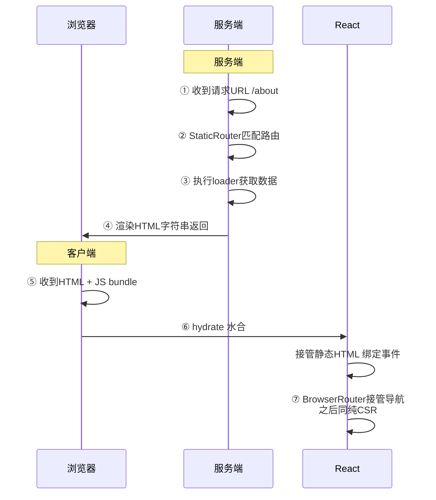

---

title: "React Router原理"

created: "2025-07-12"

tags:

  - 八股文

  - react

  - react-ts-js

---

# React Router原理

## 六、React Router 原理


> React 是单页应用（SPA）——只有一个 `index.html`。点链接不刷新页面却能切换内容——这背后是 Router 在拦截浏览器的默认行为，用 JS 模拟"页面切换"。


### 6.1 三种路由模式





| | Hash 路由 | History 路由 | Memory 路由 |


| :--- | :--- | :--- | :--- |


| URL 样子 | `example.com/#/about` | `example.com/about` | 不体现 URL / 自定义 |


| 底层 API | `hashchange` 事件 | `history.pushState` + `popstate` | 内存中的栈 |


| `#` 后的内容发到服务端？ | ❌ 不发——服务器只看到 `/` | ✅ 发——服务器看到 `/about` | N/A |


| 需要服务端配置？ | ❌ 不需要 | ✅ 需要——所有路径 fallback 到 `index.html` | ❌ 不需要 |


| 刷新 `example.com/about` | 实际访问 `example.com/` → 前端读 hash → 路由到 about | 服务端收到 `/about` 请求 → fallback 到 `index.html` → 前端路由到 about | 刷新后状态丢失 |


| 什么时候用 | 静态部署、无需服务端控制 | 正式生产环境（SEO + 美观） | SSR、测试、非浏览器环境 |


**History 路由为什么需要服务端配置？**





```nginx


# Nginx 典型配置


location / {


    try_files $uri $uri/ /index.html;  # 找不到文件就返回 index.html


}


```


### 6.2 React Router "页面不刷新"是怎么做到的？


```tsx


// React Router 内部逻辑（简化）：


// ① 拦截 <Link> 的点击事件


<Link to="/about">关于</Link>


// 实际渲染的是 <a href="/about">，但点击时：


//   event.preventDefault()  ← 阻止浏览器默认跳转


//   history.pushState(null, '', '/about')  ← 只改 URL 栏，不发请求


//   React 更新匹配到的路由组件 ← 触发重新渲染，显示新页面内容


// ② 监听浏览器的前进/后退按钮


window.addEventListener('popstate', () => {


  // 用户点了前进/后退 → URL 变了 → 重新匹配路由 → 渲染对应组件


});


```


> **一句话**：拦截 `<a>` 的默认行为 + `history.pushState` 改 URL + React 状态更新触发组件切换。三件套实现"换页面不刷新"。


### 6.3 React Router v7 三种使用模式（2026 重点）


> v7 = React Router + Remix 的统一。一个可能的问题是："v7 有哪些使用模式？"


| 模式 | 怎么写 | 特点 | 适合 |


| :--- | :--- | :--- | :--- |


| **声明式**（Declarative） | `<BrowserRouter>` + `<Routes>` + `<Route>` | 最简单——纯组件写法 | 小项目、快速原型 |


| **数据模式**（Data/Library） | `createBrowserRouter` + `RouterProvider` | 带 loader / action 数据加载 | 需要数据预取的中大型项目 |


| **框架模式**（Framework） | 文件系统路由 + 自动 SSR + 自动代码分割 | 完整框架——约定大于配置 | 生产级全栈应用 |


```tsx


// 模式 1：声明式（你目前学的）


function App() {


  return (


    <BrowserRouter>


      <Routes>


        <Route path="/" element={<Home />} />


        <Route path="/about" element={<About />} />


      </Routes>


    </BrowserRouter>


  );


}


// 模式 2：数据模式（进阶亮点——了解即可）


const router = createBrowserRouter([


  {


    path: "/",


    element: <Home />,


    loader: () => fetch("/api/posts"),     // 渲染前自动 fetch 数据


  },


  {


    path: "/post/:id",


    element: <Post />,


    loader: ({ params }) => fetch(`/api/posts/${params.id}`),


    action: ({ request }) => { /* 处理表单提交 */ },


  },


]);


function App() {


  return <RouterProvider router={router} />;


}


```


### 6.4 嵌套路由 + Outlet


> **高频考点**。`<Outlet />` 是嵌套路由的核心——父路由组件里的"占位符"。





```tsx


<Routes>


  <Route path="/dashboard" element={<Dashboard />}>


    <Route path="settings" element={<Settings />} />   {/* 嵌套在 Dashboard 里 */}


    <Route path="profile" element={<Profile />} />     {/* 嵌套在 Dashboard 里 */}


  </Route>


</Routes>


function Dashboard() {


  return (


    <div className="dashboard">


      <Sidebar />


      <main>


        <Outlet />  {/* /dashboard/settings → 渲染 <Settings /> */}


                    {/* /dashboard/profile  → 渲染 <Profile /> */}


      </main>


    </div>


  );


}


```


### 6.5 loader / action 数据模式


> v6.4+ 引入的核心特性。问"React Router 怎么做数据加载"——答 loader/action。





```tsx


// loader：渲染前获取数据——组件不用写 useEffect + useState 了


{


  path: "/users",


  loader: async () => {


    const users = await fetch("/api/users").then(r => r.json());


    return { users };            // 返回的数据自动传给组件


  },


  element: <Users />,


}


function Users() {


  const { users } = useLoaderData();  // 直接拿数据——不需要 loading state！


  return <ul>{users.map(u => <li key={u.id}>{u.name}</li>)}</ul>;


}


// action：处理表单提交等写操作


{


  path: "/login",


  action: async ({ request }) => {


    const formData = await request.formData();


    await fetch("/api/login", { method: "POST", body: formData });


    return redirect("/dashboard");  // 登录成功 → 跳转


  },


  element: <Login />,


}


function Login() {


  return (


    <Form method="post">  {/* <Form> 自动调用 action，不需要 e.preventDefault */}


      <input name="email" />


      <input name="password" type="password" />


      <button type="submit">登录</button>


    </Form>


  );


}


```


**Single Fetch（v7 新特性）**：多个 loader 的请求合并成一次网络请求——减少瀑布流。


**自动重新验证**：action 执行完 → 相关路由的 loader 自动重新执行——不需要手动刷新数据。


### 6.6 2026 新特性速览（进阶亮点，提一嘴就行）


| 特性 | 做什么 | 一句话 |


| :--- | :--- | :--- |


| `unstable_useRouterState`（v7.15.1） | 统一获取路由状态 | 可能取代 `useLocation` / `useParams` / `useSearchParams` 的万能 Hook |


| URL Masking（v7.13.1） | URL 遮罩 | 导航到图片弹窗但 URL 显示图片详情页——用户刷新后看到完整页面 |


| React Transitions 集成 | 路由切换用 `startTransition` | 导航时不阻塞用户交互 |


| Middleware（v8 未来） | loader/action 前后执行中间件 | 认证检查、日志记录——不用在每个 loader 里重复写 |


| Turbo Stream | 替代 defer，流式传输数据 | SSR 场景下分批推送数据 |


### 6.7 常见原理追问


**"SSR 场景下 React Router 如何工作？"**





---


## 速记卡（面试闪卡）


**Q1：一句话讲清「React Router原理」到底是什么？**

A：React Router 用监听 URL 变化切换视图而不刷新页面：URL 一变就匹配路由表渲染对应组件。


**Q2：三种路由模式怎么选？ —— 怎么理解？**

A：生活比喻：单页应用（SPA，Single Page Application，整站只有一个 HTML、靠 JS 换内容）像一间大平层。HashRouter 把路由藏在 URL 的 # 后面（如 /#/home），改 hash 不惊动服务器，最省事但地址丑，像在门上贴便签；BrowserRouter 用 History API（pushState，真正改地址栏路径如 /home），地址干净，但刷新时服务器要把所有路径指回 index.html 否则 404，像装修完得跟物业报备；MemoryRouter 把状态存内存、地址栏不变，专给测试和嵌入用。


**Q3：点链接为啥不刷新页面？ —— 怎么理解？**

A：生活比喻：点 <Link> 不是真跳转，而是被 React Router 拦截——它调用 history.pushState 只改地址栏、不发请求，同时订阅 URL 变化，一变就重新匹配路由、渲染对应组件。对服务器来说啥也没发生，纯前端换视图。就像翻书不换房间，只是把桌上那本书换成另一本，人没动。底层靠浏览器的 history（历史记录栈，管理前进后退）和 popstate 事件。


**Q4：v7 用法与嵌套路由 Outlet？ —— 怎么理解？**

A：生活比喻：React Router v7（2026 重点，React Router 与 Remix 合并的统一版本）有三种用法：声明式 <Routes>（纯组件，小项目）、数据模式 createBrowserRouter（带 loader/action 数据预取，中大型）、框架模式（文件约定路由，生产全栈）。嵌套路由用 <Outlet> 当“子路由出口”——父布局里留个空位，匹配到的子页就渲染在那。像书架（父布局）上留个凹槽，插哪本书（子路由）就显示哪本。


**Q5：loader/action 与高频追问？ —— 怎么理解？**

A：生活比喻：数据模式里 loader 在渲染前并行加载数据（替代 useEffect 里 fetch，免去 loading 态），action 处理表单提交，都走路由层，配 <Form> 自动触发。常见追问：“BrowserRouter 刷新为何 404？”——服务器没配 fallback，得把任意路径返回 index.html。“Hash 与 History 怎么选？”——要干净 URL 且有服务器配置能力选 History，纯静态托管偷懒选 Hash。loader 和 action 是 React Router 的数据接口（data API，把取数/写数从组件移到路由层）。


**Q6：核心速记主线有哪些？**

- 三种模式：Hash 丑但省事、Browser 干净要 fallback、Memory 测试用

- 不刷新靠 history 订阅 + 重匹配：翻书不换房间

- v7 用法与嵌套 Outlet：书架留槽插子页

- loader 取数 action 提交：数据接口移出组件


**口诀**

A：Router 切页不刷新，URL 变了换视图；

Hash 丑但部署易，Browser 干净要 fallback；

嵌套路由留 Outlet，子页插进父壳住；

loader 取数 action 交，数据模式不用糊。


## 相关链接


- 📋 目录：[[00-React]]


- 📚 学习清单：[[八股文学习路线图]]


