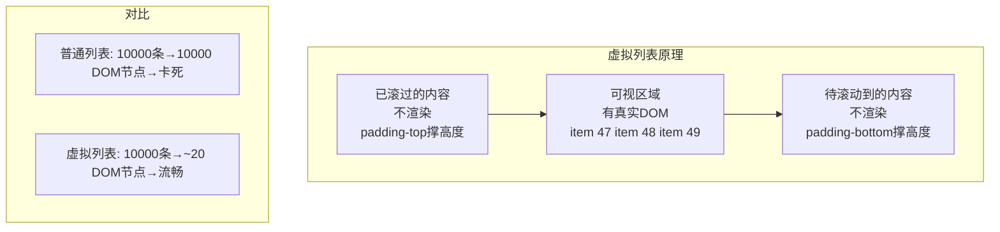
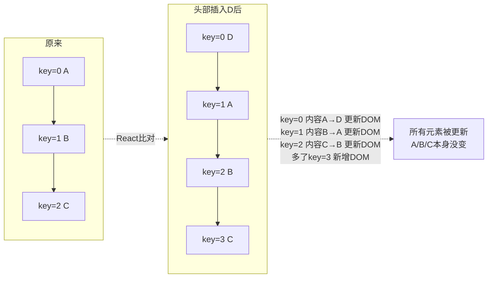
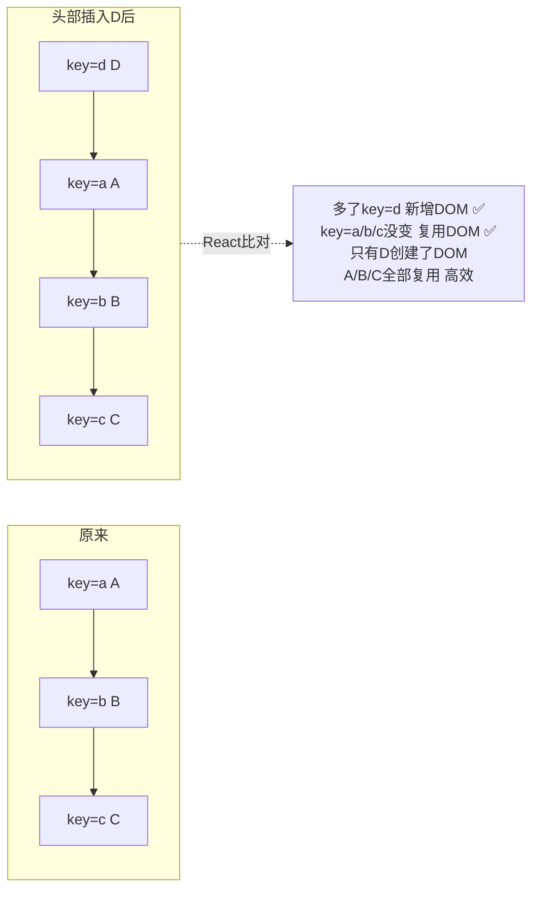

---

title: "其他性能优化常考点"

created: "2025-07-12"

tags:

  - 八股文

  - react

  - react-ts-js

---


# 其他性能优化常考点

## 五、其他性能优化常考点


> 这节是"散装知识点"——每个都能独立出一道题，但深度不如 memo 三兄弟。按 2026 频率排序。


### 5.1 React.lazy + Suspense —— 代码分割


```tsx


// 不是一开始加载所有页面代码，而是"用到才加载"


const UserProfile = React.lazy(() => import("./UserProfile"));


//                              ↑ 动态 import() → webpack 自动分包


function App() {


  return (


    <Suspense fallback={<div>加载中...</div>}>


      {/* UserProfile 的代码在首次渲染时才去下载 */}


      <UserProfile />


    </Suspense>


  );


}


```


**原理**：`React.lazy` 接收一个返回 Promise 的函数（`() => import('./X')`）。React 渲染到它时发现组件还没加载 → 往上找最近的 `<Suspense>` → 显示 fallback → 等 Promise resolve → 渲染真实组件。


**一句话讲清**："代码分割的核心是按路由拆分 bundle——用户访问 `/settings` 时才加载 Settings 页面的 JS，首屏只加载必需代码。配合 `React.lazy + Suspense` 或路由级的 `lazy()` 实现。"


### 5.2 虚拟列表 —— 大数据量渲染优化





> 常用库：`react-window`（轻量）、`react-virtualized`（功能全）。不说库名也行——把"只渲染可见区域 + padding 撑高度"这个原理讲清楚就够了。


### 5.3 防抖与节流 —— 高频事件优化


| | 防抖（Debounce） | 节流（Throttle） |


| :--- | :--- | :--- |


| 行为 | 你一直点我就一直重置计时器——等你停手了再执行 | 你一直点我最多每 N 毫秒执行一次 |


| 比喻 | 电梯关门：有人进来就重新计时，直到没人了才关门 | 地铁闸机：过一个人要等一下才能过下一个 |


| 场景 | 搜索输入、窗口 resize | 滚动事件、按钮连点 |


```tsx


// 防抖 Hook —— 搜索框场景


function useDebounce<T>(value: T, delay: number): T {


  const [debouncedValue, setDebouncedValue] = useState(value);


  useEffect(() => {


    const timer = setTimeout(() => setDebouncedValue(value), delay);  // 延迟 delay 后更新


    return () => clearTimeout(timer);  // value 又变了 → 清除上一个定时器 → 重新计时


  }, [value, delay]);


  return debouncedValue;


}


// 使用：用户停止输入 300ms 后才发请求


function SearchBox() {


  const [query, setQuery] = useState("");


  const debouncedQuery = useDebounce(query, 300);


  useEffect(() => {


    if (debouncedQuery) fetchResults(debouncedQuery);  // 300ms 没输入了才发请求


  }, [debouncedQuery]);


}


```


### 5.4 key 的正确使用


> 这个看似简单，一问"为什么不能用 index 做 key"——80% 的人说不清楚原理。


```tsx


// ❌ 用 index 做 key —— 列表顺序变了就出 bug


{items.map((item, index) => <Item key={index} {...item} />)}


// ✅ 用稳定的唯一标识


{items.map(item => <Item key={item.id} {...item} />)}


```


**为什么 index 有问题？** React 用 key 来判断"哪个元素变了"。如果用 index：








### 5.5 状态提升 vs 状态下沉


```text


状态提升：把 state 放到"需要它的组件的最近公共祖先"


  → 问题：祖先更新 → 所有后代都重渲染（即使不关心这个 state）


状态下沉：把 state 尽量放到"实际使用它的组件"里


  → 好处：state 更新只影响真正关心它的那个小组件


```


```tsx


// ❌ 状态提升过度——input 的 value 变化导致整个 App 重渲染


function App() {


  const [search, setSearch] = useState("");          // state 在顶层


  return (


    <div>


      <Header />           {/* 不关心 search，但也会重渲染 */}


      <SearchInput value={search} onChange={setSearch} />


      <Content />          {/* 不关心 search，但也会重渲染 */}


      <Footer />           {/* 不关心 search，但也会重渲染 */}


    </div>


  );


}


// ✅ 状态下沉——search 只影响 SearchInput


function App() {


  return (


    <div>


      <Header />


      <SearchInput />      {/* state 在 SearchInput 内部 */}


      <Content />


      <Footer />


    </div>


  );


}


```


### 5.6 useTransition / useDeferredValue —— React 18 并发特性


| | useTransition | useDeferredValue |


| :--- | :--- | :--- |


| 做什么 | 把某个 state 更新标记为"低优先级" | 让某个值的更新"滞后"——先用旧值显示 |


| 返回值 | `[isPending, startTransition]` | 延迟后的值 |


| 场景 | Tab 切换、路由跳转 | 搜索建议——用户输入时列表先不动 |


```tsx


// useTransition：Tab 切换时先显示旧 Tab，新 Tab 的内容"稍后追上"


function Tabs() {


  const [tab, setTab] = useState("home");


  const [isPending, startTransition] = useTransition();


  function selectTab(nextTab: string) {


    startTransition(() => setTab(nextTab));  // 标记为低优先级——别挡用户操作


  }


  return (


    <div>


      <button onClick={() => selectTab("home")}>Home</button>


      <button onClick={() => selectTab("profile")}>Profile</button>


      {isPending && <Spinner />}  {/* 新 Tab 还在准备中——显示 loading */}


      <TabContent tab={tab} />    {/* 这是慢组件——React 可以中断它的渲染 */}


    </div>


  );


}


// useDeferredValue：搜索框——用户打字时不阻塞输入


function SearchPage({ query }: { query: string }) {


  const deferredQuery = useDeferredValue(query);  // query 变了会滞后更新


  return (


    <>


      <input value={query} />                     {/* 输入永远流畅 */}


      <SearchResults query={deferredQuery} />     {/* 结果列表可以"慢一拍" */}


    </>


  );


}


```


---


## 速记卡（面试闪卡）


**Q1：一句话讲清「其他性能优化常考点」到底是什么？**

A：除 memo 三兄弟，React 性能优化还有六块：代码分割、虚拟列表、防抖节流、key 用法、状态升降、并发特性。


**Q2：5.1 代码分割 + 5.2 虚拟列表 —— 怎么理解？ —— 怎么理解？**

A：React.lazy + Suspense 做代码分割：组件不进主 bundle，用到才动态 import，首屏更快，加载时显示 fallback。虚拟列表只渲染视口内十几行，滚到哪渲哪，DOM 数量恒定。就像火车车窗——只看到窗外那几节，不用摆整列车在眼前。


**Q3：5.3 防抖节流 + 5.4 key 的正确使用 —— 怎么理解？ —— 怎么理解？**

A：防抖：事件停 N 毫秒后才执行（搜索输完再发请求）；节流：每 N 毫秒最多一次（滚动、拖拽）。key 要用稳定唯一 id，别用数组下标——用 index 当 key，列表增删会让 React 复用错 DOM、状态错乱。


**Q4：5.5 状态提升 vs 下沉 —— 怎么理解？ —— 怎么理解？**

A：状态提升：兄弟组件共享数据时把 state 提到最近公共父。状态下沉（colocation）：把只属于某子组件的状态往下放，避免无关节件跟着重渲染。原则：state 放在"真正需要它的最小组件"，既共享又不浪费渲染。


**Q5：5.6 useTransition / useDeferredValue —— 怎么理解？ —— 怎么理解？**

A：React 18 并发特性。useTransition 把"非紧急更新"标记成可中断——输入时旧结果先留、新结果后台算，界面不卡。useDeferredValue 返回"延迟版"值，紧急渲染用旧值、后台算新值。本质：让紧急交互（打字）优先，耗时渲染让路。


**Q6：核心速记主线有哪些？**

- 代码分割：lazy + Suspense，首屏更快

- 虚拟列表：只渲可见区，DOM 恒定

- 防抖等停再跑、节流匀速跑；key 用稳定 id

- 状态下沉减少重渲染；并发特性让紧急交互优先


**口诀**

A：性能优化六把刀，

lazy 分割首屏高；

防抖节流限高频，

key 用 id 下标抛。


## 相关链接


- 📋 目录：[[00-React]]


- 📚 学习清单：[[八股文学习路线图]]


