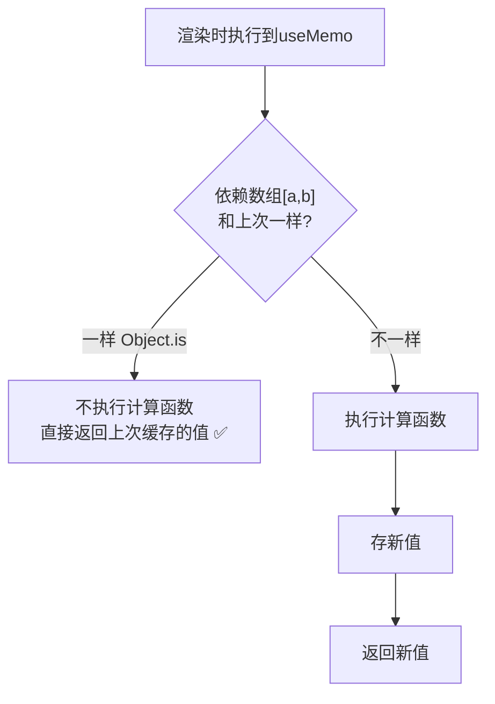

---

title: "useMemo缓存计算结果"

created: "2025-07-12"

tags:

  - 八股文

  - react

  - react-ts-js

---

# useMemo缓存计算结果

## 二、useMemo —— 缓存计算结果
### 2.1 核心原理

```tsx

const memoizedValue = useMemo(() => expensiveComputation(a, b), [a, b]);

//                              ↑ 计算函数              ↑ 依赖：这些值没变就不重新计算

```

**React 内部做的事**：



### 2.2 适用 vs 不适用场景

| 适用 ✅ | 不适用 ❌ |

| :--- | :--- |

| 大数组排序/过滤/映射（O(n) 以上） | 简单加减乘除——缓存开销 > 计算开销 |

| 传给子组件的对象/数组（配合 React.memo） | 副作用操作（那是 useEffect 的事） |

| 派生数据——一个状态衍生出的复杂计算 | 每次渲染本来就要用的值——缓存了也是白存 |

```tsx

// ✅ 适用：大数组过滤——不缓存的话每次渲染都 O(n)

function TodoList({ todos, filter }: Props) {

  const filteredTodos = useMemo(

    () => todos.filter(t => t.status === filter).sort(/* 复杂排序 */),

    [todos, filter]                    // 只有数据或筛选条件变了才重新计算

  );

  return <List items={filteredTodos} />;

}

// ❌ 不适用：简单运算——useMemo 本身也有开销（存依赖、比依赖）

function Bad({ a, b }: Props) {

  const sum = useMemo(() => a + b, [a, b]);  // 多余！a+b 比 useMemo 内部逻辑还快

  return <div>{sum}</div>;

}

```

> **经验法则**：如果你不确定要不要加 useMemo——先不加。等性能出问题了，用 React DevTools Profiler 定位瓶颈再加。**不要提前优化**。

---

## 速记卡（面试闪卡）

**Q1：一句话讲清「useMemo 缓存计算结果」到底是什么？**

A：useMemo 记住"上一次的计算结果"，只有依赖项变了才重新算，避免每次渲染都做昂贵的重复计算。它是性能优化工具，不是"让值不变"的魔法——语义上只缓存返回值。

**Q2：2.1 核心原理 —— 怎么理解？**

A：useMemo(fn, deps) 在渲染时：先比对 deps 数组和上次是否"浅相等"（shallow equal，逐项 ===）；没变就直接返回上次缓存的值，跳过 fn；变了才执行 fn 并把新结果缓存。生活比喻：你每次考试都先翻上次答案，题目没变就直接抄，题目变了才重新算——省的是"算"的时间，不是"记"的空间。

**Q3：2.2 适用 vs 不适用场景 —— 怎么理解？**

A：适用：①计算成本高（大数组排序、复杂派生数据）；②作为 props 传给子组件且子组件用 React.memo 包裹（避免每次传新引用导致子组件重渲）。不适用：①计算很 cheap（加个法），用 useMemo 反而多存多比，得不偿失；②把 useMemo 当"保证引用不变"的万能药——它不保证，deps 没变才不变。经验法则：先别用， profiling 发现卡了再加。

**Q4：和 useCallback 的关系 —— 怎么理解？**

A：useMemo 缓存"值"，useCallback 缓存"函数"。其实 `useCallback(fn, deps)` 等价于 `useMemo(() => fn, deps)`——本质一样，只是返回的是函数。常见搭配：用 useCallback 固定函数引用，配合子组件 React.memo，避免父重渲时把新函数当 props 传进去导致子也重渲。

**Q5：常见误区 —— 怎么理解？**

A：①useMemo 不能保证一定不重算（React 为内存可能丢弃缓存，比如低优先级时）；②它不是语义保证，只是性能提示；③依赖项要写全，漏写会导致用了过时值（stale closure 类问题）。别为了"看起来高级"到处包 useMemo，过度优化也是坏味道。

**Q6：核心速记主线有哪些？**

A：一、原理（deps 浅比对，变了才重算）、二、适用（高成本计算 / memo 子组件 props）、三、不适用（cheap 计算）、四、与 useCallback 等价关系、五、误区（不保证 / 依赖写全）。

**口诀**

A：useMemo 记结果，依赖没变直接给；

昂贵计算它来省，memo 子组件它来配；

便宜计算别乱套，过度优化也是罪；

本质同 useCallback，一个值来一个函。

## 相关链接

- 📋 目录：[[00-React]]

- 📚 学习清单：[[八股文学习路线图]]

