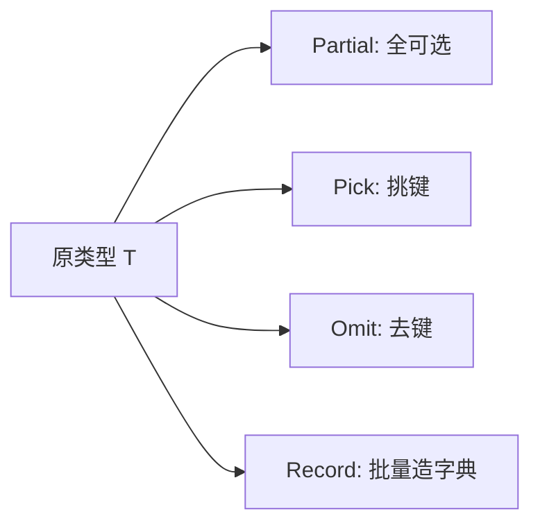

---

title: "内置工具类型"

created: "2026-07-21"

tags:

  - 八股文

  - typescript

---


# 内置工具类型

## 零、一句话定位


TS 内置了一批"基于已有类型，批量造出变体"的工具类型。它们本质都是**泛型 + 映射类型（mapped types）**的语法糖，记住高频的几个即可。


> 英文全称：**Utility Types = 工具类型**；**Mapped Types = 映射类型**；**modifier = 修饰符**（`?` 可选、`readonly` 只读）。


## 一、高频四个（最爱问）


| 工具类型 | 作用 | 类比 |

| --- | --- | --- |

| `Partial<T>` | 把 T 的所有属性变成**可选** `?` | 把"必填表"改成"选填表" |

| `Pick<T, K>` | 从 T 里**挑出**部分键 K | 从整套乐高里只挑几块 |

| `Omit<T, K>` | 从 T 里**去掉**部分键 K | 从整套乐高里拿走几块 |

| `Record<K, V>` | 构造"键为 K、值为 V"的对象类型 | 批量生成统一格式的字典 |


```ts

interface User { id: number; name: string; age: number }


type UserPatch = Partial<User>;        // { id?: number; name?: string; age?: number }

type UserPreview = Pick<User, "id" | "name">;   // { id: number; name: string }

type NoAge = Omit<User, "age">;        // { id: number; name: string }

type Dict = Record<string, number>;    // { [k: string]: number }

```


## 二、进阶常用


- `Required<T>`：所有属性变**必填**（去掉 `?`）。

- `Readonly<T>`：所有属性变**只读**。

- `ReturnType<F>`：取函数类型 F 的**返回值类型**。

- `Parameters<F>`：取函数类型 F 的**参数类型元组**。

- `Exclude<U, K>` / `Extract<U, K>`：从联合里排除 / 提取。


## 三、怎么答


先说"它们是基于映射类型造变体的语法糖"，然后举例 `Partial / Pick / Omit / Record` 四个最常用的，能现场写出 `Partial` 的简化实现加分：


```ts

type MyPartial<T> = { [K in keyof T]?: T[K] };

```


## 四、要点图解





## 速记卡（面试闪卡）


**Q1：一句话讲清「内置工具类型（Utility Types）」到底是什么？**

A：TS 内置工具类型是类型层面的函数：输入类型返回加工后的新类型，高频如 Partial/Pick/Omit/Record。


**Q2：一、高频四件套 Partial/Pick/Omit/Record —— 怎么理解？**

A：Partial<T> 把属性全变可选（更新表单只传部分字段）；Required<T> 全变必填；Pick<T,K> 从 T 里只挑 K 几个键；Omit<T,K> 排除 K 几个键。记忆：Partial 松、Required 紧、Pick 挑、Omit 删。比喻：工具类型像乐高改造件，把一套积木改造成你要的形状。英文：Partial、Pick、Omit、Record、mapped types（映射类型）。


**Q3：二、进阶常用 Readonly/Record/Exclude/ReturnType —— 怎么理解？**

A：Readonly<T> 属性全加只读；Record<K,V> 造键 K 值 V 的对象类型（如 Record<string,number>）；Exclude<U,X> 从联合剔除 X，Extract<U,X> 只留 X；ReturnType<F> 取函数返回值类型。比喻：这些都是"类型剪刀+胶水"，裁掉不要的、拼出要的。英文：Readonly、Exclude、ReturnType。


**Q4：三、底层是映射类型、手写 Partial 加分 —— 怎么理解？**

A：它们本质都是泛型 + 映射类型 { [P in keyof T]: T[P] } 的语法糖。被问实现能口述就加分，如 Partial：type MyPartial<T>={[K in keyof T]?:T[K]}——遍历 T 每个键、加 ? 变可选。Omit=Pick<T,Exclude<keyof T,K>>。比喻：映射类型像流水线，把每个属性过一道工序。英文：mapped types（映射类型）、generic（泛型）。


**Q5：四、为什么需要工具类型 —— 怎么理解？**

A：没有它，想"只要对象部分字段"就得手写新接口，重复难维护。工具类型让类型能组合、派生、复用。比喻：手写接口像每次都重新画图纸，工具类型像用标准件拼装——React 里 Pick/Omit 复用父组件 props，Partial 允许部分覆盖配置，Record 造字典。英文：type composition（类型组合）、reusability（复用）。


**Q6：核心速记主线有哪些？**

- 高频四件套：Partial/Pick/Omit/Record

- 进阶：Readonly/Exclude/Extract/ReturnType

- 底层是映射类型 { [P in keyof T] }

- 手写 Partial 加分

- 价值：类型组合复用，避免重复定义


**口诀**

A：内置工具类型多，Partial 可选 Required 全；

Pick 挑来 Omit 删，Readonly 锁不让改。

Record 造表 Exclude 剔，ReturnType 取返回；

映射类型 { [P in keyof T] }，类型体操它最帅。


## 相关链接


- 📋 目录：[[00-TypeScript]]

- 📚 学习清单：[[八股文学习路线图#十一、React-TS-JS]]

- 🔗 [[02-泛型与约束与keyof|泛型与约束]] — 工具类型的底层机制

- 🔗 [[05-类型守卫|类型守卫]] — 运行期收窄的互补手段

