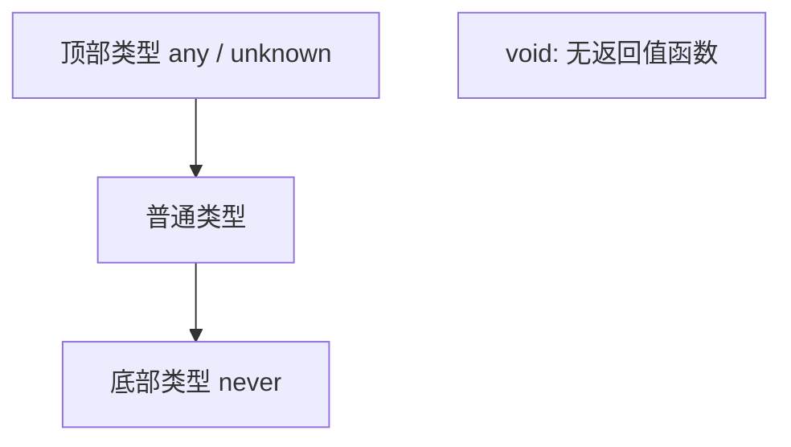

---

title: "any 与 unknown 与 never 与 void"

created: "2026-07-21"

tags:

  - 八股文

  - typescript

---


# any 与 unknown 与 never 与 void

## 零、一句话定位


四个都是"特殊类型"，但职责完全不同：


- **`any`**：彻底关闭类型检查——"啥都能进，啥都能出"。

- **`unknown`**：类型安全的 `any`——"啥都能进，但用之前必须先验明正身（narrowing）"。

- **`never`**："永远不可能有的值"——用于穷尽检查和抛异常的函数返回。

- **`void`**：函数"没有有意义的返回值"（本质就是返回 `undefined`）。


> 英文全称：**top type = 顶部类型**（`any`/`unknown` 啥都能赋给它）；**bottom type = 底部类型**（`never` 啥都赋不了给它）；**narrowing = 类型收窄**。


## 一、生活化类比


- `any` = **不验票的闸机**：人随便进，你也随便被当成任意身份，安全全无。

- `unknown` = **验票闸机**：人能进候车区，但进站台前必须查票（先收窄类型）才放。

- `never` = **黑洞**：你永远走不到那儿（函数抛错中断 / switch 的兜底分支）。

- `void` = **空手而归**：函数跑完了，但啥也没带回来。


```ts

let a: any = 1;

a = "x"; a.foo();          // 不报错，但运行期可能炸


let u: unknown = 1;

// u.trim();               // ❌ 直接调用报错：必须先收窄

if (typeof u === "string") u.trim();  // ✅ 收窄后才能用


function crash(): never { throw new Error("boom"); }  // 永远不返回

function log(): void { console.log("hi"); }           // 不返回有用值

```


## 二、关键区别


| 类型 | 能赋给谁 | 能赋给它啥 | 典型用途 |

| --- | :---: | :---: | --- |

| `any` | 任意 | 任意 | 迁移旧 JS、临时逃生（尽量少用） |

| `unknown` | 仅 `unknown`/`any` | 任意 | 接收未知外部输入（API/JSON） |

| `never` | 任意（它是底部） | 无（没有值属于 never） | 穷尽检查兜底、抛错函数 |

| `void` | 仅 `void`/`any`/`undefined` | `undefined`/`null` | 无返回值函数 |


## 三、怎么答


- `any` 放弃安全；`unknown` 是"受控的 any"，必须先 `typeof`/`instanceof` 收窄。

- `never` 表示"不可达"，常用于 `switch` 穷尽检查的 `default` 里用 `exhaustiveCheck(value: never)` 在编译期报错。

- `void` ≠ `undefined`：函数标注 `void` 只是"不在乎返回值"，调用方不会拿到有意义的值。


## 四、要点图解





---


> 写给初学者：每个概念都从"为什么需要它"开始讲，配合通俗比喻和完整可运行代码。


---


## 为什么需要类型标注？


JavaScript 有多"随意"？


```javascript

let age = 25;           // age 是数字

age = "二十五";          // 突然变成字符串了，JavaScript 完全不报错

age = true;             // 又变成布尔值了，还是不报错


function add(a, b) {

    return a + b;

}

add("1", 2);            // "12" —— 字符串拼接，不是数学加法！

```


**TypeScript 的类型标注就是给变量"贴标签"——声明这个变量只能存什么类型的值。** 编译时就帮你抓错，不用等到运行。


> TypeScript 是 JavaScript 的"超集"——所有合法的 JS 代码都是合法的 TS 代码，但 TS 多了类型系统。TS 代码需要先编译成 JS 才能运行。


---


## 基本类型标注


```typescript

let name: string = "张三";        // 字符串类型

let age: number = 25;             // 数字类型，整数和小数都算 number

let isStudent: boolean = true;    // 布尔类型


let nothing: null = null;         // null 类型

let notDefined: undefined = undefined;  // undefined 类型

let anything: any = "随便什么";    // any 类型，关掉类型检查

```


> [!warning] any 的危害

> `any` 就是告诉 TypeScript"别管我"——你放弃了类型检查，等于白装了 TypeScript。能不用就不用。


---


## 类型推断——大多数时候不用手写


TypeScript 很聪明，能根据赋的值自动推断类型：


```typescript

let name = "张三";           // 自动推断为 string

let age = 25;                // 自动推断为 number


// 什么时候必须手写？

// 情况 1：声明但不赋值

let username;                // 推断为 any（危险！）

let username2: string;       // ✅ 手动标注


// 情况 2：函数参数必须手写

function greet(name: string) {

    return `你好, ${name}`;

}


// 情况 3：返回值可以手写，也可以自动推断

function add(a: number, b: number): number { return a + b; }

function add2(a: number, b: number) { return a + b; }  // 自动推断为 number

```


> 变量能推断就不写，函数参数必须写，返回值看情况。


---


## 数组类型


```typescript

// 写法 1：类型[]（推荐）

let names: string[] = ["张三", "李四", "王五"];

let scores: number[] = [90, 85, 95];


// 写法 2：Array<类型>（泛型写法）

let names2: Array<string> = ["张三", "李四"];


// 混合类型数组——用联合类型

let mixed: (string | number)[] = ["张三", 25, "李四", 30];

```


---


## 对象类型


JS 里的"对象"用 `{}` 包裹，本质就是 Python 里的 `dict`（字典）。访问属性用 `.`（如 `user.name`）。


```typescript

let user: { name: string; age: number; email: string } = {

    name: "张三",

    age: 25,

    email: "zhangsan@qq.com",

};


// 可选属性用 ? 标记

let user2: { name: string; age?: number } = {

    name: "李四",

    // age 可以不传

};

```


---


## 联合类型（Union Types）


用 `|` 表示"可以是 A 或 B"：


```typescript

let id: string | number;

id = "abc123";                 // ✅ string

id = 12345;                    // ✅ number


function printId(id: string | number) {

    // 只能调用两种类型共有的方法

    console.log(id.toString()); // ✅ 共同方法


    // 类型守卫——先判断再用特定类型的方法

    if (typeof id === "string") {

        console.log(id.toUpperCase());

    } else {

        console.log(id.toFixed(2));

    }

}


// 联合类型 + 数组

let mixed: (string | number)[] = [1, "二", 3, "四"];

```


**通俗比喻**：联合类型就像"身份证或护照"——进某个国家，你可以出示身份证**或者**护照，但工作人员拿到后会先看一眼你出示的是哪种，再按对应流程处理（类型守卫）。


---


## 字面量类型（Literal Types）


```typescript

let direction: "up" | "down" | "left" | "right";

direction = "up";              // ✅

// direction = "forward";      // ❌ 报错：只能是那四个值


function setAlignment(align: "left" | "center" | "right") {

    console.log(`对齐方式: ${align}`);

}

```


**通俗比喻**：字面量类型就像交通信号灯——只能是红、黄、绿三种颜色，不能是紫色。


---


## 速查表


| 概念 | 一句话解释 | 关键代码 |

|------|---------|---------|

| 类型标注 | 给变量声明类型 | `let name: string = "张三"` |

| 类型推断 | TS 自动推断类型 | `let x = 42` → `number` |

| `any` | 关掉类型检查（尽量别用） | `let x: any = "随便"` |

| 联合类型 | 可以是多种类型之一 | `string | number` |

| 字面量类型 | 只能是特定的值 | `"up" | "down"` |


---


## 速记卡（面试闪卡）


**Q1：一句话讲清「any / unknown / never / void」到底是什么？**

A：any 关检查、unknown 先收窄、never 永不发生、void 无返回。


**Q2：any vs unknown —— 怎么理解？ —— 怎么理解？**

A：any 像不验票的闸机，人随便进也随便被当成任意身份，安全全无；unknown 像验票闸机，能进候车区但进站台前必须查票（先收窄类型）才放。英语：top type / narrowing。


**Q3：never 的两种用法 —— 怎么理解？ —— 怎么理解？**

A：never 像黑洞——你永远走不到那儿。要么函数抛错中断永不返回，要么在 switch 的 default 里写 `exhaustiveCheck(x: never)`，以后漏处理新类型编译期就报错。英语：bottom type / exhaustive check。


**Q4：void 的含义 —— 怎么理解？ —— 怎么理解？**

A：void 像空手而归——函数跑完了但啥也没带回来（本质返回 undefined）。注意 void 是"函数返回类型"，undefined 是"一个具体的值类型"，二者不是一回事。英语：void / undefined。


**Q5：整体定位 —— 怎么理解？ —— 怎么理解？**

A：四个都是特殊类型但职责不同：any 关灯瞎操作、unknown 亮灯先验明、never 表示永不发生、void 表示无返回。它们是类型体系里管"边界"的四个角色。


**Q6：核心速记主线有哪些？**

- any：彻底关掉类型检查，能不用就不用

- unknown：类型安全的 any，用前必须先收窄（typeof/守卫）

- never：永不可达的值，常用于穷尽检查兜底

- void：函数无有意义的返回值（即 undefined）


**口诀**

A：any 关灯瞎胡来，

unknown 先验才放开；

never 永不发生态，

void 无返莫疑猜。


## 相关链接


- 📋 目录：[[00-TypeScript]]

- 📚 学习清单：[[八股文学习路线图#十一、React-TS-JS]]

- 🔗 [[05-类型守卫|类型守卫]] — unknown 如何被收窄成具体类型

