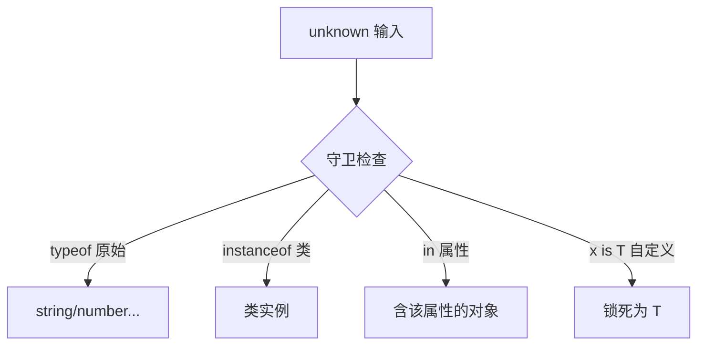

# 类型守卫（Type Guards）

## 零、一句话定位

**类型守卫**是一段"运行时检查 + 编译期收窄"的代码：你在运行期确认了"这个值到底是什么类型"，TypeScript 就跟着把该处变量的类型**收窄（narrow）**成具体类型，后续不用再解释。

> 英文全称：**Type Guard = 类型守卫**；**narrowing = 类型收窄**；**type predicate = 类型谓词**（`x is T`）。

## 一、生活化类比

类型守卫像**安检员**：你拿着包裹（`unknown`）进来，安检员用 `typeof` / `instanceof` 扫一下，确认是"手机"还是"水"，盖章放行。盖完章 TS 就知道你是手机了，后面直接当手机用，不用再自证。

## 二、四种常见守卫

```ts
// 1) typeof：判断原始类型
function f1(x: string | number) {
    if (typeof x === "string") x.toUpperCase();  // 这里 x 被收窄成 string
}

// 2) instanceof：判断类实例
function f2(x: Date | RegExp) {
    if (x instanceof Date) x.getFullYear();
}

// 3) in：判断对象是否含某属性
function f3(x: { a: number } | { b: string }) {
    if ("a" in x) x.a;
}

// 4) 自定义类型谓词：用 `x is T` 告诉 TS 守卫成立时类型是什么
function isString(x: unknown): x is string {
    return typeof x === "string";
}
function use(x: unknown) { if (isString(x)) x.toUpperCase(); }
```

## 三、为什么需要自定义守卫

`typeof`/`instanceof` 覆盖不了"两个都是对象、只是形状不同"的情况。自定义守卫 `x is T` 让 TS 在 `if` 成立后**信任你的判断**，把类型锁成 `T`——是处理 `unknown` 外部输入的利器。

## 四、要点图解



## 速记卡（面试闪卡）

**Q1：一句话讲清「类型守卫（Type Guards）」到底是什么？**
A：**类型守卫**是一段"运行时检查 + 编译期收窄"的代码：你在运行期确认了"这个值到底是什么类型"，TypeScript 就跟着把该处变量的类型**收窄（narrow）**成具体类型，后续不用再解释。
英文全称：**Type Guard = 类型守卫**；**narrowing = 类型收窄**；**type predicate = 类型谓词**（）。

**Q2：零、一句话定位 —— 怎么理解？**
A：**类型守卫**是一段"运行时检查 + 编译期收窄"的代码：你在运行期确认了"这个值到底是什么类型"，TypeScript 就跟着把该处变量的类型**收窄（narrow）**成具体类型，后续不用再解释。
英文全称：**Type Guard = 类型守卫**；**narrowing = 类型收窄**；**type predicate = 类型谓词**（）。

**Q3：一、生活化类比 —— 怎么理解？**
A：类型守卫像**安检员**：你拿着包裹（）进来，安检员用  /  扫一下，确认是"手机"还是"水"，盖章放行。盖完章 TS 就知道你是手机了，后面直接当手机用，不用再自证。

**Q4：三、为什么需要自定义守卫 —— 怎么理解？**
A：/ 覆盖不了"两个都是对象、只是形状不同"的情况。自定义守卫  让 TS 在  成立后**信任你的判断**，把类型锁成 ——是处理  外部输入的利器。

**Q5：核心速记主线有哪些？**
A：抓住这几根：零、一句话定位、一、生活化类比、二、四种常见守卫、三、为什么需要自定义守卫、四、要点图解。


## 相关链接

- 📋 目录：[[00-TypeScript]]
- 📚 学习清单：[[八股文学习清单#十一、React-TS-JS]]
- 🔗 [[04-any与unknown与never与void|unknown]] — 守卫最常见的"待安检"对象
