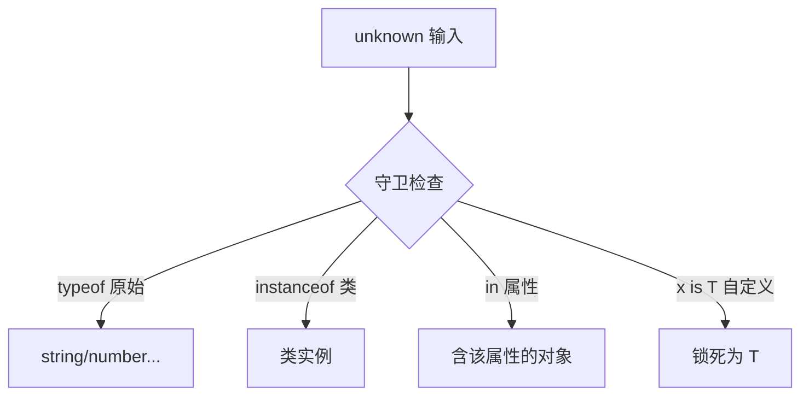

---

title: "类型守卫"

created: "2026-07-21"

tags:

  - 八股文

  - typescript

---


# 类型守卫

## 零、一句话定位


**类型守卫**是一段"运行时检查 + 编译期收窄"的代码：你在运行期确认了"这个值到底是什么类型"，TypeScript 就跟着把该处变量的类型**收窄（narrow）**成具体类型，后续不用再解释。


> 英文全称：**Type Guard = 类型守卫**；**narrowing = 类型收窄**；**type predicate = 类型谓词**（`x is T`）。


## 一、生活化类比


类型守卫像**安检员**：你拿着包裹（`unknown`）进来，安检员用 `typeof` / `instanceof` 扫一下，确认是"手机"还是"水"，盖章放行。盖完章 TS 就知道你是手机了，后面直接当手机用，不用再自证。


## 二、四种常见守卫


```ts

// 1) typeof：判断原始类型

function f1(x: string | number) {

    if (typeof x === "string") x.toUpperCase();  // 这里 x 被收窄成 string

}


// 2) instanceof：判断类实例

function f2(x: Date | RegExp) {

    if (x instanceof Date) x.getFullYear();

}


// 3) in：判断对象是否含某属性

function f3(x: { a: number } | { b: string }) {

    if ("a" in x) x.a;

}


// 4) 自定义类型谓词：用 `x is T` 告诉 TS 守卫成立时类型是什么

function isString(x: unknown): x is string {

    return typeof x === "string";

}

function use(x: unknown) { if (isString(x)) x.toUpperCase(); }

```


## 三、为什么需要自定义守卫


`typeof`/`instanceof` 覆盖不了"两个都是对象、只是形状不同"的情况。自定义守卫 `x is T` 让 TS 在 `if` 成立后**信任你的判断**，把类型锁成 `T`——是处理 `unknown` 外部输入的利器。


## 四、要点图解





## 速记卡（面试闪卡）


**Q1：一句话讲清「类型守卫 Type Guards」到底是什么？**

A：类型守卫是在运行时判断"这个值到底是什么类型"，并让 TS 在对应的代码分支里自动收窄（narrow）类型的技巧。这样你既能安全操作，又不用到处写 as 断言。


**Q2：一、生活化类比 + 为什么需要 —— 怎么理解？**

A：生活比喻：快递驿站取件，工作人员先验身份证（运行时判断）确认你是本人，才把包裹给你——之后就不再怀疑你身份了。TS 同理：unknown 进来时它不知道类型，你用一个守卫"验明正身"，守卫成立的分支里 TS 就相信这个类型了。没有守卫，你就只能粗暴 `as`，既丑又容易埋错。


**Q3：二、四种常见守卫 —— 怎么理解？**

A：① `typeof` 守卫：`typeof x === "string"` 之后 x 被收窄成 string；② `instanceof` 守卫：判断是不是某个类的实例（如 `err instanceof Error`）；③ `in` 守卫：`"name" in obj` 判断对象有没有某属性；④ 自定义类型守卫：写一个返回 `x is T` 的函数（类型谓词，type predicate），告诉 TS"返回 true 时 x 就是 T"。这四种覆盖了绝大多数收窄场景。


**Q4：三、为什么需要自定义守卫 —— 怎么理解？**

A：typeof / instanceof / in 搞不定的复杂判断（比如"是不是合法的用户对象"），就用自定义守卫 `function isUser(x: unknown): x is User { return ... }`。关键是返回类型写 `x is User`（不是 boolean）——这样在 `if (isUser(v))` 分支里，v 自动变 User，else 分支自动排除 User。它把"运行时校验"和"编译期类型"绑在了一起，是 unknown 安全落地的标准姿势。


**Q5：类型守卫 vs 类型断言 —— 怎么理解？**

A：类型断言 `x as T` 是"我比 TS 更懂，强制当它"，没有运行时检查，错了就运行时炸；类型守卫是"我证明给它看"，TS 信服且更安全。原则：能用守卫收窄就别用 as。守卫失败只是走 else 分支，断言失败是直接埋雷。


**Q6：核心速记主线有哪些？**

A：一、守卫的作用（运行时判断 + 编译期收窄）、二、四种内置守卫（typeof / instanceof / in / 自定义）、三、自定义守卫的 `x is T` 类型谓词、四、守卫 vs 断言（安全 vs 强制）。


**口诀**

A：类型守卫先验身，分支里面类型信；

typeof instanceof in，三种内置够你用；

复杂判断自己写，x is T 谓词定；

别滥用 as 强断言，守卫安全不埋雷。


## 相关链接


- 📋 目录：[[00-TypeScript]]

- 📚 学习清单：[[八股文学习路线图#十一、React-TS-JS]]

- 🔗 [[04-any与unknown与never与void|unknown]] — 守卫最常见的"待安检"对象

