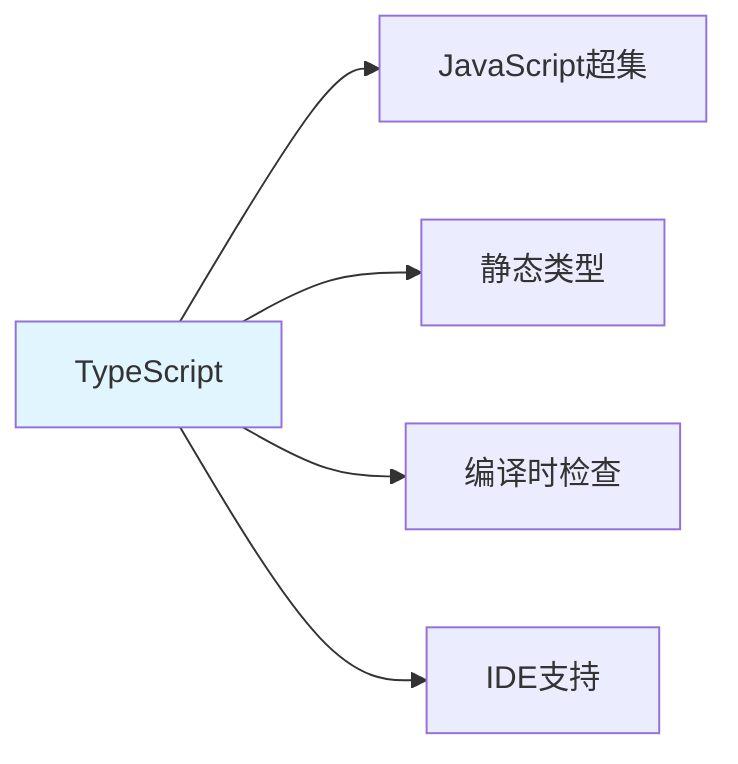

---

title: "TS 基础类型与注解"

tags:

  - typescript

  - 技术学习

created: "2026-07-21"

---

# TS 基础类型与注解

> **一句话**：TypeScript是JavaScript的超集，添加了静态类型系统。基础类型包括string、number、boolean等，注解用于指定变量、函数参数和返回值的类型。

## 1. TypeScript基础
### 1.1 什么是TypeScript？



**TypeScript**：JavaScript的超集，添加了静态类型系统，可以在编译时检查类型错误。

### 1.2 基础类型

```typescript

// 基础类型

let name: string = "Alice";

let age: number = 30;

let isActive: boolean = true;

let items: any[] = [1, "two", true];

// 数组

let numbers: number[] = [1, 2, 3];

let strings: Array<string> = ["a", "b", "c"];

// 元组

let tuple: [string, number] = ["Alice", 30];

// 枚举

enum Color {

    Red,

    Green,

    Blue

}

let color: Color = Color.Red;

```

## 2. 类型注解
### 2.1 变量注解

```typescript

// 显式注解

let name: string = "Alice";

let age: number = 30;

// 类型推断（自动推断类型）

let name = "Alice"; // 推断为string

let age = 30; // 推断为number

```

### 2.2 函数注解

```typescript

// 参数类型注解

function greet(name: string): string {

    return `Hello, ${name}!`;

}

// 可选参数

function greet(name: string, greeting?: string): string {

    return `${greeting || "Hello"}, ${name}!`;

}

// 默认参数

function greet(name: string, greeting: string = "Hello"): string {

    return `${greeting}, ${name}!`;

}

// 剩余参数

function sum(...numbers: number[]): number {

    return numbers.reduce((a, b) => a + b, 0);

}

```

### 2.3 对象类型

```typescript

// 接口

interface User {

    name: string;

    age: number;

    email?: string; // 可选属性

}

// 类型别名

type Point = {

    x: number;

    y: number;

};

// 使用

let user: User = {

    name: "Alice",

    age: 30

};

let point: Point = {

    x: 10,

    y: 20

};

```

## 3. 高级类型
### 3.1 联合类型

```typescript

// 联合类型

let id: string | number;

id = "123";

id = 123;

// 类型守卫

function processId(id: string | number) {

    if (typeof id === "string") {

        // id是string

        return id.toUpperCase();

    } else {

        // id是number

        return id.toFixed(2);

    }

}

```

### 3.2 交叉类型

```typescript

// 交叉类型

type Person = {

    name: string;

    age: number;

};

type Employee = {

    employeeId: number;

    department: string;

};

type PersonEmployee = Person & Employee;

let employee: PersonEmployee = {

    name: "Alice",

    age: 30,

    employeeId: 123,

    department: "Engineering"

};

```

### 3.3 字面量类型

```typescript

// 字面量类型

type Direction = "up" | "down" | "left" | "right";

let direction: Direction = "up";

// 数字字面量

type DiceRoll = 1 | 2 | 3 | 4 | 5 | 6;

let roll: DiceRoll = 6;

```

## 4. 实际案例
### 4.1 React组件类型

```typescript

// React组件Props类型

interface ButtonProps {

    label: string;

    onClick: () => void;

    disabled?: boolean;

    variant?: "primary" | "secondary";

}

// 函数组件

const Button: React.FC<ButtonProps> = ({

    label,

    onClick,

    disabled = false,

    variant = "primary"

}) => {

    return (

        <button

            onClick={onClick}

            disabled={disabled}

            className={`btn btn-${variant}`}

        >

            {label}

        </button>

    );

};

```

### 4.2 API响应类型

```typescript

// API响应类型

interface ApiResponse<T> {

    data: T;

    status: number;

    message: string;

}

interface User {

    id: number;

    name: string;

    email: string;

}

// 使用

async function fetchUser(id: number): Promise<ApiResponse<User>> {

    const response = await fetch(`/api/users/${id}`);

    return response.json();

}

```

## 5. 常见坑点
### 1. any类型滥用

```typescript

// 问题：使用any类型

let data: any = "hello";

data = 123; // 不报错

// 解决：使用具体类型

let data: string = "hello";

// data = 123; // 报错

```

### 2. 类型断言

```typescript

// 问题：过度使用类型断言

let value: any = "hello";

let length: number = (value as string).length;

// 解决：使用类型守卫

function isString(value: any): value is string {

    return typeof value === "string";

}

if (isString(value)) {

    let length: number = value.length;

}

```

## 核心要点

```typescript

// 基础类型

let name: string = "Alice";

let age: number = 30;

let isActive: boolean = true;

// 接口

interface User {

    name: string;

    age: number;

    email?: string;

}

// 联合类型

let id: string | number;

// 函数注解

function greet(name: string): string {

    return `Hello, ${name}!`;

}

```

## 速记卡（面试闪卡）

**Q1：一句话讲清「TS 基础类型与注解」到底是什么？**

A：TypeScript 是 JS 的超集，加了静态类型系统，能在编译期查错并给 IDE 智能提示（Static Typing）。

**Q2：1. TypeScript基础 —— 怎么理解？**

A：TS 是 JavaScript 的超集（Superset），在 JS 上加了静态类型，编译时就能抓类型错误，还能给 IDE 补全/跳转。像给 JS 配了个"语法纠察队"，写错类型当场拦下，而不是运行时才崩（静态类型，Static Typing）。

**Q3：2. 类型注解 —— 怎么理解？**

A：变量可显式注解 let age: number = 30，也能类型推断（let age=30 自动判 number）。函数注解覆盖参数、可选参数 greeting?、默认参数、剩余参数 ...numbers: number[]。像给每个盒子贴标签写明装什么，搬错东西一眼识破（类型注解，Type Annotation）。

**Q4：3. 高级类型 —— 怎么理解？**

A：联合类型 id: string | number 取其一；交叉类型 Person & Employee 合并两者；字面量类型 type Dir = 'up'|'down' 限死取值。像"会员或游客"二选一、"人+员工"叠成新身份、"方向只能上下左右"（联合/交叉类型，Union/Intersection Types）。

**Q5：4. 实际案例 —— 怎么理解？**

A：React 组件用 interface ButtonProps 约束 props（label/onClick/disabled?/variant?）；API 响应用泛型 interface ApiResponse<T> 包裹 data/status/message，fetchUser 返回 Promise<ApiResponse<User>>。像给组件和外部接口都签了"数据合同"（泛型，Generics）。

**Q6：核心速记主线有哪些？**

- TS 是 JS 超集，编译期静态类型检查 + IDE 提示

- 注解：显式标注 / 类型推断；函数支持可选/默认/剩余参数

- 高级类型：联合 | 、交叉 & 、字面量类型

- 实战：interface 约束 props，泛型 ApiResponse<T> 包裹响应

**口诀**

A：TS 是 JS 超集，静态类型编译期；

注解推断两不误，可选默认剩余参；

联合交叉字面量，类型组合多变幻；

interface 约束 props，泛型包裹响应安。

## 相关链接

- 📋 目录：[[00-TypeScript-React]]

- 📚 学习清单： React

- 🔗 [[02-interface-vs-type+泛型约束|interface vs type]]

- 🔗 [[03-JSX+函数组件+Props|React组件]]

