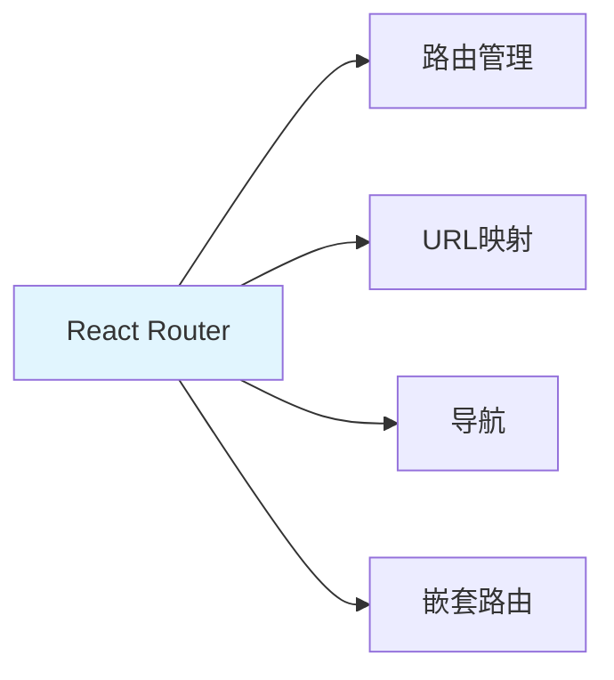

# React Router 路由系统

> **一句话**：React Router是React的路由库，用于实现单页面应用的路由管理。核心组件包括BrowserRouter、Routes、Route、Link等。

## 1. React Router基础

### 1.1 什么是React Router？



**React Router**：React的路由库，用于实现单页面应用的路由管理。

### 1.2 安装

```bash
npm install react-router-dom
```

## 2. 基础路由

### 2.1 基础配置

```jsx
import { BrowserRouter, Routes, Route, Link } from 'react-router-dom';

function App() {
    return (
        <BrowserRouter>
            <nav>
                <Link to="/">Home</Link>
                <Link to="/about">About</Link>
            </nav>
            
            <Routes>
                <Route path="/" element={<Home />} />
                <Route path="/about" element={<About />} />
            </Routes>
        </BrowserRouter>
    );
}

function Home() {
    return <h1>Home Page</h1>;
}

function About() {
    return <h1>About Page</h1>;
}
```

### 2.2 动态路由

```jsx
import { BrowserRouter, Routes, Route, useParams } from 'react-router-dom';

function App() {
    return (
        <BrowserRouter>
            <Routes>
                <Route path="/" element={<Home />} />
                <Route path="/users/:id" element={<User />} />
            </Routes>
        </BrowserRouter>
    );
}

function User() {
    const { id } = useParams();
    return <h1>User {id}</h1>;
}
```

## 3. 导航

### 3.1 Link组件

```jsx
import { Link } from 'react-router-dom';

function Navigation() {
    return (
        <nav>
            <Link to="/">Home</Link>
            <Link to="/about">About</Link>
            <Link to="/users/123">User 123</Link>
        </nav>
    );
}
```

### 3.2 编程式导航

```jsx
import { useNavigate } from 'react-router-dom';

function LoginForm() {
    const navigate = useNavigate();
    
    const handleSubmit = async (values) => {
        await login(values);
        navigate('/dashboard');
    };
    
    return (
        <form onSubmit={handleSubmit}>
            {/* 表单内容 */}
        </form>
    );
}
```

## 4. 嵌套路由

### 4.1 基础嵌套

```jsx
import { BrowserRouter, Routes, Route, Outlet, Link } from 'react-router-dom';

function App() {
    return (
        <BrowserRouter>
            <Routes>
                <Route path="/" element={<Layout />}>
                    <Route index element={<Home />} />
                    <Route path="about" element={<About />} />
                    <Route path="users" element={<Users />} />
                </Route>
            </Routes>
        </BrowserRouter>
    );
}

function Layout() {
    return (
        <div>
            <nav>
                <Link to="/">Home</Link>
                <Link to="/about">About</Link>
                <Link to="/users">Users</Link>
            </nav>
            
            <Outlet /> {/* 子路由渲染位置 */}
        </div>
    );
}
```

### 4.2 嵌套路由示例

```jsx
function Users() {
    return (
        <div>
            <h1>Users</h1>
            <Routes>
                <Route index element={<UserList />} />
                <Route path=":id" element={<UserDetail />} />
            </Routes>
        </div>
    );
}

function UserList() {
    return <div>User List</div>;
}

function UserDetail() {
    const { id } = useParams();
    return <div>User Detail {id}</div>;
}
```

## 5. 路由守卫

### 5.1 私有路由

```jsx
import { BrowserRouter, Routes, Route, Navigate } from 'react-router-dom';

function PrivateRoute({ children }) {
    const isAuthenticated = useAuth(); // 自定义Hook
    
    return isAuthenticated ? children : <Navigate to="/login" />;
}

function App() {
    return (
        <BrowserRouter>
            <Routes>
                <Route path="/login" element={<Login />} />
                <Route
                    path="/dashboard"
                    element={
                        <PrivateRoute>
                            <Dashboard />
                        </PrivateRoute>
                    }
                />
            </Routes>
        </BrowserRouter>
    );
}
```

## 6. 实际案例

### 6.1 完整应用路由

```jsx
import { BrowserRouter, Routes, Route, Link, Outlet } from 'react-router-dom';

function App() {
    return (
        <BrowserRouter>
            <Routes>
                <Route path="/" element={<Layout />}>
                    <Route index element={<Home />} />
                    <Route path="about" element={<About />} />
                    <Route path="users" element={<UsersLayout />}>
                        <Route index element={<UserList />} />
                        <Route path=":id" element={<UserDetail />} />
                    </Route>
                    <Route path="login" element={<Login />} />
                    <Route path="dashboard" element={
                        <PrivateRoute>
                            <Dashboard />
                        </PrivateRoute>
                    } />
                    <Route path="*" element={<NotFound />} />
                </Route>
            </Routes>
        </BrowserRouter>
    );
}

function Layout() {
    return (
        <div>
            <header>
                <nav>
                    <Link to="/">Home</Link>
                    <Link to="/about">About</Link>
                    <Link to="/users">Users</Link>
                </nav>
            </header>
            
            <main>
                <Outlet />
            </main>
            
            <footer>
                <p>© 2026</p>
            </footer>
        </div>
    );
}
```

## 7. 常见坑点

### 1. 忘记包裹BrowserRouter
```jsx
// 问题：没有包裹BrowserRouter
function App() {
    return (
        <Routes>
            <Route path="/" element={<Home />} />
        </Routes>
    );
}

// 解决：包裹BrowserRouter
function App() {
    return (
        <BrowserRouter>
            <Routes>
                <Route path="/" element={<Home />} />
            </Routes>
        </BrowserRouter>
    );
}
```

### 2. 路径不匹配
```jsx
// 问题：路径不匹配
<Route path="/users/:id" element={<User />} />
<Link to="/users/123">User 123</Link> // 正确
<Link to="/users">Users</Link> // 不匹配

// 解决：添加index路由
<Route path="/users" element={<Users />}>
    <Route index element={<UserList />} />
    <Route path=":id" element={<UserDetail />} />
</Route>
```

## 核心要点

```jsx
// 基础路由
<BrowserRouter>
    <Routes>
        <Route path="/" element={<Home />} />
        <Route path="/about" element={<About />} />
    </Routes>
</BrowserRouter>

// 导航
<Link to="/">Home</Link>
const navigate = useNavigate();
navigate('/about');

// 动态路由
<Route path="/users/:id" element={<User />} />
const { id } = useParams();
```

## 速记卡（面试闪卡）

**Q1：一句话讲清「React Router 路由系统」到底是什么？**
A：**React Router**：React的路由库，用于实现单页面应用的路由管理。

**Q2：1. React Router基础 —— 怎么理解？**
A：**React Router**：React的路由库，用于实现单页面应用的路由管理。

**Q3：核心速记主线有哪些？**
A：抓住这几根：1. React Router基础、2. 基础路由、3. 导航、4. 嵌套路由、5. 路由守卫、6. 实际案例。


## 相关链接

- 📋 目录：[[00-TypeScript-React]]
- 📚 学习清单： React
- 🔗 [[03-JSX+函数组件+Props|JSX和组件]]
- 🔗 [[04-useState+useEffect+自定义Hook|React Hooks]]
- 项目实践：[[项目实战/ai-resume笔记/01_技术研读/01_架构概览|ai-resume: 架构概览]]
