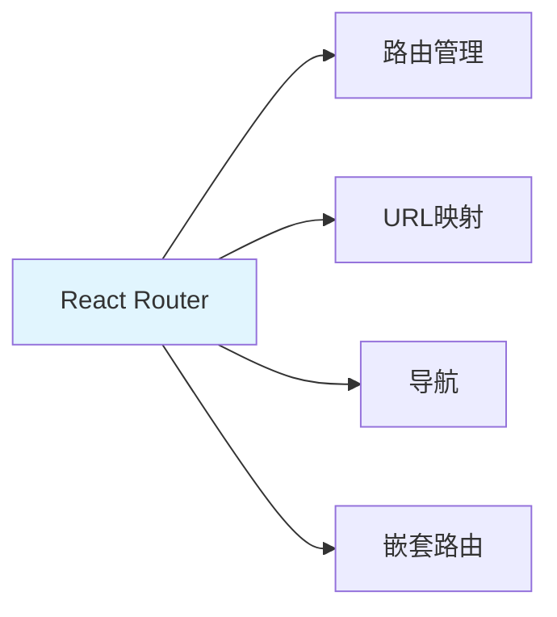

---

title: "React Router 路由系统"

tags:

  - react

  - 技术学习

created: "2026-07-21"

---

# React Router 路由系统

> **一句话**：React Router是React的路由库，用于实现单页面应用的路由管理。核心组件包括BrowserRouter、Routes、Route、Link等。

## 1. React Router基础
### 1.1 什么是React Router？



**React Router**：React的路由库，用于实现单页面应用的路由管理。

### 1.2 安装

```bash

npm install react-router-dom

```

## 2. 基础路由
### 2.1 基础配置

```jsx

import { BrowserRouter, Routes, Route, Link } from 'react-router-dom';

function App() {

    return (

        <BrowserRouter>

            <nav>

                <Link to="/">Home</Link>

                <Link to="/about">About</Link>

            </nav>

            <Routes>

                <Route path="/" element={<Home />} />

                <Route path="/about" element={<About />} />

            </Routes>

        </BrowserRouter>

    );

}

function Home() {

    return <h1>Home Page</h1>;

}

function About() {

    return <h1>About Page</h1>;

}

```

### 2.2 动态路由

```jsx

import { BrowserRouter, Routes, Route, useParams } from 'react-router-dom';

function App() {

    return (

        <BrowserRouter>

            <Routes>

                <Route path="/" element={<Home />} />

                <Route path="/users/:id" element={<User />} />

            </Routes>

        </BrowserRouter>

    );

}

function User() {

    const { id } = useParams();

    return <h1>User {id}</h1>;

}

```

## 3. 导航
### 3.1 Link组件

```jsx

import { Link } from 'react-router-dom';

function Navigation() {

    return (

        <nav>

            <Link to="/">Home</Link>

            <Link to="/about">About</Link>

            <Link to="/users/123">User 123</Link>

        </nav>

    );

}

```

### 3.2 编程式导航

```jsx

import { useNavigate } from 'react-router-dom';

function LoginForm() {

    const navigate = useNavigate();

    const handleSubmit = async (values) => {

        await login(values);

        navigate('/dashboard');

    };

    return (

        <form onSubmit={handleSubmit}>

            {/* 表单内容 */}

        </form>

    );

}

```

## 4. 嵌套路由
### 4.1 基础嵌套

```jsx

import { BrowserRouter, Routes, Route, Outlet, Link } from 'react-router-dom';

function App() {

    return (

        <BrowserRouter>

            <Routes>

                <Route path="/" element={<Layout />}>

                    <Route index element={<Home />} />

                    <Route path="about" element={<About />} />

                    <Route path="users" element={<Users />} />

                </Route>

            </Routes>

        </BrowserRouter>

    );

}

function Layout() {

    return (

        <div>

            <nav>

                <Link to="/">Home</Link>

                <Link to="/about">About</Link>

                <Link to="/users">Users</Link>

            </nav>

            <Outlet /> {/* 子路由渲染位置 */}

        </div>

    );

}

```

### 4.2 嵌套路由示例

```jsx

function Users() {

    return (

        <div>

            <h1>Users</h1>

            <Routes>

                <Route index element={<UserList />} />

                <Route path=":id" element={<UserDetail />} />

            </Routes>

        </div>

    );

}

function UserList() {

    return <div>User List</div>;

}

function UserDetail() {

    const { id } = useParams();

    return <div>User Detail {id}</div>;

}

```

## 5. 路由守卫
### 5.1 私有路由

```jsx

import { BrowserRouter, Routes, Route, Navigate } from 'react-router-dom';

function PrivateRoute({ children }) {

    const isAuthenticated = useAuth(); // 自定义Hook

    return isAuthenticated ? children : <Navigate to="/login" />;

}

function App() {

    return (

        <BrowserRouter>

            <Routes>

                <Route path="/login" element={<Login />} />

                <Route

                    path="/dashboard"

                    element={

                        <PrivateRoute>

                            <Dashboard />

                        </PrivateRoute>

                    }

                />

            </Routes>

        </BrowserRouter>

    );

}

```

## 6. 实际案例
### 6.1 完整应用路由

```jsx

import { BrowserRouter, Routes, Route, Link, Outlet } from 'react-router-dom';

function App() {

    return (

        <BrowserRouter>

            <Routes>

                <Route path="/" element={<Layout />}>

                    <Route index element={<Home />} />

                    <Route path="about" element={<About />} />

                    <Route path="users" element={<UsersLayout />}>

                        <Route index element={<UserList />} />

                        <Route path=":id" element={<UserDetail />} />

                    </Route>

                    <Route path="login" element={<Login />} />

                    <Route path="dashboard" element={

                        <PrivateRoute>

                            <Dashboard />

                        </PrivateRoute>

                    } />

                    <Route path="*" element={<NotFound />} />

                </Route>

            </Routes>

        </BrowserRouter>

    );

}

function Layout() {

    return (

        <div>

            <header>

                <nav>

                    <Link to="/">Home</Link>

                    <Link to="/about">About</Link>

                    <Link to="/users">Users</Link>

                </nav>

            </header>

            <main>

                <Outlet />

            </main>

            <footer>

                <p>© 2026</p>

            </footer>

        </div>

    );

}

```

## 7. 常见坑点
### 1. 忘记包裹BrowserRouter

```jsx

// 问题：没有包裹BrowserRouter

function App() {

    return (

        <Routes>

            <Route path="/" element={<Home />} />

        </Routes>

    );

}

// 解决：包裹BrowserRouter

function App() {

    return (

        <BrowserRouter>

            <Routes>

                <Route path="/" element={<Home />} />

            </Routes>

        </BrowserRouter>

    );

}

```

### 2. 路径不匹配

```jsx

// 问题：路径不匹配

<Route path="/users/:id" element={<User />} />

<Link to="/users/123">User 123</Link> // 正确

<Link to="/users">Users</Link> // 不匹配

// 解决：添加index路由

<Route path="/users" element={<Users />}>

    <Route index element={<UserList />} />

    <Route path=":id" element={<UserDetail />} />

</Route>

```

## 核心要点

```jsx

// 基础路由

<BrowserRouter>

    <Routes>

        <Route path="/" element={<Home />} />

        <Route path="/about" element={<About />} />

    </Routes>

</BrowserRouter>

// 导航

<Link to="/">Home</Link>

const navigate = useNavigate();

navigate('/about');

// 动态路由

<Route path="/users/:id" element={<User />} />

const { id } = useParams();

```

## 速记卡（面试闪卡）

**Q1：一句话讲清「React Router 路由系统」到底是什么？**

A：React Router 是 React 的路由库，像给单页应用装了一套「导航地图」，让 URL 和页面组件一一对应。

**Q2：四个核心组件先认脸 —— 怎么理解？**

A：把 React Router 想成小区门牌系统：BrowserRouter 是整片小区的「地基围墙」，Routes 是「总路牌」，Route 是「某栋楼的门牌＝地址对应某一户」，Link 是「楼道里的指示箭头」。英文全称 BrowserRouter（浏览器路由容器，把地址栏变化喂给 React）。四个凑齐，点链接才不刷新整页。

**Q3：动态路由像「带通配符的快递柜」 —— 怎么理解？**

A：路径里写 /users/:id，这个冒号就是「万能格子编号」——无论快递单号是 123 还是 456，都投递到同一个柜子，柜子里用 useParams()（读取路径参数的钩子）取出具体编号。生活类比：酒店房号 3 楼任意一间都走同一套「入住流程」，只是房号不同。

**Q4：嵌套路由像「套娃式的楼层导视」 —— 怎么理解？**

A：大 Route 里包小 Route，外层 Layout 用 <Outlet/>（子路由出口占位符）留了个「屏幕」，子页面像插进来的视频。好比商场：一楼大厅是 Layout，里面的服装区、餐饮区是子路由，各自独立又共享大厅电梯。Navigate 组件则是「强制定向」——没权限就直接把你拐去登录页。

**Q5：路由守卫像「小区门禁」 —— 怎么理解？**

A：私有路由 PrivateRoute 用自定义 Hook 判断「你登录没」，没登录就 <Navigate> 把你弹回 /login（登录页）。这就是前端版的门禁刷卡：访客（未登录）想进 dashboard（后台）楼层？先去前台登记（登录）。一句话：路由守卫＝在进页面之前先查身份。

**Q6：核心速记主线有哪些？**

- 四大件：BrowserRouter 围墙、Routes 总路牌、Route 门牌、Link 箭头

- 动态路由 :id 是万能格子，useParams 取具体编号

- 嵌套路由靠 <Outlet/> 留屏幕，子页面往里插

- 路由守卫 PrivateRoute 先查身份，没登录弹回登录页

**口诀**

A：React Router 管地图，URL 配组件不刷新；

冒号通配收快递，useParams 取编号；

外套留屏插子页，嵌套套娃不迷路；

门禁先查登录态，没卡弹回登录处。

## 相关链接

- 📋 目录：[[00-TypeScript-React]]

- 📚 学习清单： React

- 🔗 [[03-JSX+函数组件+Props|JSX和组件]]

- 🔗 [[04-useState+useEffect+自定义Hook|React Hooks]]

