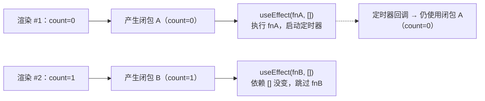

# React副作用与自定义Hook

> 写给初学者：每个概念都从"为什么需要它"开始讲，配合通俗比喻和完整可运行代码。

---

## 一、useEffect 进阶

### 1.1 闭包陷阱

闭包是 JS 的核心机制——**函数能"记住"它出生时周围的变量**，即使外部代码已经跑完了。

```tsx
// 闭包的最简例子
function createPrinter(name) {
  return function () {
    console.log(name);  // 这个 name 来自 createPrinter 的参数
  };
}
```

**闭包 + useEffect = 陷阱**：
每次组件渲染都创建一套新的变量和新的闭包。`useEffect(fn, [])` 把第一次渲染的 fn 钉死了。



**三种解法**：

| 场景 | 推荐方案 |
|:---|:---|
| 只是用 state 算新 state | `setCount(prev => prev + 1)`（函数式更新，绕过闭包） |
| 需要读 state 做其他事 | 加依赖数组 |
| 需要读最新值但不方便重建 Effect | useRef |

```tsx
// 方案 1：加依赖数组
useEffect(() => {
  const timer = setInterval(() => {
    console.log("count:", count);
  }, 1000);
  return () => clearInterval(timer);
}, [count]);

// 方案 2：函数式更新（推荐）
useEffect(() => {
  const timer = setInterval(() => {
    setCount(prev => prev + 1);  // prev 来自 React，不依赖闭包
  }, 1000);
  return () => clearInterval(timer);
}, []);

// 方案 3：useRef 存最新值
const countRef = useRef(count);
countRef.current = count;

useEffect(() => {
  const timer = setInterval(() => {
    console.log("count:", countRef.current);  // 永远是最新值
  }, 1000);
  return () => clearInterval(timer);
}, []);
```

### 1.2 cleanup 函数的三种触发时机

| 时机 | 触发条件 | 清理的是哪次 Effect |
|:---|:---|:---|
| 依赖变化 | 依赖变了，准备执行新 Effect 之前 | 上一次 setup 返回的 cleanup |
| 组件卸载 | 组件从 DOM 移除 | 最后一次 setup 返回的 cleanup |
| 依赖不变 | 不触发 | 不做任何事 |

```tsx
// 典型 cleanup：事件监听
function MouseTracker() {
  const [position, setPosition] = useState({ x: 0, y: 0 });

  useEffect(() => {
    function handleMove(e: MouseEvent) {
      setPosition({ x: e.clientX, y: e.clientY });
    }
    window.addEventListener("mousemove", handleMove);

    return () => {
      window.removeEventListener("mousemove", handleMove);
    };
  }, []);

  return <div>鼠标位置: {position.x}, {position.y}</div>;
}
```

> **为什么 `handleMove` 必须定义在 useEffect 里面？** `removeEventListener` 需要和 `addEventListener` **完全相同的函数引用**。定义在 useEffect 里面 + `[]` 空依赖 → 函数只创建一次 → 装和拆用的是同一个引用。

---

## 二、useRef — 可变但不触发渲染

有两个需求是 useState 做不到的：
- 记一个值，但变了不要触发重新渲染
- 直接拿到 DOM 元素

> **通俗比喻**：useState = 教室里的黑板（写上去大家都看到，擦掉重写大家也看到）；useRef = 你兜里的便签（写给自己看的，别人不知道）。

`useRef(初始值)` 返回一个普通 JS 对象：`{ current: 初始值 }`。

```tsx
const countRef = useRef(0);
countRef.current = 5;         // ✅ 直接赋值
console.log(countRef.current); // ✅ 直接读取 → 5
```

### 2.1 核心用途 1：存储可变值（不触发渲染）

```tsx
function TimerWithRef() {
  const [seconds, setSeconds] = useState(0);
  const intervalRef = useRef(null);

  function start() {
    if (intervalRef.current !== null) return;  // 防重复启动
    intervalRef.current = setInterval(() => {
      setSeconds(prev => prev + 1);
    }, 1000);
  }

  function stop() {
    if (intervalRef.current !== null) {
      clearInterval(intervalRef.current);
      intervalRef.current = null;
    }
  }

  return (
    <div>
      <p>{seconds} 秒</p>
      <button onClick={start}>开始</button>
      <button onClick={stop}>停止</button>
    </div>
  );
}
```

**三句话总结**：
1. **定时器归浏览器管**——启动后独立运行，React 渲染不干涉它
2. **渲染归 state 管**——`setSeconds` 触发渲染，`intervalRef.current = 1` 不触发
3. **ref 贯穿所有渲染**——同一个 `{ current }` 对象，跨渲染不变

### 2.2 核心用途 2：DOM 引用

```tsx
function AutoFocus() {
  const inputRef = useRef(null);

  useEffect(() => {
    if (inputRef.current) {
      inputRef.current.focus();  // 直接操作 DOM
    }
  }, []);

  return <input ref={inputRef} type="text" placeholder="自动聚焦" />;
}
```

**分阶段**：
- 渲染阶段：`inputRef.current = null`（DOM 还没创建）
- 提交阶段：React 创建 `<input>` → `inputRef.current = 那个 <input>`
- useEffect 执行：`inputRef.current.focus()`（DOM 已存在）

### 2.3 state vs ref 速查

| | useState | useRef |
|:---|:---|:---|
| 修改触发渲染 | 会 | 不会 |
| 多次渲染间保留值 | 会 | 会 |
| 直接操作 DOM | 不行 | 可以 |
| 异步回调中取最新值 | 小心闭包 | 一直是最新的 |

---

## 三、自定义 Hook

### 3.1 命名规则：必须以 use 开头

```tsx
useWindowSize     → React 知道这是 Hook
windowSize        → React 不知道，不做检查
```

### 3.2 基本模式

```tsx
function useWindowSize() {
  const [size, setSize] = useState({
    width: window.innerWidth,
    height: window.innerHeight,
  });

  useEffect(() => {
    function handleResize() {
      setSize({ width: window.innerWidth, height: window.innerHeight });
    }
    window.addEventListener("resize", handleResize);
    return () => window.removeEventListener("resize", handleResize);
  }, []);

  return size;
}

// 任何组件只要一行就拿到窗口大小
function MyComponent() {
  const { width } = useWindowSize();
  return <div>窗口宽度: {width}</div>;
}
```

### 3.3 自定义 Hook 可以组合

```tsx
function useUserPreferences(userId: number) {
  const windowSize = useWindowSize();
  const theme = useLocalStorage("theme", "light");
  const fontSize = useLocalStorage("fontSize", "16");

  return { ...windowSize, theme, fontSize };
}
```

React 不关心你套了几层 Hook——它只按调用顺序把所有 `useState`、`useEffect` 登记在同一个链表上。

### 3.4 useLocalStorage 完整实现

```tsx
function useLocalStorage(key: string, initial: any) {
  // 1. 初始化，从 localStorage 读值
  const [stored, setStored] = useState(() => {
    try {
      const item = window.localStorage.getItem(key);
      return item ? JSON.parse(item) : initial;
    } catch {
      return initial;
    }
  });

  // 2. 值变化时自动写入 localStorage
  useEffect(() => {
    try {
      window.localStorage.setItem(key, JSON.stringify(stored));
    } catch {
      console.warn("写入 localStorage 失败");
    }
  }, [key, stored]);

  // 3. 返回和 useState 一样的 API
  return [stored, setStored];
}

// 使用
const [theme, setTheme] = useLocalStorage("theme", "light");
```

---

## 速查表

| 概念 | 一句话解释 | 关键代码 |
|:---|:---|:---|
| 闭包陷阱 | Effect 记住的是旧值 | 把用到的变量加进依赖数组 |
| `useRef` | 可变但不触发渲染的便签 | `const r = useRef(0)` → `r.current` |
| ref + DOM | 直接拿到 DOM 元素 | `<div ref={myRef}>` |
| 自定义 Hook | 抽取可复用的逻辑 | `function useXXX() { ... }` |
| cleanup | 组件卸载时擦屁股 | `return () => clearInterval(t)` |

---

## 速记卡（面试闪卡）

**Q1：一句话讲清「React副作用与自定义Hook」到底是什么？**
A：闭包是 JS 的核心机制——**函数能"记住"它出生时周围的变量**，即使外部代码已经跑完了。
**闭包 + useEffect = 陷阱**：
每次组件渲染都创建一套新的变量和新的闭包。 把第一次渲染的 fn 钉死了。

**Q2：一、useEffect 进阶 —— 怎么理解？**
A：闭包是 JS 的核心机制——**函数能"记住"它出生时周围的变量**，即使外部代码已经跑完了。
**闭包 + useEffect = 陷阱**：
每次组件渲染都创建一套新的变量和新的闭包。 把第一次渲染的 fn 钉死了。
**三种解法**：
| 场景 | 推荐方案 |
|:---|:---|
| 只是用 state 算新 state | （函数式更新，绕过闭包） |
| 需要读 state 做其他事 | 加依赖数组 |

**Q3：二、useRef — 可变但不触发渲染 —— 怎么理解？**
A：有两个需求是 useState 做不到的：
记一个值，但变了不要触发重新渲染
直接拿到 DOM 元素
**通俗比喻**：useState = 教室里的黑板（写上去大家都看到，擦掉重写大家也看到）；useRef = 你兜里的便签（写给自己看的，别人不知道）。
 返回一个普通 JS 对象：。

**Q4：三、自定义 Hook —— 怎么理解？**
A：React 不关心你套了几层 Hook——它只按调用顺序把所有 、 登记在同一个链表上。
---

**Q5：速查表 —— 怎么理解？**
A：| 概念 | 一句话解释 | 关键代码 |
|:---|:---|:---|
| 闭包陷阱 | Effect 记住的是旧值 | 把用到的变量加进依赖数组 |
|  | 可变但不触发渲染的便签 |  →  |
| ref + DOM | 直接拿到 DOM 元素 |  |
| 自定义 Hook | 抽取可复用的逻辑 |  |
| cleanup | 组件卸载时擦屁股 |  |
---

**Q6：核心速记主线有哪些？**
A：抓住这几根：一、useEffect 进阶、二、useRef — 可变但不触发渲染、三、自定义 Hook、速查表。


## 相关链接

- 目录：[[00-TypeScript]]
- 上一篇：[[06-React Hooks深入]]
- 下一篇：[[05-React-Router路由系统|React Router路由系统]]
- 项目实践：[[项目实战/ai-resume笔记/01_技术研读/01_架构概览|ai-resume: 架构概览]]

---
→ [[技术学习清单#React 入门]]
