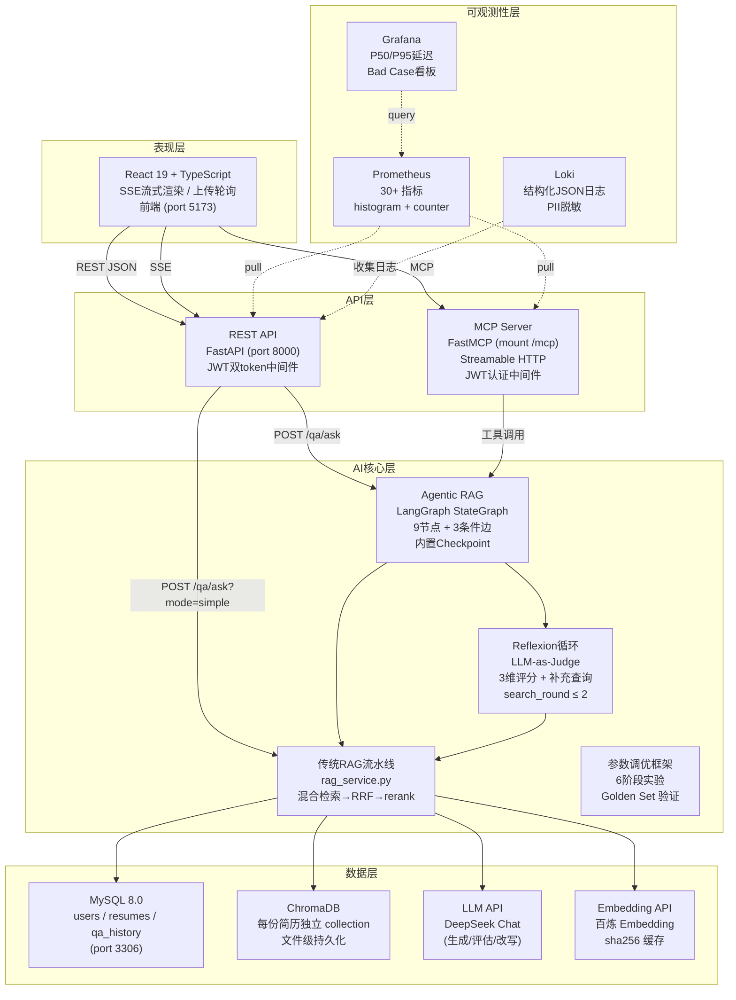
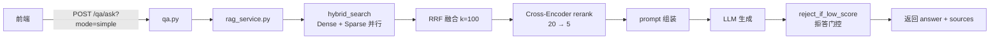
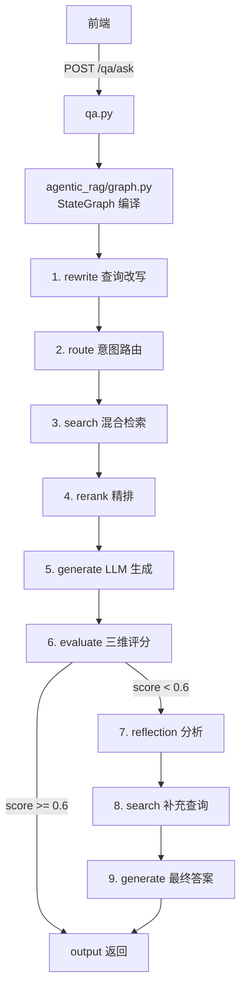
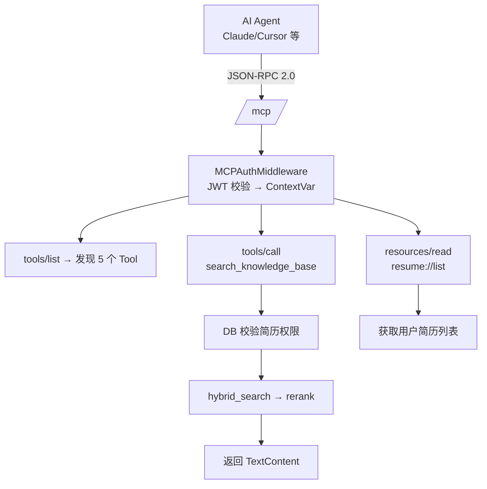

# 架构概览

> **知道项目长什么样、怎么跑起来的，才能在实践中展开深度细节。**
>
> 一个 AI 简历分析系统：上传 PDF/DOCX → 解析向量化 → 自然语言问答。
> 相当于给 HR 配了个"简历版 ChatGPT"——"这个候选人做过微服务吗？" → 系统翻简历找答案。

---

## 目录

- [一句话介绍](#一句话介绍)
- [技术栈总览](#技术栈总览)
- [目录结构（含实际文件路径）](#目录结构含实际文件路径)
- [四层架构图 + 服务依赖](#四层架构图--服务依赖)
- [请求全流程（三条路径）](#请求全流程三条路径)
- [技术选型深度解读](#技术选型深度解读)
- [常见疑问](#常见疑问)

---

## 一句话介绍

> AI 简历分析系统 = RAG 搜索 + Agent 智能编排 + MCP 协议标准化

不是简单的"调 API 回答问题"——这是一个带自评估、自纠正能力的 Agentic RAG 系统，并且在架构上集成了 MCP 协议，第三方 AI Agent 也能通过标准化协议来查询简历。

🔴 **记忆级**：项目的三个技术标签：RAG / Agent (LangGraph) / MCP

---

## 技术栈总览

| 层级        | 技术                                     | 选型理由                          |
| --------- | -------------------------------------- | ----------------------------- |
| **前端**    | React 19 + TypeScript + Vite 8         | SSE 原生支持，流式渲染体验               |
| **后端框架**  | FastAPI (Python 3.12+)                 | 异步原生，自动 OpenAPI，社区成熟          |
| **AI 编排** | LangGraph (StateGraph)                 | 状态机显式控制流，内置 Checkpoint        |
| **检索**    | ChromaDB（本地持久化）                        | 轻量无需单独部署，每份简历独立 collection    |
| **数据库**   | MySQL 8.0 (SQLAlchemy async)           | 成熟可靠，SQLAlchemy 自动迁移（Alembic） |
| **LLM**   | Xiaomi MiMo `mimo-v2.5` + 百炼 Embedding | 小米自研推理模型，中文理解与 Agentic 规划能力强  |
| **协议**    | MCP (FastMCP + Streamable HTTP)        | 2025-2026 Agent 工具交互标准        |
| **容器化**   | Docker Compose（5 套配置）                  | 开发/测试/生产/监控环境分离               |

🔴 **记忆级**：8 项技术名称及各自职责。特别注意"5 套 docker-compose"——延伸提问"你的项目怎么部署"时，这是差异化回答。

**5 套 Docker Compose 配置**：

| 文件 | 用途 | 启动内容 |
|------|------|----------|
| `docker-compose.yml` | 基础 | 后端 + MySQL |
| `docker-compose.local.yml` | 本地开发 | 后端 + MySQL（热重载） |
| `docker-compose.dev.yml` | 开发服务器 | 后端 + MySQL + 前端 |
| `docker-compose.monitor.yml` | 监控栈 | Prometheus + Grafana + Loki |
| `deploy/docker-compose.prod.yml` | 生产 | 后端 + MySQL + Nginx + SSL |

---

## 目录结构（含实际文件路径）

```text
ai-resume-analyzer/
├── backend/                          # ~5000 行 Python
│   ├── main.py                       # FastAPI 入口 + lifespan + 中间件链
│   ├── pyproject.toml                # 项目元数据 + 依赖（pyproject.toml 替代 setup.py）
│   ├── Dockerfile                    # 多阶段构建（build→prod，镜像 ~180MB）
│   │
│   ├── api/                          # REST API 路由层
│   │   ├── auth.py                   # 注册/登录/刷新 token
│   │   ├── resumes.py                # 上传/列表/详情/删除（202 异步轮询）
│   │   └── qa.py                     # 同步问答/SSE 流式/历史记录
│   │
│   ├── core/                         # 核心基础设施（核心目录）
│   │   ├── config.py                 # 配置管理（env 文件→Settings dataclass）
│   │   ├── security.py               # JWT 双 token + 解码
│   │   ├── retry.py                  # 指数退避重试 + NON_RETRYABLE 分类
│   │   ├── cache.py                  # Embedding 缓存（sha256→vector）
│   │   ├── trace.py                  # 全链路追踪 StepTimer
│   │   ├── rag_params.py             # 11 个可调参数 dataclass + 参数化版 TOML
│   │   ├── logging_config.py         # JSON 结构化日志 + PII 脱敏 + LogSampler
│   │   └── metrics.py                # Prometheus 30+ 指标（4 层 18 细分）
│   │
│   ├── models/                       # SQLAlchemy ORM
│   │   ├── user.py                   # users 表（hashed_password + refresh_token）
│   │   ├── resume.py                 # resumes 表（status→processing/ready/failed）
│   │   └── qa_history.py             # qa_history 表（question + answer + feedback）
│   │
│   ├── services/
│   │   ├── rag/                      # ⭐ 传统 RAG 流水线（模块化重构）
│   │   │   ├── chunking.py           # 分块引擎（165 行）
│   │   │   ├── retrieval.py          # 检索与排序（313 行）
│   │   │   ├── pipeline.py           # 流水线编排（292 行）
│   │   │   ├── clients.py            # 客户端管理
│   │   │   └── chunks_service.py     # chunk 服务
│   │   ├── auth_service.py           # 注册 / 密码哈希 / token 签发
│   │   ├── resume_service.py         # 上传→异步解析→分块→向量化
│   │   ├── qa_service.py             # 问答记录持久化
│   │   └── agentic_rag/              # ⭐⭐ LangGraph 状态机（核心）
│   │       ├── graph.py              # StateGraph 编译（9 节点 + 3 条件边 + Checkpoint）
│   │       ├── state.py              # 21 字段 TypedDict（完整的执行状态）
│   │       ├── rewrite.py            # 查询改写（指代消解 + 追问生成）
│   │       ├── search.py             # 混合检索（Dense + Sparse → RRF）
│   │       ├── generate.py           # 生成 + LLM-as-Judge 评估（三级拒答）
│   │       ├── reflection.py         # Reflexion 自纠正循环（分析→补充查询→重搜）
│   │       ├── mcp_nodes.py          # MCP 模式节点（复用 search + generate）
│   │       └── mcp_graph.py          # MCP 模式 StateGraph（简化版 5 节点）
│   │
│   ├── mcp_server/                   # 🔌 MCP 协议服务端（技术亮点）
│   │   ├── server.py                 # FastMCP 实例 + JWT 认证中间件（94 行）
│   │   ├── transport/
│   │   │   └── http.py               # Streamable HTTP ASGI 挂载（51 行）
│   │   ├── tools/                    # 5 个 Tool（~466 行）
│   │   │   ├── search.py             # 混合检索 + 权限校验（76 行）
│   │   │   ├── analyze.py            # 三类分析提示词（116 行）
│   │   │   ├── generate.py           # 检索增强生成（110 行）
│   │   │   ├── rewrite.py            # 查询改写（40 行）
│   │   │   └── rerank.py             # LLM Cross-Encoder 精排（124 行）
│   │   └── resources/                # 2 个 Resource（~90 行）
│   │       ├── resumes.py            # resume://list（37 行）
│   │       └── history.py            # qa_history://{resume_id}（53 行）
│   │
│   ├── mcp_client/                   # 🔌 MCP 客户端（降级封装）
│   │   ├── client.py                 # httpx 异步客户端 + JSON-RPC 2.0（186 行）
│   │   └── tools.py                  # 3 个降级封装函数（108 行）
│   │
│   ├── rag_tuning/                   # 📊 参数调优实验框架
│   │   ├── evaluate.py               # 6 阶段实验 + LLM-as-Judge 评估（688 行）
│   │   └── run_concurrent.py         # 并发 Runner + 断点续跑（201 行）
│   │
│   ├── tests/                        # 326 个测试
│   ├── alembic/                      # 数据库迁移
│   ├── schemas/                      # Pydantic 请求/响应模型
│   └── utils/                        # 工具函数
│
├── frontend/                         # ~2000 行 TypeScript
├── deploy/                           # 生产部署配置
└── docker-compose*.yml               # 5 套 Docker 编排
```

🔴 **记忆级**：`services/agentic_rag/`（9 文件）、`core/`（7 文件）、`mcp_server/tools/`（5 文件）三个核心目录——追问到具体文件时，你能说"那个在第 X 篇笔记的第 Y 行"

---

## API 层详细解读

> 📍 `api/` 目录（4 文件）

### 路由组织

```text
api/
├── auth.py          # 认证：注册/登录/刷新/登出
├── resumes.py       # 简历：上传/列表/详情/删除/分析
├── qa.py            # 问答：同步/流式/历史
├── deps.py          # 依赖注入：get_current_user
└── v1/
    └── router.py    # v1 路由汇总 + 旧路由重定向
```

🟡 **原理级**：路由按业务域拆分，不是按 HTTP 方法拆分。每个文件对应一个业务实体（用户、简历、问答），职责清晰。

### 认证 API（auth.py）

| 端点 | 方法 | 说明 | 限流 |
|------|------|------|------|
| `/auth/register` | POST | 注册新用户 | 5/min |
| `/auth/login` | POST | 登录（JSON） | 10/min |
| `/auth/token` | POST | 登录（form，Swagger 用） | 10/min |
| `/auth/refresh` | POST | 刷新 access token | 10/min |
| `/auth/logout` | POST | 登出（撤销 token + 清 cookie） | - |

🟡 **原理级**：双模登录——JSON 给前端，form 给 Swagger。SEC-004 同时下发 HttpOnly Cookie 和 JSON Bearer，兼顾安全和兼容。

### 简历 API（resumes.py）

| 端点 | 方法 | 说明 | 状态码 |
|------|------|------|--------|
| `/resumes` | POST | 上传简历 | 202（异步）/ 200（幂等） |
| `/resumes` | GET | 列表（分页） | 200 |
| `/resumes/{id}` | GET | 详情 + 状态 | 200 |
| `/resumes/{id}` | DELETE | 删除 | 204 |
| `/resumes/{id}/chunks` | GET | 查看分块结果 | 200 |
| `/resumes/{id}/analyze` | POST | 智能分析 | 200 |

🟡 **原理级**：上传用 202 Accepted + BackgroundTasks 异步处理，前端轮询状态。幂等键（Idempotency-Key）防重复上传。

### 问答 API（qa.py）

| 端点 | 方法 | 说明 | 限流 |
|------|------|------|------|
| `/qa/ask` | POST | 同步问答 | 20/min |
| `/qa/ask/stream` | POST | SSE 流式问答 | 20/min |
| `/qa/history/{resume_id}` | GET | 问答历史（分页） | - |
| `/qa/history/{id}` | DELETE | 删除单条记录 | - |

🟡 **原理级**：流式用 `StreamingResponse(media_type="text/event-stream")`，前端用 EventSource 监听。SEC-008 提示注入检测在进模型前拦截。

### 依赖注入（deps.py）

```python
async def get_current_user(
    request: Request,
    db: AsyncSession = Depends(get_db),
) -> User:
    """从请求中提取 token → 解码 → 查数据库 → 返回用户对象"""
    token = extract_token_from_request(request)
    payload = decode_token(token)
    user = await get_user_by_id(db, int(payload["sub"]))
    if user is None:
        raise HTTPException(status_code=401, detail="用户不存在")
    return user
```

🟡 **原理级**：FastAPI 的 Depends 机制——每个需要认证的端点注入 `current_user: User = Depends(get_current_user)`。token 提取支持 Bearer 和 Cookie 双模。

### 路由汇总（v1/router.py）

```python
"""v1 路由汇总：auth + resumes + qa。"""
from fastapi import APIRouter

from api.auth import router as auth_router
from api.qa import router as qa_router
from api.resumes import router as resumes_router

v1_router = APIRouter()

v1_router.include_router(auth_router)
v1_router.include_router(resumes_router)
v1_router.include_router(qa_router)
```

🟢 **了解级**：v1 路由汇总——所有 API 都挂载到 `/api/v1/` 前缀下。旧路由（`/auth/*`、`/resumes/*`）自动重定向到新路径。

---

## 数据层详细解读

> 📍 `models/` 目录（3 文件）

### 数据库连接池（database.py）

```python
from sqlalchemy.ext.asyncio import AsyncSession, async_sessionmaker, create_async_engine

engine = create_async_engine(
    settings.DATABASE_URL,
    pool_size=10,          # 连接池大小
    max_overflow=20,       # 最大溢出连接
    pool_pre_ping=True,    # 连接前ping检测
    pool_recycle=3600,     # 主动回收空闲连接，防止 MySQL wait_timeout 断开
)

AsyncSessionLocal = async_sessionmaker(
    engine,
    class_=AsyncSession,
    expire_on_commit=False,  # commit 后对象还能用
)

async def get_db():
    """每个请求拿一个 session，用完还回连接池"""
    async with AsyncSessionLocal() as session:
        yield session
```

🟡 **原理级**：SQLAlchemy 异步连接池——`pool_size=10` 表示最多 10 个并发连接，`max_overflow=20` 表示高峰时可溢出到 30 个。`pool_recycle=3600` 防止 MySQL 的 `wait_timeout` 断开空闲连接。

### 用户表（user.py）

```python
class User(Base):
    __tablename__ = "users"
    id = Column(Integer, primary_key=True)
    email = Column(String(255), unique=True, nullable=False)
    hashed_password = Column(String(255), nullable=False)
    refresh_token = Column(String(512), nullable=True)  # SEC-005：撤销用
    created_at = Column(DateTime, default=func.now())
```

🟢 **了解级**：refresh_token 存数据库支持登出撤销（SEC-005）。bcrypt 哈希密码，不可逆。

### 简历表（resume.py）

```python
class Resume(Base):
    __tablename__ = "resumes"
    id = Column(Integer, primary_key=True)
    user_id = Column(Integer, ForeignKey("users.id"), nullable=False)
    filename = Column(String(255), nullable=False)
    file_path = Column(String(512), nullable=False)
    status = Column(String(20), default="processing")  # processing/ready/failed
    parsed_text = Column(Text, nullable=True)
    idempotency_key = Column(String(64), nullable=True)  # 幂等去重
    created_at = Column(DateTime, default=func.now())
```

🟡 **原理级**：状态机 `processing → ready / failed`。前端轮询 1.5s 间隔查状态。幂等键防重复上传。

### 问答历史表（qa_history.py）

```python
class QAHistory(Base):
    __tablename__ = "qa_history"
    id = Column(Integer, primary_key=True)
    resume_id = Column(Integer, ForeignKey("resumes.id"), nullable=False)
    user_id = Column(Integer, ForeignKey("users.id"), nullable=False)
    question = Column(Text, nullable=False)
    answer = Column(Text, nullable=False)
    sources = Column(JSON, nullable=True)  # 来源 chunk 列表
    feedback = Column(Integer, nullable=True)  # 用户反馈 1/-1
    created_at = Column(DateTime, default=func.now())
```

🟢 **了解级**：sources 存 JSON 格式的 chunk 引用，支持来源溯源。feedback 支持用户评价。

---

## 验证层详细解读

> 📍 `schemas/` 目录（3 文件）

### Pydantic 模型组织

```text
schemas/
├── auth.py      # RegisterRequest, LoginRequest, TokenResponse, UserResponse
├── resume.py    # UploadAsyncResponse, ResumeResponse, ChunksResponse, AnalyzeRequest
└── qa.py        # QuestionRequest, AnswerResponse, QAHistoryResponse
```

🟡 **原理级**：Pydantic v2 模式——请求用 `Request` 后缀，响应用 `Response` 后缀。FastAPI 自动校验 + 序列化。

### 关键 Schema 示例

```python
# schemas/auth.py
class RegisterRequest(BaseModel):
    email: EmailStr                    # 自动校验邮箱格式
    password: str = Field(min_length=8)  # 密码最少 8 位
    confirm_password: str              # 二次确认

    @validator("confirm_password")
    def passwords_match(cls, v, values):
        if v != values.get("password"):
            raise ValueError("两次密码不一致")
        return v

# schemas/qa.py
class QuestionRequest(BaseModel):
    resume_id: int
    question: str = Field(min_length=1, max_length=500)
    mode: str = Field(default="agentic", pattern="^(simple|agentic)$")
```

🟡 **原理级**：自定义 validator 处理复杂校验（如两次密码一致）。Field 约束长度和模式。

---

## 四层架构图 + 服务依赖



🔴 **记忆级**：能在白板上画出 5 层（加上可观测性层），标注每层的核心技术和端口

---

## 请求全流程（三条路径）

### 路径 A：REST 传统模式（`/qa/ask?mode=simple`）



### 路径 B：REST Agentic 模式（`/qa/ask` 默认）



> 如果在 MCP 模式则走 `mcp_graph.py`（5 节点简化版）

### 路径 C：MCP Agent 模式（`/mcp/`）



🔴 **记忆级**：三条路径的名称和入口（REST 传统 / REST Agentic / MCP Agent）。延伸提问"用户请求到返回的全过程"——按路径分三段讲。

---

## 技术选型深度解读

### LangGraph 为什么比 LangChain Agent 更适合？

**回答框架：**

| 维度 | LangChain Agent | LangGraph StateGraph |
|------|-----------------|---------------------|
| **调用链** | 黑盒，选工具随机的 | 白盒，DAG 预期路径 |
| **状态管理** | 历史消息隐式传递 | 21 字段 TypedDict 显式管理 |
| **可调试** | 回看 log 才能跟踪 | 内置 Checkpoint 序列化，断点回放 |
| **控制粒度** | "用哪个工具你决定" | "评估分数<0.6 才走 Reflexion" |
| **修复** | Agent 可能自我纠正也可能跑偏 | 条件边短路/重跑，路径明确 |

延伸提问"那 LangGraph 有什么缺点？"——
答："学习曲线更陡，25 字段 TypedDict 设计需要精心规划。而且对于简单任务（一行查询），9 节点 DAG 比直接调 API 慢 30%-50%。所以项目保留了传统 RAG 模式（mode=simple），让用户选择'快速模式'还是'精确模式'。"

### ChromaDB vs Qdrant vs Milvus — 为什么选最轻量？

| 特性 | ChromaDB | Qdrant | Milvus |
|------|----------|--------|--------|
| **部署** | 文件级，零运维 | Docker | Kubernetes |
| **数据量** | ~100 chunks/简历 | 百万级 | 十亿级 |
| **检索** | 暴力搜索 / HNSW | HNSW + 过滤 | IVF + HNSW |
| **项目适用** | 个人项目 | 团队内部 | 企业平台 |

**一句话讲清**：选 ChromaDB 不是因为它最好，而是 **"当前阶段最合适"**——个人项目不需要分布式。如果延伸提问"量大了怎么办"——"切换到 Qdrant 运行 Docker 实例，SQLAlchemy 的 ORM 抽象让迁移代价很小。"

### REST + MCP 两套接口的设计哲学

**核心思考**：接口的**消费者是谁**决定协议选择。

| 消费者 | 协议 | 原因 |
|--------|------|------|
| 浏览器前端 | REST | 浏览器原生，fetch/Axios 直接调用 |
| AI Agent | MCP | 标准化工具发现 + 调用 + 资源读取 |

**MCP 的核心价值不是"比 REST 好"，而是"REST 无法提供的"**：

1. **运行时发现**：Agent 通过 `tools/list` 知道有哪些工具，不需要看文档
2. **标准化参数**：JSON-RPC 2.0 的 params 结构，Agent 可以直接推断参数含义
3. **资源 URI**：`resume://list`、`qa_history://{id}` 是标准化资源地址，Agent 可以构造

**一句话讲清**："我们不是用 MCP 替代 REST，而是用 MCP 补充 REST 做不到的事。"

### 多阶段 Docker 构建

```dockerfile
# 第一阶段：构建
FROM python:3.12-slim AS builder
COPY --from=ghcr.io/astral-sh/uv:latest /uv /uvx /bin/
RUN uv sync --frozen

# 第二阶段：运行
FROM python:3.12-slim
COPY --from=builder /app ./
CMD ["uvicorn", "main:app", "--host", "0.0.0.0", "--port", "8000"]
```

**为什么分两阶段？** 最终镜像不含 uv、编译缓存、pip 缓存——从 ~800MB 降到 ~180MB。

---

## 常见疑问

### Q1：你项目读了多少行代码？

A：后端约 5000 行 Python，核心在 4 个目录：`core/`（14 文件 300+ 行基础设施）、`services/`（10 文件 1000+ 行业务逻辑，其中 RAG 流水线已模块化拆分为 `rag/` 目录）、`mcp_server/`（9 文件 700+ 行协议实现）、`rag_tuning/`（2 文件 900+ 行实验框架）。

### Q2：前端和后端怎么通信的？

A：两条路径。普通请求走 REST JSON，SSE 流式问答走 `text/event-stream`——前端用 EventSource 监听。Agent 走 MCP JSON-RPC 2.0 到 /mcp/ 端点。

### Q3：如果 LLM API 挂了系统会怎样？

A：rag_service.py 中的 with_retry 会尝试 5 次指数退避重试。全部失败后 fallback 返回"服务暂时不可用"。MCP Client 端有独立降级——mcp_generate 返回 rejected=True。前端显示友好错误提示。

### Q4：为什么用 5 套 docker-compose？

A：因为环境需求不同。`docker-compose.yml` 是基础（后端+数据库），`.local.yml` 加挂载卷热重载，`.dev.yml` 加前端，`.monitor.yml` 是监控栈（只在需要时启动，不影响主服务），`deploy/docker-compose.prod.yml` 是生产配置（多 replica + Nginx + SSL）。

### Q5：5000 行代码，你自己写的？

A：（坦率地说）整体架构和核心模块是我写的。部分工具函数和测试参考了开源实现。但关键设计——LangGraph 9 节点编排、Reflexion 自纠正逻辑、MCP 协议集成、参数调优框架——都是基于项目需求独立设计的。

---

## 相关笔记

- 学习路线总览（见各章节导航） — 全局视角
- [[02_RAG流水线|🔧 02 RAG核心流水线]] — 传统 RAG 6 步详解
- [[03_LangGraph状态机|🤖 03 Agentic RAG 与 LangGraph 图实现]] — 9 节点状态机
- [[05_MCP协议|🔌 05 MCP协议集成全链路]] — MCP Server + Client
- [[08_可观测性|📈 08 工程化与可观测性]] — Docker 编排 + 监控栈

## 技术学习笔记

- [[语言与框架/Python/实战/01_环境搭建|Python环境搭建]]
- [[语言与框架/FastAPI/实战/01-FastAPI入门与环境搭建|FastAPI入门]]
- [[语言与框架/MySQL/实战/01-数据库基础与安装|MySQL基础]]
- [[语言与框架/Redis/实战/01-Redis数据结构与缓存|Redis数据结构]]
- [[工程化与运维/异步与鉴权/03-JWT原理与设计|JWT鉴权]]
- [[工程化与运维/异步与鉴权/01-asyncio核心API与Task并发|asyncio核心API]]

---

## 项目复盘索引

| 阶段 | 复盘笔记 | 核心内容 |
|------|---------|---------|
| Phase 1 | [[02_项目复盘/01_错误处理与透传]] | 重试策略、并发安全、错误透传 |
| Phase 2 | [[02_项目复盘/02_MCP架构升级]] | MCP 路径认证绕过修复、双重检查锁 |
| Phase 3 | [[02_项目复盘/03_生产与安全加固]] | 安全响应头、令牌撤销、PII 脱敏 |
| Phase 4 | [[02_项目复盘/04_评估框架升级]] | 独立 Judge 模型、三维度评分 |
| Phase 5 | [[02_项目复盘/05_RAG参数调优]] | 参数扫描、噪音分析 |
| Phase 6 | [[02_项目复盘/06_前端Bug修复]] | 单飞锁、SSE 卡死 |
| Phase 7 | [[02_项目复盘/07_可观测性搭建]] | 异步计时器、trace_id 透传 |
| Phase 8 | [[02_项目复盘/08_后端重构]] | rag_service 巨石拆分 |
| Phase 9 | [[02_项目复盘/09_CI-CD加固]] | ACR 迁移、回滚逻辑 |
| Phase 10 | [[02_项目复盘/10_登出与JWT撤销]] | JTI 撤销、Service 层抽取 |
| Phase 11 | [[02_项目复盘/11_Token过期与单飞锁]] | 过期弹窗、全局事件总线 |
| Phase 12 | [[02_项目复盘/12_简历分块预览]] | ChromaDB 数据源、全局锁 |
| Phase 13 | [[02_项目复盘/13_历史问答管理]] | 硬删除 vs 软删除 |

准备：[[03_项目复盘/01_项目叙事与话术]] | [[03_项目复盘/02_系统设计通关]] | [[03_项目复盘/03_生产级Bug复盘]]

---

**最后更新**：2026-07-21 | **项目**：ai-resume-analyzer

## 速记卡（面试闪卡）

**Q1：一句话讲清「架构概览」到底是什么？**
A：---

**Q2：目录 —— 怎么理解？**
A：---

**Q3：一句话介绍 —— 怎么理解？**
A：AI 简历分析系统 = RAG 搜索 + Agent 智能编排 + MCP 协议标准化
不是简单的"调 API 回答问题"——这是一个带自评估、自纠正能力的 Agentic RAG 系统，并且在架构上集成了 MCP 协议，第三方 AI Agent 也能通过标准化协议来查询简历。
🔴 **记忆级**：项目的三个技术标签：RAG / Agent (LangGraph) / MCP
---

**Q4：技术栈总览 —— 怎么理解？**
A：| 层级        | 技术                                     | 选型理由                          |
| --------- | -------------------------------------- | ----------------------------- |

**Q5：目录结构（含实际文件路径） —— 怎么理解？**
A：🔴 **记忆级**：（9 文件）、（7 文件）、（5 文件）三个核心目录——追问到具体文件时，你能说"那个在第 X 篇笔记的第 Y 行"
---

**Q6：核心速记主线有哪些？**
A：抓住这几根：目录、一句话介绍、技术栈总览、目录结构（含实际文件路径）、API 层详细解读、数据层详细解读。

