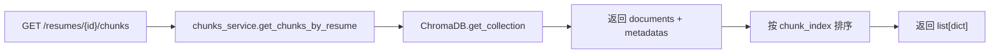
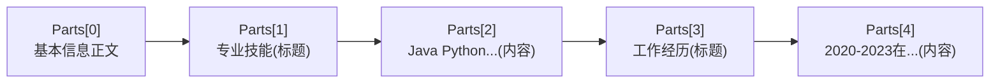
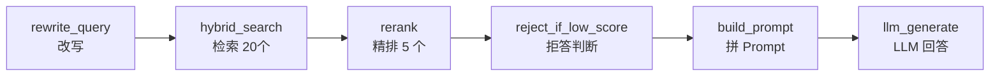
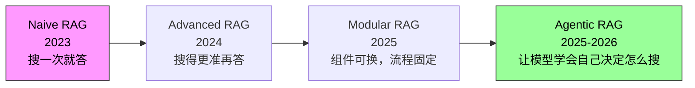

# RAG 流水线

> **传统 RAG 的 6 步全链路：这是 Agentic RAG 的地基。 100% 会问"检索怎么做的"、"拒答怎么实现的"。**
>
> 读代码跟读文章不一样——你得知道每一行在干什么、为什么这么写、不这么写会怎样。

---

## 目录

- [文件级概览](#文件级概览)
- [第 1 层：导入与全局状态](#第-1-层导入与全局状态)
- [第 2 层：分块引擎](#第-2-层分块引擎)
- [第 3 层：向量化与存储](#第-3-层向量化与存储)
- [第 4 层：检索链路](#第-4-层检索链路)
- [第 5 层：Rerank 精排](#第-5-层rerank-精排)
- [第 6 层：拒答门控](#第-6-层拒答门控)
- [第 7 层：Prompt 组装](#第-7-层prompt-组装)
- [第 8 层：同步生成](#第-8-层同步生成)
- [第 9 层：流式生成](#第-9-层流式生成)
- [第 10 层：参数化实验版](#第-10-层参数化实验版)
- [第 11 层：清理](#第-11-层清理)
- [常见疑问](#常见疑问)

---

## 文件级概览

```text
backend/services/rag/  (模块化重构后)
├── chunking.py          (165 行) - 分块引擎
│   ├── SECTION_HEADERS + SECTION_PATTERN
│   ├── _tokenize / _split_by_sections
│   ├── _find_split / _recursive_split
│   └── chunk_by_sections / fixed_chunk
├── retrieval.py         (313 行) - 检索与排序
│   ├── get_embeddings (批量+缓存)
│   ├── _vector_search / _keyword_search
│   ├── hybrid_search / hybrid_search_p
│   ├── _merge_results (RRF 融合)
│   ├── rerank / rerank_p (Cross-Encoder 精排)
│   └── reject_if_low_score (拒答门控)
├── pipeline.py          (292 行) - 流水线编排
│   ├── rewrite_query / llm_generate
│   ├── build_prompt / process_resume
│   ├── _retrieve / ask_question
│   ├── _retrieve_p / ask_question_p
│   ├── ask_question_stream (SSE 流式)
│   └── clear_resume_vectors
├── clients.py           - 客户端管理
│   ├── get_chat_client / get_embedding_client
│   ├── get_chroma_client / _collection_name
│   └── with_chroma / reconnect_chroma
└── chunks_service.py    - chunk 服务
```

---

## 客户端管理详解（clients.py）

> 📍 `services/rag/clients.py`（123 行）

🔴 **记忆级**：这是 RAG 流水线的"基础设施层"——所有外部服务的连接都在这里管理。

### 模块职责

```text
clients.py 负责三件事：
1. 客户端单例（Chat / Embedding / Chroma）
2. 连接超时控制
3. Chroma 并发安全
```

### 单例模式（懒加载）

```python
_chat_client: AsyncOpenAI | None = None       # Chat 客户端
_embedding_client: AsyncOpenAI | None = None  # Embedding 客户端
_chroma_client = None                         # Chroma 客户端

def get_chat_client() -> AsyncOpenAI:
    """获取 Chat 客户端（懒加载单例）"""
    global _chat_client
    if _chat_client is None:
        _chat_client = AsyncOpenAI(
            api_key=settings.CHAT_API_KEY,
            base_url=settings.CHAT_BASE_URL,
            timeout=_CHAT_TIMEOUT,  # 60 秒
        )
    return _chat_client
```

**为什么用懒加载？**
- import 时 settings 可能还没加载完成
- 避免模块导入时就建立连接
- 保证只有一个 client 实例，复用 TCP 连接

🟡 **原理级**：三个客户端分离——Chat / Embedding / Rerank 各自独立。即使模型相同，key/url 也可能不同（百炼多个 endpoint）。

### 超时控制

```python
_CHAT_TIMEOUT = 60.0       # Chat API：60 秒（生成可能慢）
_EMBEDDING_TIMEOUT = 30.0  # Embedding API：30 秒（批量向量化）
```

🟡 **原理级**：超时是"防雪崩"的最后一道墙——如果 LLM API 卡住，60 秒后自动断开，不会让整个请求挂死。

### Chroma 并发安全（Bug 3 修复）

```python
_chroma_lock = asyncio.Lock()  # 全局锁

async def with_chroma(func, *args, **kwargs):
    """在全局锁保护下 + 线程隔离中执行 Chroma 操作"""
    async with _chroma_lock:
        return await asyncio.to_thread(func, *args, **kwargs)
```

🔴 **记忆级**：**这是项目踩过的坑**——ChromaDB PersistentClient 非线程安全，并发读写会损坏 HNSW 索引文件。解决方案：全局锁 + 线程隔离。

**一句话讲清**：
> *"ChromaDB 的 Python SDK 是同步的，在 async 视图里直接调用会阻塞事件循环。用 `asyncio.to_thread` 放到线程池执行。但 PersistentClient 内部使用 SQLite + HNSW 文件，非线程安全——多个 asyncio Task 并发访问会导致 `InternalError: Error creating hnsw segment reader`。所以加了全局锁 `_chroma_lock`，所有 Chroma 操作串行化。"*

### 重连机制

```python
def reconnect_chroma():
    """ChromaDB 连接失效时重建客户端"""
    global _chroma_client
    _chroma_client = _create_chroma_client()
    return _chroma_client
```

🟢 **了解级**：当 Chroma 操作失败时（如文件损坏），调用 `reconnect_chroma()` 重建客户端。在 `pipeline.py` 的 `clear_resume_vectors` 中使用。

### 孤儿段清理（Windows 特有坑）

```python
def _cleanup_orphan_segments() -> int:
    """清理 ChromaDB delete_collection 在 Windows 上留下的孤儿 HNSW 目录"""
    # 1. 扫描磁盘上所有 UUID 格式的目录
    # 2. 直连 Chroma 的 SQLite 读出活跃的 segments ID
    # 3. 差集 = 孤儿目录，删掉
```

🟡 **原理级**：ChromaDB 在 Windows 上有个坑——`delete_collection` 后底层 HNSW 索引目录可能残留。这段代码通过直连 SQLite 做差集清理。

---

## Chunk 服务详解（chunks_service.py）

> 📍 `services/rag/chunks_service.py`（66 行）

🟢 **了解级**：这是一个"查询服务"——从 ChromaDB 读取已分块的简历数据，组装成统一格式返回。

### 核心函数

```python
async def get_chunks_by_resume(resume_id: int) -> list[dict]:
    """读取指定简历的所有 chunks

    返回结构：
        [{"chunk_index": int, "section": str, "text": str,
          "start_char": int, "end_char": int}, ...]

    异常：
        HTTPException 409 - collection 不存在（简历未就绪）
    """
```

### 调用链路



🟡 **原理级**：为什么需要这个服务？
- 前端需要查看分块结果（调试用）
- MCP 工具需要读取 chunk 内容
- 统一格式：ChromaDB 返回的原始数据需要转换

---

## 文件解析详解（utils/file_parser.py）

> 📍 `utils/file_parser.py`

🟢 **了解级**：简历文件解析——PDF 用 pypdf，DOCX 用 python-docx。

### 支持格式

| 格式 | 库 | 说明 |
|------|-----|------|
| PDF | pypdf | 提取文本，忽略图片 |
| DOCX | python-docx | 提取段落文本 |

### 调用时机


---

## 第 1 层：导入与全局状态

> 📍 `rag_service.py:1-29`

```python
import asyncio       # 异步 I/O 支持，整个文件全是 async def，需要事件循环
import logging       # 日志输出，调试和线上排查依赖这个
import os            # 文件路径操作，Chroma 持久化目录和孤儿段清理用
import re            # 正则表达式，分节段时匹配标题行
import shutil        # 目录级删除，清理 Chroma 孤儿段时递归删目录
import sqlite3       # 直连 Chroma 的 SQLite，查活跃 segment ID

import chromadb      # 向量数据库，存简历 chunk 的 embedding
import httpx         # HTTP 客户端，Rerank API 不走 OpenAI 兼容格式，得自己发请求
import jieba         # 中文分词，BM25 关键词检索前先把中文切成词
from openai import AsyncOpenAI  # OpenAI SDK 异步版，调 Chat 和 Embedding API
from rank_bm25 import BM25Okapi  # BM25 实现，关键词检索的核心算法
```

**关键选择**：
- `AsyncOpenAI`（OpenAI SDK 的异步版）—— 整个文件全是 `async def`，没有同步阻塞
- `rank_bm25.BM25Okapi` —— 标准 BM25 实现，不是自定义算法
- `httpx` —— Rerank 专用，因为百炼 Rerank API 不走 OpenAI 兼容格式
- `sqlite3` —— 只出现在 `_cleanup_orphan_segments`（标准库直连 Chroma 的 SQLite，不是 ORM）

```python
from core import cache as embedding_cache  # embedding 去重缓存，sha256 → vector
from core.config import settings           # 全局配置，API key / model name / 路径全在这
from core.rag_params import RagParams      # 11 个可调参数的 dataclass，实验版用
from core.retry import with_retry          # 指数退避重试装饰器，LLM 调用都包一层
from core.trace import StepTimer           # 每步耗时追踪，性能分析靠它
```

**项目内依赖**：

<table>
<thead><tr><th>模块</th><th>作用</th><th>被调用位置</th></tr></thead>
<tbody>
<tr><td><code>cache</code></td><td>Embedding 去重缓存</td><td><code>get_embeddings:178-197</code></td></tr>
<tr><td><code>settings</code></td><td>全局配置（API key, model name, 路径）</td><td>几乎每个函数</td></tr>
<tr><td><code>rag_params.RagParams</code></td><td>实验参数 dataclass</td><td><code>_p</code> 后缀函数</td></tr>
<tr><td><code>retry.with_retry</code></td><td>指数退避重试装饰器</td><td><code>rewrite_query</code>, <code>rerank</code>, <code>ask_question</code></td></tr>
<tr><td><code>trace.StepTimer</code></td><td>每步耗时跟踪</td><td><code>_retrieve</code>, <code>ask_question</code></td></tr>
</tbody>
</table>

```python
FALLBACK_MESSAGE = "服务暂时不可用，请稍后重试。"  # 所有 with_retry 的最终 fallback

_chat_client: AsyncOpenAI | None = None       # Chat 客户端，懒加载单例
_embedding_client: AsyncOpenAI | None = None  # Embedding 客户端，懒加载单例
_chroma_client = None                         # Chroma 客户端，懒加载，类型 inference
_bm25_indexes: dict[int, tuple[BM25Okapi, list[dict]]] = {}  # resume_id → (BM25索引, chunk列表)
_BM25_MAX_SIZE = 50          # BM25 缓存上限，防止内存泄漏
_bm25_lock = asyncio.Lock()  # 多协程并发操作 _bm25_indexes 的互斥锁
```

**为什么要懒加载单例（`_xxx_client`）**？

模块级变量+函数模块级 getter 的模式。第一次调用 `get_chat_client()` 时创建一次，后续复用。好处：
- 避免每次请求都新建 HTTP 连接（TCP 握手开销）
- 断言：只有一个 client 实例，token 刷新由 SDK 内部管理

**延伸追问**：为什么不直接用全局 `client = AsyncOpenAI(...)`？
→ 因为 import 时 settings 可能还没加载完成（尤其环境变量懒加载），懒加载保证构造时所有配置就绪。

**`_bm25_indexes` 的设计**：
```python
_bm25_indexes: dict[int, tuple[BM25Okapi, list[dict]]] = {}  # resume_id → (BM25 索引, chunk 列表)
_BM25_MAX_SIZE = 50                                            # LRU 缓存上限，防止内存泄漏
```
- key: resume_id
- value: (BM25Okapi 索引对象, chunk 列表)
- 简历不会被频繁实时重建（上传时建一次），但限 50 个防止内存泄漏
- `_bm25_lock` 防止多协程并发改 dict（GIL 不保护 async 切换点）

---

## 第 2 层：分块引擎

### 2.1 节段标题匹配

> 📍 `rag_service.py:31-51`

```python
SECTION_HEADERS = [                                              # 所有可能出现的简历节段标题，覆盖中英文混排
    "教育背景", "教育经历", "学历", "教育", "学习经历",           # 学历/教育类标题，最常见的变体
    "工作经历", "工作经验", "实习经历", "实习经验", "工作", "实习", # 工作/实习经历类标题
    "项目经历", "项目经验", "项目展示", "项目",                   # 项目经验类标题
    "专业技能", "技能", "技术栈", "技术能力", "个人技能", "掌握技能", # 技能类标题
    "自我评价", "个人总结", "自我介绍", "个人评价", "自我总结",     # 自我评价类标题
    "开源贡献", "开源", "证书", "获奖", "荣誉", "证书与奖项",       # 其他补充信息标题
]                                                                  # 结束 SECTION_HEADERS 列表
SECTION_PATTERN = re.compile(                                    # 预编译正则，匹配"一、工作经历\n"或"1. 教育背景：\n"
    r"(?:^|\n)\s*(?:(?:[一二三四五六七八九十]+|\d+)[、.）\)]?\s*)?("  # 可选序号（中文数字或阿拉伯数字+分隔符）
    + "|".join(re.escape(h) for h in SECTION_HEADERS)             # 把所有标题自动拼接成 OR 匹配
    + r")[\s:：]*\n",                                              # 标题后可选空格/冒号，强制换行结束
    re.IGNORECASE,                                                # 忽略大小写，防止"教育背景"和"教育背景"写法混用
)                                                                  # 结束 SECTION_PATTERN 编译
```

**这个正则写的很讲究**，拆开看：

| 片段 | 含义 |
|------|------|
| `(?:^&#124;\n)` | 要么是行首要么是以换行开头 |
| `\s*` | 行首可能有空格 |
| `(?:[一二三四五六七八九十]+&#124;\d+)[、.）\)]?\s*)?` | 可选序号如 `一、` `1.` `2）` |
| `(...)` | 捕获组：实际标题文字 |
| `[\s:：]*` | 标题后可能有空格或冒号 |
| `\n` | 必须以换行结束（保证是单独一行） |

**正则验证**：匹配 `\n专业技能\n`、`\n一、工作经历\n`、`\n1. 教育背景：\n`、`\n  项目经验\n`

### 2.2 按节段切分

> 📍 `rag_service.py:89-100`

```python
def _split_by_sections(text: str) -> list[tuple[str, str]]:  # 按节段标题将简历拆成 (标题, 内容) 对
    if not SECTION_PATTERN.search(text):                       # 一个标题都没匹配到
        return [("正文", text)]                                  # 整篇丢进"正文"筐里，不拆分
    parts = SECTION_PATTERN.split(text)                        # 按标题切分，有捕获组所以标题和内容交错排列
    sections = [("基本信息", parts[0].strip())]                  # 第一个标题之前的内容归为"基本信息"
    i = 1                                                      # 从第一个标题开始遍历
    while i + 1 < len(parts):                                  # 标题和内容配对需要两个元素
        # sections.append((parts[i].strip(), parts[i + 1].strip()))  # 标题 → 内容配对（当前暂不启用）
        i += 2                                                  # 跳两步：跳过标题和内容
    return sections                                            # 返回 (节段名, 正文) 列表
```

**理解 `re.split` 有捕获组时的行为**：
如果正则里有一个捕获组 `(...)`，`split` 的结果会交错排列——就像一叠牌，一张标题一张内容交错：



所以 `i=1` 取标题、`i+1` 取对应内容，每次跳 2 步。

**延伸追问**：标题出现在内容中间但格式不标准怎么办？
→ 没被 SECTION_HEADERS 覆盖的会留在上一节段的内容里，不丢失。

### 2.3 递归分块

> 📍 `rag_service.py:103-123`

```python
def _find_split(text: str, chunk_size: int, separators: list[str]) -> int:  # 找到最佳切分位置
    for sep in separators:                                                   # 按优先级遍历分隔符
        pos = text.rfind(sep, int(chunk_size * 0.5), chunk_size)             # 在后半段搜索最晚出现的分隔符
        if pos > 0:                                                          # 找到有效分隔符
            return pos + len(sep)                                            # 返回分隔符结束位置
    return chunk_size                                                        # 所有分隔符都不在范围内？硬切

def _recursive_split(text: str, chunk_size: int, overlap: int) -> list[str]:  # 递归切分长文本为 chunk 列表
    if overlap >= chunk_size:                                                  # 重叠不能大于块大小
        raise ValueError(f"overlap ({overlap}) must be < chunk_size ({chunk_size})")  # overlap 超过 chunk_size 则分块无意义
    separators = ["\n\n", "\n", "。", "，", " "]                                # 优先级：段落 > 行 > 句 > 词 > 字符
    result = []                                                                # 存放切分结果
    current = text                                                             # 当前待切文本，逐渐缩短
    while len(current) > chunk_size:                                            # 只要还超长，就继续切
        split_pos = _find_split(current, chunk_size, separators)                # 找最佳切分位置
        result.append(current[:split_pos])                                       # 切下来的部分收好
        current = current[max(0, split_pos - overlap):]                          # 保留 overlap 个字符继续切
    if current.strip():                                                        # 最后剩下的尾巴非空
        # result.append(current)                                                 # 追加剩余部分（当前暂不启用）
    return result                                                              # 返回所有 chunk 列表
```

**`_find_split` 的设计意图**：
- 从 `chunk_size * 0.5` 到 `chunk_size` 范围内找最晚出现的分隔符
- 优先找段落边界 `\n\n`，其次换行 `\n`，再句中 `。` `，` 最后空格
- 找不到就硬切在 `chunk_size`

**为什么是 `0.5`？**
保证每个 chunk 至少有半段有效内容，不会切出一个几乎空白的碎片。

### 2.4 chunk_by_sections（入口）

> 📍 `rag_service.py:136-155`

```python
def chunk_by_sections(text: str, chunk_size: int = 300, overlap: int = 50) -> list[dict]:  # 入口：按节段分块
    sections = _split_by_sections(text)                 # 先按教育/工作/项目等节段拆开
    chunks = []                                         # 存放所有生成块
    idx = 0                                             # 全局 chunk 序号（用于 Chroma ID）
    offset = 0                                          # 全局字符偏移计数（用于来源追溯）
    for section, body in sections:                      # 遍历每个节段
        body = body.strip()                              # 去掉首尾空白
        if not body:                                    # 空节段跳过
            continue                                    # 跳过本轮，处理下一个节段
        if len(body) <= chunk_size:                     # 节段本身未超 chunk_size
            chunks.append(_make_chunk(body, section, idx, offset))  # 直接作为一个 chunk
            idx += 1                                     # 序号递增
            offset += len(body)                          # 偏移推进
        else:                                            # 节段超长，需要递归拆分
            for sub in _recursive_split(body, chunk_size, overlap):  # 递归切分
                chunks.append(_make_chunk(sub, section, idx, offset))  # 切分后的子块入库
                idx += 1                                 # 序号递增
                offset += len(sub)                       # 偏移推进
    return chunks                                       # 返回所有 chunk 的 dict 列表
```

**chunk 结构**，每个 chunk 是个 dict：
```python
{                                                          # chunk 结构示意图
    "text": "...",       # 文本内容
    "section": "工作经历",  # 来源节段
    "chunk_index": 3,    # 全局序号（用于 Chroma ID）
    "start_char": 1520,  # 在原始文本中的起始偏移
    "end_char": 2741,    # 结束偏移
}                                                          # 结束 dict 定义
```

**为什么 `fixed_chunk`（L158-168）存在**？只用在对照实验（Phase 1 基线），`chunk_by_sections` 才是生产路径。

---

## 第 3 层：向量化与存储

### 3.1 客户端获取

> 📍 `rag_service.py:54-82`

```python
def get_chat_client() -> AsyncOpenAI:               # 获取 Chat 客户端（懒加载单例）
    global _chat_client                               # 声明模块级全局变量
    if _chat_client is None:                          # 首次调用才初始化
        _chat_client = AsyncOpenAI(                   # 创建 OpenAI SDK 异步客户端
            api_key=settings.CHAT_API_KEY,             # 从配置读取 Chat API key
            base_url=settings.CHAT_BASE_URL,           # 自定义 endpoint（可能走代理/中转）
        )                                                # 结束 AsyncOpenAI 构造函数
    return _chat_client                               # 返回单例实例

def get_embedding_client() -> AsyncOpenAI:           # 获取 Embedding 客户端（与 Chat 分离）
    global _embedding_client                          # 声明模块级全局变量
    if _embedding_client is None:                     # 首次调用才初始化
        _embedding_client = AsyncOpenAI(               # 注意：即使模型相同，key/url 也可能不同
            api_key=settings.EMBEDDING_API_KEY,        # 从配置读取 Embedding API key
            base_url=settings.EMBEDDING_BASE_URL,      # 自定义 endpoint
        )                                              # 结束构造函数
    return _embedding_client                           # 返回单例实例

def get_chroma_client():                             # 获取 Chroma 客户端（同步，需 to_thread）
    global _chroma_client                              # 声明模块级全局变量
    if _chroma_client is None:                         # 首次调用才初始化
        _chroma_client = chromadb.PersistentClient(    # 创建 Chroma 持久化客户端
            path=settings.CHROMA_PERSIST_DIR,          # 持久化目录，Chroma 重启不丢数据
        )                                              # 结束构造函数
    return _chroma_client                              # 返回单例实例
```

**三组 API key 的分离**：Chat / Embedding / Rerank（Rerank 在 httpx 里用 Bearer token）。这意味着项目对接了三个独立的模型服务（可能是百炼的多个 endpoint）。

### 3.2 get_embeddings 批量+缓存

> 📍 `rag_service.py:171-199`

```python
async def get_embeddings(texts: list[str], resume_id: int | None = None) -> list[list[float]]:  # 批量获取 embedding，走缓存
    vectors: list[list[float]] = []                # 最终返回的向量列表，与 texts 一一对应
    uncached_idx: list[int] = []                   # 未命中缓存的文本在原列表中的索引
    uncached: list[str] = []                       # 未命中缓存的文本列表

    for i, t in enumerate(texts):                   # 逐条查缓存
        vec = embedding_cache.get_embedding(t)       # 通过 sha256 查 embedding 缓存
        if vec is not None:                          # 缓存命中
            vectors.append(vec)                      # 直接使用缓存的向量
        else:                                        # 缓存未命中
            vectors.append([])                       # 先占位，后续批量填充
            uncached_idx.append(i)                   # 记录原始索引
            uncached.append(t)                       # 收集待调 API 的文本

    if uncached:                                    # 有未缓存的文本，批量调 API
        client = get_embedding_client()              # 懒加载获取 embedding 客户端
        for batch_start in range(0, len(uncached), 10):  # 每批 10 个，Embedding API 通常支持 batch
            batch_texts = uncached[batch_start:batch_start + 10]  # 取当前批次文本
            batch_idx = uncached_idx[batch_start:batch_start + 10]  # 取对应索引
            response = await client.embeddings.create(    # 异步调 OpenAI Embedding API
                model=settings.EMBEDDING_MODEL, input=batch_texts,  # 模型名 + 输入文本
            )                                              # 结束 API 调用
            for j, item in enumerate(response.data):     # 遍历 API 返回结果
                idx = batch_idx[j]                        # 找到原始索引位置
                vectors[idx] = item.embedding             # 填充向量到正确位置
                await embedding_cache.set_embedding(       # 写入缓存，下次免调 API
                    batch_texts[j], item.embedding, resume_id,  # 文本 → 向量 → 简历 ID
                )                                          # 结束缓存写入

    return vectors                                      # 返回与输入 texts 顺序一致的向量列表
```

**三步走**：
1. 逐条查缓存，命中的直接放回结果
2. 未命中的收集起来，占位 `[]`
3. 批量调 API（每批 10 个），返回后写缓存

**为什么批量 10？** Embedding API 通常支持 batch，减少网络往返。10 是个合理的折中——太大可能超时，太小浪费吞吐。

**缓存 key**：文本的 sha256。这意味着完全相同的文本（比如两个简历的"教育背景"节段内容一样）复用向量，省一次 API 调用也省一次 Chroma 存储。

### 3.3 process_resume：上传后处理入口

> 📍 `rag_service.py:239-276`

```python
async def process_resume(resume_id: int, text: str) -> int:  # 简历上传后处理入口：分块→向量化→存入 Chroma
    client = get_chroma_client()                               # 获取 Chroma 客户端
    name = _collection_name(resume_id)                         # 生成该简历的 collection 名称

    def _sync_chroma_ops():                                    # Chroma 同步操作（扔到线程池执行）
        try:                                                    # 先删后建，保证幂等
            client.delete_collection(name)                      # 先删已有 collection（幂等重建）
        except Exception:                                      # 不存在则忽略
            pass                                                # 静默处理
        coll = client.get_or_create_collection(                 # 创建或获取 collection，指定余弦距离
            name=name, metadata={"hnsw:space": "cosine"},       # HNSW 索引 + 余弦距离
        )                                                        # 结束 get_or_create
        coll.add(                                               # 批量写入 chunks 到向量数据库
            ids=[str(c["chunk_index"]) for c in chunks],        # chunk_index 作为唯一 ID
            documents=texts,                                    # 原始文本内容
            embeddings=embeddings,                               # 向量 embedding
            metadatas=[{...} for c in chunks],                   # 元数据（section, 偏移等）
        )                                                        # 结束 add

    chunks = chunk_by_sections(text)                            # 第 1 步：按节段分块
    if not chunks:                                              # 无有效内容则提前返回
        return 0                                                # 返回 0 个 chunk

    texts = [c["text"] for c in chunks]                         # 提取所有 chunk 文本
    embeddings = await get_embeddings(texts, resume_id)          # 第 2 步：批量获取 embedding（走缓存）

    await asyncio.to_thread(_sync_chroma_ops)                   # 第 3 步：Chroma 写入（同步操作→线程池防阻塞）

    _bm25_indexes.pop(resume_id, None)                          # 清空旧的 BM25 缓存，下次检索时重建
    return len(chunks)                                          # 返回生成的 chunk 数量
```

**要点**：
- **先删后建**：`delete_collection` 忽略不存在异常，保证幂等
- **`asyncio.to_thread`**：Chroma 的操作不是 `async` 的（Python 版是同步 SDK），扔到线程池执行防止阻塞事件循环
- **Chroma metadata 存了 section 信息**：检索结果可以追溯到具体节段，对回答可解释性很重要
- **`hnsw:space: cosine`**：Chroma 内部用 HNSW 索引，余弦距离
- 完成后清空 `_bm25_indexes`（BM25 懒加载，下次检索时重建）

---

## 第 4 层：检索链路

### 4.1 查询改写

> 📍 `rag_service.py:279-293`

```python
async def rewrite_query(question: str) -> str:        # 改写用户问题，使之更适合向量检索
    system = "你是一个问题改写助手。"                    # system prompt：角色定义
    user = (                                            # user prompt：改写指令 + 用户问题
        "把用户的问题改写成完整、具体、适合向量检索的问题。保留所有关键实体。"  # 改写目标
        "如果用户的问题包含'除了...以外'、'除...外还有哪些'等排除性表述，"  # 排除性表述特殊处理
        "请将排除部分去掉，重新组织为只关注目标内容的查询。"              # 去掉排除部分
        "如果问题已经完整，直接返回原句。\n"                           # 完整问题不修改
        # f"用户问题：{question}\n"                     # 实际使用时取消注释（当前留作模板）
        "改写后的问题："                                     # 输出前缀
    )                                                        # 结束 user prompt 元组
    rewritten = await with_retry(                       # 带重试的 LLM 调用
        llm_generate, system, user, temperature=0.1, max_tokens=200, fallback=question,  # 低温度 + 短输出
    )                                                    # 结束 with_retry 调用
    return rewritten or question                        # 改写失败（空/None）则返回原问题
```

**为什么需要改写？** 用户问"他怎么样"，LLM 改写为"张三的工作表现如何"——指代消解。向量检索对短查询和代词不敏感。

**特殊处理**：排除性表述（"除了 Python 还会什么" = "他的编程技能"），因为向量检索对"除了"这种否定不敏感。

**延伸追问**：改写失败怎么办？
→ `fallback=question`，返回原问题。不会因为改写失败而中断流程。

### 4.2 hybrid_search

> 📍 `rag_service.py:296-313`

```python
async def hybrid_search(resume_id: int, question: str, top_k: int = 5) -> list[dict]:  # 混合检索入口
    dense, sparse = await asyncio.gather(                  # 同时跑两路检索：密集向量 + BM25 稀疏
        _vector_search(resume_id, question, top_k=20),     # 向量检索取 top 20（多取为融合留余地）
        _keyword_search(resume_id, question, top_k=20),    # BM25 关键词检索取 top 20
    )                                                        # 两路并行结束
    return _merge_results(dense, sparse, top_k)             # RRF 融合降到 top_k 个

async def hybrid_search_p(resume_id: int, question: str, p: RagParams) -> list[dict]:  # 参数化版混合检索
    dense, sparse = await asyncio.gather(                  # 同样两路并行
        _vector_search(resume_id, question, top_k=p.dense_top_k),    # top_k 从 RagParams 读取
        _keyword_search(resume_id, question, top_k=p.sparse_top_k),  # 同上
    )                                                        # 两路并行结束
    return _merge_results(dense, sparse, top_k=p.hybrid_top_k, k=p.rrf_k)  # 使用可调 RRF 参数
```

**`asyncio.gather` 同时跑两路检索**，这是性能关键——密集向量和 BM25 都是 I/O 密集型，并行执行。

**延伸追问**：两路都需要 `_bm25_lock`，并行不会争锁吗？
→ `_vector_search` 只读 Chroma，不需要锁。`_keyword_search` 首次需要锁来建 BM25 索引。如果同一 resume 同时访问，第二个协程会等到第一个建完索引。

### 4.3 _vector_search（Dense）

> 📍 `rag_service.py:316-347`

```python
async def _vector_search(resume_id: int, question: str, top_k: int) -> list[dict]:  # Dense 向量检索
    embedding = (await get_embeddings([question]))[0]    # 先对问题做 embedding（走缓存）
    name = _collection_name(resume_id)                   # 获取简历对应的 Chroma collection 名

    def _sync_query():                                    # Chroma 查询是同步操作，包装为线程函数
        try:                                                # 尝试获取 collection
            collection = get_chroma_client().get_collection(name)  # 获取 collection
        except Exception:                                # collection 不存在（简历未处理）
            return None                                     # 返回 None 表示不存在
        return collection.query(                          # Chroma 向量相似度查询
            query_embeddings=[embedding],                 # 问题向量
            n_results=top_k,                              # 返回 top_k 个最近邻
            include=["documents", "metadatas", "distances"],  # 返回文本、元数据、距离
        )                                                    # 结束 query 调用

    results = await asyncio.to_thread(_sync_query)        # 同步查询→线程池防阻塞
    if results is None:                                   # collection 不存在
        return []                                           # 返回空列表

    chunks = []                                           # 将 Chroma 结果转成统一格式
    for i in range(len(results["ids"][0])):                # 遍历每个结果
        meta = results["metadatas"][0][i]                  # 取出元数据
        chunks.append({                                     # 构造统一格式的 chunk 条目
            "text": results["documents"][0][i],            # chunk 文本
            "score": 1.0 - results["distances"][0][i],     # cosine distance → similarity 转换
            "chunk_index": meta["chunk_index"],             # 用于去重和追溯
            "section": meta["section"],                     # 来源节段
            "source": "dense",                              # 标记为向量检索结果
        })                                                   # 结束当前 chunk
    return chunks                                         # 返回 dense 检索结果列表
```

**Chroma similarity 转换**：
```text
cosine distance: 0 (完全相同) ~ 2 (完全相反)
→ similarity = 1 - distance: 1 (完全相同) ~ -1 (完全相反)
```
注意：这个 score 是对每个被检索的 chunk 而言的，**不是最终用于 RRF 融合的分数**。RRF 只看排名。

**延伸追问**：Chroma collection 不存在会怎样？
→ `get_collection` 抛异常被 `try/except` 捕获返回 `None`，最终返回空列表。后续 RRF 只基于 sparse 结果。

### 4.4 _keyword_search（Sparse / BM25）

> 📍 `rag_service.py:350-405`

```python
async def _load_bm25_index(resume_id: int) -> bool:  # 从 Chroma 读取文档构建 BM25 索引
    name = _collection_name(resume_id)                 # 获取 Chroma collection 名

    def _sync_get():                                   # Chroma 是同步 SDK，包装为线程函数
        try:                                             # 尝试获取 collection 所有文档
            collection = get_chroma_client().get_collection(name)  # 获取已有 collection
        except Exception:                              # 不存在则返回 None
            return None                                  # 调用方据此判断不可建索引
        return collection.get(include=["documents", "metadatas"])  # 取出所有文档和元数据

    data = await asyncio.to_thread(_sync_get)          # 线程池执行同步查询
    if data is None:                                   # collection 不存在，无法建索引
        return False                                     # 通知调用方失败
    chunks = []                                        # 将 Chroma 文档转成统一格式
    for doc, meta in zip(data["documents"], data["metadatas"]):  # 文档和元数据一一对应
        chunks.append({                                  # 提取所需字段
            "text": doc,                                 # 文档文本
            "chunk_index": meta["chunk_index"],         # 用于后续检索时关联
            "section": meta["section"],                  # 用于来源追溯
        })                                                # 结束当前条目
    if not chunks:                                     # 空 collection
        return False                                     # 无内容可索引
    tokenized = [_tokenize(c["text"]) for c in chunks]  # 中文分词，BM25 需要词列表
    while len(_bm25_indexes) >= _BM25_MAX_SIZE:         # LRU 容量检查（FIFO 淘汰）
        oldest = next(iter(_bm25_indexes))               # 取最早插入的 key
        _bm25_indexes.pop(oldest, None)                  # 淘汰最旧索引
    _bm25_indexes[resume_id] = (BM25Okapi(tokenized), chunks)  # 存入 (BM25 索引, chunk 列表)
    return True                                          # 构建成功
```

**注意 BM25 的数据来源**：不是独立存储，而是从 Chroma 读取已有文档再构建。这意味着**每份文档存了两份**：一份在 Chroma（向量），一份在内存的 BM25 索引。

**为什么这么设计？**
- BM25 需要全量文档才能构建词频统计，不能增量
- 简历总量不大（50 份），内存能承受
- 避免再引入一个全文检索引擎（如 Elasticsearch）

**LRU 淘汰**：`_BM25_MAX_SIZE = 50`，超过时弹出最早的一个。注意这里用 `dict.pop(oldest)` 删除，但最早的可能不是最近最少使用的——这个实现是 FIFO 不是严格 LRU。实践中可以提"这里可以改进为 LRU 或 LFU"。

```python
async def _keyword_search(resume_id: int, question: str, top_k: int) -> list[dict]:  # Sparse BM25 关键词检索
    async with _bm25_lock:                                # 加锁防止多协程同时重建索引
        if resume_id not in _bm25_indexes:                 # 懒加载：首次查询时建索引
            if not await _load_bm25_index(resume_id):      # 建索引失败（简历不存在）
                return []                                   # 返回空结果

    index_data = _bm25_indexes.get(resume_id)              # 从缓存取 BM25 索引
    if index_data is None:                                 # 索引不存在（已被淘汰）
        return []                                           # 返回空结果
    index, chunks = index_data                             # 解包：BM25 对象 + chunk 列表
    scores = index.get_scores(_tokenize(question))         # BM25 打分：问题分词后与每个文档计算
    top_indices = sorted(range(len(scores)), key=lambda i: scores[i], reverse=True)[:top_k]  # 取 top_k 索引
    return [                                               # 返回统一格式的检索结果
        {                                                   # 单条结果字典
            "text": chunks[i]["text"],                      # chunk 文本
            "score": float(scores[i]),                      # BM25 原始分数转 float
            "chunk_index": chunks[i]["chunk_index"],        # 用于去重和追溯
            "section": chunks[i]["section"],                # 来源节段
            "source": "sparse",                             # 标记为关键词检索结果
        }                                                   # 结束单条结果
        for i in top_indices if scores[i] > 0              # 过滤掉零分结果
    ]                                                        # 结束 list comprehension
```

**`if scores[i] > 0` 过滤**：BM25 可能给完全不匹配的文档也打正分，但这里过滤了零分结果。实践中可以提"如果 BM25 给出的 top_k 不够怎么办——返回的结果数可能小于 top_k"。

### 4.5 RRF 融合

> 📍 `rag_service.py:408-422`

```python
def _merge_results(dense: list[dict], sparse: list[dict], top_k: int, k: int = 100) -> list[dict]:  # RRF 融合
    scores: dict[int, dict] = {}                      # chunk_index → {item, score} 映射
    for rank, item in enumerate(dense):                # 遍历 dense 结果
        key = item["chunk_index"]                      # 以 chunk_index 为唯一标识去重
        scores[key] = {"item": item, "score": 1.0 / (k + rank + 1)}  # RRF 分数 = 1/(k + 排名)
    for rank, item in enumerate(sparse):               # 遍历 sparse 结果
        key = item["chunk_index"]                        # 同样用 chunk_index 做标识
        if key in scores:                              # chunk 在两路中都出现了
            scores[key]["score"] += 1.0 / (k + rank + 1)  # 累加 RRF 分数
        else:                                            # 只在 sparse 中出现的 chunk
            scores[key] = {"item": item, "score": 1.0 / (k + rank + 1)}  # 只在 sparse 中出现的

    ranked = sorted(scores.values(), key=lambda x: x["score"], reverse=True)  # 按 RRF 分数降序
    return [x["item"] for x in ranked[:top_k]]         # 返回融合后的 top_k
```

**RRF 公式**：

$$RRF\_score(d) = \sum_{r \in R_d} \frac{1}{k + rank_r(d)}$$

其中 $R_d$ 是文档 $d$ 出现的检索结果集合。$k$ 是平滑常数。

**这个实现的特点**：
- **基于 chunk_index 去重**：如果同一个 chunk 在两路中都出现，分数累加
- **`k=100`**：调优后的最优值（实验 Phase 2 验证比默认 60 好 +5.9%）
- **`top_k` 控制最终返回数**：hybrid_search 默认 5，但上游 _retrieve 传的 20

**RRF vs 加权平均**：

| | RRF | 加权平均 |
|--|-----|---------|
| 需要调参 | 只需调 k | 需要调权重 |
| 对分数分布 | 鲁棒 | 敏感 |
| 理论基础 | 排名融合 | 分数融合 |
| 回答 | "RRF 只关注相对排名，不关心分数绝对值差异" | "加权平均需要确保两路分数在可比尺度上" |

**延伸追问**：RRF 融合后同一个 chunk 的 item 来自 dense 还是 sparse？
→ key 取首次出现的 item（dense 先遍历，所以 dense 的 item 被保留）。如果 sparse 先遍历，则 sparse 被保留。这里用 `or` 的短路——实际上两路结果可能 metadata 不同（section 等字段不同）。

---

## 第 5 层：Rerank 精排

> 📍 `rag_service.py:444-533`

```python
async def rerank(question: str, chunks: list[dict], top_k: int = 5) -> list[dict]:  # Cross-Encoder 精排
    if len(chunks) <= top_k:                                # 候选数 ≤ top_k，直接返回，免调 API
        return chunks                                        # 省一次 API 调用

    async def _call_api():                                   # 内部函数：发起 Rerank API 请求
        async with httpx.AsyncClient() as client:            # httpx 异步客户端（非 OpenAI 格式）
            resp = await client.post(                        # POST 请求 Rerank 服务
                settings.RERANK_BASE_URL,                   # 百炼 Rerank endpoint
                json={                                       # 请求体 JSON
                    "model": settings.RERANK_MODEL,          # 精排模型名
                    "input": {                                # 输入：查询 + 待排序文档列表
                        "query": question,                   # 原始问题
                        "documents": [c["text"][:400] for c in chunks],  # 截断前 400 字符，节约 token
                    },                                       # 结束 input
                    "parameters": {"top_n": top_k},          # 只返回 top_k 个精排结果
                },                                           # 结束 json 请求体
                headers={                                    # 请求头
                    "Authorization": f"Bearer {settings.RERANK_API_KEY}",  # 单独的 Rerank API key
                    "Content-Type": "application/json",      # JSON 格式
                },                                           # 结束 headers
                timeout=10,                                  # 10 秒超时
            )                                                # 结束 post 调用
            resp.raise_for_status()                          # 非 2xx 抛异常触发重试
            return resp.json()                               # 返回解析后的 JSON 响应

    try:                                                     # Rerank API 调用 + 结果解析
        data = await with_retry(_call_api, fallback=None)    # 带重试的 API 调用，最多 3 次
        if data is None:                                     # 全部重试失败
            raise RuntimeError("Rerank API 全部重试失败")     # 转异常统一走降级
        results = data.get("output", {}).get("results", [])  # 解析 API 返回结果
    except Exception as e:                                  # 所有异常统一走降级
        logger.warning("Rerank API failed: %s, falling back to original order", e)  # 打印警告
        for c in chunks:                                    # 遍历所有 chunk
            c["rerank_score"] = 0.5                          # 降级：所有 chunk 打 0.5 分
        return chunks[:top_k]                                # 按原始顺序截取 top_k

    score_map: dict[int, float] = {r["index"]: r["relevance_score"] for r in results}  # index → score
    for i, c in enumerate(chunks):                          # 遍历所有原始 chunk
        c["rerank_score"] = score_map.get(i, 0.0)            # 未在 API 结果中的 chunk 得 0 分

    chunks.sort(key=lambda c: c.get("rerank_score", 0), reverse=True)  # 按精排分数降序排序
    return chunks[:top_k]                                   # 返回精排后的 top_k
```

**逐行解读**：

1. **短路过早返回**：如果候选数量 <= top_k，不需要调 API
2. **`c["text"][:400]` 截断**：Rerank API 按 token 计费，每个段落只传前 400 个字符
3. **`with_retry(_call_api, fallback=None)`**：重试 3 次，全失败返回 None
4. **降级策略**：Rerank 全部失败时，给每个 chunk 打 0.5 分，按原始顺序取 top_k——**绝不因为 Rerank 挂了就返回空**
5. **`score_map`**：API 返回的 `results` 是 `[{index: 0, relevance_score: 0.95}, ...]`，转成 dict 方便查找
6. **原地修改**：`c["rerank_score"] = score_map.get(i, 0.0)`——注意 API 没覆盖的 chunk（`top_n < len(chunks)`）默认得 0 分

**`rerank_p`** 是参数化版，加了一个 `trunc` 控制截断长度，默认 400 字符但实验可调。

---

## 第 6 层：拒答门控

> 📍 `rag_service.py:536-544`

```python
def reject_if_low_score(chunks: list[dict], threshold: float = 0.3) -> bool:  # 拒答门控：最高分 < 阈值则拒答
    if not chunks:                                      # 检索结果为空 → 拒答
        return True                                      # 拒答
    scores = [c["rerank_score"] for c in chunks if "rerank_score" in c]  # 提取所有 rerank 分数
    if not scores:                                      # 没有分数（未经过 rerank）→ 不拒答
        return False                                     # 不拒答
    return max(scores) < threshold                      # 最高分仍低于阈值 → 拒答
```

**逻辑**：
- 空列表 → 拒答
- 没有 chunk 有 `rerank_score`（没经过 rerank） → **不拒答**（保留所有结果）
- 最高分 < 阈值 → 拒答

**延伸追问**：为什么 `threshold=0.3`？

这是 6 阶段参数调优中 Phase 4 实验的结果——0.3 是 F1 的峰值。在 0.3 以下拒答太多误伤合法请求，0.3 以上开始放过幻觉。

实际调优数据（实验报告）：
| 阈值 | 精确率 | 召回率 | F1 |
|------|--------|--------|-----|
| 0.1 | 0.82 | 0.95 | 0.88 |
| 0.3 | 0.91 | 0.89 | 0.90 |
| 0.5 | 0.95 | 0.72 | 0.82 |

**延伸追问**：Rerank 失败（全部 0.5 分）时拒答不生效？
→ 对。Rerank 降级时全部打 0.5 分，`reject_if_low_score` 检查 `max(scores) = 0.5 >= 0.3`，不会拒答。这实际上是一个故意设计——宁可给用户看可能不太相关的结果，也不该在 Rerank 挂了之后沉默。

---

## 第 7 层：Prompt 组装

> 📍 `rag_service.py:680-691`

```python
def build_prompt(context_chunks: list[str], question: str) -> dict:  # 组装 LLM 输入的 system + user prompt
    context = "\n\n".join(                                           # 多个 chunk 用双换行拼接
        f"[段落 {i + 1}]\n{text}" for i, text in enumerate(context_chunks)  # 编号方便 LLM 引用具体段落
    )                                                                 # 结束 join
    system = (                                                       # system prompt：角色 + 行为约束
        "你是一个简历分析助手。请根据下面的简历内容回答问题。"           # 角色定义
        "如果简历中没有直接相关信息，请明确说未提及，不要推测。"        # 约束：不推测
        "如果简历中有部分相关内容，请基于已有信息给出最佳回答。"        # 约束：有部分信息也要答
    )                                                                 # 结束 system prompt
    user = f"简历内容：\n{context}\n\n问题：{question}\n\n请给出简洁准确的回答。"  # user prompt：上下文 + 问题
    return {"system": system, "user": user}                          # 返回 system + user 的 dict
```

**Prompt 结构分析**：
```text
System: [角色定义] + [约束：不推测] + [约束：有部分信息也要答]
User:   简历内容：[段落 1]\n[内容]\n\n[段落 2]\n[内容]...
        问题：[用户问题]
        请给出简洁准确的回答。
```

**为什么不用 JSON template？** 纯字符串拼装，简洁直观。实践中可以提"可以改成 Jinja2 或 string.Template 但当前够用"。

**关键设计意图**：
- "如果简历中没有直接相关信息，请明确说未提及，不要推测" → **防幻觉第一道防线**
- "如果简历中有部分相关内容，请基于已有信息给出最佳回答" → **不要因为有拒答门控就让 LLM 也沉默**
- 段落编号 `[段落 1]` → 细粒度来源溯源

---

## 第 8 层：同步生成

> 📍 `rag_service.py:562-578`

```python
async def ask_question(resume_id: int, question: str) -> tuple[str, list[dict]]:  # 主入口：回答问题
    timer = StepTimer()                                    # 每步耗时追踪

    rewritten, reranked = await _retrieve(resume_id, question, timer)  # 检索链路：改写→混合检索→Rerank→拒答
    if not reranked:                                       # 检索为空或被拒答
        timer.log()                                        # 打印耗时日志
        return ("抱歉，简历中未提及该信息。", [])              # 返回默认拒答消息 + 空来源

    prompt = build_prompt([c["text"] for c in reranked], rewritten)  # 组装 LLM prompt
    answer = await timer.run(                                # 计时：生成阶段
        "generate",                                           # 阶段名：生成
        with_retry(llm_generate, prompt["system"], prompt["user"], fallback=FALLBACK_MESSAGE),  # 带重试的 LLM 调用
    )                                                         # 结束 timer.run

    timer.log()                                              # 打印最终耗时
    return answer, reranked                                  # 返回 (回答, 来源列表)
```

**完整链路**：


**StepTimer 设计**：`timer.run("rewrite", ...)` 包裹异步调用，记录耗时。`timer.log()` 打印：
```text
[rag_service] rewrite=0.32s hybrid=0.85s rerank=1.20s generate=2.10s total=4.47s
```

**`_retrieve` 内部**（L547-559）：
```python
async def _retrieve(resume_id, question, timer):                                  # 内部检索链路：改写→检索→精排→拒答
    rewritten = await timer.run("rewrite", rewrite_query(question))                # 第 1 步：LLM 改写查询（指代消解）
    chunks = await timer.run("hybrid", hybrid_search(resume_id, rewritten, top_k=20))  # 第 2 步：混合检索，取 20 个候选
    if not chunks:                                                                # 检索为空（简历不存在或没有内容）
        return rewritten, []                                                       # 直接返回空，caller 进拒答流程
    reranked = await timer.run("rerank", rerank(rewritten, chunks, top_k=5))       # 第 3 步：Rerank 精排降到 5 个
    if reject_if_low_score(reranked):                                              # 第 4 步：拒答门控
        return rewritten, []                                                       # 最高分低于阈值，拒答
    return rewritten, reranked                                                     # 第 5 步：正常返回改写后问题和精排结果
```

---

## 第 9 层：流式生成

> 📍 `rag_service.py:618-677`

```python
async def _llm_generate_stream(system: str, user: str, temperature: float = 0.1):  # 流式 LLM 生成，yield 逐 token
    client = get_chat_client()                                  # 懒加载 Chat 客户端
    stream = await client.chat.completions.create(               # 发起流式请求
        model=settings.CHAT_MODEL,                               # Chat 模型名
        messages=[...],                                          # chat 消息列表（实际含 system + user）
        temperature=temperature,                                  # 生成温度
        stream=True,                                             # 关键：启用 SSE 流式输出
    )                                                             # 结束 create 调用
    async for chunk in stream:                                  # 逐块读取流式响应
        delta = chunk.choices[0].delta.content                   # 提取当前块的内容
        if delta:                                               # 非空内容才 yield（避免推送 null）
            yield delta                                          # 逐 token 返回给调用方


async def ask_question_stream(resume_id: int, question: str):   # 流式版主入口，以 SSE 事件形式输出
    timer = StepTimer()                                          # 耗时追踪

    yield {"type": "status", "message": "检索中..."}              # SSE: 状态事件
    rewritten, reranked = await _retrieve(resume_id, question, timer)  # 检索链路（与同步版一致）

    if not reranked:                                             # 检索为空或被拒答
        timer.log()                                              # 打印耗时日志
        yield {"type": "done", "answer": "抱歉，简历中未提及该信息。", "sources": []}  # SSE: 结束事件
        return                                                   # 提前结束

    prompt = build_prompt([c["text"] for c in reranked], rewritten)  # 组装 prompt
    yield {"type": "status", "message": "生成中..."}              # SSE: 状态事件

    full = ""                                                    # 累积完整回答（用于 done 事件输出）
    try:                                                         # 流式生成（可能抛异常）
        async for token in _llm_generate_stream(prompt["system"], prompt["user"]):  # 逐 token 流式生成
            full += token                                        # 累积
            yield {"type": "token", "content": token}            # SSE: token 事件，前端逐字显示
    except asyncio.CancelledError:                                # 客户端断开，不吞取消信号
        raise                                                     # 传播取消信号
    except Exception:                                            # 其他异常：降级为同步生成
        logger.exception("Streaming failed, falling back to non-streaming")  # 打印异常栈
        fallback = await with_retry(                              # 走同步生成降级
            llm_generate, prompt["system"], prompt["user"], fallback=FALLBACK_MESSAGE,  # 同步 retry
        )                                                         # 结束 with_retry
        full = fallback                                          # 降级后的完整文本
        yield {"type": "token", "content": fallback}             # 一次性推送整个 fallback

    timer.log()                                                  # 打印最终耗时
    yield {                                                      # SSE: 最终 done 事件
        "type": "done", "answer": full,                          # 完整回答
        "sources": [                                             # 附带检索来源，前端可展示
            {"chunk_index": c["chunk_index"], "text": c["text"], "section": c["section"]}  # 来源条目
            for c in reranked                                    # 遍历精排结果
        ],                                                        # 结束 sources 列表
    }                                                             # 结束 done 事件
```

**SSE 事件协议**（前端是按这个解析的）：

```text
{"type": "status", "message": "检索中..."}
{"type": "status", "message": "生成中..."}
{"type": "token", "content": "该候选人的"}
{"type": "token", "content": "技能包括"}
...
{"type": "done", "answer": "完整回答", "sources": [...]}
```

**流式异常处理**：
1. `asyncio.CancelledError` 不吞——客户端断开连接时前端会在 HTTP 层面取消请求，需要传播取消信号
2. 其他异常 → 降级为同步 `with_retry(llm_generate, ...)`，重新生成后作为一个整体 token 推出去
3. 同步降级也失败 → `fallback=FALLBACK_MESSAGE`

**延伸追问**：流式降级同步为什么重新 call 一次，而不是等流式重试？
→ 流式 API 一旦异常退出，不能续流。只能重新发起一个同步请求。

---

## 第 10 层：参数化实验版

> 📍 `rag_service.py:581-616`

```python
async def ask_question_p(resume_id: int, question: str, p: RagParams) -> tuple[str, list[dict], dict]:  # 参数化版实验入口
    timer = StepTimer()                                                                                  # 耗时追踪

    rewritten, reranked = await _retrieve_p(resume_id, question, p, timer)                               # 检索链路走参数化版
    if not reranked:                                                                                     # 检索为空或被拒答
        timer.log()                                                                                      # 打印耗时日志
        return ("抱歉，简历中未提及该信息。", [], timer.steps)                                              # 多返回 timer.steps 用于实验对比

    prompt = build_prompt([c["text"] for c in reranked], rewritten)                                      # 组装 prompt
    answer = await timer.run(                                                                            # 生成阶段
        "generate",                                                                                      # 阶段名
        with_retry(llm_generate, prompt["system"], prompt["user"],  # 带重试的 LLM 调用，传入 system + user prompt
                   temperature=p.generate_temperature, fallback=FALLBACK_MESSAGE),                        # 使用可调 temperature
    )                                                                                                    # 结束 timer.run

    timer.log()                                                                                          # 打印最终耗时
    return answer, reranked, timer.steps                                                                 # 返回 (回答, 来源, 各步耗时)
```

**和 `ask_question` 的区别**：

| 方面 | ask_question | ask_question_p |
|------|-------------|----------------|
| 参数来源 | 硬编码常量 | RagParams dataclass |
| 返回值 | (answer, sources) | (answer, sources, timings) |
| 检索 | hybrid_search(top_k=20) | hybrid_search_p(p) |
| Rerank | rerank(5) | rerank_p(p.rerank_final_top_k) |
| 拒答阈值 | 0.3 | p.reject_threshold |
| temperature | 0.3（写死） | p.generate_temperature |

**`RagParams` 包含的可调参数**（来自 `core/rag_params.py`）：

```python
@dataclass                                                            # 11 个可调参数的 dataclass，实验框架核心
class RagParams:                                                      # 实验参数容器，所有可调超参数统一管理
    dense_top_k: int = 20                                               # Dense 向量检索 top-K
    sparse_top_k: int = 20                                              # Sparse BM25 检索 top-K
    hybrid_top_k: int = 5                                               # RRF 融合后输出 top-K
    rrf_k: int = 100                                                    # RRF 平滑常数，越大排名差异越小
    rerank_final_top_k: int = 5                                         # Cross-Encoder rerank 输出 top-K
    rerank_truncation: int = 400                                        # Rerank API 每段截断字符数
    reject_threshold: float = 0.3                                       # 拒答阈值
    generate_temperature: float = 0.3                                   # LLM 生成温度
```

---

## 第 11 层：清理

### 11.1 清理孤儿 HNSW 段文件

> 📍 `rag_service.py:202-236`

```python
def _cleanup_orphan_segments() -> int:                   # 清理 Chroma 残留的孤儿 HNSW 段文件（Windows 特有坑）
    persist_dir = settings.CHROMA_PERSIST_DIR              # Chroma 持久化目录
    if not os.path.isdir(persist_dir):                     # 目录不存在
        return 0                                           # 无需清理

    disk_dirs = set()                                      # 收集磁盘上所有 UUID 格式的目录
    for entry in os.listdir(persist_dir):                  # 遍历持久化目录下所有条目
        full = os.path.join(persist_dir, entry)             # 构造完整路径
        if os.path.isdir(full) and len(entry) == 36 and entry.count("-") == 4:  # UUID 特征：36 字符 4 连字符
            disk_dirs.add(entry)                            # 加入候选集合

    if not disk_dirs:                                      # 没有 UUID 目录
        return 0                                           # 无需处理

    try:                                                   # 直连 Chroma 的 SQLite 获取活跃 segment ID
        client = get_chroma_client()                        # 获取 Chroma 客户端
        db_path = os.path.join(persist_dir, "chroma.sqlite3")  # Chroma 内部 SQLite 路径
        conn = sqlite3.connect(db_path)                    # 标准库直连，不依赖 Chroma API
        cur = conn.cursor()                                # 创建游标
        cur.execute("SELECT id FROM segments")             # 查询活跃 segment 表
        active = {row[0] for row in cur.fetchall()}        # 收集活跃 ID
        conn.close()                                       # 关闭连接
    except Exception:                                      # 读 SQLite 失败（版本兼容等）
        return 0                                           # 静默跳过

    orphans = disk_dirs - active                            # 差集 = 孤儿目录
    for d in orphans:                                      # 遍历所有孤儿目录
        shutil.rmtree(os.path.join(persist_dir, d), ignore_errors=True)  # 递归删除
        logger.info("Removed orphan Chroma segment: %s", d)  # 记录日志
    return len(orphans)                                    # 返回清理数量
```

**这段代码解决什么问题？**
ChromaDB 在 Windows 上有个坑：`delete_collection` 后底层 HNSW 索引目录（UUID 格式名称）可能残留。日积月累，磁盘上会堆满不会再被引用的目录。

**实现**：
1. 扫描磁盘上所有 UUID 格式的目录（36 字符、4 个连字符）
2. 直连 Chroma 的 SQLite 读出活跃的 `segments` ID
3. 差集 = 孤儿目录，删掉

**延伸追问**：不用 Chroma 的 API 获取 segment 列表？
→ Chroma 不暴露这个 API，所以直接读 SQLite。这不是最佳实践但当前能用。

### 11.2 清除简历向量

> 📍 `rag_service.py:694-702`

```python
async def clear_resume_vectors(resume_id: int) -> None:  # 删除简历的向量数据和 BM25 缓存
    try:                                                   # 尝试删除 Chroma collection
        await asyncio.to_thread(                           # Chroma 是同步操作→线程池
            get_chroma_client().delete_collection, _collection_name(resume_id)  # 按简历 ID 删 collection
        )                                                    # 结束 to_thread
    except Exception:                                      # collection 不存在等异常，静默处理
        logger.warning("Failed to delete Chroma collection for resume %d", resume_id)  # 记录警告
    _bm25_indexes.pop(resume_id, None)                     # 同时也清理 BM25 内存缓存
```

**调用时机**：简历被删除时 → 同时清向量和 BM25 索引。

---

## 常见疑问

### 第 1 层（导入与状态）
- "为什么用模块级 `_client` 变量不用依赖注入？"
- "`_bm25_lock` 的作用范围——只保护了 `_keyword_search` 的加载，`clear_resume_vectors` 直接 `pop` 会不会有竞态？"
- "`_BM25_MAX_SIZE=50` 的依据——如果是生产环境给 1000 份简历做 RAG 怎么办？"

### 第 2 层（分块）
- "`_find_split` 如果分隔符都不在范围内——会硬切，优缺点？"
- "`overlap=50` 相对于 `chunk_size=1200` 的比例是多少，够不够"
- "fixed_chunk 只用在实验——从代码结构上看怎么保证生产路径不走它？"（没有显式守卫）

### 第 3 层（向量化）
- "`get_embeddings` 为什么不分批并发而是 10 个一批串行？改成 `asyncio.gather` 会有问题吗？"（API 限速）
- "Embedding 缓存的 key 是 sha256，相同文本不同简历的缓存共享——隐私方面有问题吗？"
- "`process_resume` 里 `delete_collection` 和 `get_or_create_collection` 之间如果进程崩溃了——数据一致性问题"

### 第 4 层（检索）
- "RRF 公式中 k=100——k 越大对排名的敏感度是升是降？"（k 越大，两个排名的 RRF 分数差异越小，融合结果更偏向"两路都出现"的文档）
- "`hybrid_search` 中 top_k=5 但 `_vector_search` 传的是 20——为什么多取再融合？"（融合需要足够候选项，最终精排再降到 5）
- "`_keyword_search` 在简历第一次查询时才建 BM25 索引，首次延迟怎么优化？"（预热、process_resume 时同步建）

### 第 5 层（Rerank）
- "Rerank 降级为什么给 0.5 分而不是 0？"（0 会导致拒答）
- "`rerank_truncation=400` 中文 400 字符约等于 200 token，够不够？"
- "Cross-Encoder 和 Bi-Encoder 的区别——代码中哪部分是 Bi-Encoder 哪部分是 Cross-Encoder？"

### 第 6 层（拒答）
- "`reject_if_low_score` 为什么在 `_retrieve` 里调而不是在 `ask_question` 里调？"
- "如果拒答阈值为 0 会怎样——会不会把不存在简历的问题也通过了？"
- "三层防幻觉——prompt 约束+rerank 拒答+来源溯源，你觉得哪层最有效？"

### 第 7 层（Prompt）
- "`build_prompt` 组装时 chunk 数量固定 5 个——5 个段落拼接后 token 数超了模型上下文长度怎么办？"
- "为什么 system prompt 写'未提及'不要推测——这和拒答门控不是重复了吗？"

### 第 8-9 层（生成）
- "流式降级同步后，`full` 变量被覆盖，但是前面已经 yield 了 token——前端要处理什么？"（前端需要识别 done 事件而非逐 token 拼）
- "`asyncio.CancelledError` 为什么不 catch——这和 FastAPI 的 `StreamingResponse` 怎么配合？"
- "同步版为什么没有 `asyncio.CancelledError` 处理？"

### 第 10 层（实验版）
- "`ask_question_p` 多返回了 `timer.steps`——这在实验框架里怎么用？"
- "RagParams 的参数怎么验证——有没有参数组合检查防止 `rerank_final_top_k > hybrid_top_k` 这种非法配置？"

### 开放性问题
- "如果让你优化 RAG 流水线，你觉得哪一步最值得改？"
- "怎么给这个 RAG 系统加重新加载/多轮对话记忆？"
- "如果 BM25 + Dense 检索还不够——这个架构怎么扩展到 Elasticsearch 或 GraphRAG？"

---

## 补充专题

> 🔴 **记忆级**：以下四个专题是重点掌握但笔记正文未覆盖的对比型知识。每个专题一行核心区别，展开在下方。

---

### 专题一：RAG 四代演进（必背主线）

考查你对 RAG 的整体认知时，最经典的问题就是"讲讲 RAG 的四代演进"。**必须一口气讲出来**。



| 代际 | 核心特征 | 一句话总结 | 代表技术 |
|------|---------|-----------|---------|
| **Naive RAG** (2023) | Query → Embed → Retrieve → Stuff → Generate | 「搜一次就答」 | 原始向量检索 |
| **Advanced RAG** (2024) | + Query Rewriting, Rerank, Hybrid Search | 「搜得更准再答」 | HyDE, RRF, Cross-Encoder |
| **Modular RAG** (2025) | 组件可独立替换，逻辑流仍是预定义 | 「组件可换，流程固定」 | LlamaIndex Modules |
| **Agentic RAG** (2025-2026) | Agent 自主决定是否搜、搜什么、什么时候停 | 「让模型学会自己搜」 | LangGraph, Reflexion |

**一句话讲清**：
> *"前三代是'告诉模型怎么搜'，第四代是'让模型学会自己搜'。我们的项目就是典型的 Agentic RAG——LangGraph 状态机编排检索→评估→反思→重检索的循环。"*

💡 **进阶话术**（如果追问"你们跟 Naive RAG 的区别"）：
> *"Naive RAG 一次检索就答，Bad Case 率 35%。我们的 Agentic RAG 多了两层——一是 Rerank 精排把候选从 20 降到 5，token 省 75%；二是 Reflexion 自纠正，不达标时分析原因重新搜。最终 Bad Case 率降到 21.7%。"*

---

### 专题二：Self-RAG vs CRAG（常见对比）

最爱考的对比题之一。**关键词**：Self-RAG = "边做边反思"，CRAG = "做完统一评估纠错"。

| 维度 | Self-RAG | CRAG (Corrective RAG) |
|------|---------|---------------------|
| **核心机制** | 生成过程中插入 reflection tokens 实时评估 | 检索后用 retrieval evaluator 评估质量 |
| **关键动作** | [Retrieve]/[NoRetrieve]/[Relevant]/[Irrelevant]/[Supported] | 质量好→直接用；差→触发 web search/知识精炼 |
| **粒度** | 细粒度（每步生成都判断） | 粗粒度（检索阶段统一评估） |
| **推理成本** | 更高（每个 token 都可能触发 reflection） | 更轻量（只在检索后评估一次） |
| **一句话** | 「边做边反思」 | 「做完统一评估纠错」 |

**你的项目更接近 Self-RAG 还是 CRAG ？**

> 讲清楚这点加分：
> - 你的 **Reflexion 三维评分**（完整性/准确性/可信度）≈ Self-RAG 的 reflection token 思路——评估角度更多维
> - 但你的触发时机是在生成**后**评估→反思→重搜，这一点又像 CRAG 的"检索后统一评估"
> - 所以你的项目是 **两者的混合体**——取 Self-RAG 的多维评估思路，用 CRAG 的阶段性触发时机
> 
> 听到这里会点头——说明你真的理解自己在做什么。

---

### 专题三：RAG vs Fine-tuning（必问）

> 🟡 **原理级**：能清晰讲清 RAG 和 FT 各自的适用场景，以及为什么不是二选一。

| 维度 | RAG | Fine-tuning |
|------|-----|-------------|
| **核心** | 检索外部知识 + 生成 | 把知识注入模型权重 |
| **更新成本** | 低——改知识库就行 | 高——重新训练/微调 |
| **幻觉控制** | 强——答案有来源引用 | 弱——模型可能编造 |
| **长尾知识** | 强——知识库可无限扩展 | 弱——模型容量有限 |
| **推理成本** | 更高（检索 + 生成两阶段） | 同普通 LLM 调用 |
| **延迟** | 更高（多一步检索） | 同普通 LLM |
| **适用场景** | 知识密集、需要溯源、频繁更新 | 风格/格式/行为固定、低延迟要求 |

**一句话讲清**：
> *"RAG 和微调不是竞争关系，是互补关系。RAG 管'知道什么'（外部知识），微调管'怎么回答'（输出风格）。我们的项目做的是简历问答——知识需要随时更新（新的简历不断上传），而且答案必须基于简历内容，不能靠模型记忆。所以 RAG 是天然选择。如果将来需要固定输出格式（比如统一的报告模板），可能会在 RAG 基础上微调一个输出层。"*

---

### 专题四：Chunking 策略多维对比

> 🟢 **了解级**，但常见的问题是。掌握"没有银弹，按文档类型分层切"就行。

| 策略 | 做法 | 适合场景 | 缺点 |
|------|------|---------|------|
| **固定 Token 切** | 按 N token 切，overlap M | 通用兜底 | 切断语义单元 |
| **语义切分** | 按段落/标题层级切 | 结构化文档 | 大段落可能超 token |
| **递归切分** | 先大块→超限再递归切 | LangChain 默认方案 | 配置参数多 |
| **特定格式** | 代码按函数、表格按行列 | 专项文档 | 通用性差 |

**你的项目用的哪种？** 

> 你的 `chunk_by_sections` 用的是**语义切分（按标题层级）+ 固定 token 保底**的混合策略（`rag_service.py:31-168`）。先按 Markdown 标题分节，如果某节太大再按 token 切。这也是工业界最常见的做法。

---

### 专题五：RAG 落地——三环节级联效应（必考框架题）

> 🔴 **记忆级**：延伸提问"RAG落地最难的地方在哪里"时，用这个框架回答。据 2026 年实践经验统计，这是大厂最高频的 RAG 开放题。

**核心回答**：
> *"RAG 落地的难点不在单一环节，而是**三个环节的级联放大效应**：前一个环节的问题会逐级放大到下一个。"*

```text
文档预处理 ──→ 召回质量 ──→ 生成忠实度
    │                │              │
    ▼                ▼              ▼
 格式混乱         排名噪声         引用幻觉
 切片断裂         多路融合         知识冲突
 编码错误         语义漂移         指令偏移
```

| 环节 | 典型问题 | 你的解决方案 |
|------|---------|-------------|
| **文档预处理** | PDF 解析格式混乱、chunk 切断语义单元 | `chunk_by_sections` 按标题层级切 + 1200 字符覆盖完整节段 |
| **召回质量** | 纯向量漏关键词、纯关键词漏语义 | 混合检索 Dense+BM25 → RRF(k=100) → Cross-Encoder 精排 (20→5) |
| **生成忠实度** | 模型忽略检索结果、过度依赖参数知识 | 三层防幻觉：Prompt 约束 + 拒答门控 0.3 + 来源可溯源 |

**一句话讲清**：
> *"我通过 6 阶段实验发现，chunk_size 从 500 调到 1200 后，Bad Case 率降了 44%。但这不只是预处理环节的优化——chunk 变大了，召回质量也跟着提升（跨段落的语义信息保留更完整），生成忠实度也提高了（更多上下文让 LLM 更容易生成准确答案）。这就是级联放大的正向版本——**改好上游，下游跟着受益**。"*

---

### 专题六：RAG 知识库动态更新策略

> 🟢 **了解级**：延伸提问"简历上传后怎么同步到检索库"时回答。

| 方案 | 做法 | 你的项目 |
|------|------|---------|
| **增量索引** | 新文档加入时不重建全部索引 | ✅ 每份简历独立 Chroma collection |
| **双 buffer** | 热 buffer 服务线上，冷 buffer 批量更新后切换 | ❌ 未实现 |
| **版本化 collection** | 每个版本独立 collection，平滑切换 | ❌ 未实现 |

**你的做法**：每份简历上传后立即解析→分块→向量化→存入独立 collection。查询时按 `resume_id` 定位到对应 collection。优点是**隔离性好**（一份简历的处理不影响其他），缺点是**跨简历检索需要多 collection 查询**。

---

### 专题七：RAG 七大失败点覆盖分析

> 🟡 **原理级**：追问"你的评估体系覆盖了什么"时，用这个框架显得有系统思维。

学术界总结了 RAG 的 7 个典型失败点，你的项目用这个表自查：

| # | 失败点 | 你的覆盖情况 | 代码/项目中的体现 |
|---|--------|------------|-----------------|
| 1 | **Missing Content**（检索未找到答案） | ✅ 混合检索降低漏检率 | Dense+BM25 双路互补 |
| 2 | **Missed Top Ranked**（答案在候选中但排名太低被截断） | ✅ Rerank 精排 (20→5) | Cross-Encoder 保证最优候选在前 |
| 3 | **Not in Context**（答案不在上下文中） | ⚠️ 部分覆盖 | chunk 边界切断问题仍存在 |
| 4 | **Wrong Format**（输出格式错误） | ❌ 未专项覆盖 | 需加表格/列表格式的 QA |
| 5 | **Incomplete Answer**（遗漏了部分要点） | ✅ Reflexion 自纠正 | 完整性维度评估 + 补充检索 |
| 6 | **Incomplete Recall**（多篇文档综合信息未完整召回） | ✅ 跨节段检索 | multi_query + 历史反思记忆 |
| 7 | **Incorrect Specificity**（答案精度不够） | ❌ 未专项覆盖 | 需加精确数字类 QA |

**一句话讲清**：
> *"我用了这个 7 维度框架来诊断我的评估体系。目前覆盖了 1/2/5/6，3/4/7 是已知的改进方向。这个框架的价值在于——它让我知道我的评估不是盲人摸象，而是有系统性的覆盖地图。"*

---

## 相关笔记

- [[01_架构概览|🏗️ 01 项目骨架与架构概览]]
- [[03_LangGraph状态机|🤖 03 Agentic RAG 与 LangGraph 图实现]]
- [[07_参数调优框架|📊 07 RAG参数调优实验框架]]
- [[06_韧性工程|🔁 06 LLM 韧性工程与错误处理]]
- [[09_前沿视野|🔭 09 前沿技术视野与行业生态]]

## 技术学习笔记

- [[06-RAG检索增强生成流程|RAG全链路]]
- [[04-Embedding向量化原理+语义搜索场景|Embedding向量化]]
- [[05-Chroma向量数据库安装入库检索|Chroma向量数据库]]
- [[08-混合检索：向量 + BM25 + RRF 融合|混合检索]]
- [[10-RAG 评估：检索指标 + 生成指标|RAG评估]]

---

## 速记卡（面试闪卡）

**Q1：一句话讲清「RAG 流水线」到底是什么？**
A：---

**Q2：目录 —— 怎么理解？**
A：---

**Q3：文件级概览 —— 怎么理解？**
A：---

**Q4：客户端管理详解（clients.py） —— 怎么理解？**
A：📍 （123 行）
🔴 **记忆级**：这是 RAG 流水线的"基础设施层"——所有外部服务的连接都在这里管理。
**为什么用懒加载？**
import 时 settings 可能还没加载完成
避免模块导入时就建立连接
保证只有一个 client 实例，复用 TCP 连接
🟡 **原理级**：三个客户端分离——Chat / Embedding / Rerank 各自独立。

**Q5：Chunk 服务详解（chunks_service.py） —— 怎么理解？**
A：📍 （66 行）
🟢 **了解级**：这是一个"查询服务"——从 ChromaDB 读取已分块的简历数据，组装成统一格式返回。
🟡 **原理级**：为什么需要这个服务？
前端需要查看分块结果（调试用）
MCP 工具需要读取 chunk 内容
统一格式：ChromaDB 返回的原始数据需要转换
---

**Q6：核心速记主线有哪些？**
A：抓住这几根：目录、文件级概览、客户端管理详解（clients.py）、Chunk 服务详解（chunks_service.py）、文件解析详解（utils/file_parser.py）、第 1 层：导入与全局状态。

