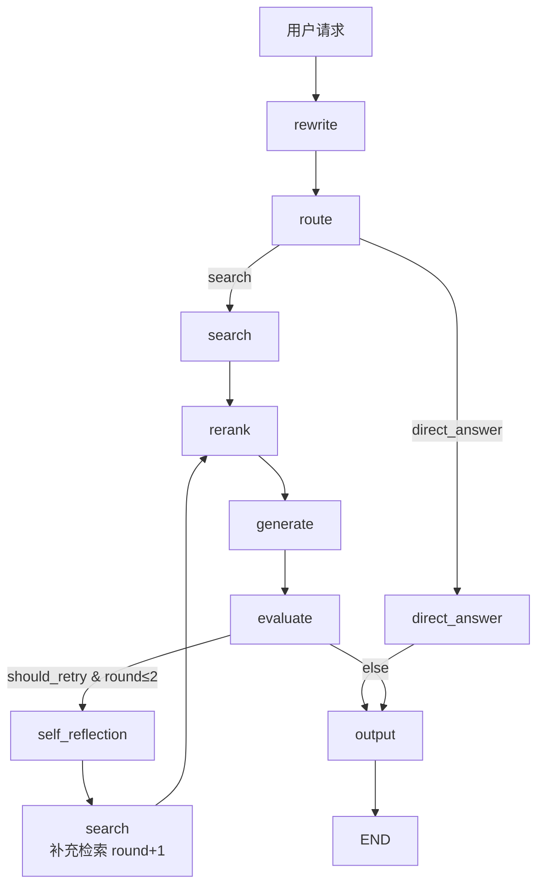

# LangGraph 状态机

> **项目最值钱的代码——没有之一。LangGraph StateGraph 的 9 节点 DAG + 3 条条件边。听到 LangGraph 会眼前一亮。**
>
> 传统 RAG 是流水线：切菜 → 炒菜 → 装盘，顺序固定。
> Agentic RAG 是厨师长：先看客人的需求（route），简单问题直接答，复杂问题先查再炒，炒完了尝尝咸淡（evaluate），淡了反思补充再炒（reflection）。

---

## 目录

- [文件结构](#文件结构)
- [graph.py 逐行走读](#graphpy-逐行走读)
  - [第 1 段：imports + 常量](#第-1-段imports--常量-l1-26)
  - [第 2 段：辅助节点（direct_answer + output）](#第-2-段辅助节点direct_answer--output-l29-64)
  - [第 3 段：3 条条件边函数](#第-3-段3-条条件边函数-l67-91)
  - [第 4 段：图的构造过程](#第-4-段图的构造过程-l93-147)
- [State 设计逐字段解读](#state-设计逐字段解读)
- [图执行时序图](#图执行时序图)
- [Checkpoint 机制](#checkpoint-机制)
- [直接模式 vs MCP 模式](#直接模式-vs-mcp-模式)
- [常见疑问](#常见疑问)

---

## 文件结构

```text
backend/services/agentic_rag/
├── graph.py         ← ★ 核心：147 行图构造（我们逐行走读的文件）
├── state.py         ← State TypedDict + 节点名称常量
├── __init__.py      ← 导出 create_agentic_rag_graph
├── rewrite.py       ← rewrite_node + route_node
├── search.py        ← search_node + rerank_node
├── generate.py      ← generate_node + evaluate_node
└── reflection.py    ← self_reflection_node
```

---

## graph.py 逐行走读

### 第 1 段：imports + 常量（L1-26）

```python
import json
import logging

from langgraph.graph import StateGraph, END, START
from langgraph.checkpoint.memory import MemorySaver
```

**为什么只 import 这三个东西？**
- `StateGraph` — 图框架（代替官方的 `Graph`，因为我们要状态追踪）
- `END` / `START` — 图的起止哨兵节点（LangGraph 固定要求）
- `MemorySaver` — 内存级 checkpoint 持久化

整个文件**只依赖 LangGraph**，没有任何业务逻辑 import——所有业务代码在各自的 node 文件里。

```python
from services.agentic_rag.state import (
    AgenticRAGState,
    REWRITE_NODE, ROUTE_NODE, SEARCH_NODE,
    RERANK_NODE, GENERATE_NODE, EVALUATE_NODE,
    SELF_REFLECTION_NODE, OUTPUT_NODE,
)
from services.agentic_rag.rewrite import rewrite_node, route_node
from services.agentic_rag.search import search_node, rerank_node
from services.agentic_rag.generate import generate_node, evaluate_node
from services.agentic_rag.reflection import self_reflection_node
```

**注意**：node 函数名和节点名称字符串是分开的。
- 节点名称：`"rewrite"`（来自 state.py 的 `REWRITE_NODE`）
- 函数引用：`rewrite_node`（来自 rewrite.py）

这是 LangGraph 的约定——`add_node(name, function)`。

```python
DIRECT_ANSWER_NODE = "direct_answer"
_DIRECT_ANSWER_REPLY = "你好！我是简历分析助手，请问有什么关于简历的问题我可以帮你解答？"
```

**为什么 `DIRECT_ANSWER_NODE` 不在 state.py 里？**
因为 `direct_answer` 是一个"伪节点"——它不是正式的业务节点，而是 route 的条件分支。放在 graph.py 里暗示"这个节点是本图特有的"。

`_DIRECT_ANSWER_REPLY` 是模板回复字符串，写在常量中而不是 node 函数内部——方便改文案和 i18n 扩展。

---

### 第 2 段：辅助节点（direct_answer + output）（L29-64）

#### direct_answer_node（L29-37）

```python
async def direct_answer_node(state: AgenticRAGState) -> dict:
    logger.info("direct_answer_node: returning template greeting")
    trace = dict(state.get("trace", {}))
    trace["direct_answer"] = {"elapsed_ms": 0, "template": True}
    return {
        "answer": _DIRECT_ANSWER_REPLY,
        "sources": [],
        "trace": trace,
    }
```

**关键设计**：
- **只更新 State 中的部分字段**：LangGraph 中 node 返回的 dict 会被 merge 进 State，不是覆盖整个 State。这里只更新 `answer`、`sources`、`trace` 三个字段，其他字段保持原样。
- **trace 链式传递**：`state.get("trace", {})` 取出已有 trace，追加自己的记录后再返回。这样最终的 trace 是完整链路。
- **`elapsed_ms: 0`**：这个节点实际没花时间（直接返回模板），但 trace 结构保持统一方便前端渲染。

#### output_node（L39-64）

```python
async def output_node(state: AgenticRAGState) -> dict:
    answer = state.get("answer", "")
    sources = state.get("sources", [])
    final_sources = [json.dumps(s, ensure_ascii=False) for s in sources]

    trace = dict(state.get("trace", {}))
    trace["output"] = {
        "answer_length": len(answer),
        "source_count": len(final_sources),
        "search_rounds": state.get("search_round", 0),
        "eval_score": state.get("eval_score", 0.0),
        "reflection_rounds": state.get("reflection_round", 0),
    }

    logger.info(
        "output_node: answer=%d chars, sources=%d, rounds=%d, eval=%.2f, reflections=%d",
        len(answer), len(final_sources), state.get("search_round", 0),
        state.get("eval_score", 0.0), state.get("reflection_round", 0),
    )

    return {
        "final_answer": answer,
        "final_sources": final_sources,
        "trace": trace,
    }
```

**output_node 在两个路径都会走到**：
- agentic 路径：output ← evaluate（score >= 0.6 或轮次上限）
- direct_answer 路径：output ← direct_answer

**关键转换**：
```python
final_sources = [json.dumps(s, ensure_ascii=False) for s in sources]
```
sources 从 list[dict] 序列化为 list[str]（JSON 字符串），因为最终返回值 `final_sources` 的类型是 `list[str]`（API 序列化友好）。

**延伸追问**：为什么 trace 里记录 `eval_score` 但不记录 `completeness_score` 等子分？
→ eval_score 是条件边决策的依据，最有监控价值。子分在 trace 里膨胀太快。

---

### 第 3 段：3 条条件边函数（L67-91）

#### `_route_after_route`（L67-73）

```python
def _route_after_route(state: AgenticRAGState) -> str:
    decision = state.get("route_decision", "search")
    logger.info("_route_after_route: %s", decision)
    if decision == "direct_answer":
        return DIRECT_ANSWER_NODE
    return SEARCH_NODE
```

**注意这个函数是同步的（不是 async）**。LangGraph 的条件边函数必须同步——它们只是读取 State 做路由判断，不调用任何 I/O。

**默认值 `"search"`**：如果 route_node 没写 `route_decision`（异常情况），默认走完整 RAG 链路——安全策略。

#### `_route_after_evaluate`（L75-84）

```python
def _route_after_evaluate(state: AgenticRAGState) -> str:
    should_retry = state.get("should_retry", False)
    search_round = state.get("search_round", 0)

    if should_retry and search_round <= 2:
        logger.info("_route_after_evaluate: reflexion (round=%d)", search_round)
        return SELF_REFLECTION_NODE

    logger.info("_route_after_evaluate: output (retry=%s, round=%d)", should_retry, search_round)
    return OUTPUT_NODE
```

**两个条件同时满足才走反思**：
1. `should_retry == True`（evaluate_node 判断答案质量不合格）
2. `search_round <= 2`（最多 3 轮检索：首轮 + 反思补充 2 轮）

**延伸追问**：为什么是 `search_round` 而不是 `reflection_round`？
→ 每次反思都会触发重新搜索，`search_round` 和 `reflection_round` 是同步递增的。用 `search_round` 更直观地表达了"最多检索 3 次"的语义。

#### `_route_after_reflection`（L87-90）

```python
def _route_after_reflection(state: AgenticRAGState) -> str:
    supplement_queries = state.get("supplement_queries", [])
    logger.info("_route_after_reflection: %d supplement queries", len(supplement_queries))
    return SEARCH_NODE
```

**固定回搜**：不管有没有补充查询，都回 `search` 节点。
- 有补充查询 → 用补充查询 + 原始改写查询重新搜索
- 无补充查询 → 用原始改写查询再搜一次（LLM 判为不完善但没给出补充查询）

这种做法很稳妥——宁可多搜一次也不漏掉信息。

---

### 第 4 段：图的构造过程（L93-147）

这是最关键的部分——看看 `create_agentic_rag_graph` 是怎么把 9 个节点拼成一张 DAG 的：

```python
def create_agentic_rag_graph(checkpointer=None):
    if checkpointer is None:
        checkpointer = MemorySaver()

    graph = StateGraph(AgenticRAGState)
```

**第一步：创建 StateGraph，指定 State 类型**。
`AgenticRAGState` 是一个 `TypedDict`，LangGraph 用它来：
1. 校验每个 node 返回的字段是否在 State 定义中
2. 在 Checkpoint 中序列化/反序列化
3. 提供 IDE 类型提示

```python
add_node × 9
    graph.add_node(REWRITE_NODE, rewrite_node)
    graph.add_node(ROUTE_NODE, route_node)
    graph.add_node(SEARCH_NODE, search_node)
    graph.add_node(RERANK_NODE, rerank_node)
    graph.add_node(GENERATE_NODE, generate_node)
    graph.add_node(EVALUATE_NODE, evaluate_node)
    graph.add_node(SELF_REFLECTION_NODE, self_reflection_node)
    graph.add_node(DIRECT_ANSWER_NODE, direct_answer_node)
    graph.add_node(OUTPUT_NODE, output_node)
```

**第二步：注册 9 个节点**。
`add_node(name, function)` — name 是字符串标识，function 是一个 `async def (state: AgenticRAGState) -> dict`。

```python
    # 固定边：START → rewrite → route
    graph.add_edge(START, REWRITE_NODE)
    graph.add_edge(REWRITE_NODE, ROUTE_NODE)
```

**第三步：固定边**。`START` 和 `END` 是 LangGraph 内置的哨兵节点。

```python
    # 条件边 1：route → search / direct_answer
    graph.add_conditional_edges(
        ROUTE_NODE,
        _route_after_route,
        {SEARCH_NODE: SEARCH_NODE, DIRECT_ANSWER_NODE: DIRECT_ANSWER_NODE},
    )
```

**第四步：条件边 1**。
三个参数：源节点、路由函数、目标映射字典。
- 如果 `_route_after_route` 返回 `"search"` → 走 `SEARCH_NODE`
- 如果返回 `"direct_answer"` → 走 `DIRECT_ANSWER_NODE`

```python
    # 固定边：search → rerank → generate → evaluate
    graph.add_edge(SEARCH_NODE, RERANK_NODE)
    graph.add_edge(RERANK_NODE, GENERATE_NODE)
    graph.add_edge(GENERATE_NODE, EVALUATE_NODE)
```

**第五步：线性链固定边**。检索 → 精排 → 生成 → 评估，顺序固定。

```python
    # 条件边 2：evaluate → self_reflection / output
    graph.add_conditional_edges(
        EVALUATE_NODE, _route_after_evaluate,
        {SELF_REFLECTION_NODE: SELF_REFLECTION_NODE, OUTPUT_NODE: OUTPUT_NODE},
    )

    # 条件边 3：self_reflection → search
    graph.add_conditional_edges(
        SELF_REFLECTION_NODE, _route_after_reflection,
        {SEARCH_NODE: SEARCH_NODE},
    )
```

**第六步：条件边 2 和 3**。条件边 3 只有一个目标——因为 `_route_after_reflection` 始终返回 `SEARCH_NODE`，所以实际上这可以是一条固定边。但写条件边留着扩展空间（未来可能加「放弃」分支）。

```python
    # 固定边：direct_answer → output → END
    graph.add_edge(DIRECT_ANSWER_NODE, OUTPUT_NODE)
    graph.add_edge(OUTPUT_NODE, END)
```

**第七步：收束边**。两个路径最终汇聚到 `output`，然后到 `END`。

```python
    compiled = graph.compile(checkpointer=checkpointer)
    logger.info("agentic_rag graph compiled successfully (with Reflexion)")
    return compiled
```

**第八步：编译**。`compile` 做三件事：
1. **拓扑排序**：验证没有循环依赖（除了条件边构成的有向环，它是允许的——LangGraph 支持有条件的循环）
2. **类型检查**：验证 node 函数的出入参类型和 State 定义一致
3. **注入 Checkpointer**：每次 node 执行后自动保存状态

---

## State 设计逐字段解读

> 📍 `state.py:1-40`

```python
class AgenticRAGState(TypedDict):
    question: str                    # 原始用户问题（不变）
    resume_id: int                   # 目标简历 ID
    rewritten_query: str             # rewrite_node 的输出
    route_decision: str              # route_node 的输出： "search" | "direct_answer"
    chunks: list[dict]               # search_node 的输出
    search_round: int                # 当前第几轮搜索（条件边用）
    answer: str                      # generate_node 的输出
    sources: list[dict]              # generate_node 的引用来源
    eval_score: float                # evaluate_node 的综合分
    eval_feedback: str               # evaluate_node 的评语文本
    should_retry: bool               # evaluate_node 的判断：要不要反思
    completeness_score: float        # 完整性评分 0-10
    accuracy_score: float            # 准确性评分 0-10
    source_credibility_score: float  # 来源可信度评分 0-10
    reflection_result: str           # self_reflection_node 的分析结果
    missing_info: list[str]          # 反思的缺失信息列表
    supplement_queries: list[str]    # 反思的补充查询（最多 3 个）
    reflection_round: int            # 当前反思轮次 0-2
    final_answer: str                # output_node 组装后的最终答案
    final_sources: list[str]         # output_node JSON 序列化后的来源
    trace: dict                      # 全链路追踪数据
    tool_errors: list[dict]          # 阶段4 错误透传：记录检索/重排等子步骤中失败的「工具」及错误摘要
```

**字段分类**：

| 分类 | 字段数 | 字段名 |
|------|--------|--------|
| 入参 | 2 | question, resume_id |
| 中间结果 | 6 | rewritten_query, route_decision, chunks, search_round, answer, sources |
| Eval 结果 | 6 | eval_score, eval_feedback, should_retry, completeness_score, accuracy_score, source_credibility_score |
| Reflection 结果 | 4 | reflection_result, missing_info, supplement_queries, reflection_round |
| 最终输出 | 3 | final_answer, final_sources, trace |
| 错误追踪 | 1 | tool_errors |

**延伸追问**：为什么 `eval_score`（float）和 `completeness_score`（float 0-10）不是同一量纲？
→ 一个是条件边用的"是否合格"（0-1 或 0-100%），一个是详细子评分（0-10），设计意图不同。

**延伸追问**：`chunks: list[dict]` 没有类型标注字典结构，怎么保证各节点读写一致？
→ Python 的 TypedDict 不支持嵌套类型约束。项目通过 node 函数契约 + 代码注释保证。缺陷，可以引入 Pydantic。

---

## 图执行时序图



**完整路径示例**（Agentic + 一次反思）：
```text
rewrite → route → search → rerank → generate → evaluate → self_reflection → search → rerank → generate → evaluate → output → END
```
LLM 调用 6 次：rewrite(1) + generate(2) + evaluate(2) + self_reflection(1) = 6。

---

## Checkpoint 机制

> 📍 `graph.py:93-95`

```python
def create_agentic_rag_graph(checkpointer=None):
    if checkpointer is None:
        checkpointer = MemorySaver()
```

**MemorySaver** 是 LangGraph 内置的 `BaseCheckpointSaver` 实现，将状态保存在内存中：

```text
Node 执行前 → State 快照写入 checkpointer
Node 执行后 → State 增量更新写入 checkpointer
```

**作用**：
1. **故障恢复**：某节点抛出异常，可以从上一个 checkpoint 重放
2. **调试**：`graph.get_state(config)` 可以读取任意历史节点后的状态
3. **人机交互**：可以在节点之间暂停、等待人工确认后再继续

**扩展路径**：
```text
MemorySaver（当前）→ SqliteSaver（单机持久化）→ RedisSaver（分布式）
```

---

## 直接模式 vs MCP 模式

项目支持两种运行模式：

| 方面 | graph.py（直接模式） | mcp_graph.py（MCP 模式） |
|------|---------------------|------------------------|
| search | `search_node` 直接调 rag_service | `mcp_search_node` 通过 MCP Client |
| rerank | `rerank_node` 直接调 | `mcp_rerank_node` 通过 MCP |
| generate | `generate_node` 直接调 | `mcp_generate_node` 通过 MCP |
| 图结构 | 完全相同 | 完全相同 |
| 条件边 | 完全相同 | 完全相同 |
| State | 完全相同 | 完全相同 |

**设计亮点**：中间的 3 个 I/O 节点可以替换，图框架和外层节点不变。核心逻辑复用。

**如果 MCP 不可用**：
```python
# 调用方代码
try:
    graph = create_agentic_rag_mcp_graph()
    result = await graph.ainvoke(...)
except MCPConnectionError:
    graph = create_agentic_rag_graph()  # 降级为直接模式
    result = await graph.ainvoke(...)
```

---

## 常见疑问

### imports + 常量
- "`MemorySaver` 的局限是什么——生产环境应该用什么？"
- "`DIRECT_ANSWER_NODE` 为什么不放在 state.py 中和另外 8 个节点名一起？"（非标准节点，图级概念）

### 辅助节点
- "`direct_answer_node` 为什么返回 `trace` 字段？——trace 是怎么从第一个 node 传递到最后一个 node 的？"
- "`output_node` 把 `sources` JSON 序列化——为什么不早序列化？"
- "如果 `answer` 为空字符串，output_node 会怎样？——`len(answer)` 输出 0，不会崩溃"

### 条件边
- "`_route_after_route` 为什么默认走 search 而不是 direct_answer？"
- "`_route_after_evaluate` 用 `search_round` 而不是 `reflection_round`——这两个值不一定相等吧？"（每次 search 都会 rerank → generate → evaluate，可能有一次 evaluate 没触发 reflection 直接走了 output，这时候 search_round > reflection_round）
- "`_route_after_reflection` 始终返回 SEARCH_NODE——为什么不设计成可能直接走向 evaluate？"

### 图构造
- "9 个 `add_node` 和 8 个 `add_edge`——为什么不用循环注册？"（可读性 > DRY，9 个节点不同函数不同语义）
- "`compile(checkpointer=...)` 做了什么——没有检查点能不能跑？"
- "如果 `evaluate_node` 抛异常了，图会怎样？——异常传播到调用方，graph 未完成"

### State
- "25 个字段——是不是太多了，怎么精简？"
- "`final_sources: list[str]` 和 `sources: list[dict]` 为什么并存？——output 之前用 `sources`，之后用 `final_sources`"
- "如果 state 要加新字段——需要改几个文件？"（state.py + 写这个字段的 node 文件 + 读这个字段的 node/条件边，不超过 3 处）

### 整体设计
- "为什么 choose search 还是 direct_answer 要专门用一个 `route_node`（LLM 调用）而不是关键字匹配路由？"
- "LangGraph 的图支持异步执行——你的节点都是 async 的，LangGraph 是怎么编排的？"
- "这个图最多可以循环几次？"（最多 3 次检索：首轮 + 2 次反思）

---

## 补充专题

### 专题一：LLM vs Agent——核心区别与定义

> 🔴 **记忆级**：第一题高频。从字节到阿里，几乎所有实践经验的第一问。

**一句话区别**：
> *"LLM 是'嘴'——告诉你怎么做；Agent 是'手+脑'——直接帮你做完。"*

**四大天花板 vs Agent 解法**：

| LLM 天花板 | Agent 解法 | 你的项目实现 |
|-----------|-----------|-------------|
| 只会说不会做 | 工具调用（Function Calling/MCP） | 5 个 MCP Tool 执行简历检索/分析 |
| 没有记忆 | 记忆模块（短期+长期） | State 25 字段存中间状态 |
| 知识截止 | RAG 检索外部知识 | 混合检索 ChromaDB 简历库 |
| 不会规划 | ReAct/Plan-and-Execute | LangGraph 9 节点状态机编排 |

**Agent 核心组件**（标准定义）：

```text
┌─────────────────────────────────────────┐
│              LLM Agent                   │
│  ┌───────┐ ┌───────┐ ┌───────┐ ┌─────┐  │
│  │ Brain │ │ Plan  │ │Memory │ │Tool │  │
│  │  LLM  │ │ 规划  │ │ 记忆  │ │ 工具 │  │
│  └───────┘ └───────┘ └───────┘ └─────┘  │
└─────────────────────────────────────────┘
```

1. **大脑（LLM）**：推理、理解、决策中心 → DeepSeek v4
2. **规划模块**：CoT → ReAct → ToT → Plan-and-Execute → **你的 Route 节点**
3. **记忆模块**：短期（context window）+ 长期（向量库/数据库）→ **State + MySQL**
4. **工具模块**：Function Calling → MCP → Skills → **你的 5 个 MCP Tool**

**一句话讲清**：
> *"拿'查天气取消跑步计划'举例：LLM 会说'您可以打开天气 APP 查看'，Agent 会自己调天气 API → 查日历 → 删计划 → 回复你。LLM 告诉你方法，Agent 直接给结果。我的项目本质就是 Agent——用户问'这个候选人做过微服务吗'，系统自主检索→分析→评估→可能反思→给出答案，而不是告诉用户'你可以打开简历看一下'。"*

---

### 专题二：Agent vs Workflow 选型判断

> 🟡 **原理级**：跟 11 篇的决策树呼应，这里单讲 Agent 和 Workflow 的区别。

| 维度 | Workflow | Agent |
|------|----------|-------|
| 控制权 | 代码硬编码 | LLM 动态决策 |
| 流程 | 预定义 DAG | 运行时动态规划 |
| 适用场景 | 稳定、可预测 | 开放、不确定 |
| 可测试性 | 强（所有路径已知） | 弱（路径不确定） |
| Token 成本 | 低 | 高 |
| 典型应用 | 数据 ETL、定时任务 | 智能问答、代码生成 |

**你的项目的定位**：
> *"简历问答中部分流程是确定的（问候→直接回复），部分是不确定的（专业问题→动态检索）。所以我用 LangGraph StateGraph 显式定义节点和边，关键的灵活性在条件边（route、evaluate）上交给 LLM 判断。这是**受控的 Agent 模式**——不是全自由的 Agent，也不是死板的 Workflow。"*

---

## 相关笔记

- [[02_RAG流水线|🔧 02 RAG核心流水线（逐行走读）]]
- [[04_Reflexion自纠正|🔄 04 Reflexion自纠正循环]]
- [[05_MCP协议|🔌 05 MCP协议集成全链路]]

## 技术学习笔记

- [[15-Agent架构与工具调用|Agent架构与工具调用]]
- [[44-LangChain框架入门|LangChain框架入门]]
- RAG vs Agent
- [[11-Agentic RAG：LLM 主动决策多次检索 vs 传统单次被动检索|Agentic RAG]]

---

**最后更新**：2026-07-14 | **项目**：ai-resume-analyzer | **graph.py 行数**：147

## 速记卡（面试闪卡）

**Q1：一句话讲清「LangGraph 状态机」到底是什么？**
A：- 
- 
---

**Q2：目录 —— 怎么理解？**
A：- 
- 
---

**Q3：文件结构 —— 怎么理解？**
A：---

**Q4：graph.py 逐行走读 —— 怎么理解？**
A：**为什么只 import 这三个东西？**
— 图框架（代替官方的 ，因为我们要状态追踪）
/  — 图的起止哨兵节点（LangGraph 固定要求）
— 内存级 checkpoint 持久化
整个文件**只依赖 LangGraph**，没有任何业务逻辑 import——所有业务代码在各自的 node 文件里。
**注意**：node 函数名和节点名称字符串是分开的。

**Q5：State 设计逐字段解读 —— 怎么理解？**
A：📍 
**字段分类**：
| 分类 | 字段数 | 字段名 |
|------|--------|--------|
| 入参 | 2 | question, resume_id |
| 中间结果 | 6 | rewritten_query, route_decision, chunks, search_round, answer, sources |

**Q6：核心速记主线有哪些？**
A：抓住这几根：目录、文件结构、graph.py 逐行走读、State 设计逐字段解读、图执行时序图、Checkpoint 机制。

