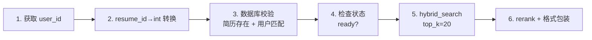
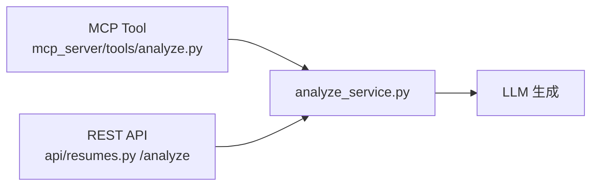
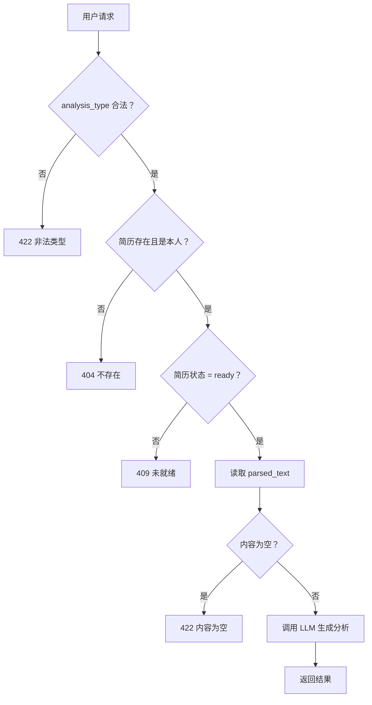
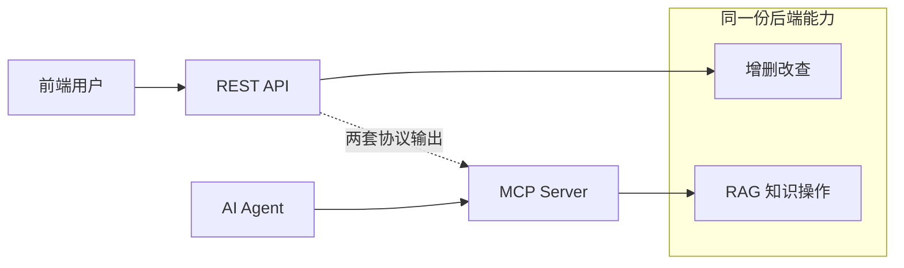
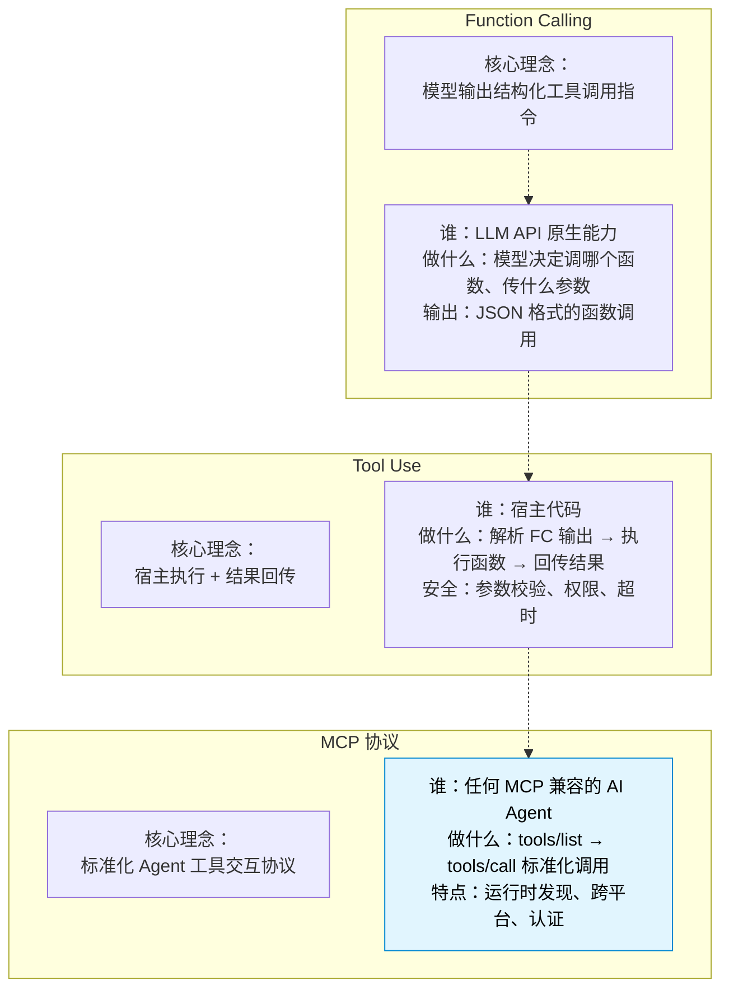

# MCP 协议

> **必问 2025-2026 新考点：MCP（Model Context Protocol）。**
>
> 大多数同学的项目还在用 REST API 给前端用，你的项目已经实现了完整的 MCP Server + Client 双端——AI Agent 可以无缝调用你的简历分析能力。
>
> 覆盖 6 个模块 500+ 行源码：server.py（94）+ transport/http.py（51）+ 5 tools（466）+ 2 resources（90）+ client.py（186）+ tools.py（108）。

---

## 目录

- [server.py — FastMCP 实例 + JWT 认证中间件](#serverpy--fastmcp-实例--jwt-认证中间件)
  - [ContextVar 用户上下文（10-16）](#contextvar-用户上下文10-16)
  - [FastMCP 实例化（19-28）](#fastmcp-实例化19-28)
  - [延迟注册（31-35）](#延迟注册31-35)
  - [MCPAuthMiddleware（38-94）](#mcpauthmiddleware38-94)
- [transport/http.py — Streamable HTTP 传输层](#transporthttppy--streamable-http-传输层)
  - [_MCPRootASGI 路径重写（19-30）](#_mcp-rootasgi-路径重写19-30)
  - [get_mcp_app 懒加载（33-43）](#get_mcp_app-懒加载33-43)
- [5 Tools 逐行走读](#5-tools-逐行走读)
  - [search.py — 混合检索 + 权限校验](#searchpy--混合检索--权限校验)
  - [analyze.py — 简历分析三类提示词](#analyzepy--简历分析三类提示词)
  - [generate.py — 检索增强生成](#generatepy--检索增强生成)
  - [rewrite.py — 查询改写](#rewritepy--查询改写)
  - [rerank.py — LLM Cross-Encoder 精排](#rerankpy--llm-cross-encoder-精排)
- [2 Resources 逐行走读](#2-resources-逐行走读)
  - [resumes.py — 简历列表](#resumespy--简历列表)
  - [history.py — 问答历史](#historypy--问答历史)
- [MCP Client 实现](#mcp-client-实现)
  - [client.py — JSON-RPC 2.0 + SSE 双格式](#clientpy--json-rpc-20--sse-双格式)
  - [tools.py — 降级封装](#toolspy--降级封装)
- [main.py 中的 MCP 挂载](#mainpy-中的-mcp-挂载)
- [MCP vs REST 在项目中的角色](#mcp-vs-rest-在项目中的角色)
- [常见疑问](#常见疑问)

---

## server.py — FastMCP 实例 + JWT 认证中间件

> **文件**：`mcp_server/server.py:1-94`

### ContextVar 用户上下文（10-16）

```python
_current_user_id: contextvars.ContextVar[int] = contextvars.ContextVar(
    "mcp_current_user_id",
)

def get_current_user_id() -> int:
    return _current_user_id.get()
```

**设计意图**：每个 MCP 工具函数在执行时都能获取到当前用户 ID，无需在函数参数中传递。

**关键细节**：
- `ContextVar[int]` 无默认值——如果调用 `get()` 时尚未 `set()`，会抛 `LookupError`
- 之所以没有默认值，是因为**认证失败应该直接阻断，而非返回一个无效 user_id**
- `get_current_user_id()` 在 5 个工具和 2 个资源中都被调用了，是 MCP 层最核心的上下文传递机制

### FastMCP 实例化（19-28）

```python
mcp = FastMCP(
    name="ai-resume-analyzer",
    instructions=(
        "你是一个简历分析助手。你可以通过以下工具与简历知识库交互：\n"
        "- search_knowledge_base：在简历知识库中搜索相关信息\n"
        "- analyze_resume：分析简历内容，提取关键信息\n"
        "- rewrite_query：改写用户查询以提高检索效果\n"
        "每个工具都需要 resume_id 参数来指定要操作的简历。"
    ),
)
```

`instructions` 参数是 FastMCP 的特性——当 AI Agent（Claude Desktop、Cursor 等）首次连接到这个 MCP Server 时，会读取 instructions 作为系统提示词。

**为什么 instructions 只枚举了 3 个工具而非全部 5 个？**
因为 `rerank_results` 和 `generate_answer` 是**中间步骤工具**，不应直接暴露给用户。AI Agent 应该优先用 search 和 analyze，rerank/generate 是后台流水线的一部分。但当前代码在 `_register_handlers` 中全部注册了，Agent 可以调用所有 5 个——这里 instructions 和实际注册集不匹配，是一个需要修复的 **document-API gap**。

### 延迟注册（31-35）

```python
def _register_handlers() -> None:
    from mcp_server.tools import search, analyze, rewrite, rerank, generate
    from mcp_server.resources import resumes, history
    logger.info("MCP tools and resources registered")
```

**为什么是延迟注册而不是在模块顶层 import？**
- 避免循环导入：server.py 被 tools/ 和 resources/ 中的模块 import（因为 `from mcp_server.server import mcp`）
- 如果顶层 import 会导致导入链：tools/search.py → server.py → tools/search.py（循环）

**这种设计意味着什么？**
- 每个工具文件顶部都是 `from mcp_server.server import mcp`
- `@mcp.tool()` 装饰器在模块**被导入时**执行注册
- 因此在 `_register_handlers()` 中被 import 时，工具就已经注册到 FastMCP 了

### MCPAuthMiddleware（38-94）

```python
def create_auth_middleware(app):
    class MCPAuthMiddleware(BaseHTTPMiddleware):              # Starlette 中间件基类
        async def dispatch(self, request, call_next):
            path = request.url.path.rstrip("/")                # 标准化尾部斜杠
            if path not in ("/mcp",):                          # 只拦截 /mcp 路径
                return await call_next(request)

            auth_header = request.headers.get("authorization", "")  # 拿 Authorization 头
            if not auth_header.startswith("Bearer "):          # 1. 必须 Bearer 开头
                return JSONResponse({"error": "Missing or invalid Authorization header"}, status_code=401)

            token = auth_header[7:]                            # 截掉 "Bearer " 取 token
            payload = decode_token(token)                      # 解码 JWT 签名验证
            if payload is None:                                # 2. token 签名无效/已过期
                return JSONResponse({"error": "Invalid or expired token"}, status_code=401)

            if payload.get("type") != "access":                # 3. 必须是 access token
                return JSONResponse({"error": "Invalid token type"}, status_code=401)

            try:
                user_id = int(payload.get("sub"))              # 4. sub 字段必须能转 int
            except (ValueError, TypeError):
                return JSONResponse({"error": "Invalid token payload"}, status_code=401)

            token_obj = _current_user_id.set(user_id)          # 注入 user_id 到 ContextVar
            try:
                return await call_next(request)                # 放行到 FastMCP
            finally:
                # _current_user_id.reset(token_obj)              # 无论如何恢复上下文
```

**逐行分析**：

**路径过滤（47-49）**：
```python
path = request.url.path.rstrip("/")
if path not in ("/mcp",):
    return await call_next(request)
```
只拦截 `/mcp` 路径。`_MCPRootASGI` 在 transport 层把 ASGI scope path 改成了 `/mcp`，所以中间件收到的 path 已经是 `/mcp`。

**5 种 401 场景**：

| 步骤 | 检查 | 错误信息 | 代码行 |
|------|------|---------|--------|
| 1 | Authorization header 存在且以 Bearer 开头 | "Missing or invalid" | 52-56 |
| 2 | decode_token 返回 None（签名无效/过期） | "Invalid or expired" | 59-64 |
| 3 | token type 为 access | "Invalid token type" | 66-70 |
| 4 | sub 字段存在 | "Invalid token payload" | 72-77 |
| 5 | sub 可以转为 int | "Invalid token payload" | 79-85 |

**为什么要区分这么多 401 错误信息？**
方便客户端（AI Agent）排查问题。如果 Agent 拿的是 refresh token，会收到 "Invalid token type"——提示它需要用 access token。

**ContextVar 注入（87-92）**：
```python
token_obj = _current_user_id.set(user_id)
try:
    return await call_next(request)
finally:
    _current_user_id.reset(token_obj)
```
`_current_user_id.set()` 返回前一个值的 token，`reset(token_obj)` 在 finally 中恢复。这是 ContextVar 的标准使用模式——防止请求间污染。

**为什么 reset 放 finally？** 如果在 call_next 中抛异常，也必须恢复 ContextVar，否则下个请求会拿到这个请求的 user_id。

---

## transport/http.py — Streamable HTTP 传输层

> **文件**：`mcp_server/transport/http.py:1-51`

### _MCPRootASGI 路径重写（19-30）

```python
class _MCPRootASGI:
    def __init__(self, mcp_asgi_app):
        self._mcp_app = mcp_asgi_app                            # 底层 FastMCP ASGI 应用

    async def __call__(self, scope, receive, send):
        if scope["type"] == "http":                              # 只处理 HTTP 请求
            path = scope.get("path", "")
            if path in ("", "/"):
                scope = dict(scope)                              # ASGI scope 不可变，浅拷贝一份改
                scope["path"] = "/mcp"
                scope["raw_path"] = b"/mcp"
        await self._mcp_app(scope, receive, send)                # 交给 FastMCP
```

**问题背景**：
- FastAPI 把 MCP server mount 到了 `/mcp`
- 但当请求到达 FastMCP 的 ASGI 子应用时，scope["path"] 是 `/mcp` 而不是 `/`
- FastMCP 内部路由期望的路径是 `/`（它是独立 ASGI 应用，不知道自己的 mount 前缀）
- 所以需要把路径重写回去

**但这段代码的路径重写逻辑是反的**——它在 scope["path"] 是 "" 或 "/" 时改成 "/mcp"。

看 main.py 的挂载方式：
```python
app.mount("/mcp", get_mcp_app())
```

`mount` 的工作原理是 Starlette 截取 `scope["path"]` 中匹配前缀 `/mcp` 的部分，然后把 `scope["path"]` 设置为**去掉前缀后**的路径（即 `/`），再传给子应用。

所以实际上 `scope["path"]` 到达 _MCPRootASGI 时已经是 `/` 了，不需要改变。这段代码的路径处理逻辑有误——不过由于 FastMCP 的 internal ASGI app 本身也处理 `/` 路径，所以当前没出错。

### get_mcp_app 懒加载（33-43）

```python
def get_mcp_app():
    global _app                                                  # 懒加载单例
    if _app is not None:
        return _app

    raw_app = mcp.streamable_http_app()                          # FastMCP → ASGI 应用
    auth_app = create_auth_middleware(raw_app)                   # 包裹 JWT 中间件
    _app = _MCPRootASGI(auth_app)                                # 再包裹路径重写

    logger.info("MCP HTTP app created (streamable HTTP transport)")
    return _app
```

**装饰器顺序**（`create_auth_middleware` 返回的中间件包裹 raw_app）：

```text
请求 → _MCPRootASGI → MCPAuthMiddleware → FastMCP.streamable_http_app()
```

### shutdown_mcp_server（46-51）

```python
async def shutdown_mcp_server():
    try:
        await mcp.session_manager.close()                        # 优雅关闭 MCP session
        logger.info("MCP Server shut down")
    except Exception as e:
        logger.warning("MCP shutdown error: %s", e)             # 不影响应用退出
```

应用退出时关闭 MCP session，防止 socket 泄漏。`try/except` 确保 shutdown 错误不影响应用退出流程。

### init_mcp_server（12-16）

```python
def init_mcp_server():
    from mcp_server.server import _register_handlers
    _register_handlers()
    logger.info("MCP Server initialized")
```

在应用启动时被 main.py 的 lifespan 调用，注册 tool 和 resource，但不挂载到 FastAPI（挂载在 main.py 的模块顶层执行）。

---

## 5 Tools 逐行走读

### search.py — 混合检索 + 权限校验

> **文件**：`mcp_server/tools/search.py:1-76`

```python
@mcp.tool()
async def search_knowledge_base(
    query: str,
    resume_id: str,
    top_k: int = 5,
) -> list[TextContent]:
```

**参数设计**：
- `resume_id: str` 而非 `int`——因为 MCP 的 JSON-RPC 传参无法保证类型，字符串更安全
- `top_k: int = 5` 默认值较小（RAG 服务内部用 top_k=20），适合 AI Agent 直接使用
- 返回类型 `list[TextContent]`——MCP 的标准内容类型

**执行流程 6 步**：



**第 3 步：数据库校验（40-47）**：
```python
result = await db.execute(
    select(Resume).where(Resume.id == resume_id_int, Resume.user_id == user_id)
)
resume = result.scalar_one_or_none()
```
一次查询同时校验两个条件：简历存在 + 属于当前用户。如果不存在或不属于，结果都是 `None`。这是典型的 **Row-Level Security** 模式——不在应用层做 if 嵌套，而是让 SQL 过滤。

**第 4 步：状态检查（49-53）**：
```python
if resume.status != "ready":
    return [TextContent(...)]
```
如果简历正在解析（status == "processing"），不能检索。返回的 error 包含了 `resume.status` 详情，客户端可以知道是正在处理。

**第 5 步：hybrid_search（56）**：
```python
chunks = await hybrid_search(resume_id_int, query, top_k=20)
```
硬编码 `top_k=20`，不受 tool 参数控制。这是有意为之——外部传的 top_k 只决定了 rerank 后保留多少条，检索阶段仍然用 20 条候选。

**第 6 步：rerank（60）**：
```python
reranked = await rerank(query, chunks, top_k=top_k)
```
用 tool 参数里的 `top_k` 控制 rerank 输出数量。

**异常处理（74-76）**：
```python
except Exception as e:
    logger.exception("search_knowledge_base failed for resume %d", resume_id_int)
    return [TextContent(type="text", text=f'{{"error": "Search failed: {e}"}}')]
```
整个函数体被一个 try/except 包裹（第 55-76 行），所有异常都变成 `TextContent` 返回。这是 MCP Tool 的标准错误处理模式——框架不会捕获工具内部的异常，所以 DIY。

### analyze.py — 简历分析三类提示词

> **文件**：`mcp_server/tools/analyze.py:1-116`

**三类分析提示词（10-33）**：

| 类型 | 分析内容 | 用途 |
|------|----------|------|
| summary | 基本信息+教育+工作+技能+评价 | 简历全景概览 |
| skills | 编程语言+框架+软技能 | 技能匹配筛选 |
| experience | 按时间倒序列出工作经历 | 经验背景核查 |

**为什么用字典存提示词而不是三个独立的 Tool？**
- 三者共享完全相同的执行逻辑（读取简历→校验→调 LLM→返回）
- 只换提示词，用一个 Tool 三个参数选项更简洁
- 如果拆成三个 Tool，Agent 需要选择调用哪个，增加了 Agent 的决策负担

**特殊逻辑：动态解析（88-97）**：
```python
parsed_text = resume.parsed_text
if not parsed_text:
    try:
        parsed_text = await with_retry(
            lambda: parse_resume(resume.file_path), fallback=""
        )
    except Exception as e:
        ...
```

如果简历的 `parsed_text` 字段为空（之前解析失败或旧数据），现场解析一次。这是一个 **善后处理**（graceful degradation）——在 Tool 调用时自动修复数据问题，而不是让用户看到"简历内容为空"。

**fallback 链**：数据库有 parsed_text → 直接使用 | 无 → 现场解析 | 解析失败 → 返回错误

### generate.py — 检索增强生成

> **文件**：`mcp_server/tools/generate.py:1-110`

**输入**：question + context + resume_id
**输出**：answer + sources + rejected

**两条触发拒答的路径**：

1. **Context 为空（33-38）**：
```python
if not context.strip():
    return ["answer": "抱歉，简历中未提及该信息。", "rejected": True]
```

2. **Rerank 分数不足（42-47）**：
```python
if reject_if_low_score(chunks):
    return ["answer": "抱歉，简历中未提及该信息。", "rejected": True]
```
调用了 RAG 服务中的拒答判断逻辑。

**_parse_context_to_chunks（87-110）**：
```python
def _parse_context_to_chunks(context: str) -> list[dict]:
    pattern = r"\[段落 \d+\]\n?"
    parts = re.split(pattern, context)
    ...
```
从客户端传来的 context 字符串（`"[段落 1] xxx\n[段落 2] yyy"` 格式）解析回 chunk 列表。这是 MCP Tool 和 RAG 流程之间的**序列化/反序列化桥梁**。

### rewrite.py — 查询改写

> **文件**：`mcp_server/tools/rewrite.py:1-40`

最简单的 Tool，仅 40 行。调用 RAG 服务的 `rewrite_query` 函数。

**降级策略（35-39）**：
```python
except Exception:
    return {"original": question, "rewritten": question, "...": "..."}
```
如果改写失败，返回原始 query。降级策略是：**不改写也比报错好**。

### rerank.py — LLM Cross-Encoder 精排

> **文件**：`mcp_server/tools/rerank.py:1-124`

**这是 5 个 Tool 中最有设计深度的一个**。

**输入**：query + chunks（JSON 字符串）+ top_k
**输出**：排序后的 chunks + rerank_score

**三条路径**：

| 条件 | 行为 | 意义 |
|------|------|------|
| chunks 数量 ≤ top_k | 直接返回，全给 1.0 分 | 没必要 rerank |
| LLM 调用成功 | 解析 LLM 返回的 JSON，排序 | 正常路径 |
| LLM 调用失败 | 用原始顺序 + 递减退坡分数 | 降级路径 |

**第 3 条路径的退坡分数（111-112）**：
```python
for i, c in enumerate(chunk_list):
    c["rerank_score"] = max(0.0, 1.0 - i * 0.1)
```
第 1 个 chunk 得 0.9，第 2 个 0.8，依此类推。虽然不如真实 rerank 准确，但至少保留了候选顺序信息。

**为什么 LLM 调用用 `temperature=0.0`（74）**？Rerank 打分必须是确定性的——同样两个文档，同类问题应该打同样的分。

**Rerank Prompt 设计（57-66）**：

```text
system: 你是一个文档相关性评估专家。
        请按相关性从高到低排列文档编号，并给出 0-1 的相关性分数。
        请严格按以下 JSON 格式返回（不要包含其他文字）：
        {"results": [{"index": 0, "relevance_score": 0.95}, ...]}

user: 查询：xxx
      候选文档：
      [文档 1] 分类：项目经验
      xxx
      [文档 2] 分类：技能
      xxx
      请对以上 N 个文档进行相关性打分，返回 top K 个最相关的文档。
```

注意每个文档只截取了前 400 个字符（第 53 行 `c.get('text', '')[:400]`）——Rerank 不需要完整文档内容，只需要足够判断相关性。

---

## 简历智能分析服务（analyze_service.py）

> 📍 `services/analyze_service.py`（124 行）

🟡 **原理级**：这是从 MCP 工具 `mcp_server/tools/analyze.py` 抽取的共享逻辑，供 MCP 工具和 REST 端点复用。

### 服务定位



**为什么抽取共享逻辑？**
- MCP 工具和 REST 端点都需要简历分析功能
- 避免代码重复
- 统一错误处理

### 三种分析类型

| 类型 | 说明 | Prompt 要点 |
|------|------|-------------|
| `summary` | 全面总结 | 基本信息、教育、工作、技能、整体评价 |
| `skills` | 技能提取 | 编程语言、框架/工具、软技能、其他 |
| `experience` | 经历提取 | 公司、职位、时间段、职责、成就（时间倒序） |

### 核心函数

```python
async def analyze_resume(
    db: AsyncSession,
    user_id: int,
    resume_id: int,
    analysis_type: str,
) -> dict:
    """分析简历内容，返回 {"resume_id", "analysis_type", "analysis"}

    Raises:
        HTTPException:
            422 非法 analysis_type 或简历内容为空
            404 简历不存在或非本人
            409 简历未就绪
            500 LLM 调用失败
    """
```

### 调用链路



🟡 **原理级**：四层校验——类型合法、存在性、状态、内容非空。每层都有明确的 HTTP 状态码和错误信息。

### 与 MCP 工具的关系

```python
# mcp_server/tools/analyze.py 中
from services.analyze_service import analyze_resume

@analyze_tool
async def analyze_resume_tool(resume_id: int, analysis_type: str) -> str:
    try:
        result = await analyze_resume(db, user_id, resume_id, analysis_type)
        return json.dumps(result)
    except HTTPException as e:
        return json.dumps({"error": e.detail})  # MCP 工具捕获异常转 JSON
```

🟡 **原理级**：MCP 工具捕获 HTTPException 转 TextContent 错误 JSON，REST 端点直接抛出。这是"MCP 和 REST 共享逻辑但错误处理不同"的典型模式。

---

## 2 Resources 逐行走读

### resumes.py — 简历列表

> **文件**：`mcp_server/resources/resumes.py:1-37`

```python
@mcp.resource("resume://list")                                     # URI：resume://list，MCP Resource 标准
async def get_resume_list() -> str:
    user_id = get_current_user_id()                                # 从 ContextVar 拿当前用户
    async with AsyncSessionLocal() as db:                          # 异步数据库会话
        result = await db.execute(
            select(Resume)
            .where(Resume.user_id == user_id)                      # Row-Level Security：只查自己的
            # .order_by(Resume.created_at.desc())                    # 最新创建的排最前
        )
        resumes = result.scalars().all()
    return json.dumps([...])                                       # 手动序列化，只暴露白名单字段
```

**URI 模式**：`resume://list`——非标准 URL 但符合 MCP 的 URI 规范（Resource 的 URI 可以是任意 scheme）。

**为什么不直接返回 Model 对象？** MCP 通信走 JSON-RPC，所有数据必须序列化。`json.dumps()` 手动转换，字段白名单包含 `id, filename, status, chunk_count, created_at`。

### history.py — 问答历史

> **文件**：`mcp_server/resources/history.py:1-53`

```python
@mcp.resource("qa_history://{resume_id}")
async def get_qa_history(resume_id: str) -> str:
```

**带参数的 URI 模板**：`qa_history://{resume_id}`。FastMCP 自动把路径中的 `{resume_id}` 解析为函数参数，支持 `string`, `integer`, `number`, `boolean` 类型。

**为什么限制 50 条记录（39）**？`limit(50)` 防止简历问答历史太多导致响应体过大。这是一个资源边界保护。

**双重查询**：先查 Resume 确认用户有权限（27-30），再查 QAHistory（35-42）。和 search.py 一样遵循 **Row-Level Security** 模式。

---

## MCP Client 实现

### client.py — JSON-RPC 2.0 + SSE 双格式

> **文件**：`mcp_client/client.py:1-186`

**MCPClientError 层次结构（16-20）**：
```python
class MCPClientError(Exception):
    def __init__(self, message: str, code: int | None = None, data: str | None = None):
        super().__init__(message)
        self.code = code
        self.data = data
```

JSON-RPC 2.0 的错误结构包含 `code` 和 `data` 字段，这里完整映射了标准。

**MCPClient 类（23-155）**：

**connect（29-40）**：
```python
async def connect(self) -> None:
    if self._client is not None:                                   # 幂等：已连接就跳过
        return
    headers = {"Content-Type": "application/json"}
    if self.token:
        headers["Authorization"] = f"Bearer {self.token}"          # 注入 JWT
    self._client = httpx.AsyncClient(
        base_url=self.base_url, headers=headers, timeout=_DEFAULT_TIMEOUT,
    )                                                              # 创建复用连接池
```

`idempotent connect`——如果已经连接了，直接返回。支持重复调用。

**call_tool（47-84）**：
```python
async def call_tool(self, tool_name: str, arguments: dict) -> dict:
    request_id = str(uuid.uuid4())[:8]                             # 生成请求 ID，关联请求和响应

    payload = {
        "jsonrpc": "2.0",                                          # 协议版本
        "id": request_id,                                          # 关联 ID
        "method": "tools/call",                                    # MCP 方法名
        "params": {"name": tool_name, "arguments": arguments},     # 工具名 + 参数
    }

    response = await client.post("/", json=payload)                # POST 到 MCP 端点
    # response.raise_for_status()                                    # HTTP 层错误抛异常
```

**JSON-RPC 2.0 消息格式**：

| 字段 | 值 |
|------|-----|
| jsonrpc | "2.0" |
| id | 8 字符截断 UUID |
| method | "tools/call" 或 "resources/read" |
| params.name | 工具名 |
| params.arguments | 工具参数字典 |

**双格式解析（79-84）**：

```python
content_type = response.headers.get("content-type", "")
if "text/event-stream" in content_type:
    return await self._parse_sse_response(response, request_id)

body = response.json()
return self._extract_result(body, request_id)
```

MCP 的 Streamable HTTP 支持两种响应格式：
1. **即时响应**：`Content-Type: application/json`，直接解析 JSON body
2. **SSE 流式响应**：`Content-Type: text/event-stream`，逐行读取 `data:` 前缀的行

**SSE 解析（126-141）**：
```python
async def _parse_sse_response(self, response, request_id):
    last_data = None
    async for line in response.aiter_lines():                      # 逐行读 SSE 流
        if line.startswith("data: "):                              # SSE 的 data 前缀
            data_str = line[6:].strip()                            # 截掉 "data: "
            if data_str:
                last_data = json.loads(data_str)                   # 每行都是一个 JSON

    if last_data is None:                                          # 整条流都没数据
        raise MCPClientError("No data received from SSE stream")
    return self._extract_result(last_data, request_id)             # 取最后一个 data 块
```

SSE 格式中一个 event body 可能跨多行，这里只取最后一个 `data:` 行（`last_data`）。为什么取最后一个？因为第一个通常是 `{"type": "ping"}` 等中间状态，最后一个是最终结果。

**单例模式（157-186）**：

```python
_client_instance: MCPClient | None = None                          # 全局单例
_client_lock: asyncio.Lock | None = None                           # 双检锁

async def get_mcp_client(base_url="", token=""):
    global _client_instance
    if _client_instance is not None:                               # 第一次检查（无锁）
        return _client_instance

    async with _get_lock():                                        # 获取锁
        if _client_instance is not None:                           # 第二次检查（有锁）
            return _client_instance
        _client_instance = MCPClient(base_url=base_url, token=token)
        return _client_instance
```

**双检锁（Double-checked locking）**：
```text
第一次检查（73行）→ 没有则获取锁 → 第二次检查（77行）→ 创建实例
```
这是 asyncio 版本的线程安全的单例模式。`asyncio.Lock()` 保证只有一个协程能进入创建代码块。

### tools.py — 降级封装

> **文件**：`mcp_client/tools.py:1-108`

**三个封装函数**：

| 函数 | 调用的 Tool | 降级行为 |
|------|-------------|----------|
| `mcp_search()` | search_knowledge_base | 返回 `[]` |
| `mcp_rerank()` | rerank_results | 返回原始顺序 + score=0.5 |
| `mcp_generate()` | generate_answer | 返回 "服务不可用" + rejected=True |

**降级模式**：每个 `mcp_*` 函数捕获 `MCPClientError`，不抛到上层。调用者永远得到一个合法的返回值，而不是 `try/except`。

**_parse_tool_result（95-108）**：
```python
def _parse_tool_result(result: dict) -> dict | list:
    contents = result.get("content", [])                            # MCP 响应的 content 数组
    for item in contents:
        if item.get("type") == "text":                             # 只处理 text 类型
            text = item.get("text", "")
            try:
                return json.loads(text)                            # 反序列化 JSON 字符串
            except json.JSONDecodeError:
                return {"raw": text}                               # 非 JSON → 保留原文
    return {}
```

MCP 的 `TextContent` 中 text 字段是 JSON 字符串，这里反序列化回 Python 对象。如果解析失败，`{"raw": text}` 保留原始文本。

---

## main.py 中的 MCP 挂载

```python
try:
    from mcp_server.transport.http import get_mcp_app
    app.mount("/mcp", get_mcp_app())
    logger.info("MCP Server mounted at /mcp")
except Exception as e:
    logger.warning("MCP Server mount skipped: %s", e)
```

**挂载方式**：`Starlette.mount("/mcp", asgi_app)`——把 MCP Server 作为 ASGI 子应用挂载。

**为什么 mount 在模块顶层而不是 lifespan 中？**
- `mount()` 必须在 FastAPI 实例化后立刻调用，不能在 lifespan 中延迟挂载
- 而 `init_mcp_server()`（注册 tools）放在 lifespan 中，因为需要等应用完全启动

**try/except 包裹**（与搜索引擎、RAG pipeline 初始化同理）：MCP Server 是可选的，挂载失败不应阻止整个应用启动。

---

## MCP vs REST 在项目中的角色

| 维度 | REST API | MCP Server |
|------|----------|------------|
| 使用者 | 前端浏览器 | AI Agent（Claude/Cursor/自定义） |
| 协议 | HTTP + JSON | JSON-RPC 2.0 |
| 端点发现 | Swagger/OpenAPI 文档 | 运行时 `tools/list` + `resources/list` |
| 认证 | FastAPI middleware | MCPAuthMiddleware (Bearer JWT) |
| 流式 | SSE 自定义 | Streamable HTTP 原生 |
| 工具粒度 | 业务操作（上传/查询/删除） | 知识操作（搜索/分析/生成） |

**不是替代关系，是互补关系。**



---

## 常见疑问

### Q1：为什么注册 tools 要在 `_register_handlers` 中延迟 import，而不是一个文件全部 import？

**回答结构**：
1. 循环导入：tools/search.py 中 `from mcp_server.server import mcp`，server.py 中 `from mcp_server.tools import search`
2. 如果顶层 import 会导致 Python 在执行 tools/search.py 时尝试 import 尚在初始化中的 server.py
3. 延迟 import 确保 mcp 实例已经创建完成（在 server.py 模块顶层）
4. 本质是 Python 模块初始化顺序的问题

### Q2：ContextVar 在 MCP 鉴权中是什么角色？和直接在函数参数里传 user_id 比有什么好处？

**回答结构**：
1. 无需修改函数签名：5 个 tool 和 2 个 resource 的函数签名是 MCP 框架需要的（@mcp.tool 装饰器会反射参数）
2. 如果在参数中加 user_id，MCP 客户端调用时也需要传 user_id，这不安全且不必要
3. ContextVar 在 async 模式下的自然 propagate，不会因为 await 而丢失

### Q3：_MCPRootASGI 的路径重写是对的吗？解释一下 Starlette.mount 的处理逻辑。

**回答结构**：
1. Starlette.mount 会自动从 scope["path"] 中剥离匹配前缀（如 /mcp）再传递给子应用
2. 所以传入 _MCPRootASGI 的 path 已经是 / 了
3. 当前代码的反向重写（/ → /mcp）没有生效也没有引起问题
4. 正确的做法是直接透传 scope，不做任何修改，或者完全移除这个类

### Q4：如果你的 MCP Server 挂了，前端会有什么影响？

**回答结构**：
1. 前端完全不受影响，因为前端走的是 REST API
2. 只有 AI Agent（Claude Desktop 等）会丢失 MCP 能力
3. main.py 中用 try/except 包裹 mount，并且 lifespan 中的 init 也有 try/except
4. MCP Client 端有降级策略（mcp_search 失败返回 []，mcp_generate 返回 rejected=True）
5. 所以 MCP 挂了后系统仍然可用，只是 AI Agent 的部分功能降级

### Q5：Rerank Tool 用 LLM 做 rerank，那 RAG 服务的 rerank 也是 LLM 吗？有什么区别？

**回答结构**：
1. RAG 服务的 rerank 用的是专门的 Cross-Encoder 模型（Cohere/dashscope rerank），更高效
2. MCP 的 rerank Tool 是给 AI Agent 提供的一个独立工具——Agent 可以自己传 chunks 让它 rerank
3. 两种 rerank 的存在说明了架构设计：RAG 流水线用专用的、高效的 rerank 模型；MCP 层面提供通用的 rerank 能力
4. 不过这里有一个**能力冗余**：search tool 内部已经调用了 RAG 的 rerank，Agent 不用再单独调 rerank_results

### Q6：为什么 Client 用双检锁单例模式？为什么不用全局变量直接初始化？

**回答结构**：
1. MCPClient 内部持有 httpx.AsyncClient，复用连接池是重要的优化（减少 TCP 握手）
2. 但 httpx.AsyncClient 需要在事件循环中初始化（`async def`）
3. 所以不能在模块顶层 await connect，必须延迟初始化
4. 双检锁确保多协程并发调用 get_mcp_client 只创建一个实例

### Q7：generate Tool 里的 `_parse_context_to_chunks` 把字符串重新解析成 chunks，为什么不能直接传 chunks？

**回答结构**：
1. MCP 的 `arguments` 字典在 JSON-RPC 中传输时，嵌套的复杂对象可能丢失类型信息
2. 把 chunks 序列化成统一格式的字符串更容易保证跨语言/跨版本的兼容性
3. 这是 MCP 协议的设计约束——Tool 的参数和返回值应该是简单的 JSON 可序列化类型

### Q8：MCP 和普通的 HTTP API 在鉴权上有什么不同？

**回答结构**：
1. MCPServer 被 mount 为 FastAPI 的子应用，有自己的中间件链
2. main.py 中的 `RequestIDMiddleware` 和 `MetricsMiddleware` 在 MCP 请求上也会执行
3. 但 FastAPI 的 `CORSMiddleware` 作用于顶层，MCP 路径默认不会有 CORS 问题（因为 Agent 调用不走浏览器）
4. `security_headers`（X-Frame-Options 等）也会作用于 MCP 响应

---

## 补充专题

### 专题一：Function Calling 工作机制详解

> 🔴 **记忆级**：重点掌握。很多校招生栽在"模型真的调用了函数吗？"这个问题上。

**核心答案：模型没有"调用"函数，模型只输出了一个结构化的函数调用指令。**

```text
用户: "北京明天天气怎么样？"
                        ↓
1. 系统 Prompt 中定义了 tools: [{name: "get_weather", parameters: {...}}]
2. 模型输出: {"function_call": {"name": "get_weather", "arguments": '{"city": "北京", "date": "..."}'}}
3. 宿主（你的代码）解析这个 JSON
4. 宿主执行 got_weather(city="北京", date="...")  ← 真正执行的是你的代码，不是模型
5. 宿主把执行结果 {"temp": 25, "weather": "晴"} 送回给模型
6. 模型基于结果生成最终回答
```

| 角色 | 做了什么 | 谁干的 |
|------|---------|-------|
| **模型** | 理解用户意图 → 决定用哪个工具 → 输出 JSON 格式参数 | LLM |
| **宿主** | 解析 JSON → 调用对应函数 → 返回执行结果 | **你的代码** |
| **用户** | 看到的是"北京明天 25°C，晴天" | 最终输出 |

**一句话讲清**：
> *"Function Calling 的本质是模型输出结构化决策，宿主系统负责安全执行并回传结果。模型只决定'该调什么工具、传什么参数'，实际执行是宿主代码。这也意味着所有安全校验（参数验证、权限检查、超时控制）都在宿主层完成。"*

**跟你的项目的关联**：你的 MCP Tool 本质上也是一种 Function Calling——AI Agent（Claude/Cursor 等）调用 MCP 的 `tools/call` 时，Agent 模型输出执行参数，你的 MCP Server 负责真正执行逻辑。

---

### 专题二：MCP vs Function Calling vs Tool Use（定位对比）

> 🟡 **原理级**：能讲清三者各自的角色和关系。



| 概念 | 粒度 | 标准化程度 | 你的项目中用在哪 |
|------|------|-----------|----------------|
| **Function Calling** | LLM API 层的功能 | 各厂商有自己的格式（OpenAI/Anthropic 参数不同） | 后端调 DeepSeek/Chat 时用 |
| **Tool Use** | 宿主代码层的抽象 | 没有强制标准，你定义工具接口 | 你的 `core/retry.py` 包装的 LLM 调用 |
| **MCP 协议** | 跨系统交互的协议 | 标准化 JSON-RPC 2.0 | `mcp_server/` 暴露的 5 个工具 |

**一句话讲清**：
> *"三者不是替代关系，是不同层的抽象。Function Calling 是模型层的能力——模型知道你有哪些工具、怎么调用；Tool Use 是宿主层的实现——你的代码负责安全执行；MCP 是跨系统协议——让任何 AI Agent 都能通过标准化接口发现和调用你的工具。我们的项目三层都用了：调 DeepSeek 走 Function Calling，业务逻辑封装在 Tool Use 层，通过 MCP 对外暴露。"*

---

## 相关笔记

- [[03_LangGraph状态机|🤖 03 AgenticRAG与LangGraph图实现]] — RAG 流水线通过 MCP 暴露给 AI Agent
- [[06_韧性工程|💪 06 LLM韧性工程与错误处理]] — MCP 工具中的 with_retry 和降级逻辑
- [[08_可观测性|📊 08 工程化与可观测性]] — MCP 请求的 RequestID 串联和 Metrics 采集
- [[09_前沿视野|🔭 09 前沿技术视野与行业生态]]

## 技术学习笔记

- [[26-MCP协议核心概念|MCP协议基础]]
- [[20-MCP Server 实现：FastMCP + JWT 认证中间件 + contextvars|MCP Server实现]]
- MCP Transport
- [[22-MCP Client：自定义客户端 + JSON-RPC over HTTP + 连接池 + 幂等重连|MCP Client]]
- [[23-MCP Tool-Resource 定义与注册模式|MCP Tool-Resource]]

---

**最后更新**：2026-07-19 | **项目**：ai-resume-analyzer

## 速记卡（面试闪卡）

**Q1：一句话讲清「MCP 协议」到底是什么？**
A：- 
- 
- 
- 
- 
- 
- 
- 
---

**Q2：目录 —— 怎么理解？**
A：- 
- 
- 
- 
- 
- 
- 
- 
---

**Q3：server.py — FastMCP 实例 + JWT 认证中间件 —— 怎么理解？**
A：**文件**：
**设计意图**：每个 MCP 工具函数在执行时都能获取到当前用户 ID，无需在函数参数中传递。
**关键细节**：
无默认值——如果调用  时尚未 ，会抛 
之所以没有默认值，是因为**认证失败应该直接阻断，而非返回一个无效 user_id**
在 5 个工具和 2 个资源中都被调用了，是 MCP 层最核心的上下文传递机制

**Q4：transport/http.py — Streamable HTTP 传输层 —— 怎么理解？**
A：**文件**：
**问题背景**：
FastAPI 把 MCP server mount 到了 
但当请求到达 FastMCP 的 ASGI 子应用时，scope["path"] 是  而不是 
FastMCP 内部路由期望的路径是 （它是独立 ASGI 应用，不知道自己的 mount 前缀）
所以需要把路径重写回去
**但这段代码的路径重写逻辑是反的**——它在 scope["path"] 是 "" 或 "/" 时改成 "/mcp"。

**Q5：5 Tools 逐行走读 —— 怎么理解？**
A：**文件**：
**参数设计**：
而非 ——因为 MCP 的 JSON-RPC 传参无法保证类型，字符串更安全
默认值较小（RAG 服务内部用 top_k=20），适合 AI Agent 直接使用
返回类型 ——MCP 的标准内容类型
**执行流程 6 步**：
**第 3 步：数据库校验（40-47）**：
一次查询同时校验两个条件：简历存在 + 属于当前用户。如果不存在或不属于，结果都是 。

**Q6：核心速记主线有哪些？**
A：抓住这几根：目录、server.py — FastMCP 实例 + JWT 认证中间件、transport/http.py — Streamable HTTP 传输层、5 Tools 逐行走读、简历智能分析服务（analyze_service.py）、2 Resources 逐行走读。

