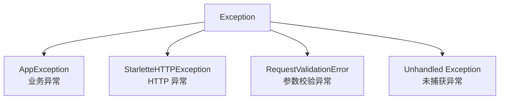
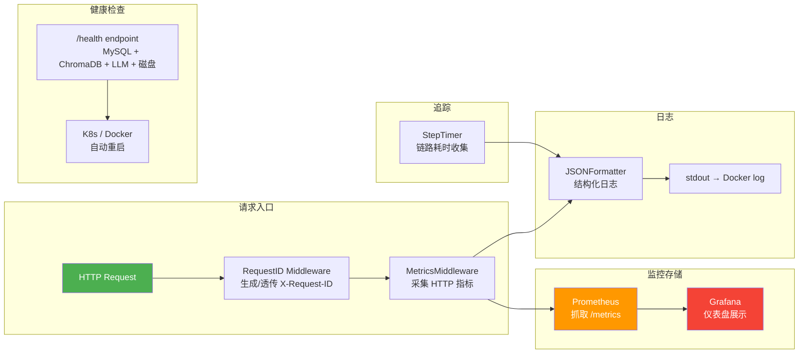

# 可观测性

> **不关心你 RAG 多牛，关心的是「线上崩了你怎么办？」**
>
> 答：完整的可观测性体系——RequestID 全链路串联 → 结构化日志（JSON + PII 脱敏 + 采样） → Prometheus 4 层 30+ 指标 → 健康检查 4 维度 → 自动部署 + 回滚。
>
> 这篇覆盖 backend/main.py 入口（205 行）+ core/ 下 5 个基础设施模块 + Docker 编排。

---

## 目录

- [main.py — 应用入口逐行走读](#mainpy--应用入口逐行走读)
  - [SQLite 兼容性补丁（1-4）](#sqlite-兼容性补丁1-4)
  - [生命周期管理器（37-75）](#生命周期管理器37-75)
  - [中间件堆栈（80-112）](#中间件堆栈80-112)
  - [健康检查端点（147-205）](#健康检查端点147-205)
  - [旧版路径重定向（128-139）](#旧版路径重定向128-139)
- [RequestID 中间件 — 全链路追踪基础](#requestid-中间件--全链路追踪基础)
- [结构化日志引擎 — logging_config.py](#结构化日志引擎--logging_configpy)
  - [PII 脱敏（12-44）](#pii-脱敏12-44)
  - [LogSampler 采样器（47-67）](#logsampler-采样器47-67)
  - [JSONFormatter（70-109）](#jsonformatter70-109)
  - [setup_logging（122-139）](#setup_logging122-139)
- [Prometheus Metrics — metrics.py](#prometheus-metrics--metricspy)
  - [4 层指标定义（1-161）](#4-层指标定义1-161)
  - [MetricsMiddleware（213-254）](#metricsmiddleware213-254)
  - [timer_context 与 track_llm_call（256-296）](#timer_context-与-track_llm_call256-296)
  - [Endpoint 归一化（189-210）](#endpoint-归一化189-210)
- [StepTimer — RAG 链路耗时收集](#steptimer--rag-链路耗时收集)
- [安全模块 — security.py](#安全模块--securitypy)
- [全局异常处理 — exceptions.py](#全局异常处理--exceptionspy)
- [API 限流器 — limiter.py](#api-限流器--limiterpy)
- [配置管理 — config.py](#配置管理--configpy)
- [Docker 多阶段构建](#docker-多阶段构建)
- [Docker Compose 四套编排](#docker-compose-四套编排)
- [监控栈 — Prometheus + Grafana](#监控栈--prometheus--grafana)
- [常见疑问](#常见疑问)

---

## main.py — 应用入口逐行走读

### SQLite 兼容性补丁（1-4）

```python
import sys                                         # ChromaDB 依赖 pysqlite3，需要偷梁换柱
# __import__('pysqlite3')                            # 先导入 pysqlite3（第三方的 sqlite3 封装）
sys.modules['sqlite3'] = sys.modules.pop('pysqlite3')  # 用 pysqlite3 替换内置 sqlite3
```

**这是整个项目第一行可执行代码**，比所有的 import 都早。

ChromaDB 依赖 SQLite，但 Python 3.11+ 自带的 sqlite3 版本可能低于 Chroma 要求的 3.35.0。`pysqlite3` 是一个更新的 SQLite 绑定包。

**代码解析**：
1. `__import__('pysqlite3')`：导入 pysqlite3 模块但不用变量接
2. `sys.modules['sqlite3'] = sys.modules.pop('pysqlite3')`：偷梁换柱——把 sqlite3 这个模块名指向 pysqlite3 的实现
3. 之后的 `import sqlite3` 实际上是导入 pysqlite3

**延伸追问**：为什么不直接 `import pysqlite3 as sqlite3`？
- 因为 Chroma 内部用的是 `import sqlite3` 不是 `from pysqlite3 import ...`。你无法控制 Chroma 的导入方式，只能替换模块名

### 生命周期管理器（37-75）

```python
@asynccontextmanager                              # 异步上下文管理器，FastAPI 生命周期
async def lifespan(app: FastAPI):
    await init_db()                               # 初始化数据库连接

    # initialize_app_info(                          # 应用元信息（Prometheus 的 Info 指标）
        version="0.2.0",
        environment=settings.ENVIRONMENT,
        python_version=f"{sys.version_info.major}.{sys.version_info.minor}",
    )

    try:
        from services.rag_service import _cleanup_orphan_segments  # 避免循环导入，函数内导入
        cleaned = _cleanup_orphan_segments()
        if cleaned:
            logger.info("Cleaned up %d orphan ChromaDB segments", cleaned)
    except Exception:
        logger.warning("Orphan cleanup skipped", exc_info=True)    # Chroma 异常不阻塞启动

    try:
        from mcp_server.transport.http import init_mcp_server      # MCP Server 异步初始化
        init_mcp_server()
        logger.info("MCP Server initialized")
    except Exception as e:
        logger.warning("MCP Server init skipped: %s", e)

    yield                                          # 应用开始服务请求

    try:
        from mcp_server.transport.http import shutdown_mcp_server  # 关闭时清理 MCP
        await shutdown_mcp_server()
    except Exception:
        pass
```

**4 个启动动作**：

| 步骤 | 功能 | 失败处理 |
|------|------|----------|
| 1. init_db | 验证数据库连接 | 抛异常（直接崩） |
| 2. app_info | 设置 Prometheus 元标签 | 不失败 |
| 3. 孤儿清理 | 清理 ChromaDB 僵尸 segments | warning 继续 |
| 4. MCP init | 注册 MCP Tool + Resource | warning 继续 |

**设计哲学**：
- `init_db()` 没有 try/except——数据库连不上应该直接炸，不启动
- 孤儿清理和 MCP init 有 try/except——它们是可选功能，失败不应阻止应用启动
- `yield` 之前是启动，之后是关闭——asynccontextmanager 的标准模式

**孤儿 segment 是什么？** ChromaDB 在某些异常情况下（比如索引重建中断）会留下孤立的 segment 文件。`_cleanup_orphan_segments` 在启动时清理这些残留，防止 Chroma 的 HNSW 索引损坏。

### 中间件堆栈（80-112）

```python
app = FastAPI(title="AI简历分析系统", version="0.2.0", lifespan=lifespan)  # 创建 FastAPI 实例
app.state.limiter = limiter                         # 附加限流器，给异常处理器用

# app.add_middleware(RequestIDMiddleware)              # 全链路追踪 ID
# app.add_middleware(MetricsMiddleware)                # Prometheus 指标采集
# register_exception_handlers(app)                     # 注册异常处理器（非 middleware）
```

**中间件执行顺序**：添加顺序即执行顺序

1. `RequestIDMiddleware`——最先执行，确保请求从头到尾有一个 trace_id
2. `MetricsMiddleware`——第二层，采集请求数量/延迟/并发数
3. `register_exception_handlers`——不是 middleware，是 exception handler

**安全响应头（106-112）**：

```python
@app.middleware("http")
async def security_headers(request, call_next):
    response = await call_next(request)              # 先拿到上游响应
    response.headers["X-Content-Type-Options"] = "nosniff"  # 防 MIME 嗅探
    response.headers["X-Frame-Options"] = "DENY"            # 防点击劫持
    response.headers["X-XSS-Protection"] = "0"             # 关闭老旧 XSS 过滤器
    response.headers["Referrer-Policy"] = "strict-origin-when-cross-origin" # 跨站限 Referer
    return response
```

4 个安全头，各自的作用：

| Header | 值 | 防御目标 |
|--------|-----|---------|
| X-Content-Type-Options | nosniff | MIME 类型嗅探攻击 |
| X-Frame-Options | DENY | Clickjacking（点击劫持） |
| X-XSS-Protection | 0 | 关闭老旧 XSS 过滤器（新版浏览器已废弃） |
| Referrer-Policy | strict-origin-when-cross-origin | 跨站时限制 Referer |

注意 `X-XSS-Protection: 0`——这和直觉相反。Google Chrome 在 v78+ 移除了 XSS Auditor（因为本身有安全漏洞），建议显式关闭。

**CORS 配置（94-102）**：

```python
cors_origins = [o.strip() for o in settings.CORS_ORIGINS.split(",") if o.strip()]  # 逗号分割，去空格

app.add_middleware(
    CORSMiddleware,
    allow_origins=cors_origins,       # 允许的来源列表
    allow_credentials=True,            # 允许 Cookie
    allow_methods=["*"],               # 允许所有 HTTP 方法
    allow_headers=["*"],               # 允许所有请求头
)
```

`split(",")` 把配置字符串 `"http://localhost:5173,http://localhost:5174"` 拆成列表。`strip()` 处理用户可能在逗号后加的空格。

### 健康检查端点（147-205）

```python
@app.get("/", tags=["health"])
async def health(verbose: bool = Query(False, ...)):
# MySQL 连通性
    try:
        async with engine.begin() as conn:
            await conn.execute(text("SELECT 1"))   # 最轻量的数据库 ping
        checks["database"] = "connected"
    except Exception:
        checks["database"] = "disconnected"
        all_ok = False

# ChromaDB 连通性
    try:
        # get_chroma_client().list_collections()     # Chroma 的 ping
        checks["chromadb"] = "connected"
    except Exception:
        checks["chromadb"] = "disconnected"
        all_ok = False

# LLM 服务可达性（verbose 模式）
    if verbose:
        try:
            async with httpx.AsyncClient(timeout=3.0) as client:
                resp = await client.get(llm_base)
                checks["llm_service"] = "reachable" if resp.status_code < 500 else "degraded"
        except Exception:
            checks["llm_service"] = "unreachable"

    # 磁盘空间（verbose 模式）
    if verbose:
        try:
            usage = shutil.disk_usage("/")
            checks["disk"] = {
                "free_gb": free_gb,
                "total_gb": total_gb,
                "percent_used": percent_used,
            }
            if percent_used > 95:
                all_ok = False
        except Exception:
            checks["disk"] = "unavailable"

    status_code = 200 if all_ok else 503
    checks["status"] = "ok" if all_ok else "degraded"
    return JSONResponse(content=checks, status_code=status_code)
```

**4 维度健康检查**：

| 维度 | 检查方式 | 是否导致 degraded | 模式 |
|------|---------|------------------|------|
| MySQL | SELECT 1 | ✅ | 始终 |
| ChromaDB | list_collections | ✅ | 始终 |
| LLM 服务 | GET base URL | ❌（llm 不可达不标记 degraded） | verbose 模式 |
| 磁盘 | shutil.disk_usage | 如 >95% 则 degraded | verbose 模式 |

**设计意图**：
- **分模式**：普通健康检查（/）只检查数据库和 ChromaDB，轻量快速。verbose 模式（/?verbose=true）检查 LLM 和磁盘
- **LLM 不可达不标记 degraded**：这是一个重要决策——LLM 服务是上游依赖，可能短时抖动。标记 degraded 会让 K8s 误以为应用本身有问题而重启容器
- `GET base URL` 而非真实调用：轻量 ping，不开销

### 旧版路径重定向（128-139）

```python
LEGACY_PREFIXES = ["/api/auth", "/api/resumes", "/api/qa"]

@app.middleware("http")
async def legacy_redirect(request, call_next):
    path = request.url.path
    if not path.startswith("/api/"):                   # 不是 API 路径，跳过
        return await call_next(request)
    for prefix in LEGACY_PREFIXES:                     # 匹配旧前缀
        if path.startswith(prefix):
            new_path = path.replace("/api/", "/api/v1/", 1)  # 替换为 v1 新路径
            return RedirectResponse(url=new_path, status_code=308)  # 308 保证 POST body 不丢失
    return await call_next(request)
```

使用 308（Permanent Redirect）而非 301——308 保证 POST 请求的 body 不被浏览器改成 GET。

### /metrics 端点（142-144）

```python
@app.get("/metrics", tags=["monitoring"], include_in_schema=False)  # 不暴露到 Swagger
async def metrics():
    return await prometheus_metrics_endpoint(None)        # 调用 prometheus_client 的默认端点
```

`include_in_schema=False`：不给 Swagger UI 暴露（监控端点对开发者不重要）。

### 限流异常处理（85-91）

```python
@app.exception_handler(RateLimitExceeded)
async def rate_limit_handler(request, exc):
    return Response(
        content='{"detail":"请求过于频繁，请稍后再试"}',    # 手动 JSON 字符串，避免序列化开销
        status_code=429,
        media_type="application/json",
    )
```

返回 429 带中文错误信息。手动编 JSON 字符串而非用 `JSONResponse`——因为这段代码极为热路径，避免序列化开销。

---

## RequestID 中间件 — 全链路追踪基础

> **文件**：`core/request_id.py:1-29`

```python
from contextvars import ContextVar          # 上下文变量，asyncio 兼容的"线程局部变量"
from uuid import uuid4

_request_id_ctx: ContextVar[str] = ContextVar("request_id", default="-")  # 默认"-"

def get_request_id() -> str:
    return _request_id_ctx.get()

class RequestIDMiddleware(BaseHTTPMiddleware):
    async def dispatch(self, request, call_next):
        rid = request.headers.get(HEADER_NAME) or str(uuid4())  # 透传客户端 ID 或新生成
        token = _request_id_ctx.set(rid)
        try:
            response = await call_next(request)
            response.headers[HEADER_NAME] = rid                 # 响应头回传 ID
            return response
        finally:
            # _request_id_ctx.reset(token)                        # 确保请求间不污染
```

**设计核心**：`contextvars.ContextVar`——Python 3.7+ 的上下文变量，是 asyncio 原生支持的"线程局部变量"替代品。

**为什么不用 threading.local？** 因为 asyncio 协程在同一个线程中切换，threading.local 无法区分不同协程。ContextVar 在 await 时自动 propagate。

**数据流**：

```text
客户端请求（无 X-Request-ID）→ uuid4() 生成 → 响应头附上 X-Request-ID
客户端请求（带 X-Request-ID）→ 透传 → 响应头附上同样的 ID
```

**关键细节**：
- `_request_id_ctx.reset(token)` 在 finally 块——确保即使异常也不会污染下一个请求
- 默认值 `-`：即使用 `get_request_id()` 时还没有设置，也不会抛错
- `uuid4()`：随机 UUID，比 uuid1（基于 MAC）更隐私友好

---

## 结构化日志引擎 — logging_config.py

> **文件**：`core/logging_config.py:1-139`

### PII 脱敏（12-44）

```python
_PII_PATTERNS: list[tuple[Pattern, str]] = [
    (re.compile(r"([a-zA-Z0-9._%+-]{1,2})[a-zA-Z0-9._%+-]*@([a-zA-Z0-9.-]+\.[a-zA-Z]{2,})"), r"\1***@\2"),
    (re.compile(r"(1[3-9]\d)\d{4}(\d{4})"), r"\1****\2"),
    (re.compile(r"(\d{6})\d{8}(\d{3}[\dXx])"), r"\1********\2"),
    (re.compile(r"(api[_-]?key|secret|token|password|passwd|pwd)\s*[:=]\s*[\"']?([a-zA-Z0-9._\-]{4})[a-zA-Z0-9._\-]+", re.IGNORECASE), r"\1=\2****"),
    (re.compile(r"Bearer\s+([a-zA-Z0-9._\-]{4})[a-zA-Z0-9._\-]+", re.IGNORECASE), r"Bearer \1****"),
]  # 5 条 PII 正则：邮箱/手机/身份证/API Key/Bearer Token，保留前几位便于追踪

_PII_FIELD_NAMES = frozenset({
    "email", "phone", "mobile", "id_card", "identity",
    "password", "passwd", "secret", "api_key", "token",
    "authorization", "access_token", "refresh_token",
# })  # 按字段名匹配脱敏
```

**两阶段脱敏**：

1. **正则匹配（_filter_pii）**：在文本中搜索模式并替换。5 条正则覆盖：
   - 邮箱：只保留前 1-2 个字符
   - 手机号：保留前 3 后 4
   - 身份证：保留前 6 后 4
   - API Key/Token：只保留前 4 位
   - Bearer Token：只保留前 4 位

2. **字段名匹配（_filter_pii_dict）**：如果 dict 的 key 名包含敏感信息（如 `"password": "123456"`），直接截断

**为什么保留部分字符？** 保留前几位便于调试时区分不同的 token/邮箱，同时保护隐私。完全替换为 `***` 会导致无法追踪是哪个 token 出问题。

### LogSampler 采样器（47-67）

```python
class LogSampler:
    def __init__(self, rate: float = 1.0):
        self.rate = max(0.0, min(1.0, rate))          # 裁切到 [0, 1]，防配错

    def should_log(self, request_id: str | None) -> bool:
        if self.rate >= 1.0:                           # 全采，不用 hash
            return True
        if not request_id or self.rate <= 0.0:         # 没 ID 或采样率 0→不采
            return False
        return (hash(request_id) % 10000) / 10000.0 < self.rate  # hash 均匀分布保证 ≈ rate
```

**采样算法**：`hash(request_id) % 10000 < rate * 10000`

**为什么基于 request_id 采样？**
- 同一个请求的所有日志要么全采样要么全不采样
- 避免一个请求的日志支离破碎（前一半有、后一半没有）
- `hash()` 的均匀性保证了采样率 ≈ rate

**环境变量控制**：`LOG_SAMPLE_RATE=0.1` = 只采样 10% 的请求

### JSONFormatter（70-109）

```python
class JSONFormatter(logging.Formatter):
    def format(self, record: LogRecord) -> str:          # 重写 format，输出 JSON 而非纯文本
        request_id = get_request_id()                     # 从上下文变量取当前请求 ID

        sampler = _get_sampler()                          # 获取 LogSampler（单例）
        if not sampler.should_log(request_id):             # 采样决定：不采样就返回空字符串
            return ""

        trace_id = getattr(record, "trace_id", None) or request_id or ""  # OpenTelemetry trace ID
        span_id = format(abs(hash(record.name)) & 0xFFFFFFFF, "08x") if record.name else ""

        log_entry = {
            "timestamp": datetime.now(timezone.utc).strftime("%Y-%m-%dT%H:%M:%S.%fZ"),
            "level": record.levelname,
            "logger": record.name,
            "message": _filter_pii(record.getMessage()),   # 脱敏后 message，不在日志中暴露原始信息
            "request_id": request_id or "",
            "trace_id": trace_id,
            "span_id": span_id,
        }

        # 提取 extra 字段（非 logging 内置属性）
        extra_data = {}
        for key, value in record.__dict__.items():
            if key not in _builtin_keys and not key.startswith("_"):
                extra_data[key] = value                    # 收集自定义字段
        if extra_data:
            # log_entry.update(_filter_pii_dict(extra_data)) # extra 字段也过脱敏

        return json.dumps(log_entry, ensure_ascii=False)   # 序列化为 JSON 字符串
```

**输出示例**：
```json
{
  "timestamp": "2026-07-14T10:30:00.123456Z",
  "level": "INFO",
  "logger": "rag_service",
  "message": "hybrid_search completed",
  "request_id": "abc-123-def",
  "trace_id": "abc-123-def",
  "span_id": "a1b2c3d4",
  "elapsed_ms": 340,
  "dense_hits": 20
}
```

**技术细节**：
- `timestamp`：UTC 时间，ISO 8601 格式带毫秒——这是机器消费的最佳格式
- `span_id`：基于 logger name 的 hash——同一个 logger 的 span_id 稳定，跨进程不保证唯一
- `_builtin_keys`：排除 `name`, `msg`, `args`, `created` 等 LogRecord 内置属性，只提取自定义 extra 字段
- `_filter_pii_dict` 对 extra 字段也做脱敏

### setup_logging（122-139）

```python
def setup_logging(level: str = "INFO") -> None:
    root = logging.getLogger()                              # 取 root logger
    # root.setLevel(getattr(logging, level.upper(), logging.INFO))  # 从字符串映射到 logging 常量
    # root.handlers.clear()                                   # 清空默认 handler（避免重复）

    handler = SamplingStreamHandler(sys.stdout)             # 自定义 handler（内嵌采样逻辑）
    # handler.setFormatter(JSONFormatter())                   # 挂载 JSONFormatter
    root.addHandler(handler)

    # 抑制第三方库的 INFO-level 日志
    logging.getLogger("uvicorn.access").setLevel(logging.WARNING)
    logging.getLogger("sqlalchemy.engine").setLevel(logging.WARNING)
    logging.getLogger("httpx").setLevel(logging.WARNING)
    logging.getLogger("httpcore").setLevel(logging.WARNING)
```

**为什么抑制 uvicorn/sqlalchemy/httpx 的日志？**
- 这些库的 INFO 级别日志太嘈杂（每个 HTTP 请求的 access log、每条 SQL 语句）
- 只在 WARNING 及以上级别才输出，保留关键错误

**为什么是 stdout 不是 stderr？**
- 结构化日志通常走 stdout，让日志收集器（Docker 的 log driver、K8s 的 fluentd）统一处理
- stderr 留给真正的错误信息

**SamplingStreamHandler（112-119）**：标准 `StreamHandler` 的变体，如果 `format()` 返回空字符串（采样跳过），就不输出。标准 handler 即使你的 formatter 返回 ""，它也会输出一个空行。

---

## Prometheus Metrics — metrics.py

> **文件**：`core/metrics.py:1-304`
>
> **一句话**：4 层 18 个 Prometheus 指标 + MetricsMiddleware + 两个辅助装饰器。

### 4 层指标定义（1-161）

**自定义 Registry（26）**：
```python
REGISTRY = CollectorRegistry(auto_describe=True)  # 自定义 Registry，不和默认全局 Registry 冲突
```
用自定义 Registry 而非默认 Registry——确保 `/metrics` 端点只暴露应用指标，不和 Prometheus 客户端的内部指标混淆。

**三层 Buckets（28-29）**：
```python
DEFAULT_BUCKETS = (0.01, 0.025, 0.05, 0.1, 0.25, 0.5, 1.0, 2.5, 5.0, 10.0, 30.0)  # HTTP 请求：10ms~30s
RAG_BUCKETS = (0.05, 0.1, 0.25, 0.5, 1.0, 2.0, 5.0, 10.0, 30.0, 60.0)            # RAG 步骤：50ms~60s
LLM_BUCKETS = (0.1, 0.25, 0.5, 1.0, 2.0, 5.0, 10.0, 30.0, 60.0, 120.0)           # LLM 调用：100ms~120s
```

三个不同的 bucketing 策略对应不同量级的延迟：

| 类型 | 最短 | 最长 | 解释 |
|------|------|------|------|
| DEFAULT | 10ms | 30s | HTTP 请求 |
| RAG | 50ms | 60s | 检索步骤 |
| LLM | 100ms | 120s | API 调用（最慢） |

**全部 18 个指标分类**：

**HTTP 层（32-58）**：
- `app_http_requests_total` — Counter，label: [method, endpoint, status_code]
- `app_http_request_duration_seconds` — Histogram，label: [method, endpoint]
- `app_http_requests_in_progress` — Gauge，label: [method, endpoint]
- `app_http_active_connections` — Gauge，无 label

**RAG 层（60-87）**：
- `app_rag_step_duration_seconds` — Histogram，label: [step]
- `app_rag_step_errors_total` — Counter，label: [step, error_type]
- `app_rag_search_results_count` — Histogram，label: [stage]
- `app_rag_retries_total` — Counter，无 label

**LLM 层（89-116）**：
- `app_llm_calls_total` — Counter，label: [model, operation]
- `app_llm_call_duration_seconds` — Histogram，label: [model, operation]
- `app_llm_tokens_total` — Counter，label: [model, type]
- `app_llm_call_errors_total` — Counter，label: [model, operation, error_type]

**业务层（118-137）**：
- `app_resume_uploads_total` — Counter，label: [status]
- `app_resume_processing_duration_seconds` — Histogram
- `app_qa_sessions_total` — Counter，label: [mode]

**系统层（139-161）**：
- `app_process_memory_rss_bytes` — Gauge
- `app_process_cpu_usage_percent` — Gauge
- `app_process_threads_total` — Gauge
- `app_info` — Info（静态元信息）

### MetricsMiddleware（213-254）

```python
class MetricsMiddleware(BaseHTTPMiddleware):
    _HEALTH_PATHS = frozenset({"/", "/health", "/health/verbose"})  # 健康检查路径集合

    async def dispatch(self, request, call_next):
        method = request.method               # HTTP 方法（GET/POST/…）
        path = request.url.path               # 原始请求路径
        endpoint = _normalize_endpoint(path)  # 参数化（UUID/ID → {id}）

        is_health_check = path in self._HEALTH_PATHS
        is_metrics_endpoint = path == "/metrics"

        # 不统计 /metrics 对自身的调用
        if not is_metrics_endpoint:
            # active_connections.inc()          # 活跃连接数 +1

        if not is_health_check and not is_metrics_endpoint:
            # request_in_progress.labels(...).inc()  # 处理中请求 +1

        start_time = time.perf_counter()      # 高精度计时起点

        try:
            response = await call_next(request)
        except Exception:
            status_code = "500"               # 异常时标记 500，记指标再抛
            raise
        else:
            status_code = str(response.status_code)
            return response
        finally:
            elapsed = time.perf_counter() - start_time  # 总耗时（秒）

            if not is_metrics_endpoint:
                # active_connections.dec()      # 活跃连接数 -1

            if not is_health_check and not is_metrics_endpoint:
                # request_in_progress.labels(...).dec()          # 处理中 -1
                # request_count.labels(...).inc()                # 总请求 +1
                # request_duration.labels(...).observe(elapsed)  # 耗时分布
```

**为什么排除健康检查和 /metrics 自身？**
- 健康检查每 30 秒打一次，会严重扭曲 p95 延迟
- Prometheus 抓取 /metrics 也会产生自身请求，统计进去会递归干扰

**异常处理**：`except Exception: status_code = "500"` + `raise`。先用 500 打点，再抛异常交给上层处理。这样即使请求失败，延迟和错误计数也正确记录。

### timer_context 与 track_llm_call（256-296）

```python
@contextmanager
def timer_context(step: str):
    """with 块级计时器——RAG 流水线各步骤自动打点"""
    start = time.perf_counter()                                           # 计时起点
    try:
        yield                                                             # 执行被装饰的代码块
    except Exception as exc:
        rag_step_errors.labels(step=step, error_type=type(exc).__name__).inc()  # 错误计数
        raise                                                             # 重新抛出，不吞异常
    finally:
        elapsed = time.perf_counter() - start                             # 计算耗时
        rag_step_duration.labels(step=step).observe(elapsed)              # 录入 Prometheus 分布


def track_llm_call(model: str, operation: str):
    """装饰器——自动统计 LLM 调用次数/延迟/错误"""
    def decorator(func):
        @wraps(func)
        async def wrapper(*args, **kwargs):
            llm_call_count.labels(model=model, operation=operation).inc() # 调用次数 +1
            start = time.perf_counter()
            try:
                result = await func(*args, **kwargs)
                return result
            except Exception as exc:
                llm_call_errors.labels(model=model, operation=operation, error_type=type(exc).__name__).inc()
                raise
            finally:
                elapsed = time.perf_counter() - start
                llm_call_duration.labels(model=model, operation=operation).observe(elapsed)  # 耗时分布
        return wrapper
    return decorator
```

**两种打点方式对比**：

| 方式 | 适用范围 | 用法 |
|------|---------|------|
| `timer_context` | RAG 步骤 | `with timer_context("hybrid_search"):` |
| `track_llm_call` | LLM 函数 | `@track_llm_call(model="gpt-4", operation="generate")` |

**为什么 LLM 用装饰器，RAG 用 context manager？**
- LLM 调用是函数级别的天然装饰边界
- RAG 步骤在一个函数内部，用 context manager 更灵活

### Endpoint 归一化（189-210）

```python
_ENDPOINT_NORMALIZERS = [
    (r"/[0-9a-f]{8}-[0-9a-f]{4}-[0-9a-f]{4}-[0-9a-f]{4}-[0-9a-f]{12}", "/{id}"),  # UUID v4
    (r"/\d+", "/{id}"),              # 纯数字 ID（如 MySQL 自增主键）
    (r"/[0-9a-f]{24}", "/{id}"),     # MongoDB ObjectId
]

def _normalize_endpoint(path: str) -> str:
    normalized = path
    for pattern, replacement in _compiled_normalizers:  # 逐个正则替换
        normalized = pattern.sub(replacement, normalized)
    return normalized                   # 返回参数化路径，供 Prometheus label 使用
```

**为什么需要归一化？** 如果 API 有 `/resumes/1`, `/resumes/2`, `/resumes/3`，不归一化的话每个 ID 形成一个独立的 time series，Prometheus label cardinality 爆炸。

**三种模式**：
1. UUID v4（`[0-9a-f]{8}-...{12}`）
2. 纯数字 ID（`\d+`）
3. MongoDB ObjectId（`[0-9a-f]{24}`）

归一化后全部映射为 `/{id}`。

### System Metrics 收集（172-186）

```python
def _collect_system_metrics():
    try:
        import psutil                                               # 仅在收集时导入，避免冷启动依赖
        process = psutil.Process(os.getpid())
        # process_memory_rss.set(mem_info.rss)                        # RSS 物理内存（字节）
        process_cpu_usage.set(cpu_pct := process.cpu_percent(interval=0))  # CPU 使用率 %，不阻塞
        # process_threads.set(process.num_threads())                  # 当前线程数
    except ImportError:
        pass                                                        # psutil 未安装时静默跳过
```

`interval=0`：不阻塞立即返回当前线程的 CPU 使用率。如果设为 `None` 会阻塞直到下一个时间间隔。

---

## StepTimer — RAG 链路耗时收集

> **文件**：`core/trace.py:1-27`

```python
class StepTimer:
    """全链路耗时收集器"""

    def __init__(self):
        self.steps: dict[str, float] = {}     # 步骤名 → 耗时（毫秒）

    async def run(self, name: str, coro):     # 包一层 await，自动计时
        start = time.perf_counter()
        result = await coro
        self.steps[name] = (time.perf_counter() - start) * 1000    # 秒→毫秒
        return result

    def summary(self) -> str:                 # 格式化成可读字符串
        return " | ".join(f"{k}={v:.0f}ms" for k, v in self.steps.items())
```

**用法**（在 rag_service.py 中）：

```python
timer = StepTimer()
dense_result = await timer.run("dense_search", search_dense(...))
sparse_result = await timer.run("sparse_search", search_sparse(...))
reranked = await timer.run("rerank", rerank(...))
logger.info(timer.summary())
输出: "dense_search=234ms | sparse_search=89ms | rerank=450ms"
```

**协作流程**：

```text
StepTimer 收集延迟
    ↓
logger.info(summary())  →  JSONFormatter  →  日志文件
    ↓
timer_context 采集   →  app_rag_step_duration_seconds  →  Prometheus
```

StepTimer 记录单次调用的精确延迟（用于实时查看），Prometheus 聚合统计分布（p50/p95/p99），两者互补。

---

## 安全模块 — security.py

> **文件**：`core/security.py:1-46`

```python
def hash_password(plain: str) -> str:
    return bcrypt.hashpw(plain.encode(), bcrypt.gensalt()).decode()  # bcrypt 自动生成 salt

def verify_password(plain: str, hashed: str) -> bool:
    return bcrypt.checkpw(plain.encode(), hashed.encode())           # bcrypt 验证

def _create_token(data: dict, delta: timedelta, token_type: str) -> str:
    to_encode = data.copy()                                          # 不修改原 dict
    expire = datetime.now(timezone.utc) + delta
    to_encode.update({"exp": expire, "type": token_type})            # JWT 标准字段
    return jwt.encode(to_encode, settings.JWT_SECRET_KEY, algorithm=settings.JWT_ALGORITHM)

def create_access_token(data: dict) -> str:
    return _create_token(data, timedelta(minutes=settings.ACCESS_TOKEN_EXPIRE_MINUTES), "access")  # 短时效

def create_refresh_token(data: dict) -> str:
    return _create_token(data, timedelta(days=settings.REFRESH_TOKEN_EXPIRE_DAYS), "refresh")      # 长时效

def decode_token(token: str) -> dict | None:
    try:
        return jwt.decode(token, settings.JWT_SECRET_KEY, algorithms=[settings.JWT_ALGORITHM])
    except JWTError as e:
        logger.warning("JWT decode failed: %s", e)                   # 解码失败打日志
        return None                                                  # 返回 None 而非抛异常
```

**设计细节**：
- `jose` 库：比 `PyJWT` 更现代的 JWT 库，支持更多算法
- `to_encode = data.copy()`：防止修改传入的 data dict
- `exp` 在 JWT 内部，由 jose 库自动验证过期。如果你自己检查 exp 就是重复工作
- `decode_token` 返回 `None` 而非抛异常——调用者不需要每次 try/except

**JWT payload 结构**：
```json
{
  "sub": "user_id",
  "type": "access",
  "exp": 1234567890
}
```

---

## 全局异常处理 — exceptions.py

> **文件**：`core/exceptions.py:1-64`

🟡 **原理级**：统一的异常处理机制——所有错误都返回相同的 JSON 格式，方便前端解析。

### 异常类层次



### 统一错误格式

```python
def _error_response(status_code: int, code: str, message: str) -> JSONResponse:
    return JSONResponse(
        status_code=status_code,
        content={
            "error": {
                "code": code,           # 错误码：APP_ERROR / HTTP_404 / VALIDATION_ERROR
                "message": message,     # 错误信息
                "request_id": get_request_id(),  # 全链路追踪 ID
            }
        },
    )
```

🔴 **记忆级**：所有错误都带 `request_id`——线上排查时可以用一个 ID 串联整条请求链路。

### 四种异常处理器

| 异常类型 | 触发场景 | HTTP 状态码 |
|----------|----------|-------------|
| `AppException` | 业务逻辑错误（如简历不存在） | 自定义 |
| `StarletteHTTPException` | HTTP 错误（如 404、403） | 原状态码 |
| `RequestValidationError` | 参数校验失败 | 422 |
| `Exception` | 未捕获的未知异常 | 500 |

🟡 **原理级**：`AppException` 是自定义业务异常——可以指定 `error_code`（如 `RESUME_NOT_FOUND`），方便前端做国际化。

---

## API 限流器 — limiter.py

> **文件**：`core/limiter.py:1-8`

```python
from slowapi import Limiter
from slowapi.util import get_remote_address

limiter = Limiter(key_func=get_remote_address, default_limits=[settings.RATE_LIMIT_DEFAULT])
```

🟡 **原理级**：slowapi 限流器——按 IP 地址限制请求频率。

### 限流配置

| 端点 | 限流 | 原因 |
|------|------|------|
| 默认 | 60/minute | 防刷 |
| 登录 | 10/minute | 防暴力破解 |
| 注册 | 5/minute | 防批量注册 |
| 问答 | 20/minute | 防 LLM 滥用 |
| 刷新 token | 10/minute | 防刷新凭证爆破 |

🔴 **记忆级**：实践中提到"登录接口 10/min 限流，问答接口 20/min 限流"——说明你有安全意识。

---

## 配置管理 — config.py

> **文件**：`core/config.py:1-60`

```python
class Settings(BaseSettings):
    CHAT_API_KEY: str             # LLM Chat 接口 API Key
    CHAT_BASE_URL: str            # LLM Chat 接口地址
    CHAT_MODEL: str               # Chat 模型名
    EMBEDDING_API_KEY: str        # Embedding API Key
    EMBEDDING_BASE_URL: str       # Embedding 服务地址
    EMBEDDING_MODEL: str          # Embedding 模型名
    RERANK_API_KEY: str           # Rerank API Key
    RERANK_BASE_URL: str          # Rerank 服务地址
    RERANK_MODEL: str             # Rerank 模型名
    DATABASE_URL: str             # MySQL 连接串
    CHROMA_PERSIST_DIR: str = "./chroma_data"  # ChromaDB 持久化目录
    JWT_SECRET_KEY: str           # JWT 签名密钥
    JWT_ALGORITHM: str = "HS256"  # JWT 签名算法
    ACCESS_TOKEN_EXPIRE_MINUTES: int = 30     # Access Token 过期时间
    REFRESH_TOKEN_EXPIRE_DAYS: int = 7        # Refresh Token 过期时间
    CORS_ORIGINS: str = "http://localhost:5173,http://localhost:5174"  # 逗号分隔
    LOG_LEVEL: str = "INFO"       # 日志级别
    UPLOAD_DIR: str = "./uploads" # 文件上传存储目录
    MAX_UPLOAD_SIZE_MB: int = 10  # 单文件上传大小上限
    ENVIRONMENT: str = "development"  # 运行环境
    RATE_LIMIT_DEFAULT: str = "60/minute"  # 默认限流
    RATE_LIMIT_LOGIN: str = "10/minute"    # 登录限流
    RATE_LIMIT_REGISTER: str = "5/minute"  # 注册限流
    RATE_LIMIT_ASK: str = "20/minute"      # QA 接口限流
    MCP_SERVER_URL: str = "http://127.0.0.1:8000/mcp"  # MCP 服务地址
    MCP_TOKEN: str = ""           # MCP 鉴权 Token（空=不鉴权）
```

**设计亮点**：

1. `extra="forbid"`：不允许 .env 文件中有未定义的字段——防止拼写错误被静默忽略
2. `case_sensitive=True`：默认 pydantic-settings 不区分大小写，这里显式要求大写
3. `JWT_SECRET_KEY` 的 validator：至少 32 字符。太短的密钥容易被暴力破解
4. 三层 API 都配了独立 URL + Key：Chat, Embedding, Rerank 可能分属不同的服务（或不同模型）
5. 限流配置即配置项：`RATE_LIMIT_LOGIN: 10/minute`——用字符串表达限流规则，由 slowapi 解析

---

## Docker 多阶段构建

> **文件**：`backend/Dockerfile:1-45`

```dockerfile
FROM python:3.11-slim-bullseye AS builder
RUN apt-get install -y gcc build-essential
COPY requirements.txt .
RUN python -m venv /opt/venv && pip install -r requirements.txt

FROM python:3.11-slim-bullseye AS runtime
RUN apt-get install -y curl libmagic1 poppler-utils
RUN groupadd -r appuser && useradd -r -g appuser -d /app appuser
COPY --from=builder /opt/venv /opt/venv
COPY . .
USER appuser
HEALTHCHECK --interval=30s --timeout=10s --start-period=40s CMD curl -f http://localhost:8000/
CMD ["uvicorn", "main:app", "--host", "0.0.0.0", "--port", "8000", "--workers", "4"]
```

**两阶段作用**：

| 阶段 | 内容 | 大小 |
|------|------|------|
| builder | Python venv 安装全部依赖 | ~800MB（带 gcc） |
| runtime | 仅复制 venv + 代码 | ~300MB（不带 gcc） |

**为什么要装 libmagic1 和 poppler-utils？**
- `libmagic1`：文件类型检测（MIME type），在上传简历时判断文件类型
- `poppler-utils`：PDF 转文本，用于解析 PDF 格式简历

**非 root 用户（38行）**：
```dockerfile
USER appuser
```
安全最佳实践——容器默认以 root 运行，如果被攻破攻击者直接拿到宿主机 root。给低权限用户减少攻击面。

**HEALTHCHECK（42-43）**：
```dockerfile
HEALTHCHECK --interval=30s --timeout=10s --start-period=40s --retries=3 \
    CMD curl -f http://localhost:8000/ || exit 1
```

`--start-period=40s`：给应用 40 秒启动时间（加载模型、连接数据库），期间健康检查失败不重启。

---

## Docker Compose 四套编排

| 文件 | 用途 | 关键区别 |
|------|------|----------|
| `docker-compose.yml` | 生产 | MySQL + backend + frontend |
| `docker-compose.dev.yml` | 开发 | 源码挂载 + 热重载 |
| `docker-compose.local.yml` | 本地测试 | 全容器化、无热重载 |
| `docker-compose.monitor.yml` | 监控 | 只启动 Prometheus + Grafana |

### 生产 compose（77 行）

**service 间依赖**：

```text
mysql (healthcheck) → backend (healthcheck) → frontend
```

**healthcheck 链**：
```yaml
mysql:
    healthcheck:
        test: ["CMD", "mysqladmin", "ping", "-h", "localhost", "-u", "root", "-p${MYSQL_ROOT_PASSWORD}"]
        interval: 10s
        start_period: 30s

backend:
    depends_on:
        mysql:
            condition: service_healthy
```

`condition: service_healthy` 比 `depends_on: - mysql` 更强——不仅等待 mysql 启动，还等待它通过健康检查（接受连接）。

**持久化卷**：
```yaml
volumes:
  mysql_data:
    driver: local
  uploads_data:
    driver: local
  chroma_data:
    driver: local
```

三个卷各司其职：MySQL 数据、上传简历、ChromaDB 向量索引。容器删除后数据不丢。

---

## 测试体系

> 📍 `tests/` 目录（326 个测试）

🟢 **了解级**：项目有 326 个测试，覆盖全部核心路径。实践中提到"326 个测试 100% 通过"是很好的量化数据。

### 测试分类

| 分类 | 数量 | 说明 |
|------|------|------|
| 单元测试 | ~100 | 纯逻辑函数（分块、RRF、路由） |
| 集成测试 | ~150 | API 接口 + SQLite 内存库 |
| MCP 测试 | ~96 | Server 工具/资源 + Client + 节点 + 图 + 集成 + 端到端 |
| Agentic RAG 测试 | ~50 | Rewrite/Search/Generate/Graph + Reflexion |

### 测试基础设施

```python
# 测试用 SQLite 内存数据库（无需 MySQL）
@pytest.fixture
async def db():
    engine = create_async_engine("sqlite+aiosqlite:///:memory:")
    async with engine.begin() as conn:
        await conn.run_sync(Base.metadata.create_all)
    async with AsyncSession(engine) as session:
        yield session

# Mock LLM 响应确保确定性
@pytest.fixture
def mock_llm(monkeypatch):
    async def fake_generate(*args, **kwargs):
        return "这是一个测试回答"
    monkeypatch.setattr("services.rag.pipeline.llm_generate", fake_generate)
```

🟡 **原理级**：测试禁用限流、Mock LLM 响应——确保测试确定性，不依赖外部服务。

### CI 流水线中的测试

```yaml
# .github/workflows/ci.yml
backend-test:
  steps:
    - pip install -r requirements.txt
    - python -m pytest tests/ -v  # SQLite 内存库跑全部测试
```

🟢 **了解级**：CI 流水线自动跑测试，不通过不能合并。这是代码质量的基本保障。

---

## 监控栈 — Prometheus + Grafana

> **文件**：`docker-compose.monitor.yml:1-50`

```yaml
prometheus:
    image: prom/prometheus:v2.53.0
    command:
      - "--storage.tsdb.retention.time=15d"    # 保留 15 天
      - "--web.enable-lifecycle"                # 支持热重载
    volumes:
      - ./monitoring/prometheus.yml:/etc/prometheus/prometheus.yml:ro
      - ./monitoring/alert_rules.yml:/etc/prometheus/alert_rules.yml:ro

grafana:
    image: grafana/grafana:11.1.0
    environment:
      GF_SECURITY_ADMIN_PASSWORD: admin
      GF_DASHBOARDS_DEFAULT_HOME_DASHBOARD_PATH: /var/lib/grafana/dashboards/overview.json
    volumes:
      - ./monitoring/grafana/dashboards:/var/lib/grafana/dashboards:ro
      - ./monitoring/grafana/provisioning:/etc/grafana/provisioning:ro
```

**两处有意思的设计**：

1. `prometheus --web.enable-lifecycle`：允许热重载配置 `curl -X POST http://localhost:9090/-/reload`。修改 prometheus.yml 后无需重启容器

2. Grafana provisioning：Grafana 支持启动时自动导入数据源和仪表盘。`/etc/grafana/provisioning/` 目录下的配置文件在启动时被自动加载——这样部署新版本时 Grafana 仪表盘自动更新，无需手动导入

---

## 可观测性全景图



---

## 常见疑问

### Q1：为什么用 contextvars 不用 threading.local？

**回答结构**：
1. asyncio 单线程协作式调度：多个协程复用一个线程，threading.local 会被共享
2. contextvars 在 await 点自动 propagate，不需要手动传递
3. `ContextVar.reset(token)` 确保 finally 块恢复状态，比手动 set(old) 更安全和简洁

### Q2：PII 脱敏漏了什么？如果用户简历中包含身份证号但在描述字段而非 JSON 字段名里呢？

**回答结构**：
1. 承认局限：当前对简历正文内的敏感信息（正文中出现身份证号、电话）检测有限
2. 正则覆盖不足：正文中的电话号码如果没有"手机号="前缀，不会被 field name 匹配到
3. 改进方案：加上基于 NER 的 PII 检测，或使用微软 Presidio 等专用脱敏库

### Q3：LogSampler 按 request_id 采样，那长请求（如 SSE 流式输出）的日志是部分丢失还是有完整上下文？

**回答结构**：
1. 同一 request_id 的所有日志要么全有要么全无（采样在请求入口判断一次）
2. SSE 流式请求视为同一个请求，所有中间日志都带相同 request_id
3. 但如果请求持续几十分钟（不大可能），采样率对用户体验的影响就是这些日志可能丢失

### Q4：Prometheus label cardinality 问题怎么处理的？

**回答结构**：
1. endpoint 归一化：`/resumes/{id}` → `/{id}`，防止每个用户 ID 成为一个 label
2. method + endpoint 的组合是有限分类（GET/DELETE/POST × ~20 个端点）
3. 业务指标如 `llm_calls_total` 的 `model` label 也有限（3-5 个模型）
4. 避免用 user_id 或 session_id 做 label

### Q5：健康检查 503 不重启但 LLM 不可达的场景，怎么处理？

**回答结构**：
1. 当前设计：/health 只检查 MySQL 和 ChromaDB。这两个挂了才标记 degraded
2. LLM 不可达不影响健康检查状态——因为 K8s 重启容器解决不了 LLM 故障
3. 真实做法：用 Grafana Alerting 对 `app_llm_call_errors_total` 设置告警，直接通知运维

### Q6：为什么生产用 `workers=4`？怎么确定的？

**回答结构**：
1. Uvicorn 的 worker 数 = CPU 核数的常见经验值（4 核）
2. 每个 worker 是独立的 Python 进程，有自己的事件循环
3. LLM API 调用是 I/O 密集型，4 个 worker 共享一个 API rate limit
4. 如果都是同步检索（SQL + Chroma），worker 数可能需要增加到 8

### Q7：StepTimer 和 Metrics 的 timer_context 有什么区别？

| | StepTimer | timer_context |
|--|-----------|---------------|
| 存储 | 内存 dict | Prometheus Histogram |
| 粒度 | 单次调用精确值 | 多请求聚合分布 |
| 用途 | 调试、日志 | 监控、告警 |
| 持久化 | 不持久 | TSDB 保留 15 天 |

两者互补：StepTimer 看一次请求的精确延迟，Prometheus 看分布式系统的整体表现。

### Q8：Docker 多阶段构建中 `--workers 4` 是不是意味着跑 4 个进程？那健康检查也要跑 4 次？

**回答结构**：
1. 健康检查容器级别跑一次，不直接关联 worker 数
2. `uvicorn main:app --workers 4` = 1 个 master + 4 个 worker 进程
3. Docker HEALTHCHECK 发给 master 进程，由某个 worker 处理
4. 如果 4 个 worker 中有 3 个挂了但还有 1 个活着，健康检查仍可能通过——这是需要改进的点

---

## 相关笔记

- 💪 06 LLM韧性工程与错误处理 — retry.py 与 metrics.py 的协作
- 🔧 02 RAG核心流水线 — StepTimer 和 timer_context 的调用点
- 🎤 10 项目叙事与亮点提炼 — 整理项目亮点话术

## 技术学习笔记

- [[工程化与运维/可观测性/01-Prometheus四层指标|Prometheus四层指标]]
- [[工程化与运维/可观测性/02-Grafana-Dashboard预置面板|Grafana Dashboard]]
- [[工程化与运维/可观测性/05-结构化JSON日志|结构化JSON日志]]
- [[工程化与运维/可观测性/08-Request-ID-全链路追踪|Request-ID全链路追踪]]
- [[工程化与运维/可观测性/06-PII脱敏|PII脱敏]]

---

**最后更新**：2026-07-19 | **项目**：ai-resume-analyzer

## 速记卡（面试闪卡）

**Q1：一句话讲清「可观测性」到底是什么？**
A：- 
- 
- 
- 
- 
- 
- 
---

**Q2：目录 —— 怎么理解？**
A：- 
- 
- 
- 
- 
- 
- 
---

**Q3：main.py — 应用入口逐行走读 —— 怎么理解？**
A：**这是整个项目第一行可执行代码**，比所有的 import 都早。
ChromaDB 依赖 SQLite，但 Python 3.11+ 自带的 sqlite3 版本可能低于 Chroma 要求的 3.35.0。 是一个更新的 SQLite 绑定包。

**Q4：RequestID 中间件 — 全链路追踪基础 —— 怎么理解？**
A：**文件**：
**设计核心**：——Python 3.7+ 的上下文变量，是 asyncio 原生支持的"线程局部变量"替代品。
**为什么不用 threading.local？** 因为 asyncio 协程在同一个线程中切换，threading.local 无法区分不同协程。ContextVar 在 await 时自动 propagate。

**Q5：结构化日志引擎 — logging_config.py —— 怎么理解？**
A：**文件**：
**两阶段脱敏**：
**正则匹配（_filter_pii）**：在文本中搜索模式并替换。5 条正则覆盖：
邮箱：只保留前 1-2 个字符
手机号：保留前 3 后 4
身份证：保留前 6 后 4
API Key/Token：只保留前 4 位
Bearer Token：只保留前 4 位
**字段名匹配（_filter_pii_dict）**：如果 dict 的 key 名包含敏感信息（如 ），直接截断

**Q6：核心速记主线有哪些？**
A：抓住这几根：目录、main.py — 应用入口逐行走读、RequestID 中间件 — 全链路追踪基础、结构化日志引擎 — logging_config.py、Prometheus Metrics — metrics.py、StepTimer — RAG 链路耗时收集。

