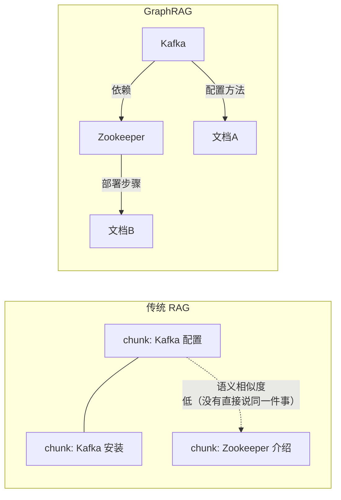
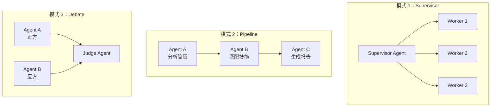

# 前沿视野

> **延伸提问"最近有什么关注的前沿技术"不是为了考你论文，而是看你有没有技术敏感度。**
>
> 30% 的校招生栽在这一问——要么泛泛而谈"大模型很火"，要么完全答不上来。本篇梳理 5 个跟你的项目直接相关的前沿方向，每一个都能自然衔接到"我们在项目中怎么做的"。

---

## 目录

- [01：DeepResearch — 最热的 Agentic RAG 标杆](#01deepresearch--最热的-agentic-rag-标杆)
- [02：GraphRAG — 知识图谱 + RAG](#02graphrag--知识图谱--rag)
- [03：A2A 协议 — Agent-to-Agent 通信](#03a2a-协议--agent-to-agent-通信)
- [04：Multi-Agent 协作模式](#04multi-agent-协作模式)
- [05：2026 AI Agent 行业趋势判断](#052026-ai-agent-行业趋势判断)
- [一句话讲清串讲](#一句话讲清串讲)

---

## 01：DeepResearch — 最热的 Agentic RAG 标杆

> 🟡 **原理级**：如果你只追一个前沿，就是 DeepResearch。高概率被问。

### 是什么

DeepResearch 不是单一产品。通义、OpenAI、Perplexity 都有自己的 DeepResearch。它们的共同特征是：

- **不再是"搜一次就答"**——而是"自主规划多步搜索 → 交叉验证 → 合成答案"
- **端到端训练**：通义 DeepResearch 的做法是 Agentic Mid-Training + Post-Training——搜索不是外挂工具，而是被训练成模型内在的行为

### 跟你的项目的关联

```text
你的项目                    DeepResearch
   │                           │
   ├── 混合检索                 ├── 多步搜索（主动 plan）
   ├── Reflexion 自纠正          ├── Self-Reflection 循环
   ├── Rerank 精排               ├── 多源交叉验证
   └── 拒答门控                  └── 信息饱和判断
```

**一句话讲清**：
> *"DeepResearch 本质上是 Agentic RAG 的极致版本。我们的项目在思路上跟它相通——Reflexion 自纠正循环在 DeepResearch 里被扩展成多步搜索规划，Rerank 精排在那边变成了多源交叉验证。通义 DeepResearch 给我的最大启发是'搜索不是外挂工具，而是需要被端到端训练的行为'——这也是 Agentic RAG 第四代的核心区别。"*

### 关键金句

> *"前三代 RAG 是'告诉模型怎么搜'，第四代（Agentic RAG）是'让模型学会自己搜'。DeepResearch 就是第四代的最强实践。"*

🔴 **记忆级**：这句话必须脱口而出。

---

## 02：GraphRAG — 知识图谱 + RAG

> 🟢 **了解级**：知道概念、能说清跟传统 RAG 的区别就行。

### 是什么

传统 RAG 把文档切成独立 chunk 存向量，但 chunk 之间的**关系**（引用、继承、因果）是丢失的。GraphRAG 用知识图谱把这些关系显式建模。



| 维度 | 传统 RAG | GraphRAG |
|------|---------|----------|
| 数据模型 | 独立向量 | 实体 + 关系 |
| 跨文档推理 | 弱（靠语义相似度） | 强（图遍历） |
| 实现复杂度 | 低 | 高 |
| 适用场景 | 问答型（事实查询） | 分析型（关系查询） |

**一句话讲清**：
> *"GraphRAG 适合'哪些技术栈匹配这个岗位'这种需要跨简历推理的场景。但对我们现有项目来说，大多数问题是事实性查询（'他做过 Kafka 吗'），传统 RAG 足以应对。如果后面升级到'对比分析多份简历'，GraphRAG 是合理的演进方向。"*

---

## 03：A2A 协议 — Agent-to-Agent 通信

> 🟢 **了解级**：知道有这个协议、跟 MCP 什么关系就行。跟你的 MCP 经验有呼应。

### 是什么

MCP（Model Context Protocol）解决的是 **Agent 跟工具/数据** 的交互问题。
A2A（Agent-to-Agent）解决的是 **Agent 跟 Agent** 的通信问题。

```text
MCP:    AI Agent → 工具/API/数据库         （一层：工具层标准化）
A2A:    AI Agent ↔ 其他 AI Agent          （二层：通信层标准化）
```

| 协议 | 解决 | 类比 |
|------|------|------|
| MCP | Agent 怎么调用工具 | USB 协议——设备怎么连电脑 |
| A2A | Agent 怎么跟其他 Agent 协作 | HTTP 协议——电脑怎么连电脑 |

**一句话讲清**：
> *"我们的项目已经在 MCP 层面做了标准化——5 个 Tool 通过 MCP 暴露给任何 AI Agent。如果将来需要多 Agent 协同工作（一个 Agent 搜简历、一个 Agent 分析技能匹配度、一个 Agent 生成报告），A2A 就是它们之间的通信协议。MCP 解决了'手'的问题，A2A 解决'大脑之间'的问题。"*

---

## 04：Multi-Agent 协作模式

> 🟢 **了解级**：知道几种常见模式、能跟聊两句就行。

### 常见模式



| 模式 | 适用场景 | 复杂度 |
|------|---------|-------|
| **Supervisor** | 一个主 Agent 调度多个子 Agent | 中 |
| **Pipeline** | 流水线处理（你项目的 LangGraph 本质就是这个） | 低 |
| **Debate** | 交叉验证、提高答案准确率 | 高 |
| **Tool 共享** | 多 Agent 共用工具集（MCP 正好解决这个） | 低 |

**一句话讲清**：
> *"我们的 LangGraph 9 节点其实就是一个 Pipeline 模式的 Multi-Agent 系统——每个节点可以看作一个 mini-Agent，Route 节点决定下一步去哪个节点。如果要升级，一个方向是引入 Supervisor 模式——主 Agent 判断问题复杂度，简单问题走传统 RAG，复杂问题调度一个 Agent 团队执行。"*

---

## 05：模型微调基础（补充知识）

> 🟢 **了解级**：Agent 开发岗对微调要求低（实践经验数据显示多数大厂不做硬性要求），但知道基本概念能体现知识广度。

### SFT / RLHF / DPO / GRPO 对比

| 方法 | 全称 | 解决什么问题 | 代表模型 |
|------|------|-------------|---------|
| **SFT** | Supervised Fine-Tuning | 让模型学会特定格式/风格/行为 | 指令微调、工具调用微调 |
| **RLHF** | RL from Human Feedback | 对齐人类偏好（有用+无害） | GPT-4、Claude |
| **DPO** | Direct Preference Optimization | 简化 RLHF，无需 Reward Model | 开源偏好对齐 |
| **GRPO** | Group Relative Policy Optimization | 强化学习，分组相对评分 | DeepSeek-R1 |

**常见追问**：「Agent 开发需要微调吗？」

> *"当前主流方案是**不微调**，通过 RAG + Prompt 控制行为。但在工具调用场景下，SFT 少量高质量数据可以显著提升 Tool Calling 准确率。我的项目没用微调是因为：① DeepSeek 的 Function Calling 能力已经够用；② 微调需要训练数据，个人项目资源有限。但如果需要固定输出格式（比如统一的简历分析报告模板），在 RAG 基础上微调一个输出层是合理的。"*

### Token 与上下文窗口

> 基础概念，但常考。

- **Token**：LLM 的最小语义单元（≈0.75 英文单词 / ≈1.5 中文字符）
- **上下文窗口越大 ≠ 越好**：存在「Lost in the Middle」现象——模型更关注开头和结尾；Token 成本线性增长；推理延迟非线性增加

**你的优化策略**：Rerank 20→5，token 减 75%，等于把"上下文"变干净了。不是窗口越大越好，是窗口里的**内容质量**更重要。

---

## 06：2026 AI Agent 行业趋势判断

### 趋势 1：从"调 API"到"系统稳定性"（加分点）

2025 年学习重点是"会不会调 API"，2026 年的重点是"系统稳不稳"。

```text
2025 (Vibe Coding)          2026 (Agentic Engineering)
   │                              │
   ├── Prompt 写得好               ├── 异常处理完善
   ├── 能调多个 API                ├── 容错+降级+熔断
   ├── Demo 跑得通                 ├── 可观测性体系
   └── 会用 LangChain              └── 理解 LangGraph 状态管理
```

**跟你的关联**：你的韧性工程（06 篇）、可观测性（08 篇）正好踩在这个趋势上。

### 趋势 2：MCP 成标配，A2A 是下一波

MCP 在 2025 年底开始爆发，2026 年已经成为 JD 中的高频词。A2A 还在早期，但已经在部分大厂开始落地。

### 趋势 3：工程化能力 > 算法能力

纯算法岗门槛在提高（硕士起步、顶会要求），但**AI 应用开发**岗位门槛更友好——更看重工程落地能力。

---

## 话术串讲

### 问题一："你最近关注什么前沿技术？"

> *"我最近最关注的是 DeepResearch 这边的发展，特别是通义 DeepResearch 的 Agentic Mid-Training 和 Post-Training 框架。它让我意识到搜索不应该是一个外挂工具，而是 Agent 内化的能力。我们项目里的 Reflexion 自纠正循环在思路上跟它是相通的——都是 Agent 自己决定什么时候搜、搜什么、什么时候停。另外 MCP 和 A2A 的协议演进我也在 follow，因为我们的项目已经有 MCP 的实践经验了。"*

### 问题二："你这个项目跟 DeepResearch 比怎么样？"

> *"从架构思路上是相通的——Agentic RAG 的核心理念（自主检索→评估→反思）是一样的。差距主要在规模和训练深度上：DeepResearch 做了端到端的模型训练，我们的 Reflexion 实现还停留在 Prompt 级别的自纠正。不过从落地的角度看，对于简历问答这个垂直场景，我们的精度已经够用了（composite 0.5448）。如果要从 90% 走到 99%，可能需要引入 DeepResearch 式的多步搜索和端到端训练。"*

### 问题三："Agent 发展的瓶颈是什么？"

> *"我自己的理解是两个：一是评估体系还不成熟——怎么判断 Agent 任务完成得好不好，没有一个像 RAG 里 RAGAS 那样的标准框架；二是可解释性——Agent 做了多步决策，出问题了很难定位是哪一步错的。这也是我在项目里花比较多精力做可观测性的原因——ResponseID 全链路追踪、30+ Prometheus 指标，本质就是为了回答'这步为什么走了 5 秒'这种问题。"*

---

## 相关笔记

- [[02_RAG流水线|🔧 02 RAG核心流水线]] — Agentic RAG 的地基
- [[03_LangGraph状态机|🤖 03 Agentic RAG 与 LangGraph 图实现]] — 你的 Agent 编排实现
- [[05_MCP协议|🔌 05 MCP协议集成全链路]] — MCP 实践，A2A 的前置基础
- [[08_可观测性|📈 08 工程化与可观测性]] — 行业趋势呼应
- [[01_项目叙事与话术|🎤 10 项目叙事与亮点提炼]]

## 技术学习笔记

- [[52-A2A协议核心概念|A2A协议]]
- [[54-ANP协议概念|ANP协议]]
- [[53-MCP-vs-A2A本质区别|MCP vs A2A]]
- MCP+A2A+ANP三层协议栈

---

**最后更新**：2026-07-14 | **项目**：ai-resume-analyzer

## 速记卡（面试闪卡）

**Q1：一句话讲清「前沿视野」到底是什么？**
A：---

**Q2：目录 —— 怎么理解？**
A：---

**Q3：01：DeepResearch — 最热的 Agentic RAG 标杆 —— 怎么理解？**
A：🟡 **原理级**：如果你只追一个前沿，就是 DeepResearch。高概率被问。
DeepResearch 不是单一产品。通义、OpenAI、Perplexity 都有自己的 DeepResearch。它们的共同特征是：
**不再是"搜一次就答"**——而是"自主规划多步搜索 → 交叉验证 → 合成答案"

**Q4：02：GraphRAG — 知识图谱 + RAG —— 怎么理解？**
A：🟢 **了解级**：知道概念、能说清跟传统 RAG 的区别就行。
传统 RAG 把文档切成独立 chunk 存向量，但 chunk 之间的**关系**（引用、继承、因果）是丢失的。GraphRAG 用知识图谱把这些关系显式建模。

**Q5：03：A2A 协议 — Agent-to-Agent 通信 —— 怎么理解？**
A：🟢 **了解级**：知道有这个协议、跟 MCP 什么关系就行。跟你的 MCP 经验有呼应。
MCP（Model Context Protocol）解决的是 **Agent 跟工具/数据** 的交互问题。
A2A（Agent-to-Agent）解决的是 **Agent 跟 Agent** 的通信问题。

**Q6：核心速记主线有哪些？**
A：抓住这几根：目录、01：DeepResearch — 最热的 Agentic RAG 标杆、02：GraphRAG — 知识图谱 + RAG、03：A2A 协议 — Agent-to-Agent 通信、04：Multi-Agent 协作模式、05：模型微调基础（补充知识）。

