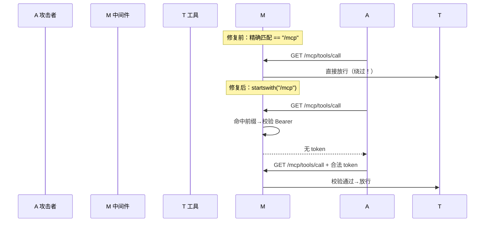
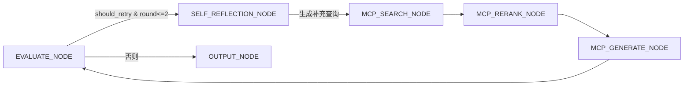

# 架构升级

> 电梯陈述（一句话能背）：「把  服务从『路径可被绕过 + 工具不认用户』的不安全状态，升级成了『/mcp 全路径前缀鉴权 + 每个工具都校验用户身份 + 反思节点闭环 + 复用 Cross-Encoder + 客户端双重检查锁 + 全链路超时』的生产级安全架构。」

## 一、背景（为什么要做这个）

这个项目的亮点是 **MCP（Model Context Protocol，模型上下文协议）**——简单说，它是一个"让  模型标准化地调用外部工具/读取资源"的开放协议，类似给大模型装了一套统一的  接口。FastMCP  挂在 `/mcp` 路径下，对外暴露 `search_knowledge_base / rerank_results / generate_answer / analyze_resume / rewrite_query` 五个工具，并挂了  认证中间件。

但初版有两个致命问题，不做的话就是**生产事故**：
1. 认证中间件用精确匹配 `== "/mcp"`，攻击者只要在  后面拼个字符（如 `/mcp/foo`）就能**绕过鉴权**直接调工具——等于门没锁。
2. 三个写类工具**不校验当前用户是谁**，任何拿到  的人都能替别人操作简历——越权。

此外还有几处工程债：MCP 版的  缺反思节点（和标准 Agentic  不一致）、rerank 工具自己用  打分（重复实现 + 慢）、客户端单例创建没有并发保护、所有远程调用没超时。这一阶段就是把这些一次性补齐。

## 二、逐个讲：问题 → 怎么想 → 怎么解（配 Mermaid）

### 路径绕过——最危险的一个

**问题是什么**：认证中间件是这样写的（伪代码）：
```python
if request.url.path == "/mcp":   # 只有精确等于才鉴权
    auth()
```
那 `/mcp/tools/call` 或 `/mcp/anything` 这种子路径，**根本不会进鉴权分支**，等于裸奔。

**怎么想的**：协议的实际端点都在 `/mcp` 子路径下（JSON-RPC 走 `/mcp/`），精确匹配只护住了"目录本身"而放过了所有"子资源"。这跟「只锁了大门、没锁屋里每个房间」一个道理。正确做法是用**前缀匹配**——只要是以 `/mcp` 开头的路径，统统要过鉴权。

**最终怎么解的**：`mcp_server/server.py` 的 `create_auth_middleware` 里改成：
```python
if not request.url.path.startswith("/mcp"):
    return await call_next(request)
# 否则走下面的 Bearer  解析 + decode_token + 类型/subject 校验
```
`startswith` 一把梭，无论 `/mcp`、`/mcp/`、`/mcp/x/y` 全被罩住，彻底堵死拼接绕过。



### 工具层补用户认证

**问题是什么**：就算中间件把用户  塞进了 `contextvars.ContextVar`，三个工具函数也**根本不读它**，谁调都行。

**怎么想的**：中间件验证了"你是合法登录用户"，但工具本身得确认"这次调用确实带着用户上下文"。最干净的做法是复用中间件已经设好的 contextvar——`server.py` 里已有 `get_current_user_id()`，工具直接调它；取不到（说明绕过了中间件或被直接调用）就**拒绝**，绝不静默放行（静默放行等于安全形同虚设）。

**最终怎么解的**：`generate.py / rewrite.py / rerank.py` 入口都加了：
```python
try:
    _user_id = get_current_user_id()
except LookupError:
    return [TextContent(type="text", text=json.dumps(
        {"error": "authentication required: missing user context"}))]
```
`LookupError` 是 `ContextVar.get()` 在无值时的标准异常，精确捕获、明确拒绝。

### MCP  补反思节点

**问题是什么**：标准 Agentic  在评估分数过低时会进入 **Self-Reflection（自我反思，即  框架）**节点去补查；但  版的  评估后只跳转搜索或直接输出，缺了反思环。

**怎么想的**：两套  行为应该一致，否则  模式下的回答质量会明显差一截，也违背"统一架构"的设计。做法是让 MCP  的 `_route_after_evaluate` 在需要重试时路由到已存在的 `SELF_REFLECTION_NODE`。

**最终怎么解的**：`mcp_graph.py` 导入 `SELF_REFLECTION_NODE`，并在路由函数里加分支：
```python
def _route_after_evaluate(state):
    if state.get("should_retry") and state.get("search_round", 0) <= 2:
        return SELF_REFLECTION_NODE   # 进反思，最多  轮（对齐标准版）
    return OUTPUT_NODE
```
同时在 `create_mcp_agentic_rag_graph` 里把节点和条件边都挂上。



### 复用 Cross-Encoder

**问题是什么**：`rerank_results` 工具原本自己调  打分做精排——既重复实现了 `rag_service.rerank` 已有能力，又慢又贵又不稳定。

**怎么想的**：精排就该用 **Cross-Encoder（交叉编码器，把  和  拼一起送模型打一个相关性分数，比分别编码再算余弦更准）**，这是已经在 `rag_service` 里调通、带重试和降级的生产代码。工具层不该另起炉灶。

**最终怎么解的**：`rerank.py` 改为 `from services.rag_service import rerank as cross_encoder_rerank`，直接复用；并保留兜底（Cross-Encoder 失败时按原序给保底分，不向上抛）。

### 客户端双重检查锁

**问题是什么**：`get_mcp_client()` 是模块级单例，但并发首次调用时可能创建出多个客户端（竞态）。

**怎么想的**：经典解法就是**双重检查锁（double-checked locking）**——第一次无锁快路径（绝大多数请求走这里，零开销），真正要创建时才拿锁，进锁后再查一次防止重复创建。

**最终怎么解的**：`mcp_client/client.py`：
```python
_client_lock: asyncio.Lock = asyncio.Lock()
async def get_mcp_client(...):
    global _client_instance
    if _client_instance is not None:        # 第一次检查（无锁）
        return _client_instance
    async with _client_lock:                # 拿锁
        if _client_instance is not None:    # 第二次检查（防重复）
            return _client_instance
        _client_instance = MCPClient(...)
        return _client_instance
```

### 全链路超时

**问题是什么**：MCP 工具里的 `httpx.AsyncClient()` 和客户端都没设超时，远端卡住就会无限挂起，拖垮整个服务。

**怎么想的**：对齐 的写法，统一用 `httpx.Timeout(30, connect=10)`（总时限 30s、连接 10s），并把常量提到模块级方便管理。

**最终怎么解的**：`client.py` 的 `_DEFAULT_TIMEOUT`、各工具的 `MCP_HTTP_TIMEOUT` 都设为 `httpx.Timeout(30, connect=10)`，工具调用用 `asyncio.wait_for(..., timeout=MCP_HTTP_TIMEOUT.read)` 兜底。

## 四、关键决策与取舍

- **用 `startswith` 而非正则/白名单**：前缀匹配最省心且不可能漏子路径；白名单要维护、易漏。代价是必须保证 `/mcp` 之外没有也要保护的敏感路径——目前项目没有，可接受。
- **拒绝而非静默放行**：`get_current_user_id()` 取不到就明确返回 auth error。取舍是调用方必须处理错误，但安全优先。
- **复用 Cross-Encoder 而非自实现**：省代码、行为一致、带降级。代价是工具依赖 `rag_service` 模块（耦合），但对内复用是合理取舍。
- **双重检查锁**：单例并发安全且零热路径开销。代价是代码稍复杂，但这是并发单例的标准写法。

## 五、踩坑（值得讲的故事）

- **路径匹配的"隐形门"**：最容易漏的就是"只护目录不护子路径"。做 MCP/网关类鉴权时，第一反应就该用前缀，而不是精确等于。
- **`ContextVar` 取不到抛 `LookupError`**：一开始容易想当然捕获 `ValueError` 或 `AttributeError`，其实 `ContextVar.get()` 无值抛的是 `LookupError`，得用对异常类型才捕得到。
- **跨阶段红线**：本阶段  执行时误删了 `docker-compose.local.yml`（不属于任何阶段范围），被主流程发现后已 `git checkout` 还原。教训：改文件前先确认是否在自己的阶段范围内，**删除类操作必须二次确认**。

## 六、常见疑问

**Q1：为什么 `startswith("/mcp")` 就够了，不用更严格的校验？**
A：因为 `/mcp` 下所有端点都需要鉴权，前缀匹配既保证无遗漏又无需维护白名单。前提是确认 `/mcp` 之外没有同样敏感的路径——项目满足。若未来有例外路径，再叠加白名单排除。

**Q2：MCP 工具为什么还要再校验一次用户，中间件不是已经验过了吗？**
A：两层职责不同。中间件验证"请求者是否合法登录用户"；工具层验证"本次工具调用是否确实携带了用户上下文"。前者防未登录，后者防越权/被直接调用绕过中间件。纵深防御。

**Q3：双重检查锁为什么第二次还要查？第一次检查不够吗？**
A：第一次无锁检查是为了热路径零开销。但两个协程可能同时通过第一次检查，都拿到锁——先拿锁的创建了实例，后拿锁的若不再查一次就会覆盖/重复创建。第二次检查消除这个竞态。

**Q4：rerank 复用 Cross-Encoder，那工具自己的  打分能力完全没了吗？**
A：是的，刻意去掉了。LLM 打分慢、贵、分数不好设阈值；Cross-Encoder 是精排的事实标准，且 `rag_service.rerank` 已带重试和降级，行为一致更可靠。

**Q5：反思节点最多  轮，为什么是  不是 3？**
A：来自调优数据——第  轮带来的质量提升 <0.02，但成本和延迟翻倍，边际收益不划算，所以封顶  轮（对齐标准 Agentic RAG）。


> ▶ 关联技术研读：[[01_技术研读/05_MCP协议|05_MCP协议]]

## 速记卡（面试闪卡）

**Q1：一句话讲清「架构升级」到底是什么？**
A：这个项目的亮点是 **MCP（Model Context Protocol，模型上下文协议）**——简单说，它是一个"让  模型标准化地调用外部工具/读取资源"的开放协议，类似给大模型装了一套统一的  接口。FastMCP  挂在  路径下，对外暴露  五个工具，并挂了  认证中间件。

**Q2：一、背景（为什么要做这个） —— 怎么理解？**
A：这个项目的亮点是 **MCP（Model Context Protocol，模型上下文协议）**——简单说，它是一个"让  模型标准化地调用外部工具/读取资源"的开放协议，类似给大模型装了一套统一的  接口。FastMCP  挂在  路径下，对外暴露  五个工具，并挂了  认证中间件。

**Q3：二、逐个讲：问题 → 怎么想 → 怎么解（配 Mermaid） —— 怎么理解？**
A：**问题是什么**：认证中间件是这样写的（伪代码）：
那  或  这种子路径，**根本不会进鉴权分支**，等于裸奔。
**怎么想的**：协议的实际端点都在  子路径下（JSON-RPC 走 ），精确匹配只护住了"目录本身"而放过了所有"子资源"。这跟「只锁了大门、没锁屋里每个房间」一个道理。正确做法是用**前缀匹配**——只要是以  开头的路径，统统要过鉴权。

**Q4：四、关键决策与取舍 —— 怎么理解？**
A：**用  而非正则/白名单**：前缀匹配最省心且不可能漏子路径；白名单要维护、易漏。代价是必须保证  之外没有也要保护的敏感路径——目前项目没有，可接受。
**拒绝而非静默放行**： 取不到就明确返回 auth error。取舍是调用方必须处理错误，但安全优先。
**复用 Cross-Encoder 而非自实现**：省代码、行为一致、带降级。代价是工具依赖  模块（耦合），但对内复用是合理取舍。

**Q5：五、踩坑（值得讲的故事） —— 怎么理解？**
A：**路径匹配的"隐形门"**：最容易漏的就是"只护目录不护子路径"。做 MCP/网关类鉴权时，第一反应就该用前缀，而不是精确等于。
** 取不到抛 **：一开始容易想当然捕获  或 ，其实  无值抛的是 ，得用对异常类型才捕得到。
**跨阶段红线**：本阶段  执行时误删了 （不属于任何阶段范围），被主流程发现后已  还原。教训：改文件前先确认是否在自己的阶段范围内，**删除类操作必须二次确认**。

**Q6：核心速记主线有哪些？**
A：抓住这几根：一、背景（为什么要做这个）、二、逐个讲：问题 → 怎么想 → 怎么解（配 Mermaid）、四、关键决策与取舍、五、踩坑（值得讲的故事）、六、常见疑问。

