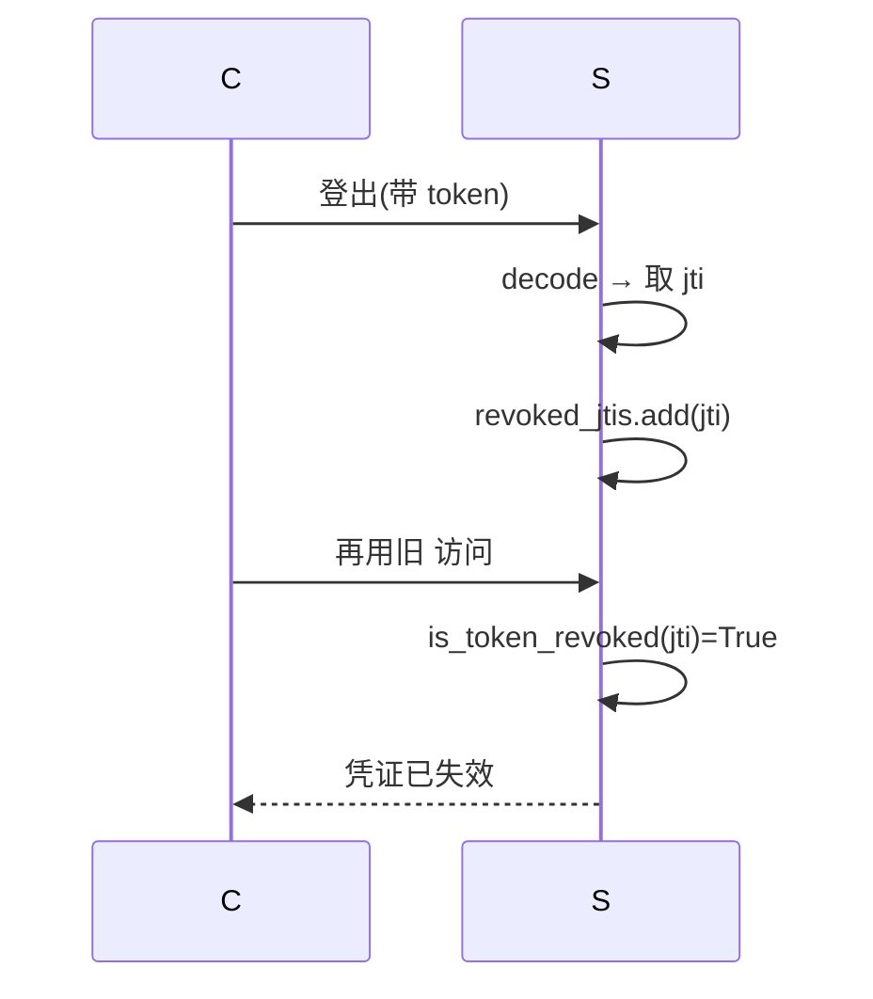

# 生产与安全加固

> 电梯陈述：「分两轮把项目从  级拉到生产安全基线——第一轮补齐  安全头、CORS 白名单、metrics 认证、幂等上传、配置 fail-fast；第二轮纵深到认证与内容层：refresh 限流、jti 令牌撤销、HttpOnly  双模认证、提示注入正则防御、PII 脱敏、请求体限制。两轮共  个  测试全绿，零破坏性变更。」

## 零、为什么分两轮

第一轮解决「门面」问题：响应头、CORS、启动校验。第二轮在其基础上推进到「钥匙」和「内容」层。本质是**纵深防御**——不是把一扇门加十把锁，而是修十道不同位置的闸门。

## 一、传输层与响应层加固

### 1.1 安全响应头

在中间件统一注入，一处生效、零侵入业务代码：

- **HSTS**：`max-age=31536000; includeSubDomains`（仅  生效，本地  开发不受影响）
- **CSP**：`default-src 'none'`（纯  服务不需要加载任何子资源，最严基线）
- **Permissions-Policy**：禁用 camera/geolocation/microphone 等敏感特性
- **CORS**：从 `allow_origins=["*"]` 收紧为显式白名单；`allow_methods` 限 GET/POST/DELETE；`allow_headers` 仅放行 Authorization/Content-Type/X-Request-ID/Idempotency-Key

### 1.2 `/metrics` 认证

配  强制 Bearer，未配开发放行——生产可锁、本地可跑。

### 1.3 幂等上传

客户端为一次上传生成  放入 `Idempotency-Key` 头，服务端 `(user, key)` 命中即返回已有记录，查不到才新建。类比：银行柜员先看「这位客户今天办过同单号没」。

### 1.4 启动期配置 fail-fast

`validate_required_settings()` 校验 DATABASE_URL/CHAT_API_KEY/EMBEDDING_API_KEY/RERANK_API_KEY/JWT_SECRET_KEY 等必填项，缺失则启动即抛 RuntimeError。

## 二、认证与内容层加固

### 2.1  端点限流

`RATE_LIMIT_REFRESH = "5/minute"`，配合第一轮已做的 login(10/min) 和 register(5/min)，爆破面全覆盖。

### 2.2 令牌撤销

JWT 无状态意味着签发后无法挂失。做法：
- `_create_token` 注入 `jti=uuid4().hex` + `iat`
- 维护 `revoked_jtis` 集合，登出 ADD、校验前查找
- 接口已抽象好，生产换 Redis  仅需替换存储层

### 2.3 HttpOnly  双模认证

 像把钥匙揣口袋（ 可读），HttpOnly  像锁进保险柜（ 读不到）。为避免与并行开发的前端  实现冲突，做成双模：登录/刷新同时下发  和 JSON Bearer，前端零改动。`get_current_user` 优先  其次 Cookie。

### 2.4 提示注入防御

正则启发式检测（忽略指令/ignore previous/system prompt/jailbreak/泄露提示），命中返回  且不触达  图。同时给检索内容加 `<<<retrieved_context>>>` 边界标记。

**诚实边界**：正则挡得住明文模板，挡不住语义化/编码绕过。是纵深防御的一层，不是银弹。

### 2.5  脱敏

正则识别手机/邮箱/身份证/银行卡四类高敏字段。**默认关闭**——这个产品是简历分析，候选人联系方式本就是用户想看的内容。做成合规开关，部署方按需开启。

### 2.6 请求体限制 + 扩展响应头

- `limit_request_body` 中间件：读 `Content-Length` 不读 body，超限 413
- 去 `Server` 头 + 加 COOP/CORP 跨源隔离头
- `Cache-Control: no-store` 防令牌落盘

## 三、关键决策与取舍

| 决策 | 选择 | 取舍 |
|------|------|------|
| 安全头位置 | 中间件而非各路由 |  等也被加（无害） |
| `/metrics` |  软开关 | 本地少一层防护（不暴露公网可接受） |
| 幂等键存库 |  字段+索引 | 多一次 SELECT（命中即省整条流水线） |
|  模式 | 双模不移除 Bearer | 安全收益未拉满，需后续协调全量迁移 |
| 撤销名单 | 内存非 Redis | 多实例不共享（接口已抽象好） |
|  脱敏 | 默认关 | 保护产品核心价值，部署方按需开 |
| 注入防御 | 正则启发式 | 零额外成本、可解释；挡不住编码绕过 |

## 四、踩坑（值得讲的故事）

1. **半成品**：agent 被中途终止只留了半成品——main.py 只有基础头、CORS 还是 `*`。教训：lead 必须独立 verify git diff + 复跑测试，不能信  自报完成。
2. **跨阶段幽灵断链**： 把 `core/trace.py` 重写为链路追踪，删掉了 `rag_service.py` 仍依赖的 `StepTimer`，导致全量测试挂。以向后兼容  补回。教训：改公共  必须  全仓下游。
3. **限流装饰器要 `request` 参数**：`@limiter.limit` 要求函数带 `request: Request`，否则  报错。
4. **响应头删除用 `del` 非 `.pop`**：Starlette 的 `Response.headers` 不一定实现 `pop`。
5. **异步 mock**：测异步函数时  也必须是 `async def`，不然 `TypeError`。

## 五、常见疑问

**Q：为什么  用 `default-src 'none'` 不放开？** — 纯 JSON  服务，响应不含子资源，`'none'` 是最严基线。

**Q：token 撤销是内存的，生产怎么办？** — 接口已抽象，生产换 Redis SET + TTL。甚至可做 `user:tv`，改密全量踢。

**Q：HttpOnly  没  风险？** — `SameSite=lax` 挡第三方站。当前纯  无  写操作副作用，风险低。

**Q：提示注入用正则，绕过怎么办？** — 正则只是第一层。纵深：分类器护栏 → 指令/数据分界（wrap_untrusted） → 输出侧二次校验。

**Q：PII 脱敏默认关，不就等于没做？** — 恰恰相反，是产品权衡。能力已做好测好，开箱即用，部署方按需开启。

> ▶ 关联技术研读：[[01_技术研读/01_架构概览|01_架构概览]]

## 速记卡（面试闪卡）

**Q1：一句话讲清「生产与安全加固」到底是什么？**
A：第一轮解决「门面」问题：响应头、CORS、启动校验。第二轮在其基础上推进到「钥匙」和「内容」层。本质是**纵深防御**——不是把一扇门加十把锁，而是修十道不同位置的闸门。

**Q2：零、为什么分两轮 —— 怎么理解？**
A：第一轮解决「门面」问题：响应头、CORS、启动校验。第二轮在其基础上推进到「钥匙」和「内容」层。本质是**纵深防御**——不是把一扇门加十把锁，而是修十道不同位置的闸门。

**Q3：一、传输层与响应层加固 —— 怎么理解？**
A：在中间件统一注入，一处生效、零侵入业务代码：
**HSTS**：（仅  生效，本地  开发不受影响）
**CSP**：（纯  服务不需要加载任何子资源，最严基线）
**Permissions-Policy**：禁用 camera/geolocation/microphone 等敏感特性
**CORS**：从  收紧为显式白名单； 限 GET/POST/DELETE；

**Q4：二、认证与内容层加固 —— 怎么理解？**
A：，配合第一轮已做的 login(10/min) 和 register(5/min)，爆破面全覆盖。
JWT 无状态意味着签发后无法挂失。做法：
注入  + 
维护  集合，登出 ADD、校验前查找
接口已抽象好，生产换 Redis  仅需替换存储层
 像把钥匙揣口袋（ 可读），HttpOnly  像锁进保险柜（ 读不到）。为避免与并行开发的前端  实现冲突，做成双模：登录/刷新同时下发  和 JSON Bearer，前端零改动。

**Q5：三、关键决策与取舍 —— 怎么理解？**
A：| 决策 | 选择 | 取舍 |
|------|------|------|
| 安全头位置 | 中间件而非各路由 |  等也被加（无害） |
|  |  软开关 | 本地少一层防护（不暴露公网可接受） |
| 幂等键存库 |  字段+索引 | 多一次 SELECT（命中即省整条流水线） |
|  模式 | 双模不移除 Bearer | 安全收益未拉满，需后续协调全量迁移 |

**Q6：核心速记主线有哪些？**
A：抓住这几根：零、为什么分两轮、一、传输层与响应层加固、二、认证与内容层加固、三、关键决策与取舍、四、踩坑（值得讲的故事）、五、常见疑问。

