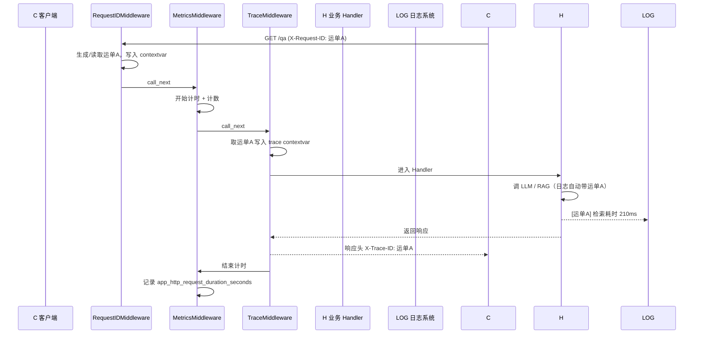

# 可观测性接入

> 电梯陈述（一句话能背）：「在不改动 main.py 的前提下，给  后端补上了请求级 trace_id 透传（新建 `core/trace.py`）和异步  计时器（`async_timer_context`），把指标、日志、链路三者用同一个『运单号』串起来，让一次慢请求能被定位到具体哪一步慢、能不能从海量日志里捞出来。」

## 一、背景（为什么要做这个）

这是 AI 简历分析系统求职作品多阶段改造中的可观测性接入。

之前系统「能跑，但黑盒」——用户报「问答好慢」，只能盲猜是检索慢还是  慢；线上出 bug，几十个服务日志里翻不到是哪一次请求出的问题。可观测性的三大支柱是 **Metrics（指标）、Logs（日志）、Traces（链路）**，本阶段就是把这三根柱子在后端立起来，且为后续接  看板打地基。

硬性约束（团队长明确）：**本阶段禁止修改 `main.py`**（ 安全加固独享其编辑权，二者并发执行避免同文件冲突）。所以所有增强都收敛在两个文件：`core/metrics.py`（增强）和新建 `core/trace.py`（ 透传）。`main.py` 里只留一行「接线注释」，由主流程在 完成后统一挂载。

## 三、逐个讲：问题 → 怎么想 → 怎么解（配 Mermaid）

### 1. 把 `timer_context` 改成异步可用

**问题**：RAG 检索/改写/重排/生成全是 `async` 的，原来的 `timer_context` 是个同步 `@contextmanager`，只能 `with`，不能在 `async def` 里用 `async with`。

**怎么想**：第一反应是用「异步生成器」——`async def async_timer_context(): ... yield`。写完一跑测试直接炸：`'async_generator' object does not support the asynchronous context manager protocol`。原来 `async with` 要的是实现了 `__aenter__/__aexit__` 协议的对象，而异步生成器对象只有 `__aiter__/__anext__`，**两者不是一回事**。这是 Python _async context manager_ vs _async generator_ 的经典混淆点。

**怎么解**：改用类实现 `__aenter__`/`__aexit__`，在 `__aexit__` 里无论成功还是异常都记录耗时（异常时额外记 `rag_step_errors`），并返回 `False` 表示不吞异常、原样上抛。

```python
class async_timer_context:
    def __init__(self, step: str) -> None:
        self._step = step
        self._start: float | None = None

    async def __aenter__(self) -> "async_timer_context":
        self._start = time.perf_counter()
        return self

    async def __aexit__(self, exc_type, exc, tb) -> bool:
        elapsed = time.perf_counter() - (self._start or time.perf_counter())
        if exc_type is not None:
            rag_step_errors.labels(step=self._step, error_type=exc_type.__name__).inc()
        rag_step_duration.labels(step=self._step).observe(elapsed)
        return False
```

### 2. 团队长重点：trace_id 在请求内透传（新建 `core/trace.py`）

**问题**：一次  请求会经过  查询 →  调用 →  检索等多个环节，每个环节都写日志。出问题时希望「拿一个  就把这次请求的所有日志捞出来」，但目前各处的日志彼此孤立。

**生活化类比**：把一次请求想成一次「快递配送」，`X-Request-ID` 就是**运单号**。现状是每道工序（分拣、运输、派送）都在各自的小本本上记账，但没写运单号，事后没法拼出这单的完整轨迹。`TraceMiddleware` 做的事 = 给这次配送建一份「随单档案」（用 `contextvars` 实现），沿途每一道工序都把同一个运单号写进日志；前端/网关出错时也能把这个运单号原样带回，拿它去日志系统一搜就全出来了。

**怎么想 / 怎么解**：用 `contextvars.ContextVar` 存 `trace_id`——它天生「请求/协程隔离」，比全局变量安全，比传参优雅。`TraceMiddleware` 直接读请求头 `X-Request-ID`（与已有的 `RequestIDMiddleware` 同源对齐），写入 contextvar，并在响应头回写 `X-Trace-ID` 方便排障。再配一个 `TraceIDFilter` 把 `trace_id` 注入每条日志记录，外加 `bind_trace_id()` 给后台任务这类非  上下文手动绑号。

请求处理链路的时序如下：



### 3. 跨阶段阻塞：补齐 `StepTimer` 契约

**问题**：跑测试时 `conftest` 一 import `main` 就炸——`services/rag_service.py` 里写了 `from core.trace import StepTimer`，但 `core.trace` 还没有这个类（ 的重构提前引用了该文件的符号）。这是并行开发典型的「先依赖接口，后实现」。

**怎么想**：没有去改 `rag_service.py`（那是 的地盘，且同样在并发改），而是确认了它期望的契约——`StepTimer()`、`await timer.run("step", 协程)`、`timer.log()`、`timer.steps`（分段耗时 dict）。既然 `core/trace.py` 已归管，直接把 `StepTimer` 实现进去，既解了阻塞，又复用同一套  指标（`rag_step_duration` / `rag_step_errors`），保证「分段计时单」和「异步计时器」两套  数据落到同一个指标上，Grafana 一处可看。

```python
class StepTimer:
    def __init__(self) -> None:
        self.steps: dict[str, float] = {}
        self._start = time.perf_counter()

    async def run(self, step: str, awaitable):
        start = time.perf_counter()
        try:
            return await awaitable
        except Exception as exc:
            rag_step_errors.labels(step=step, error_type=type(exc).__name__).inc()
            raise
        finally:
            elapsed = time.perf_counter() - start
            self.steps[step] = elapsed
            rag_step_duration.labels(step=step).observe(elapsed)

    def log(self) -> None:
        total = time.perf_counter() - self._start
        breakdown = ", ".join(f"{k}={v*1000:.1f}ms" for k, v in self.steps.items())
        logger.info("RAG pipeline timing: total=%.1fms | %s", total * 1000, breakdown)
```

## 四、关键决策与取舍

1. **不碰 main.py，只留接线注释**： 在并发改 main.py，若也改必然产生合并冲突。策略是「提供 `install_trace_middleware(app)` 函数和注释，由主流程统一挂载」，把「能力实现」和「接线」解耦。代价是本次运行验证要靠测试里自建的 mini-app（不依赖 main），好处是零冲突、可独立验证。
2. **trace_id 直接读请求头、不依赖中间件顺序**：`TraceMiddleware` 不去读 `RequestIDMiddleware` 的 contextvar，而是自己读 `X-Request-ID` 头。这样即使未来中间件装配顺序变化，运单号也拿得到，更健壮。
3. **绝不给指标加 trace_id 维度**：这是 Prometheus 的 Cardinality 反模式——每个唯一请求 ID 会生成一条独立时间序列，基数爆炸把内存和查询都拖垮。trace_id 只用于**日志关联**和**响应头回写**，指标维度维持在 `route`/`status`/`step` 这种有限集合内。
4. **复用既有指标而非新建**：既有指标已存在，选择「确认并保留 + 测试覆盖」，而非推倒重写，符合「最小对症改动」纪律。

## 五、踩坑（值得讲的故事）

- **异步生成器 ≠ 异步上下文管理器**：最典型的坑。`async def` + `yield` 是 async generator，`async with` 要的是 async CM。实践中讲这个能体现对 Python 异步协议的理解深度。
- **跨模块 import 地狱**：一开始测试起不来，根因是 `rag_service.py`（别人的文件）import 了 `StepTimer` 却还没实现。定位方式很朴素——看报错栈最底层的 `ImportError: cannot import name 'StepTimer'`，顺着找到引用方，再读它对符号的用法确认契约。这提醒：并行开发时，「谁拥有被依赖的文件」决定了「谁来补齐这个符号」。
- **app 没挂 /metrics 路由**：第一版测试直接 `GET /metrics`，但 mini-app 没定义该路由（它在 main.py），结果拿到 404、断言全红。补一个等价于 main.py 的 `/metrics` 路由即可——再次印证「测试环境要自己把依赖摆齐」。

## 六、常见疑问

**Q1：contextvars 和全局变量、thread-local 有什么区别？为什么用它做 trace_id？**
A：全局变量在并发请求下会串号；`thread-local` 只对线程隔离，而  是单线程多协程，多个请求跑在同一个线程里，thread-local 也会串。`contextvars` 是「按协程/任务」隔离的上下文，一次 `await` 切换协程时上下文自动跟着走，完美匹配 ASGI「一个请求一个任务」的模型，所以 trace_id 用它能保证请求间不串、请求内随处可取。

**Q2：为什么不在  指标里加 trace_id 标签？**
A：这是 Cardinality（基数）问题。trace_id 几乎每个请求都唯一，一旦做成标签，时间序列数量 ≈ 请求数 × 维度组合，会无限增长，直接拖垮  内存和查询性能。正确做法是 trace_id 走日志（ELK/Loki 按字段检索）和分布式追踪，指标只保留有限维度。三者各司其职。

**Q3：你的  和项目已有的  是不是重复了？**
A：职责不同但同源。RequestIDMiddleware 解决「生成并回写 X-Request-ID」；TraceMiddleware 解决「把这个  变成应用内可随时取用的  上下文，并注入日志 + 响应头」。两者读同一个头、值完全对齐，1+1>2：前端拿 X-Trace-ID 回带，后端日志按 trace_id 聚合，构成完整闭环。

**Q4：如果某个环节没有异步，能用 `async_timer_context` 吗？**
A：不能，它是 async CM，得在 `async def` 里 `async with`。同步代码继续用既有的 `timer_context`（`with`）。两者落到同一个 `rag_step_duration` 直方图，Grafana 统一看，不分裂。

**Q5： 引用你的 `StepTimer`，你们怎么避免又冲突？**
A：靠「文件所有权」约定——`core/trace.py` 归，所以来实现 `StepTimer`；`rag_service.py` 归，只消费不修改。接口契约由引用方先行定义、实现方补齐，测试（RED→GREEN）是双方的「契约测试」。


> ▶ 关联技术研读：[[01_技术研读/08_可观测性|08_可观测性]]

## 速记卡（面试闪卡）

**Q1：一句话讲清「可观测性接入」到底是什么？**
A：这是 AI 简历分析系统求职作品多阶段改造中的可观测性接入。
之前系统「能跑，但黑盒」——用户报「问答好慢」，只能盲猜是检索慢还是  慢；线上出 bug，几十个服务日志里翻不到是哪一次请求出的问题。可观测性的三大支柱是 **Metrics（指标）、Logs（日志）、Traces（链路）**，本阶段就是把这三根柱子在后端立起来，且为后续接  看板打地基。

**Q2：一、背景（为什么要做这个） —— 怎么理解？**
A：这是 AI 简历分析系统求职作品多阶段改造中的可观测性接入。
之前系统「能跑，但黑盒」——用户报「问答好慢」，只能盲猜是检索慢还是  慢；线上出 bug，几十个服务日志里翻不到是哪一次请求出的问题。可观测性的三大支柱是 **Metrics（指标）、Logs（日志）、Traces（链路）**，本阶段就是把这三根柱子在后端立起来，且为后续接  看板打地基。

**Q3：三、逐个讲：问题 → 怎么想 → 怎么解（配 Mermaid） —— 怎么理解？**
A：**问题**：RAG 检索/改写/重排/生成全是  的，原来的  是个同步 ，只能 ，不能在  里用 。
**怎么想**：第一反应是用「异步生成器」——。写完一跑测试直接炸：。原来  要的是实现了  协议的对象，而异步生成器对象只有 ，**两者不是一回事**。这是 Python _async context manager_ vs _async generator_ 的经典混淆点。

**Q4：四、关键决策与取舍 —— 怎么理解？**
A：**不碰 main.py，只留接线注释**： 在并发改 main.py，若也改必然产生合并冲突。策略是「提供  函数和注释，由主流程统一挂载」，把「能力实现」和「接线」解耦。代价是本次运行验证要靠测试里自建的 mini-app（不依赖 main），好处是零冲突、可独立验证。
**trace_id 直接读请求头、不依赖中间件顺序**： 不去读  的 contextvar，而是自己读  头。

**Q5：五、踩坑（值得讲的故事） —— 怎么理解？**
A：**异步生成器 ≠ 异步上下文管理器**：最典型的坑。 +  是 async generator， 要的是 async CM。实践中讲这个能体现对 Python 异步协议的理解深度。
**跨模块 import 地狱**：一开始测试起不来，根因是 （别人的文件）import 了  却还没实现。定位方式很朴素——看报错栈最底层的 ，顺着找到引用方，再读它对符号的用法确认契约。

**Q6：核心速记主线有哪些？**
A：抓住这几根：一、背景（为什么要做这个）、三、逐个讲：问题 → 怎么想 → 怎么解（配 Mermaid）、四、关键决策与取舍、五、踩坑（值得讲的故事）、六、常见疑问。

