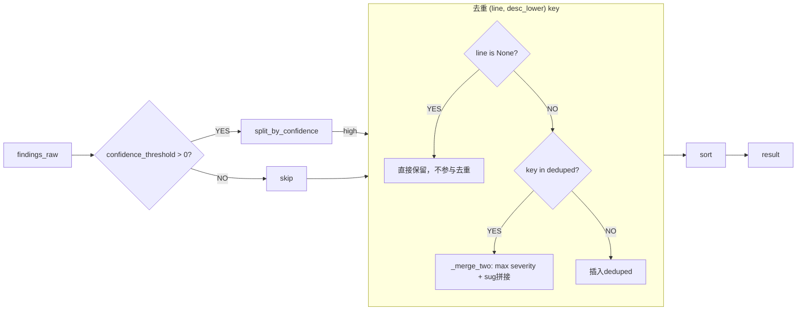

# 03 — Aggregator 去重排序与报告渲染

## 记忆级：merge.py + report.py 逐行精读

---

### 📍 **位置**：`services/aggregator/merge.py:17-45`

### aggregate_findings — 去重 + 排序



```python
def aggregate_findings(findings, confidence_threshold=0.0):
    # 1. 置信度过滤（Task 13.2）
    if confidence_threshold > 0.0:
        findings, _low = split_by_confidence(findings, confidence_threshold)

    # 2. 去重 key = (line, description.strip().lower())
    for f in findings:
        key = (line, f.get("description", "").strip().lower())
        if key in deduped:
            deduped[key] = _merge_two(deduped[key], f)
        else:
            deduped[key] = {**f, "sources": [f.get("worker", "?")]}

    # line=None → 不参与去重（LLM 没给行号，无法判定是否同一位置）
    no_line = [f for f in findings if f.get("line") is None]

    result = list(deduped.values()) + no_line

    # 3. 排序：severity 权重(0-3) + line key
    result.sort(key=lambda f: (_severity_rank(f.get("severity", "info")),
                               _line_key(f.get("line"))))
    return result
```

---

### 📍 **位置**：`services/aggregator/merge.py:12-15`

### _merge_two — 合并策略

| 字段 | 合并规则 |
|------|----------|
| `severity` | 取更严重的（high > medium > low > info） |
| `suggestion` | 去重后 `/` 拼接 |
| `sources` | set 合并，排序后写入 |
| 其余字段 | 使用高 severity 的 finding 的 base |

**`_severity_rank`**：
```python
_SEVERITY_ORDER = {"high": 0, "medium": 1, "low": 2, "info": 3}
```

---

### 📍 **位置**：`services/aggregator/merge.py:20-30`

### 去重 key 设计

```python
key = (line, f.get("description", "").strip().lower())
```

- `line` 定位行，`description_lower` 区分具体问题
- `line` 为 None 的 finding 不参与去重（无法确定是否同一位置）
- `line` 不为 None 但 `description` 不同 → 不被合并（同一行允许有多个独立问题）

### _line_key — 行号标准化排序

| 行号类型 | rank | 排序说明 |
|----------|------|----------|
| `int` / `float` | 0 | 数值行号，按大小升序 |
| `None` | 1 | LLM 没给行号，排中间 |
| `str`（如 "N/A"） | 2 | 字符串行号，排最后 |

**解决的核心问题**：不同类型行号混排会触发 Python `TypeError: '<' not supported between instances of 'str' and 'int'`。`_line_key` 返回 `(rank, value)` 元组，保证任意两种类型都能比较。

### 📍 **位置**：`services/aggregator/merge.py:35-45`

### 排序逻辑

```python
result.sort(key=lambda f: (_severity_rank(f.get("severity", "info")),
                            _line_key(f.get("line"))))
```

先按严重度（high 最前），同级按行号升序。

---

### split_by_confidence — 置信度阈值拆分（merge.py:63-87）

```python
def split_by_confidence(findings, threshold=0.0):
    high, low = [], []
    for f in findings:
        conf = float(f.get("confidence", 0.0))  # 缺失→0.0，非数值→0.0
        if conf >= threshold:
            high.append(f)
        else:
            low.append(f)
    return high, low
```

---

### 📍 **位置**：`services/aggregator/report.py:17-55`

### generate_report — Markdown 报告渲染

报告结构：

```text
# 🔍 代码审查报告

## 📋 摘要
- 语言: python
- 问题总数: 12（高危: 2, 中危: 5, 低危: 3, 提示: 2）
- 审查维度: quality, security, performance, structure

## 🔒 安全审查
| 行号 | 严重度 | 问题 | 建议 | 来源 |
|------|--------|------|------|------|

## ✨ 代码质量
...

## ⚡ 性能
...

## 🏗️ 架构
...

## 💭 低置信度提示（Task 13.2）
> 以下 N 条发现置信度较低...

## ⚠️ 审查警告
- worker_quality 超时（120s）
```

**常量表**：

| 常量 | 值 |
|------|-----|
| `_ROLE_LABELS` | `security→"安全审查", quality→"代码质量", performance→"性能", structure→"架构"` |
| `_ROLE_ORDER` | `["security", "quality", "performance", "structure"]` — 安全优先展示 |
| `_ROLE_ICON` | `security→🔒, quality→✨, performance→⚡, structure→🏗️` |
| `_SEVERITY_BADGE` | `high→🔴高危, medium→🟡中危, low→🟢低危, info→ℹ️提示` |

**分 section 逻辑**（report.py:76-94）：
- 按 `_ROLE_ORDER` 遍历，每个 role 只展示 `worker==role` 的 finding
- `sources` 列展示所有原始来源（去重时多个 Worker 发现同一问题）
- 无 finding 时输出 `✅ 未发现问题`

**低置信度提示区**（report.py:99-113）：
- 与正式发现区分开，避免噪音干扰但又保留信息
- 表格多一列"置信度"

**审查警告区**（report.py:115-120）：
- 展示 errors 列表（熔断、Worker 超时、decompose 异常）
- 空 errors 时不输出此 section

---

## 常见疑问

**Q1：去重 key 为什么用 (line, description_lower) 而不是 (line, category)？**
A：category 太粗。"安全"能涵盖注入、密钥、反序列化等完全不同的问题。同一行可能有 eval 的安全风险和函数过长两个不同问题，description 区分了具体内容。

**Q2：line 为 None 的 finding 怎么排序？**
A：给 9999 排到最后。因为没有行号的问题通常是整体性的（"函数缺乏异常处理"），不需要优先展示。

**Q3：多个 Worker 报告同一个问题时报告怎么展示？**
A：只在 primary worker 的 section 出现一次，sources 列标注所有发现者。不改 primary worker 字段。

---

## 相关笔记

- [[00-17条架构决策总览|00 17条架构决策总览]]
- [[02-Worker与TemplateMethod模式|02 Worker与TemplateMethod模式]]
- [[04-三层容错与并发bug|04 三层容错与并发bug]]

## 技术学习笔记

- [[15-Agent架构与工具调用|Agent架构与工具调用]]
- [[10-RAG 评估：检索指标 + 生成指标|RAG评估]]
- [[39-Agent评测体系：benchmark-case-指标设计|Agent评测体系]]
- [[01-Token计费原理-Temperature控制-SystemPrompt层级|Token计费原理]]

## 速记卡（面试闪卡）

**Q1：一句话讲清「03 — Aggregator 去重排序与报告渲染」到底是什么？**
A：| 字段 | 合并规则 |
|------|----------|
|  | 取更严重的（high > medium > low > info） |
|  | 去重后  拼接 |
|  | set 合并，排序后写入 |
| 其余字段 | 使用高 severity 的 finding 的 base |
****：
---
定位行， 区分具体问题

**Q2：记忆级：merge.py + report.py 逐行精读 —— 怎么理解？**
A：| 字段 | 合并规则 |
|------|----------|
|  | 取更严重的（high > medium > low > info） |
|  | 去重后  拼接 |
|  | set 合并，排序后写入 |
| 其余字段 | 使用高 severity 的 finding 的 base |
****：
---
定位行， 区分具体问题
为 None 的 finding 不参与去重（无法确定是否同一位置）

**Q3：📋 摘要 —— 怎么理解？**
A：语言: python
问题总数: 12（高危: 2, 中危: 5, 低危: 3, 提示: 2）
审查维度: quality, security, performance, structure

**Q4：🔒 安全审查 —— 怎么理解？**
A：| 行号 | 严重度 | 问题 | 建议 | 来源 |
|------|--------|------|------|------|

**Q5：✨ 代码质量 —— 怎么理解？**
A：...

**Q6：核心速记主线有哪些？**
A：抓住这几根：记忆级：merge.py + report.py 逐行精读、📋 摘要、🔒 安全审查、✨ 代码质量、⚡ 性能、🏗️ 架构。

