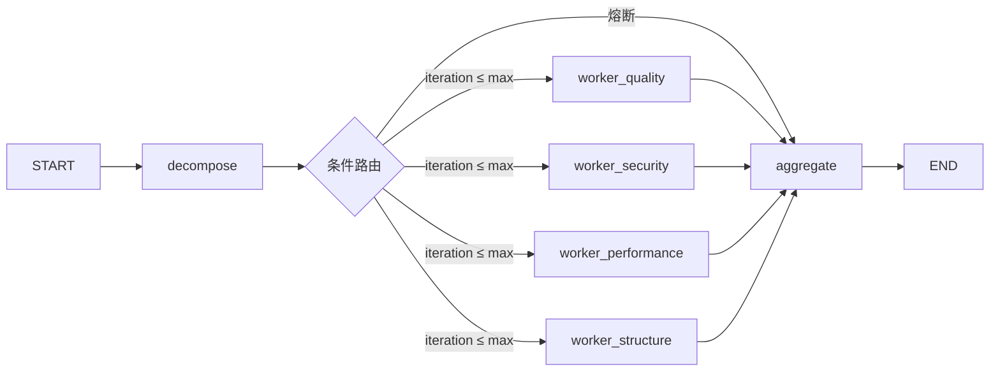

# 05 — API 与 CLI 接口契约

## 原理级：`api/reviews.py` 核心路由

**文件位置**：`backend/api/reviews.py`（267行）

routes.py 定义了 6 个端点，分为 **同步执行** 和 **SSE 流式** 两条路径，底层统一调用 `build_supervisor_graph().ainvoke()` / `.astream()`。

### 1. `POST /api/v1/reviews` — 创建审查（同步）

```python
@router.post("", response_model=ReviewResponse, status_code=200)
async def create_review(req: ReviewRequest, db: AsyncSession = Depends(get_db)):
```

核心流程：
1. `_create_review_record()` 写入数据库，status=`running`
2. `graph.ainvoke({"code": ..., "language": ...})` 同步执行整个审查图
3. 结果写入 `review.report`，status→`completed` / `failed`
4. 返回 `ReviewResponse`

### 2. `GET /api/v1/reviews/{review_id}` — 查询审查

```python
result = await db.execute(select(Review).where(Review.id == rid))
review = result.scalar_one_or_none()
```

按 ID 查数据库，不存在返回 404；存在返回 `ReviewResponse`（含 report）。

### 3. `POST /api/v1/reviews/from-pr` — 从 PR 审查

```python
code, language = await _fetch_pr_code(req.pr_url)   # 拉 PR diff → 代码
graph = build_supervisor_graph()
result = await graph.ainvoke({...})
```

通过 `core/common.py` 的 `fetch_pr_code` 拉取 GitHub PR 的 .patch，解析出代码和语言，走相同审查链路。

### 4. 流式端点（SSE）

- `POST /api/v1/reviews/stream`
- `POST /api/v1/reviews/stream/from-pr`

均返回 `StreamingResponse(media_type="text/event-stream")`，事件序列：

```text
: heartbeat  (填充 ~1KB 刷出响应头)

event: node_start     → {"node": "decompose"}
event: node_end       → {"node": "decompose"}
event: node_start     → {"node": "worker_quality"}
event: node_start     → {"node": "worker_security"}
event: node_start     → {"node": "worker_performance"}
event: node_start     → {"node": "worker_structure"}

(每个 Worker 完成后)
event: node_end       → {"node": "worker_xxx"}

(4 个 Worker 全部完成后)
event: node_start     → {"node": "aggregate"}
event: node_end       → {"node": "aggregate"}

event: complete       → {"review_id": ..., "report": ..., "status": "completed"}
```

关键实现细节：
- 使用 `graph.astream(stream_mode="updates")` 而非 `astream_events`（后者在 LangGraph 1.2.7 中事件格式不稳定）
- `_sse_event()` 填充到 ~1KB 触发浏览器缓冲区刷出
- 异常时发 `event: error` + 最终 `event: complete`（status=`failed`）

### 审查图结构



图装配代码见 `services/supervisor/graph.py:174`（`build_supervisor_graph`）。

---

## 了解级

### `cli/main.py`（129行）

**一句话**：基于 argparse 的 CLI 入口，`--file` 与 `--pr` 互斥组，审查结果输出 Markdown 到 stdout。

📍位置：
- 互斥组定义：`main.py:106` `review_parser.add_mutually_exclusive_group(required=True)`
- `cmd_review`：读本地文件 → `asyncio.run(graph.ainvoke(...))`（`main.py:57`）
- `cmd_review_pr`：GitHubClient 拉 PR → 同链路（`main.py:77`）
- 路径安全校验 `_resolve_review_file`：禁止路径穿越 + 禁止密钥文件（`main.py:30`）

### `schemas/review.py`（65行）

**一句话**：三个 Pydantic 模型，`model_overrides` 的 6 个合法 key 在 `_VALID_MODEL_OVERRIDE_KEYS` 中显式列出。

📍位置：
- `ReviewRequest`：`code` + `language`（正则 ^(python|...|java)$）+ 可选 `model_overrides`（`review.py:19`）
- `PRReviewRequest`：`pr_url` + `model_overrides`（`review.py:39`）
- `ReviewResponse`：含 `report`、`status`、`review_id` 等，含 `from_orm_model` 转换方法（`review.py:46`）
- `@model_validator` 校验 `model_overrides` key 白名单（`review.py:26`）

### `api/deps.py`（35行）

**一句话**：`get_db` 重导出 + `require_auth` JWT Bearer 鉴权依赖，开发态 fail-open 放行。

📍位置：
- `require_auth`：`settings.API_AUTH_REQUIRED=False` 时返回 `"anonymous"`，否则校验 Bearer token（`deps.py:20`）
- `HTTPBearer(auto_error=False)`：不强制携带 token（`deps.py:17`）

### `core/languages.py`（16行）

**一句话**：单一来源的扩展名→语言映射，CLI 和 GitHub 集成都读它，避免两份重复。

📍位置：
- `EXT_TO_LANGUAGE`：5 个映射（`.py`→python, `.js`→javascript, `.ts`→typescript, `.go`→go, `.java`→java）（`languages.py:7`）
- `VALID_LANGUAGES`：由映射值推导的不可变集合（`languages.py:16`）

---

## 🎯 追问集

### Q1: `POST /reviews` 目前是同步返回，如果代码量很大（>50K tokens）会有什么问题？怎么改进？

**A**：当前是 W1 简化实现，`graph.ainvoke` 同步等待全部 Worker 完成才返回。大代码量下 Worker LLM 调用可能达到分钟级，HTTP 连接会超时。W2 方案改为：
1. `POST /reviews` 返回 `202 Accepted` + `review_id`
2. 后端用 `BackgroundTasks` 或 Celery 异步执行 graph
3. 客户端轮询 `GET /reviews/{id}` 获取结果
4. 或直接走 `/stream` SSE 路径实时接收事件

### Q2: SSE 流式实现中为什么要用 `astream(stream_mode="updates")` 而不是 `astream_events`？

**A**：LangGraph 1.2.7 中 `astream_events` 的事件格式不稳定且不完整——`node_start`/`node_end` 可能不触发。`astream(mode="updates")` 直接 yield 每个节点的完成输出，行为是可预测的。代价是需要在循环内手动管理节点事件顺序（decompose→4 Worker→aggregate 的编排逻辑是手写的），但可靠性更高。

### Q3: `model_overrides` 的作用是什么？在什么场景下用？

---

## 相关笔记

- [[00-17条架构决策总览|00 17条架构决策总览]]
- [[01-Supervisor-Worker编排与StateGraph|01 Supervisor-Worker编排与StateGraph]]
- [[07-MCP协议实战|07 MCP协议实战]]

## 技术学习笔记

- [[15-Agent架构与工具调用|Agent架构与工具调用]]
- [[26-MCP协议核心概念|MCP协议基础]]
- [[01-Token计费原理-Temperature控制-SystemPrompt层级|Token计费原理]]
- [[工程化与运维/异步与鉴权/03-JWT原理与设计|JWT鉴权]]
- [[工程化与运维/异步与鉴权/04-FastAPI+JWT全链路实现|FastAPI+JWT全链路]]

**A**：允许 API 调用方在每个请求中覆盖 6 个角色的 LLM model name（decompose / 4 Worker / judge）。生产场景中 decompose 和 aggregate 用便宜模型（如 gpt-4o-mini），Worker 用强模型（如 claude-sonnet-4），judge 用最强模型（如 claude-opus-4），可降本 40-60%。未配置时回退到 `CHAT_MODEL`（兼容 W1 单模型行为）。

## 速记卡（面试闪卡）

**Q1：一句话讲清「05 — API 与 CLI 接口契约」到底是什么？**
A：**文件位置**：（267行）
routes.py 定义了 6 个端点，分为 **同步执行** 和 **SSE 流式** 两条路径，底层统一调用  / 。
核心流程：
写入数据库，status=
同步执行整个审查图
结果写入 ，status→ / 
返回 
按 ID 查数据库，不存在返回 404；存在返回 （含 report）。

**Q2：原理级：`api/reviews.py` 核心路由 —— 怎么理解？**
A：**文件位置**：（267行）
routes.py 定义了 6 个端点，分为 **同步执行** 和 **SSE 流式** 两条路径，底层统一调用  / 。
核心流程：
写入数据库，status=
同步执行整个审查图
结果写入 ，status→ / 
返回 
按 ID 查数据库，不存在返回 404；存在返回 （含 report）。
通过  的  拉取 GitHub PR 的 .patch，解析出代码和语言，走相同审查链路。

**Q3：了解级 —— 怎么理解？**
A：**一句话**：基于 argparse 的 CLI 入口， 与  互斥组，审查结果输出 Markdown 到 stdout。
📍位置：
互斥组定义： 
：读本地文件 → （）
：GitHubClient 拉 PR → 同链路（）
路径安全校验 ：禁止路径穿越 + 禁止密钥文件（）
**一句话**：三个 Pydantic 模型， 的 6 个合法 key 在  中显式列出。

**Q4：🎯 追问集 —— 怎么理解？**
A：**A**：当前是 W1 简化实现， 同步等待全部 Worker 完成才返回。大代码量下 Worker LLM 调用可能达到分钟级，HTTP 连接会超时。W2 方案改为：
返回  + 
后端用  或 Celery 异步执行 graph
客户端轮询  获取结果
或直接走  SSE 路径实时接收事件
**A**：LangGraph 1.2.7 中  的事件格式不稳定且不完整——/ 可能不触发。

**Q5：核心速记主线有哪些？**
A：抓住这几根：原理级：`api/reviews.py` 核心路由、了解级、🎯 追问集、相关笔记、技术学习笔记。

