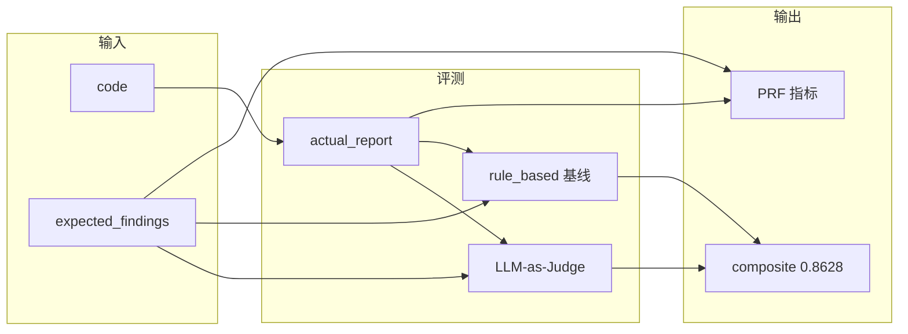

# 09：LLM 评测体系搭建

## 概述

两维评测：**软指标**（LLM-as-Judge，裁判也是 LLM）和 **硬指标**（PRF，基于 ground truth 的确定性可复现比对）。配套 Token 计量、数据集加载、API 暴露、链路追踪。

---

## 第一级：Judge 核心（judge.py 🔴）

📍 `services/evaluation/judge.py`：`judge_with_llm`、`_composite` 公式、`_parse_judge_json`、`rule_based`

### 三维度评分（与 ai-resume-analyzer 对齐）

| 维度 | 权重 | 含义 |
|------|------|------|
| completeness（完整性） | 40% | 实际报告覆盖了多少期望发现（漏报扣分） |
| accuracy（准确性） | 40% | 实际报告是否正确（幻觉/错误严重度/张冠李戴都扣分） |
| source_traceability（来源可信度） | 20% | 是否标注行号/代码片段 |

```python
composite = 0.4 * completeness + 0.4 * accuracy + 0.2 * source_traceability
```

### 两种评分模式

**1. judge_rule_based——确定性基线**

```python
def judge_rule_based(expected_findings, actual_report) -> Judgment:
```

- completeness：期望 description 前 8 字在报告中出现的比例
- accuracy：基线用 completeness 近似（无 LLM 时无法判幻觉）
- source_traceability：报告是否含"行"或代码块标记
- **无需 LLM，毫秒级**

**2. judge_with_llm——LLM 裁判**

```python
async def judge_with_llm(code, expected_findings, actual_report, client=None, model=None) -> Judgment:
```

- 构造 prompt（含 code + expected + actual），调 LLM 返回 JSON
- `_parse_judge_json` 容错解析：去 ```json 包裹 → json.loads → 正则兜底
- `client` 可注入（测试用），`model` 默认 `settings.JUDGE_MODEL`

### _parse_judge_json 容错三阶降级

```text
LLM 原始输出
  → 去掉 ```json 包裹
  → json.loads 解析
  → 失败后正则在文本中搜 3 个浮点数
  → 全部失败则 0.0 + rationale="parse-fallback"
```

### Judgment dataclass

```python
@dataclass
class Judgment:
    completeness: float
    accuracy: float
    source_traceability: float
    composite: float    # 由 _composite() 加权算
    rationale: str = ""
```

### LLM-as-Judge 评测流程



---

## 第二级：评测主流程（eval.py 🟡）

📍 `services/evaluation/eval.py`：`run_one`、`run_all`

### run_one——单条样本

```python
async def run_one(sample, judge_client=None, meter=None, confidence_threshold=0.0) -> dict:
```

1. （可选）注入 MeteredClient 计量 token
2. `build_supervisor_graph().ainvoke()` 跑审查
3. `aggregate_findings()` 聚合去重
4. `split_by_confidence()` 置信度过滤
5. `compute_prf()` 算硬指标
6. `judge_with_llm()` 算软指标

**注意**：`meter` 参数通过 monkeypatch `llm_mod.get_chat_client` 实现拦截，`finally` 块必须还原原始函数避免污染。

### run_all——遍历数据集

```python
async def run_all(dataset_path, limit=None, meter=None) -> dict:
```

加载数据集 → 遍历评测 → 汇总 → 返回 summary（含 per_sample + 总体统计 + token 用量）

### compute_prf（metrics.py 🟢）

📍 `services/evaluation/metrics.py`：`compute_prf`

```python
def compute_prf(expected: list[dict], actual: list[dict]) -> dict:
```

**匹配策略**：把 expected/actual 的 finding 抽象为 key = `(description 前 10 字小写, line)`。

- TP = expected 命中 actual（desc 前缀相同**或** line 相同，贪心一对一的避免重复计）
- FN = expected 未命中；FP = actual 未命中 expected
- precision = TP/(TP+FP)，recall = TP/(TP+FN)，f1 = 2PR/(P+R)

**边界约定**：
- expected 为空 → P=R=F1=1.0（无 ground truth 不扣分）
- actual 为空且 expected 非空 → R=0.0，P=1.0（无假阳性）

### scan_threshold——置信度阈值扫描

```python
def scan_threshold(results: list[dict]) -> list[dict]:
```

不重跑 graph——复用 `_all_findings` 带 confidence，`_expected` 作为 ground truth，用不同阈值过滤后重算 PRF，找出 F1 最优阈值。

返回 10 行：threshold 从 0.0 到 0.9 步长 0.1。

### 辅助函数

| 函数 | 作用 |
|------|------|
| `summarize(results)` | 总体 composite_avg + PRF_avg + by_category |
| `summarize_by_category(results)` | 按 security/quality/performance/structure 聚合 |
| `render_report(summary)` | Markdown 报告渲染 |

### CLI 入口

```bash
python -m backend.services.evaluation.eval --limit 5
python -m backend.services.evaluation.eval --all --report reports/eval_report.md
python -m backend.services.evaluation.eval --limit 10 --tokens --scan-threshold
```

---

## 第三级：周边能力（🟢 一句话总结 + 位置）

### cost.py——Token 计量

📍 `services/evaluation/cost.py`：`MeteredClient`

- **TokenMeter**：`@dataclass` 累加 prompt/completion/total tokens + call_count
- **MeteredClient**：代理类，只拦截 `.chat.completions.create` 记录 usage，其余属性（`.models`、`.embeddings`）原样代理真实 client
- **estimate_cost**：按单价估算成本

位置：`services/evaluation/cost.py`（110 行）

### dataset.py——评测集加载

```python
@dataclass class Sample: id, language, category, code, expected_findings
@dataclass class ExpectedFinding: severity, category, description, line

def load_dataset(path) -> list[Sample]:
```

数据结构简洁，JSON 文件每一行一条样本，从 dict 还原为 Sample + ExpectedFinding dataclass。

位置：`services/evaluation/dataset.py`（57 行）

### api/evaluation.py——评测 API

- `GET /api/v1/evaluation/summary` —— 评测总览
- `POST /api/v1/evaluation/run` —— 触发重新评测
- `GET /api/v1/evaluation/scan-threshold` —— 置信度阈值扫描表

**模式**：`rule_based`（默认，秒级响应，不调 LLM）和 `llm`（真实 LLM-as-Judge）。LLM 模式优先读预计算结果。

**缓存**：内存缓存 + `?force=1` 强制刷新。

位置：`api/evaluation.py`（313 行）

### tracing.py——Langfuse 链路追踪

抽象 Span/Tracer 接口，统一 NoOp 和 Langfuse 两个 backend：

- 未配 Langfuse → `NoOpTracer`，零侵入
- 配了但 SDK 未装 → 降级 NoOp + warning 日志
- 配了且 SDK 可用 → `LangfuseTracer`

Span 支持 `with` 上下文管理，自动 end。

位置：`core/tracing.py`（158 行）

---

## Q&A

**Q1：为什么 performance 维度分数最低（0.76）？**  
**A**：accuracy 只有 0.66，集中在严重度误判（如 low 判为中危）、行号不匹配（行 3 vs 行 4）。说明 Worker 在 performance 维度的严重度校准和行号定位需要优化。

**Q2：PRF 的 precision 为什么低到 0.086？**  
**A**：PRF 用的是关键词精确匹配。expected 的 "SQL injection" 和 actual 的 "SQL注入风险" 不匹配。但 recall 0.81 说明大部分问题被发现了。这正好是为什么要做 LLM-as-Judge——它能理解语义相似性。

**Q3：软硬指标冲突时信哪个？**  
**A**：看场景。功能回归测 recall，成本控制看 precision，综合质量看 composite。两个尺子一起用才可信。

**Q4：TokenMeter 怎么做到不侵入 Worker 代码？**  

---

## 相关笔记

- [[00-17条架构决策总览|00 17条架构决策总览]]
- [[01-Supervisor-Worker编排与StateGraph|01 Supervisor-Worker编排与StateGraph]]
- [[10-安全加固四道防线|10 安全加固四道防线]]

## 技术学习笔记

- [[39-Agent评测体系：benchmark-case-指标设计|Agent评测体系]]
- [[10-RAG 评估：检索指标 + 生成指标|RAG评估]]
- [[01-Token计费原理-Temperature控制-SystemPrompt层级|Token计费原理]]
- [[工程化与运维/可观测性/01-Prometheus四层指标|Prometheus四层指标]]
- [[工程化与运维/可观测性/02-Grafana-Dashboard预置面板|Grafana Dashboard]]
**A**：代理模式。MeteredClient 包装 AsyncOpenAI client，只拦截 .chat.completions.create 记录 usage，其余属性直接穿透到真实 client。Worker 代码零改动。

## 速记卡（面试闪卡）

**Q1：一句话讲清「09：LLM 评测体系搭建」到底是什么？**
A：两维评测：**软指标**（LLM-as-Judge，裁判也是 LLM）和 **硬指标**（PRF，基于 ground truth 的确定性可复现比对）。配套 Token 计量、数据集加载、API 暴露、链路追踪。
---

**Q2：概述 —— 怎么理解？**
A：两维评测：**软指标**（LLM-as-Judge，裁判也是 LLM）和 **硬指标**（PRF，基于 ground truth 的确定性可复现比对）。配套 Token 计量、数据集加载、API 暴露、链路追踪。
---

**Q3：第一级：Judge 核心（judge.py 🔴） —— 怎么理解？**
A：📍 ：、 公式、、
| 维度 | 权重 | 含义 |
|------|------|------|
| completeness（完整性） | 40% | 实际报告覆盖了多少期望发现（漏报扣分） |
| accuracy（准确性） | 40% | 实际报告是否正确（幻觉/错误严重度/张冠李戴都扣分） |
| source_traceability（来源可信度） | 20% | 是否标注行号/代码片段 |
**1.

**Q4：第二级：评测主流程（eval.py 🟡） —— 怎么理解？**
A：📍 ：、
（可选）注入 MeteredClient 计量 token
跑审查
聚合去重
置信度过滤
算硬指标
算软指标
**注意**： 参数通过 monkeypatch  实现拦截， 块必须还原原始函数避免污染。
加载数据集 → 遍历评测 → 汇总 → 返回 summary（含 per_sample + 总体统计 + token 用量）
📍 ：

**Q5：第三级：周边能力（🟢 一句话总结 + 位置） —— 怎么理解？**
A：📍 ：
**TokenMeter**： 累加 prompt/completion/total tokens + call_count
**MeteredClient**：代理类，只拦截  记录 usage，其余属性（、）原样代理真实 client
**estimate_cost**：按单价估算成本
位置：（110 行）

**Q6：核心速记主线有哪些？**
A：抓住这几根：概述、第一级：Judge 核心（judge.py 🔴）、第二级：评测主流程（eval.py 🟡）、第三级：周边能力（🟢 一句话总结 + 位置）、Q&A、相关笔记。

