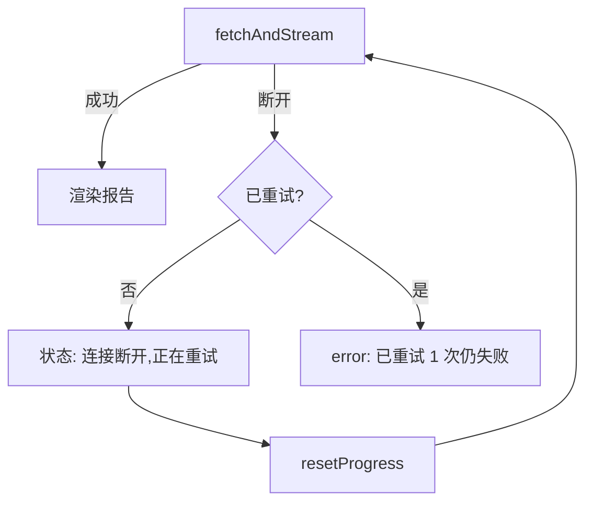

# 三层容错与并发 bug

> SSE 流式中断、评测 API 失败、键盘用户无法切 Tab、小屏溢出——边缘场景比核心功能更考验设计。这一轮不做新功能，只做：自动重试、错误降级、无障访问、响应式适配。每一个"简单"的打磨背后都有隐蔽的坑。

## 一、背景

在开发1-4时把核心功能做完了，但产品要"能用"和"好用"之间差了一整轮边缘场景打磨。三个方向：① 错误处理（网络断开 / API 失败时用户不懵逼）；② 响应式（移动端能用）；③ 无障碍（键盘用户和屏幕阅读器用户能用）。

为什么放最后做？核心功能优先级最高。先跑通主流程，再覆盖边界。

## 二、逐个讲：问题 → 怎么想 → 怎么解

### 1. SSE 流式中途断开 → 自动重试 1 次

**问题**：用户提交代码后，SSE 流式传输中途网络抖动断开，`reader.read()` 抛异常直接进 catch 显示 error。用户不知道是网络问题还是代码问题。

**怎么想**：两个策略。A：自动重试——catch 后重新发请求，但不能无限重试。B：提示手动重试——显示"连接断开，点击重试"按钮。

策略 A 体验更好（用户无感知），但要约束：只重试 1 次、只在没收到 complete 时重试、重试前重置进度面板。

**怎么解**：把 fetch+stream 抽成 `fetchAndStream()` 内部函数。外层 try-catch 里判断：如果 `finalStatus === "failed"`（没收到 complete）且 `!retried`，就重试 1 次，状态显示"连接断开，正在重试..."。重试后还失败则 error 提示加"（已重试 1 次仍失败）"。

### 2. 评测 API 失败只显示一行红字 → 错误 banner + 重试按钮

**问题**：评测接口失败时只改了状态栏文字，用户可能没注意到，而且没有重试入口。

**怎么想**：让错误可见、可操作。把 catch 逻辑从"状态栏改文字"改成"渲染错误 banner + 重试按钮"。

**怎么解**：`loadEvaluation` 的 catch 里，把 eval-view 的内容替换为错误 banner（红色背景 + 错误信息 + 重试按钮）。用户看到 banner 就知道出错了，点重试就能重新加载。

### 3. Tab 只能鼠标点击 → 键盘导航（ARIA tablist）

**问题**：Tab（报告/评测）只能鼠标点击切换。键盘用户无法用左右箭头切换——ARIA tablist 标准交互缺失。

**怎么想**：ARIA tablist 的最佳实践：选中 Tab `tabindex=0`，未选中 `tabindex=-1`；左右箭头切换聚焦 + 选中一起做。

**怎么解**：`switchTab` 里动态设置 `tabIndex`。给两个 Tab 加 `keydown` 监听：ArrowRight/ArrowLeft 切换到另一个 Tab。

### 4. 进度节点状态变化屏幕阅读器不播报 → aria-label 动态更新

**问题**：进度节点的 `aria-label` 固定（如"任务拆解"），状态变化时屏幕阅读器不播报。

**怎么想**：动态更新节点的 `aria-label`，变成"任务拆解：运行中"。用 `dataset.baseLabel` 存原始 label，避免重复拼接。

**怎么解**：`setNodeState` 里首次调用时把 `aria-label` 存到 `dataset.baseLabel`，之后每次更新读 baseLabel + 拼接当前状态的中文文本。

## 三、关键决策与取舍

| 决策 | 选择 | 取舍 |
|------|------|------|
| SSE 重试 1 次而非多次 | 覆盖偶发抖动，避免重试风暴 | 持续断网要用户手动重试，但提示已说明情况 |
| 480px media query 而非 375px | 覆盖更多小屏设备 | 480-768px 用紧凑样式，这个区间设备少 |
| ARIA 箭头切换而非 Tab 键 | 符合 WAI-ARIA 标准 | 用户需学习"箭头切换"交互 |
| CSS animation 而非 transition | `hidden` 不支持 transition | 每次切换播 0.2s 动画，但很短不烦 |
| error banner 而非状态栏文字 | 更醒目，有重试入口 | 占用更多视觉空间，但错误场景不频繁 |

## 四、踩坑

1. **SSE 重试时为什么要 resetProgress？** 因为重试是重新发请求，后端从头跑（decompose → worker → aggregate）。保留之前进度会让用户看到"已完成的节点又变回运行中"，以为有 bug。reset 让进度面板和后端保持一致。

2. **`hidden` 属性 vs `style.display`** 两个都是隐藏但机制不同。一开始混着用——按钮默认 `style.display:none`，switchTab 切换 `.hidden` 属性。内联的 display:none 还在，按钮永远不显示。最后统一用 `hidden` 属性解决。

3. **browser_evaluate 持续返回 null**。在开发4时就遇到过，在开发5时继续。放弃死磕，改用网络请求 + API 验证 + 代码审查四合一验证。教训：工具不可靠时不要死磕，换可观测信号。

4. **browser_snapshot 把 hidden 元素也列出来**。一开始以为按钮没藏好，用 JS 检查 `getBoundingClientRect()` 确认元素确实是隐藏的。snapshot 只是列 DOM 树，不管可见性。

## 五、常见疑问

**Q1：SSE 重试为什么只重试 1 次？** A：两个原因。持续断网重试 10 次也失败，反而让用户等更久。大量用户同时重连会形成"重试风暴"。1 次覆盖偶发抖动，持续断网交给用户判断。

**Q2：aria-label 动态更新，屏幕阅读器真的会读吗？** A：NVDA/JAWS 在元素有焦点时会播报。但 progress 节点不在 `aria-live` 区域，不会主动播报。如果放 `aria-live="polite"` 区域，6 个节点同时变化会变成"播报轰炸"。当前方案是"用户导航时读出最新状态"，平衡了信息量和体验。

**Q3：键盘导航为什么用 ArrowLeft/ArrowRight 而非 Tab 键？** A：WAI-ARIA tablist 模式标准。Tab 键应用于在不同组件间移动，箭头键在组件内导航。如果用 Tab 切换 Tab，用户要按很多次才能跳过组件。

---

## 相关笔记

- [[01-技术研读/00-17条架构决策总览|00 17条架构决策总览]]
- [[01-技术研读/04-三层容错与并发bug|04 三层容错与并发bug]]
- [[06_交付闭环与工程化|06 交付闭环与工程化]]

## 技术学习笔记

- [[27-指数退避重试：Exponential Backoff + Jitter|指数退避重试]]
- [[28-降级路径（Degradation）：某环节失败 → 回退到次优但可用方案|降级路径]]
- [[AI与Agent/知识/八股/33-异常处理与降级策略|工具调用失败处理]]
- [[语言与框架/TypeScript-React/实战/06-React Hooks深入|React Hooks深入]]
- [[语言与框架/TypeScript-React/实战/07-React副作用与自定义Hook|React副作用与自定义Hook]]

**Q4：480px 下评测面板的图表会不会太小？** A：480px media query 把图表高度从 220px 降到 160px，Chart.js `responsive: true` 自动缩放。160px 足够看清 4 根柱子的对比。小屏还可以横屏（667px），自动用 768px 样式。

## 速记卡（面试闪卡）

**Q1：一句话讲清「三层容错与并发 bug」到底是什么？**
A：在开发1-4时把核心功能做完了，但产品要"能用"和"好用"之间差了一整轮边缘场景打磨。三个方向：① 错误处理（网络断开 / API 失败时用户不懵逼）；② 响应式（移动端能用）；③ 无障碍（键盘用户和屏幕阅读器用户能用）。
为什么放最后做？核心功能优先级最高。先跑通主流程，再覆盖边界。

**Q2：一、背景 —— 怎么理解？**
A：在开发1-4时把核心功能做完了，但产品要"能用"和"好用"之间差了一整轮边缘场景打磨。三个方向：① 错误处理（网络断开 / API 失败时用户不懵逼）；② 响应式（移动端能用）；③ 无障碍（键盘用户和屏幕阅读器用户能用）。
为什么放最后做？核心功能优先级最高。先跑通主流程，再覆盖边界。

**Q3：二、逐个讲：问题 → 怎么想 → 怎么解 —— 怎么理解？**
A：**问题**：用户提交代码后，SSE 流式传输中途网络抖动断开， 抛异常直接进 catch 显示 error。用户不知道是网络问题还是代码问题。
**怎么想**：两个策略。A：自动重试——catch 后重新发请求，但不能无限重试。B：提示手动重试——显示"连接断开，点击重试"按钮。
策略 A 体验更好（用户无感知），但要约束：只重试 1 次、只在没收到 complete 时重试、重试前重置进度面板。

**Q4：三、关键决策与取舍 —— 怎么理解？**
A：| 决策 | 选择 | 取舍 |
|------|------|------|
| SSE 重试 1 次而非多次 | 覆盖偶发抖动，避免重试风暴 | 持续断网要用户手动重试，但提示已说明情况 |
| 480px media query 而非 375px | 覆盖更多小屏设备 | 480-768px 用紧凑样式，这个区间设备少 |

**Q5：四、踩坑 —— 怎么理解？**
A：**SSE 重试时为什么要 resetProgress？** 因为重试是重新发请求，后端从头跑（decompose → worker → aggregate）。保留之前进度会让用户看到"已完成的节点又变回运行中"，以为有 bug。reset 让进度面板和后端保持一致。
** 属性 vs ** 两个都是隐藏但机制不同。一开始混着用——按钮默认 ，switchTab 切换  属性。内联的 display:none 还在，按钮永远不显示。

**Q6：核心速记主线有哪些？**
A：抓住这几根：一、背景、二、逐个讲：问题 → 怎么想 → 怎么解、三、关键决策与取舍、四、踩坑、五、常见疑问、相关笔记。

